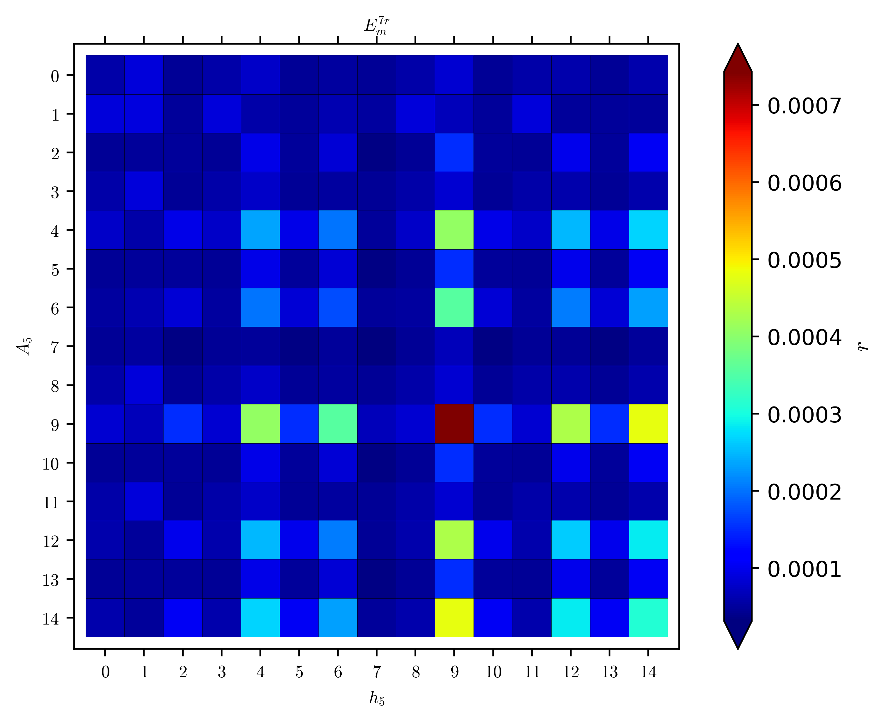
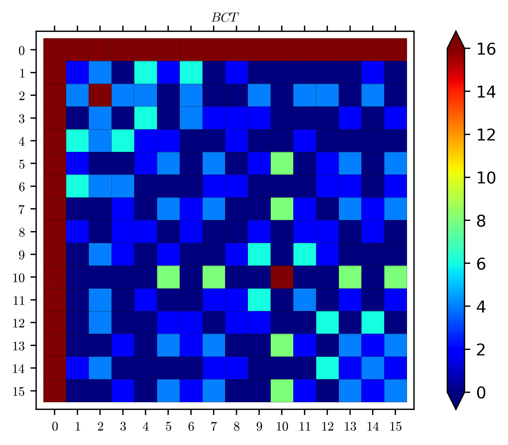
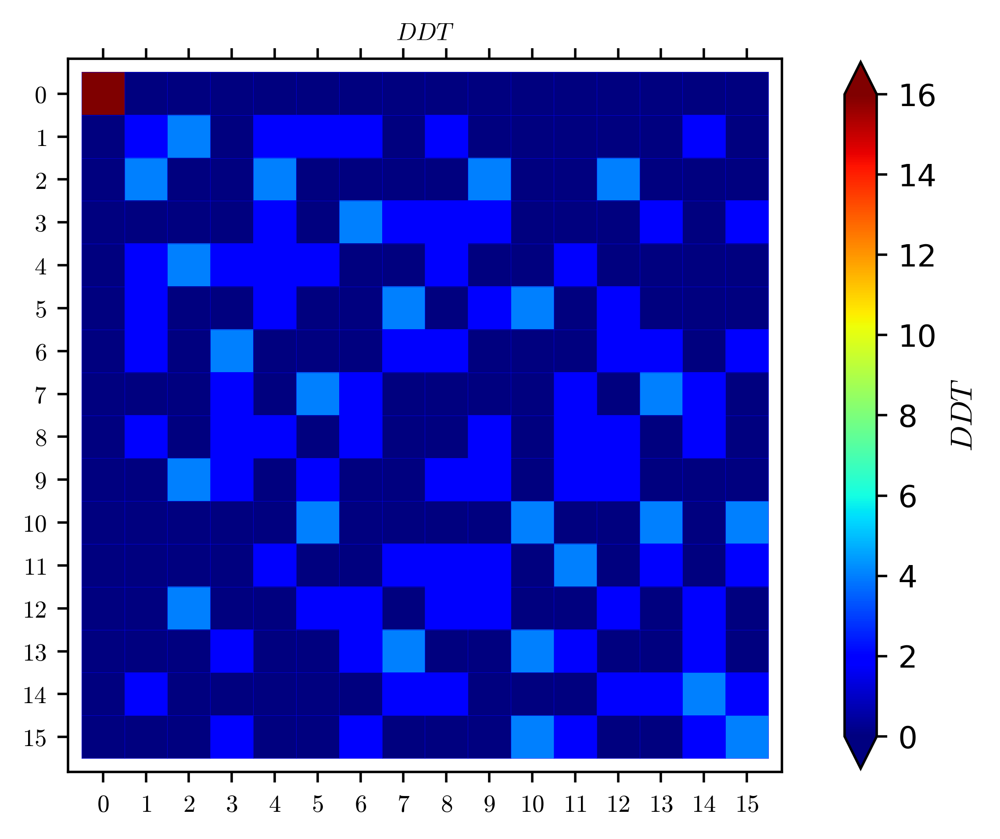

# Boomerang Cryptanalysis of CRAFT

**Life truly is a boomerang. What you give, you get!**

Author: Hosein Hadipour

- [Boomerang Cryptanalysis of CRAFT](#boomerang-cryptanalysis-of-craft)
- [Define CRAFT's S-box](#define-crafts-s-box)
- [Em-7 Rounds](#em-7-rounds)
  - [Visual Representation for BCT of CRAFT's S-box](#visual-representation-for-bct-of-crafts-s-box)
  - [Visual Representation for DDT of CRAFT's S-box](#visual-representation-for-ddt-of-crafts-s-box)
- [8 Rounds](#8-rounds)
  - [Pbm-8 Rounds](#pbm-8-rounds)
- [9 Rounds](#9-rounds)
  - [E0-9 Rounds](#e0-9-rounds)
  - [E1-9 Rounds](#e1-9-rounds)
  - [Pbm-9 Rounds](#pbm-9-rounds)
- [10 Rounds](#10-rounds)
  - [E0-10 Rounds](#e0-10-rounds)
  - [E1-10 Rounds](#e1-10-rounds)
  - [Pbm-10 Rounds](#pbm-10-rounds)
- [11 Rounds](#11-rounds)
  - [E0-11 Rounds](#e0-11-rounds)
  - [E1-11 Rounds](#e1-11-rounds)
  - [Pbm-11 Rounds](#pbm-11-rounds)
- [12 Rounds](#12-rounds)
  - [E0-12 Rounds](#e0-12-rounds)
  - [E1-12 Rounds](#e1-12-rounds)
  - [Pbm-12 Rounds](#pbm-12-rounds)
- [13 Rounds](#13-rounds)
  - [E0-13 Rounds](#e0-13-rounds)
  - [E1-13 Rounds](#e1-13-rounds)
  - [Pbm-13 Rounds](#pbm-13-rounds)
- [14 Rounds](#14-rounds)
  - [E0-14 Rounds](#e0-14-rounds)
  - [E1-14 Rounds](#e1-14-rounds)
  - [Pbm-14 Rounds](#pbm-14-rounds)

# Define CRAFT's S-box


```python
from sage.crypto.sboxes import SBox
sb = SBox([0xc, 0xa, 0xd, 0x3, 0xe, 0xb, 0xf, 0x7, 0x8, 0x9, 0x1, 0x5, 0x0, 0x2, 0x4, 0x6])
ddt = sb.difference_distribution_table()
bct = sb.boomerang_connectivity_table()
```


```python
sample = "0x0000000000A00000"
ios = [0]*15
for i in range(1, 16):
    ios[i - 1] = sample.replace('A', hex(i)[2:])
# ios
```


```python
with open('possible_ios.txt', 'w') as fileobj:
    for i in range(15):
        fileobj.write(ios[i])
        fileobj.write('\n')
```


```python
# 0: Theoretical
# 1: Empirical
flag = 0
if (flag == 0):
    r7 = matrix(RR, [[0.0000580831007974356,0.0000891196442952869,0.0000468747655416333,0.0000582294291096733,0.0000764722580636883,0.0000477296737290910,0.0000532883984499387,0.0000474047121696198,0.0000580858788133588,0.0000814596420258804,0.0000469162750594569,0.0000580858788133588,0.0000615359490993059,0.0000475073414445083,0.0000606396520113517],
    [0.0000891196442952869,0.0000911819001774701,0.0000501525645340834,0.0000891196442952869,0.0000580478838577573,0.0000501525645340834,0.0000625063809474764,0.0000516826653718887,0.0000891196442952869,0.0000686065097964382,0.0000501525645340834,0.0000891196442952869,0.0000499810591672509,0.0000501525645340834,0.0000497159396350837],
    [0.0000468747655416333,0.0000501525645340834,0.0000479455019688126,0.0000477296737290910,0.0000973554992981395,0.0000497327936578453,0.0000846142983518782,0.0000348077961858884,0.0000475073414445083,0.000152451080926528,0.0000486876029729056,0.0000469162750594569,0.0000986598076377884,0.0000486876029729056,0.000103948891933657],
    [0.0000582294291096733,0.0000891196442952869,0.0000477296737290910,0.0000580831007974356,0.0000764722580636883,0.0000468747655416333,0.0000532883984499387,0.0000474047121696198,0.0000580858788133588,0.0000814596420258804,0.0000475073414445083,0.0000580858788133588,0.0000615359490993059,0.0000469162750594569,0.0000606396520113517],
    [0.0000764722580636883,0.0000580478838577573,0.0000973554992981395,0.0000764722580636883,0.000235263315536011,0.0000973554992981395,0.000202073813894534,0.0000505605260683185,0.0000764722580636883,0.000407920604084440,0.0000973554992981395,0.0000764722580636883,0.000248514732343450,0.0000973554992981395,0.000269658662481430],
    [0.0000477296737290910,0.0000501525645340834,0.0000497327936578453,0.0000468747655416333,0.0000973554992981395,0.0000479455019688126,0.0000846142983518782,0.0000348077961858884,0.0000469162750594569,0.000152451080926528,0.0000486876029729056,0.0000475073414445083,0.0000986598076377884,0.0000486876029729056,0.000103948891933657],
    [0.0000532883984499387,0.0000625063809474764,0.0000846142983518782,0.0000532883984499387,0.000202073813894534,0.0000846142983518782,0.000174269896582463,0.0000481652440031358,0.0000532883984499387,0.000354190220739217,0.0000846142983518782,0.0000532883984499387,0.000207187272278957,0.0000846142983518782,0.000233198964041004],
    [0.0000474047121696198,0.0000516826653718887,0.0000348077961858884,0.0000474047121696198,0.0000505605260683185,0.0000348077961858884,0.0000481652440031358,0.0000311332993496929,0.0000474047121696198,0.0000682298230347316,0.0000348077961858884,0.0000474047121696198,0.0000473839173377895,0.0000348077961858884,0.0000480213004886388],
    [0.0000580858788133588,0.0000891196442952869,0.0000475073414445083,0.0000580858788133588,0.0000764722580636883,0.0000469162750594569,0.0000532883984499387,0.0000474047121696198,0.0000582294291096733,0.0000814596420258804,0.0000477296737290910,0.0000580831007974356,0.0000615359490993059,0.0000468747655416333,0.0000606396520113517],
    [0.0000814596420258804,0.0000686065097964382,0.000152451080926528,0.0000814596420258804,0.000407920604084440,0.000152451080926528,0.000354190220739217,0.0000682298230347316,0.0000814596420258804,0.000743424575072643,0.000152451080926528,0.0000814596420258804,0.000429900974178722,0.000152451080926528,0.000479444685945549],
    [0.0000469162750594569,0.0000501525645340834,0.0000486876029729056,0.0000475073414445083,0.0000973554992981395,0.0000486876029729056,0.0000846142983518782,0.0000348077961858884,0.0000477296737290910,0.000152451080926528,0.0000497327936578453,0.0000468747655416333,0.0000986598076377884,0.0000479455019688126,0.000103948891933657],
    [0.0000580858788133588,0.0000891196442952869,0.0000469162750594569,0.0000580858788133588,0.0000764722580636883,0.0000475073414445083,0.0000532883984499387,0.0000474047121696198,0.0000580831007974356,0.0000814596420258804,0.0000468747655416333,0.0000582294291096733,0.0000615359490993059,0.0000477296737290910,0.0000606396520113517],
    [0.0000615359490993059,0.0000499810591672509,0.0000986598076377884,0.0000615359490993059,0.000248514732343450,0.0000986598076377884,0.000207187272278957,0.0000473839173377895,0.0000615359490993059,0.000429900974178722,0.0000986598076377884,0.0000615359490993059,0.000263382114459800,0.0000986598076377884,0.000284964929726811],
    [0.0000475073414445083,0.0000501525645340834,0.0000486876029729056,0.0000469162750594569,0.0000973554992981395,0.0000486876029729056,0.0000846142983518782,0.0000348077961858884,0.0000468747655416333,0.000152451080926528,0.0000479455019688126,0.0000477296737290910,0.0000986598076377884,0.0000497327936578453,0.000103948891933657],
    [0.0000606396520113517,0.0000497159396350837,0.000103948891933657,0.0000606396520113517,0.000269658662481430,0.000103948891933657,0.000233198964041004,0.0000480213004886388,0.0000606396520113517,0.000479444685945549,0.000103948891933657,0.0000606396520113517,0.000284964929726811,0.000103948891933657,0.000309573371219075]])
else:
    r7 = matrix(RR, [[2^-13.90,2^-12.99,2^-14.18,2^-13.86,2^-13.48,2^-14.18,2^-13.92,2^-14.04,2^-13.86,2^-13.41,2^-14.25,2^-13.90,2^-13.83,2^-14.18,2^-13.80],
    [2^-12.98,2^-12.43,2^-13.68,2^-13.01,2^-13.35,2^-13.64,2^-13.42,2^-13.48,2^-13.02,2^-13.21,2^-13.66,2^-12.99,2^-13.60,2^-13.65,2^-13.58],
    [2^-14.20,2^-13.66,2^-14.26,2^-14.17,2^-13.20,2^-14.21,2^-13.34,2^-14.33,2^-14.17,2^-12.56,2^-14.21,2^-14.24,2^-13.20,2^-14.22,2^-13.06],
    [2^-13.90,2^-13.00,2^-14.18,2^-13.89,2^-13.49,2^-14.23,2^-13.94,2^-14.06,2^-13.88,2^-13.43,2^-14.19,2^-13.85,2^-13.79,2^-14.20,2^-13.76],
    [2^-13.49,2^-13.31,2^-13.18,2^-13.50,2^-11.96,2^-13.20,2^-12.06,2^-13.69,2^-13.45,2^-11.10,2^-13.19,2^-13.47,2^-11.84,2^-13.22,2^-11.69],
    [2^-14.16,2^-13.63,2^-14.17,2^-14.22,2^-13.21,2^-14.24,2^-13.33,2^-14.34,2^-14.19,2^-12.56,2^-14.27,2^-14.17,2^-13.20,2^-14.20,2^-13.06],
    [2^-13.96,2^-13.40,2^-13.34,2^-13.97,2^-12.04,2^-13.33,2^-12.07,2^-13.81,2^-13.97,2^-11.12,2^-13.33,2^-13.97,2^-11.98,2^-13.34,2^-11.67],
    [2^-14.07,2^-13.53,2^-14.35,2^-14.03,2^-13.67,2^-14.34,2^-13.76,2^-14.39,2^-14.03,2^-13.22,2^-14.37,2^-14.04,2^-13.80,2^-14.35,2^-13.69],
    [2^-13.87,2^-12.99,2^-14.17,2^-13.87,2^-13.51,2^-14.22,2^-13.97,2^-14.00,2^-13.93,2^-13.39,2^-14.20,2^-13.85,2^-13.87,2^-14.21,2^-13.79],
    [2^-13.41,2^-13.24,2^-12.56,2^-13.39,2^-11.11,2^-12.53,2^-11.11,2^-13.22,2^-13.41,2^-10.11,2^-12.58,2^-13.39,2^-11.02,2^-12.55,2^-10.72],
    [2^-14.23,2^-13.66,2^-14.19,2^-14.14,2^-13.23,2^-14.19,2^-13.32,2^-14.33,2^-14.14,2^-12.58,2^-14.20,2^-14.16,2^-13.23,2^-14.22,2^-13.06],
    [2^-13.86,2^-12.98,2^-14.21,2^-13.85,2^-13.48,2^-14.17,2^-13.97,2^-14.02,2^-13.86,2^-13.39,2^-14.22,2^-13.87,2^-13.84,2^-14.18,2^-13.81],
    [2^-13.83,2^-13.61,2^-13.17,2^-13.82,2^-11.87,2^-13.20,2^-11.99,2^-13.78,2^-13.84,2^-11.03,2^-13.18,2^-13.83,2^-11.76,2^-13.21,2^-11.56],
    [2^-14.18,2^-13.69,2^-14.19,2^-14.19,2^-13.21,2^-14.27,2^-13.31,2^-14.36,2^-14.21,2^-12.53,2^-14.23,2^-14.16,2^-13.23,2^-14.20,2^-13.03],
    [2^-13.82,2^-13.59,2^-13.08,2^-13.79,2^-11.68,2^-13.07,2^-11.70,2^-13.65,2^-13.78,2^-10.73,2^-13.05,2^-13.78,2^-11.56,2^-13.07,2^-11.32]])
```


```python
R7r = [[[[2^(-14.0715), 0, 0, 2^(-15.5966), 0, 0, 0, 0, 2^(-16.8218), 0, 0, 2^(-16.1677), 0, 0, 0], [0, 2^(-13.4539), 0, 0, 0, 0, 0, 0, 0, 0, 0, 0, 0, 0, 0], [0, 0, 2^(-14.3808), 0, 0, 2^(-17.7300), 0, 0, 0, 0, 2^(-15.9566), 0, 0, 0, 0], [2^(-15.5966), 0, 0, 2^(-14.0679), 0, 0, 0, 0, 2^(-16.1615), 0, 0, 2^(-16.8341), 0, 0, 0], [0, 0, 0, 0, 2^(-13.6747), 0, 0, 2^(-16.1886), 0, 0, 0, 0, 2^(-16.2553), 0, 0], [0, 0, 2^(-17.7300), 0, 0, 2^(-14.3548), 0, 0, 0, 0, 0, 0, 0, 2^(-15.9411), 0], [0, 0, 0, 0, 0, 0, 2^(-14.1958), 0, 0, 0, 0, 0, 0, 0, 2^(-16.6044)], [0, 0, 0, 0, 2^(-16.1886), 0, 0, 2^(-14.3646), 0, 0, 0, 0, 2^(-16.6044), 0, 0], [2^(-16.8218), 0, 0, 2^(-16.1615), 0, 0, 0, 0, 2^(-14.0715), 0, 0, 2^(-15.5996), 0, 0, 0], [0, 0, 0, 0, 0, 0, 0, 0, 0, 2^(-13.5836), 0, 0, 0, 0, 2^(-16.3366)], [0, 0, 2^(-15.9566), 0, 0, 0, 0, 0, 0, 0, 2^(-14.3796), 0, 0, 2^(-17.7300), 0], [2^(-16.1677), 0, 0, 2^(-16.8341), 0, 0, 0, 0, 2^(-15.5996), 0, 0, 2^(-14.0715), 0, 0, 0], [0, 0, 0, 0, 2^(-16.2553), 0, 0, 2^(-16.6044), 0, 0, 0, 0, 2^(-13.9882), 0, 0], [0, 0, 0, 0, 0, 2^(-15.9411), 0, 0, 0, 0, 2^(-17.7300), 0, 0, 2^(-14.3615), 0], [0, 0, 0, 0, 0, 0, 2^(-16.6044), 0, 0, 2^(-16.3366), 0, 0, 0, 0, 2^(-14.0094)]], [[0, 0, 0, 0, 0, 0, 0, 0, 0, 0, 0, 0, 0, 0, 0], [0, 0, 0, 0, 0, 0, 0, 0, 0, 0, 0, 0, 0, 0, 0], [0, 0, 0, 0, 0, 0, 0, 0, 0, 0, 0, 0, 0, 0, 0], [0, 0, 0, 0, 0, 0, 0, 0, 0, 0, 0, 0, 0, 0, 0], [0, 0, 0, 0, 0, 0, 0, 0, 0, 0, 0, 0, 0, 0, 0], [0, 0, 0, 0, 0, 0, 0, 0, 0, 0, 0, 0, 0, 0, 0], [0, 0, 0, 0, 0, 0, 0, 0, 0, 0, 0, 0, 0, 0, 0], [0, 0, 0, 0, 0, 0, 0, 0, 0, 0, 0, 0, 0, 0, 0], [0, 0, 0, 0, 0, 0, 0, 0, 0, 0, 0, 0, 0, 0, 0], [0, 0, 0, 0, 0, 0, 0, 0, 0, 0, 0, 0, 0, 0, 0], [0, 0, 0, 0, 0, 0, 0, 0, 0, 0, 0, 0, 0, 0, 0], [0, 0, 0, 0, 0, 0, 0, 0, 0, 0, 0, 0, 0, 0, 0], [0, 0, 0, 0, 0, 0, 0, 0, 0, 0, 0, 0, 0, 0, 0], [0, 0, 0, 0, 0, 0, 0, 0, 0, 0, 0, 0, 0, 0, 0], [0, 0, 0, 0, 0, 0, 0, 0, 0, 0, 0, 0, 0, 0, 0]], [[0, 0, 0, 0, 0, 0, 0, 0, 0, 0, 0, 0, 0, 0, 0], [0, 0, 0, 0, 0, 0, 0, 0, 0, 0, 0, 0, 0, 0, 0], [0, 0, 0, 0, 0, 0, 0, 0, 0, 0, 0, 0, 0, 0, 0], [0, 0, 0, 0, 0, 0, 0, 0, 0, 0, 0, 0, 0, 0, 0], [0, 0, 0, 0, 0, 0, 0, 0, 0, 0, 0, 0, 0, 0, 0], [0, 0, 0, 0, 0, 0, 0, 0, 0, 0, 0, 0, 0, 0, 0], [0, 0, 0, 0, 0, 0, 0, 0, 0, 0, 0, 0, 0, 0, 0], [0, 0, 0, 0, 0, 0, 0, 0, 0, 0, 0, 0, 0, 0, 0], [0, 0, 0, 0, 0, 0, 0, 0, 0, 0, 0, 0, 0, 0, 0], [0, 0, 0, 0, 0, 0, 0, 0, 0, 0, 0, 0, 0, 0, 0], [0, 0, 0, 0, 0, 0, 0, 0, 0, 0, 0, 0, 0, 0, 0], [0, 0, 0, 0, 0, 0, 0, 0, 0, 0, 0, 0, 0, 0, 0], [0, 0, 0, 0, 0, 0, 0, 0, 0, 0, 0, 0, 0, 0, 0], [0, 0, 0, 0, 0, 0, 0, 0, 0, 0, 0, 0, 0, 0, 0], [0, 0, 0, 0, 0, 0, 0, 0, 0, 0, 0, 0, 0, 0, 0]], [[2^(-15.5966), 0, 0, 2^(-16.8461), 0, 0, 0, 0, 2^(-18.3166), 0, 0, 2^(-17.6515), 0, 0, 0], [0, 2^(-15.3341), 0, 0, 0, 0, 0, 0, 0, 0, 0, 0, 0, 0, 0], [0, 0, 2^(-15.7554), 0, 0, 2^(-18.3027), 0, 0, 0, 0, 2^(-17.0954), 0, 0, 0, 0], [2^(-16.8461), 0, 0, 2^(-15.5966), 0, 0, 0, 0, 2^(-17.6515), 0, 0, 2^(-18.3166), 0, 0, 0], [0, 0, 0, 0, 2^(-14.9219), 0, 0, 2^(-18.0491), 0, 0, 0, 0, 2^(-16.9495), 0, 0], [0, 0, 2^(-18.3027), 0, 0, 2^(-15.7554), 0, 0, 0, 0, 0, 0, 0, 2^(-17.0954), 0], [0, 0, 0, 0, 0, 0, 2^(-14.9970), 0, 0, 0, 0, 0, 0, 0, 2^(-18.0885)], [0, 0, 0, 0, 2^(-18.0491), 0, 0, 2^(-16.0774), 0, 0, 0, 0, 2^(-18.0885), 0, 0], [2^(-18.3166), 0, 0, 2^(-17.6515), 0, 0, 0, 0, 2^(-15.5996), 0, 0, 2^(-16.8508), 0, 0, 0], [0, 0, 0, 0, 0, 0, 0, 0, 0, 2^(-14.2039), 0, 0, 0, 0, 2^(-17.0484)], [0, 0, 2^(-17.0954), 0, 0, 0, 0, 0, 0, 0, 2^(-15.7571), 0, 0, 2^(-18.3027), 0], [2^(-17.6515), 0, 0, 2^(-18.3166), 0, 0, 0, 0, 2^(-16.8508), 0, 0, 2^(-15.5996), 0, 0, 0], [0, 0, 0, 0, 2^(-16.9495), 0, 0, 2^(-18.0885), 0, 0, 0, 0, 2^(-15.0323), 0, 0], [0, 0, 0, 0, 0, 2^(-17.0954), 0, 0, 0, 0, 2^(-18.3027), 0, 0, 2^(-15.7571), 0], [0, 0, 0, 0, 0, 0, 2^(-18.0885), 0, 0, 2^(-17.0484), 0, 0, 0, 0, 2^(-14.8231)]], [[0, 0, 0, 0, 0, 0, 0, 0, 0, 0, 0, 0, 0, 0, 0], [0, 0, 0, 0, 0, 0, 0, 0, 0, 0, 0, 0, 0, 0, 0], [0, 0, 0, 0, 0, 0, 0, 0, 0, 0, 0, 0, 0, 0, 0], [0, 0, 0, 0, 0, 0, 0, 0, 0, 0, 0, 0, 0, 0, 0], [0, 0, 0, 0, 0, 0, 0, 0, 0, 0, 0, 0, 0, 0, 0], [0, 0, 0, 0, 0, 0, 0, 0, 0, 0, 0, 0, 0, 0, 0], [0, 0, 0, 0, 0, 0, 0, 0, 0, 0, 0, 0, 0, 0, 0], [0, 0, 0, 0, 0, 0, 0, 0, 0, 0, 0, 0, 0, 0, 0], [0, 0, 0, 0, 0, 0, 0, 0, 0, 0, 0, 0, 0, 0, 0], [0, 0, 0, 0, 0, 0, 0, 0, 0, 0, 0, 0, 0, 0, 0], [0, 0, 0, 0, 0, 0, 0, 0, 0, 0, 0, 0, 0, 0, 0], [0, 0, 0, 0, 0, 0, 0, 0, 0, 0, 0, 0, 0, 0, 0], [0, 0, 0, 0, 0, 0, 0, 0, 0, 0, 0, 0, 0, 0, 0], [0, 0, 0, 0, 0, 0, 0, 0, 0, 0, 0, 0, 0, 0, 0], [0, 0, 0, 0, 0, 0, 0, 0, 0, 0, 0, 0, 0, 0, 0]], [[0, 0, 0, 0, 0, 0, 0, 0, 0, 0, 0, 0, 0, 0, 0], [0, 0, 0, 0, 0, 0, 0, 0, 0, 0, 0, 0, 0, 0, 0], [0, 0, 0, 0, 0, 0, 0, 0, 0, 0, 0, 0, 0, 0, 0], [0, 0, 0, 0, 0, 0, 0, 0, 0, 0, 0, 0, 0, 0, 0], [0, 0, 0, 0, 0, 0, 0, 0, 0, 0, 0, 0, 0, 0, 0], [0, 0, 0, 0, 0, 0, 0, 0, 0, 0, 0, 0, 0, 0, 0], [0, 0, 0, 0, 0, 0, 0, 0, 0, 0, 0, 0, 0, 0, 0], [0, 0, 0, 0, 0, 0, 0, 0, 0, 0, 0, 0, 0, 0, 0], [0, 0, 0, 0, 0, 0, 0, 0, 0, 0, 0, 0, 0, 0, 0], [0, 0, 0, 0, 0, 0, 0, 0, 0, 0, 0, 0, 0, 0, 0], [0, 0, 0, 0, 0, 0, 0, 0, 0, 0, 0, 0, 0, 0, 0], [0, 0, 0, 0, 0, 0, 0, 0, 0, 0, 0, 0, 0, 0, 0], [0, 0, 0, 0, 0, 0, 0, 0, 0, 0, 0, 0, 0, 0, 0], [0, 0, 0, 0, 0, 0, 0, 0, 0, 0, 0, 0, 0, 0, 0], [0, 0, 0, 0, 0, 0, 0, 0, 0, 0, 0, 0, 0, 0, 0]], [[0, 0, 0, 0, 0, 0, 0, 0, 0, 0, 0, 0, 0, 0, 0], [0, 0, 0, 0, 0, 0, 0, 0, 0, 0, 0, 0, 0, 0, 0], [0, 0, 0, 0, 0, 0, 0, 0, 0, 0, 0, 0, 0, 0, 0], [0, 0, 0, 0, 0, 0, 0, 0, 0, 0, 0, 0, 0, 0, 0], [0, 0, 0, 0, 0, 0, 0, 0, 0, 0, 0, 0, 0, 0, 0], [0, 0, 0, 0, 0, 0, 0, 0, 0, 0, 0, 0, 0, 0, 0], [0, 0, 0, 0, 0, 0, 0, 0, 0, 0, 0, 0, 0, 0, 0], [0, 0, 0, 0, 0, 0, 0, 0, 0, 0, 0, 0, 0, 0, 0], [0, 0, 0, 0, 0, 0, 0, 0, 0, 0, 0, 0, 0, 0, 0], [0, 0, 0, 0, 0, 0, 0, 0, 0, 0, 0, 0, 0, 0, 0], [0, 0, 0, 0, 0, 0, 0, 0, 0, 0, 0, 0, 0, 0, 0], [0, 0, 0, 0, 0, 0, 0, 0, 0, 0, 0, 0, 0, 0, 0], [0, 0, 0, 0, 0, 0, 0, 0, 0, 0, 0, 0, 0, 0, 0], [0, 0, 0, 0, 0, 0, 0, 0, 0, 0, 0, 0, 0, 0, 0], [0, 0, 0, 0, 0, 0, 0, 0, 0, 0, 0, 0, 0, 0, 0]], [[0, 0, 0, 0, 0, 0, 0, 0, 0, 0, 0, 0, 0, 0, 0], [0, 0, 0, 0, 0, 0, 0, 0, 0, 0, 0, 0, 0, 0, 0], [0, 0, 0, 0, 0, 0, 0, 0, 0, 0, 0, 0, 0, 0, 0], [0, 0, 0, 0, 0, 0, 0, 0, 0, 0, 0, 0, 0, 0, 0], [0, 0, 0, 0, 0, 0, 0, 0, 0, 0, 0, 0, 0, 0, 0], [0, 0, 0, 0, 0, 0, 0, 0, 0, 0, 0, 0, 0, 0, 0], [0, 0, 0, 0, 0, 0, 0, 0, 0, 0, 0, 0, 0, 0, 0], [0, 0, 0, 0, 0, 0, 0, 0, 0, 0, 0, 0, 0, 0, 0], [0, 0, 0, 0, 0, 0, 0, 0, 0, 0, 0, 0, 0, 0, 0], [0, 0, 0, 0, 0, 0, 0, 0, 0, 0, 0, 0, 0, 0, 0], [0, 0, 0, 0, 0, 0, 0, 0, 0, 0, 0, 0, 0, 0, 0], [0, 0, 0, 0, 0, 0, 0, 0, 0, 0, 0, 0, 0, 0, 0], [0, 0, 0, 0, 0, 0, 0, 0, 0, 0, 0, 0, 0, 0, 0], [0, 0, 0, 0, 0, 0, 0, 0, 0, 0, 0, 0, 0, 0, 0], [0, 0, 0, 0, 0, 0, 0, 0, 0, 0, 0, 0, 0, 0, 0]], [[2^(-16.8218), 0, 0, 2^(-18.3166), 0, 0, 0, 0, 2^(-19.0478), 0, 0, 2^(-18.5288), 0, 0, 0], [0, 2^(-16.4275), 0, 0, 0, 0, 0, 0, 0, 0, 0, 0, 0, 0, 0], [0, 0, 2^(-17.5054), 0, 0, 2^(-21.9724), 0, 0, 0, 0, 2^(-19.5617), 0, 0, 0, 0], [2^(-18.3166), 0, 0, 2^(-16.8341), 0, 0, 0, 0, 2^(-18.5613), 0, 0, 2^(-19.0478), 0, 0, 0], [0, 0, 0, 0, 2^(-17.2915), 0, 0, 2^(-19.2502), 0, 0, 0, 0, 2^(-20.8886), 0, 0], [0, 0, 2^(-21.9724), 0, 0, 2^(-17.5412), 0, 0, 0, 0, 0, 0, 0, 2^(-19.5617), 0], [0, 0, 0, 0, 0, 0, 2^(-17.7067), 0, 0, 0, 0, 0, 0, 0, 2^(-19.3097)], [0, 0, 0, 0, 2^(-19.2502), 0, 0, 2^(-17.3511), 0, 0, 0, 0, 2^(-19.3097), 0, 0], [2^(-19.0478), 0, 0, 2^(-18.5613), 0, 0, 0, 0, 2^(-16.8341), 0, 0, 2^(-18.3166), 0, 0, 0], [0, 0, 0, 0, 0, 0, 0, 0, 0, 2^(-17.6792), 0, 0, 0, 0, 2^(-21.4191)], [0, 0, 2^(-19.5617), 0, 0, 0, 0, 0, 0, 0, 2^(-17.5412), 0, 0, 2^(-21.9724), 0], [2^(-18.5288), 0, 0, 2^(-19.0478), 0, 0, 0, 0, 2^(-18.3166), 0, 0, 2^(-16.8218), 0, 0, 0], [0, 0, 0, 0, 2^(-20.8886), 0, 0, 2^(-19.3097), 0, 0, 0, 0, 2^(-17.9042), 0, 0], [0, 0, 0, 0, 0, 2^(-19.5617), 0, 0, 0, 0, 2^(-21.9724), 0, 0, 2^(-17.5054), 0], [0, 0, 0, 0, 0, 0, 2^(-19.3097), 0, 0, 2^(-21.4191), 0, 0, 0, 0, 2^(-17.9627)]], [[0, 0, 0, 0, 0, 0, 0, 0, 0, 0, 0, 0, 0, 0, 0], [0, 0, 0, 0, 0, 0, 0, 0, 0, 0, 0, 0, 0, 0, 0], [0, 0, 0, 0, 0, 0, 0, 0, 0, 0, 0, 0, 0, 0, 0], [0, 0, 0, 0, 0, 0, 0, 0, 0, 0, 0, 0, 0, 0, 0], [0, 0, 0, 0, 0, 0, 0, 0, 0, 0, 0, 0, 0, 0, 0], [0, 0, 0, 0, 0, 0, 0, 0, 0, 0, 0, 0, 0, 0, 0], [0, 0, 0, 0, 0, 0, 0, 0, 0, 0, 0, 0, 0, 0, 0], [0, 0, 0, 0, 0, 0, 0, 0, 0, 0, 0, 0, 0, 0, 0], [0, 0, 0, 0, 0, 0, 0, 0, 0, 0, 0, 0, 0, 0, 0], [0, 0, 0, 0, 0, 0, 0, 0, 0, 0, 0, 0, 0, 0, 0], [0, 0, 0, 0, 0, 0, 0, 0, 0, 0, 0, 0, 0, 0, 0], [0, 0, 0, 0, 0, 0, 0, 0, 0, 0, 0, 0, 0, 0, 0], [0, 0, 0, 0, 0, 0, 0, 0, 0, 0, 0, 0, 0, 0, 0], [0, 0, 0, 0, 0, 0, 0, 0, 0, 0, 0, 0, 0, 0, 0], [0, 0, 0, 0, 0, 0, 0, 0, 0, 0, 0, 0, 0, 0, 0]], [[0, 0, 0, 0, 0, 0, 0, 0, 0, 0, 0, 0, 0, 0, 0], [0, 0, 0, 0, 0, 0, 0, 0, 0, 0, 0, 0, 0, 0, 0], [0, 0, 0, 0, 0, 0, 0, 0, 0, 0, 0, 0, 0, 0, 0], [0, 0, 0, 0, 0, 0, 0, 0, 0, 0, 0, 0, 0, 0, 0], [0, 0, 0, 0, 0, 0, 0, 0, 0, 0, 0, 0, 0, 0, 0], [0, 0, 0, 0, 0, 0, 0, 0, 0, 0, 0, 0, 0, 0, 0], [0, 0, 0, 0, 0, 0, 0, 0, 0, 0, 0, 0, 0, 0, 0], [0, 0, 0, 0, 0, 0, 0, 0, 0, 0, 0, 0, 0, 0, 0], [0, 0, 0, 0, 0, 0, 0, 0, 0, 0, 0, 0, 0, 0, 0], [0, 0, 0, 0, 0, 0, 0, 0, 0, 0, 0, 0, 0, 0, 0], [0, 0, 0, 0, 0, 0, 0, 0, 0, 0, 0, 0, 0, 0, 0], [0, 0, 0, 0, 0, 0, 0, 0, 0, 0, 0, 0, 0, 0, 0], [0, 0, 0, 0, 0, 0, 0, 0, 0, 0, 0, 0, 0, 0, 0], [0, 0, 0, 0, 0, 0, 0, 0, 0, 0, 0, 0, 0, 0, 0], [0, 0, 0, 0, 0, 0, 0, 0, 0, 0, 0, 0, 0, 0, 0]], [[2^(-16.1677), 0, 0, 2^(-17.6515), 0, 0, 0, 0, 2^(-18.5288), 0, 0, 2^(-18.0272), 0, 0, 0], [0, 2^(-15.7660), 0, 0, 0, 0, 0, 0, 0, 0, 0, 0, 0, 0, 0], [0, 0, 2^(-16.7292), 0, 0, 2^(-20.5763), 0, 0, 0, 0, 2^(-18.4994), 0, 0, 0, 0], [2^(-17.6515), 0, 0, 2^(-16.1615), 0, 0, 0, 0, 2^(-18.0272), 0, 0, 2^(-18.5613), 0, 0, 0], [0, 0, 0, 0, 2^(-16.2927), 0, 0, 2^(-18.5162), 0, 0, 0, 0, 2^(-19.3108), 0, 0], [0, 0, 2^(-20.5763), 0, 0, 2^(-16.7027), 0, 0, 0, 0, 0, 0, 0, 2^(-18.4622), 0], [0, 0, 0, 0, 0, 0, 2^(-16.6210), 0, 0, 0, 0, 0, 0, 0, 2^(-18.7567)], [0, 0, 0, 0, 2^(-18.5162), 0, 0, 2^(-16.6489), 0, 0, 0, 0, 2^(-18.7567), 0, 0], [2^(-18.5288), 0, 0, 2^(-18.0272), 0, 0, 0, 0, 2^(-16.1677), 0, 0, 2^(-17.6515), 0, 0, 0], [0, 0, 0, 0, 0, 0, 0, 0, 0, 2^(-16.3250), 0, 0, 0, 0, 2^(-19.4156)], [0, 0, 2^(-18.4994), 0, 0, 0, 0, 0, 0, 0, 2^(-16.7292), 0, 0, 2^(-20.5763), 0], [2^(-18.0272), 0, 0, 2^(-18.5613), 0, 0, 0, 0, 2^(-17.6515), 0, 0, 2^(-16.1615), 0, 0, 0], [0, 0, 0, 0, 2^(-19.3108), 0, 0, 2^(-18.7567), 0, 0, 0, 0, 2^(-16.6720), 0, 0], [0, 0, 0, 0, 0, 2^(-18.4622), 0, 0, 0, 0, 2^(-20.5763), 0, 0, 2^(-16.7027), 0], [0, 0, 0, 0, 0, 0, 2^(-18.7567), 0, 0, 2^(-19.4156), 0, 0, 0, 0, 2^(-16.7439)]], [[0, 0, 0, 0, 0, 0, 0, 0, 0, 0, 0, 0, 0, 0, 0], [0, 0, 0, 0, 0, 0, 0, 0, 0, 0, 0, 0, 0, 0, 0], [0, 0, 0, 0, 0, 0, 0, 0, 0, 0, 0, 0, 0, 0, 0], [0, 0, 0, 0, 0, 0, 0, 0, 0, 0, 0, 0, 0, 0, 0], [0, 0, 0, 0, 0, 0, 0, 0, 0, 0, 0, 0, 0, 0, 0], [0, 0, 0, 0, 0, 0, 0, 0, 0, 0, 0, 0, 0, 0, 0], [0, 0, 0, 0, 0, 0, 0, 0, 0, 0, 0, 0, 0, 0, 0], [0, 0, 0, 0, 0, 0, 0, 0, 0, 0, 0, 0, 0, 0, 0], [0, 0, 0, 0, 0, 0, 0, 0, 0, 0, 0, 0, 0, 0, 0], [0, 0, 0, 0, 0, 0, 0, 0, 0, 0, 0, 0, 0, 0, 0], [0, 0, 0, 0, 0, 0, 0, 0, 0, 0, 0, 0, 0, 0, 0], [0, 0, 0, 0, 0, 0, 0, 0, 0, 0, 0, 0, 0, 0, 0], [0, 0, 0, 0, 0, 0, 0, 0, 0, 0, 0, 0, 0, 0, 0], [0, 0, 0, 0, 0, 0, 0, 0, 0, 0, 0, 0, 0, 0, 0], [0, 0, 0, 0, 0, 0, 0, 0, 0, 0, 0, 0, 0, 0, 0]], [[0, 0, 0, 0, 0, 0, 0, 0, 0, 0, 0, 0, 0, 0, 0], [0, 0, 0, 0, 0, 0, 0, 0, 0, 0, 0, 0, 0, 0, 0], [0, 0, 0, 0, 0, 0, 0, 0, 0, 0, 0, 0, 0, 0, 0], [0, 0, 0, 0, 0, 0, 0, 0, 0, 0, 0, 0, 0, 0, 0], [0, 0, 0, 0, 0, 0, 0, 0, 0, 0, 0, 0, 0, 0, 0], [0, 0, 0, 0, 0, 0, 0, 0, 0, 0, 0, 0, 0, 0, 0], [0, 0, 0, 0, 0, 0, 0, 0, 0, 0, 0, 0, 0, 0, 0], [0, 0, 0, 0, 0, 0, 0, 0, 0, 0, 0, 0, 0, 0, 0], [0, 0, 0, 0, 0, 0, 0, 0, 0, 0, 0, 0, 0, 0, 0], [0, 0, 0, 0, 0, 0, 0, 0, 0, 0, 0, 0, 0, 0, 0], [0, 0, 0, 0, 0, 0, 0, 0, 0, 0, 0, 0, 0, 0, 0], [0, 0, 0, 0, 0, 0, 0, 0, 0, 0, 0, 0, 0, 0, 0], [0, 0, 0, 0, 0, 0, 0, 0, 0, 0, 0, 0, 0, 0, 0], [0, 0, 0, 0, 0, 0, 0, 0, 0, 0, 0, 0, 0, 0, 0], [0, 0, 0, 0, 0, 0, 0, 0, 0, 0, 0, 0, 0, 0, 0]], [[0, 0, 0, 0, 0, 0, 0, 0, 0, 0, 0, 0, 0, 0, 0], [0, 0, 0, 0, 0, 0, 0, 0, 0, 0, 0, 0, 0, 0, 0], [0, 0, 0, 0, 0, 0, 0, 0, 0, 0, 0, 0, 0, 0, 0], [0, 0, 0, 0, 0, 0, 0, 0, 0, 0, 0, 0, 0, 0, 0], [0, 0, 0, 0, 0, 0, 0, 0, 0, 0, 0, 0, 0, 0, 0], [0, 0, 0, 0, 0, 0, 0, 0, 0, 0, 0, 0, 0, 0, 0], [0, 0, 0, 0, 0, 0, 0, 0, 0, 0, 0, 0, 0, 0, 0], [0, 0, 0, 0, 0, 0, 0, 0, 0, 0, 0, 0, 0, 0, 0], [0, 0, 0, 0, 0, 0, 0, 0, 0, 0, 0, 0, 0, 0, 0], [0, 0, 0, 0, 0, 0, 0, 0, 0, 0, 0, 0, 0, 0, 0], [0, 0, 0, 0, 0, 0, 0, 0, 0, 0, 0, 0, 0, 0, 0], [0, 0, 0, 0, 0, 0, 0, 0, 0, 0, 0, 0, 0, 0, 0], [0, 0, 0, 0, 0, 0, 0, 0, 0, 0, 0, 0, 0, 0, 0], [0, 0, 0, 0, 0, 0, 0, 0, 0, 0, 0, 0, 0, 0, 0], [0, 0, 0, 0, 0, 0, 0, 0, 0, 0, 0, 0, 0, 0, 0]]], [[[0, 0, 0, 0, 0, 0, 0, 0, 0, 0, 0, 0, 0, 0, 0], [0, 0, 0, 0, 0, 0, 0, 0, 0, 0, 0, 0, 0, 0, 0], [0, 0, 0, 0, 0, 0, 0, 0, 0, 0, 0, 0, 0, 0, 0], [0, 0, 0, 0, 0, 0, 0, 0, 0, 0, 0, 0, 0, 0, 0], [0, 0, 0, 0, 0, 0, 0, 0, 0, 0, 0, 0, 0, 0, 0], [0, 0, 0, 0, 0, 0, 0, 0, 0, 0, 0, 0, 0, 0, 0], [0, 0, 0, 0, 0, 0, 0, 0, 0, 0, 0, 0, 0, 0, 0], [0, 0, 0, 0, 0, 0, 0, 0, 0, 0, 0, 0, 0, 0, 0], [0, 0, 0, 0, 0, 0, 0, 0, 0, 0, 0, 0, 0, 0, 0], [0, 0, 0, 0, 0, 0, 0, 0, 0, 0, 0, 0, 0, 0, 0], [0, 0, 0, 0, 0, 0, 0, 0, 0, 0, 0, 0, 0, 0, 0], [0, 0, 0, 0, 0, 0, 0, 0, 0, 0, 0, 0, 0, 0, 0], [0, 0, 0, 0, 0, 0, 0, 0, 0, 0, 0, 0, 0, 0, 0], [0, 0, 0, 0, 0, 0, 0, 0, 0, 0, 0, 0, 0, 0, 0], [0, 0, 0, 0, 0, 0, 0, 0, 0, 0, 0, 0, 0, 0, 0]], [[2^(-13.4539), 0, 0, 2^(-15.3341), 0, 0, 0, 0, 2^(-16.4275), 0, 0, 2^(-15.7660), 0, 0, 0], [0, 2^(-13.4209), 0, 0, 0, 0, 0, 0, 0, 0, 0, 0, 0, 0, 0], [0, 0, 2^(-14.2833), 0, 0, 2^(-18.2138), 0, 0, 0, 0, 2^(-16.0847), 0, 0, 0, 0], [2^(-15.3341), 0, 0, 2^(-13.4539), 0, 0, 0, 0, 2^(-15.7660), 0, 0, 2^(-16.4275), 0, 0, 0], [0, 0, 0, 0, 2^(-14.0724), 0, 0, 2^(-15.9574), 0, 0, 0, 0, 2^(-17.0020), 0, 0], [0, 0, 2^(-18.2138), 0, 0, 2^(-14.2833), 0, 0, 0, 0, 0, 0, 0, 2^(-16.0847), 0], [0, 0, 0, 0, 0, 0, 2^(-13.9656), 0, 0, 0, 0, 0, 0, 0, 2^(-16.2091)], [0, 0, 0, 0, 2^(-15.9574), 0, 0, 2^(-14.2400), 0, 0, 0, 0, 2^(-16.2091), 0, 0], [2^(-16.4275), 0, 0, 2^(-15.7660), 0, 0, 0, 0, 2^(-13.4539), 0, 0, 2^(-15.3341), 0, 0, 0], [0, 0, 0, 0, 0, 0, 0, 0, 0, 2^(-13.8313), 0, 0, 0, 0, 2^(-16.9415)], [0, 0, 2^(-16.0847), 0, 0, 0, 0, 0, 0, 0, 2^(-14.2833), 0, 0, 2^(-18.2138), 0], [2^(-15.7660), 0, 0, 2^(-16.4275), 0, 0, 0, 0, 2^(-15.3341), 0, 0, 2^(-13.4539), 0, 0, 0], [0, 0, 0, 0, 2^(-17.0020), 0, 0, 2^(-16.2091), 0, 0, 0, 0, 2^(-14.2883), 0, 0], [0, 0, 0, 0, 0, 2^(-16.0847), 0, 0, 0, 0, 2^(-18.2138), 0, 0, 2^(-14.2833), 0], [0, 0, 0, 0, 0, 0, 2^(-16.2091), 0, 0, 2^(-16.9415), 0, 0, 0, 0, 2^(-14.2959)]], [[0, 0, 0, 0, 0, 0, 0, 0, 0, 0, 0, 0, 0, 0, 0], [0, 0, 0, 0, 0, 0, 0, 0, 0, 0, 0, 0, 0, 0, 0], [0, 0, 0, 0, 0, 0, 0, 0, 0, 0, 0, 0, 0, 0, 0], [0, 0, 0, 0, 0, 0, 0, 0, 0, 0, 0, 0, 0, 0, 0], [0, 0, 0, 0, 0, 0, 0, 0, 0, 0, 0, 0, 0, 0, 0], [0, 0, 0, 0, 0, 0, 0, 0, 0, 0, 0, 0, 0, 0, 0], [0, 0, 0, 0, 0, 0, 0, 0, 0, 0, 0, 0, 0, 0, 0], [0, 0, 0, 0, 0, 0, 0, 0, 0, 0, 0, 0, 0, 0, 0], [0, 0, 0, 0, 0, 0, 0, 0, 0, 0, 0, 0, 0, 0, 0], [0, 0, 0, 0, 0, 0, 0, 0, 0, 0, 0, 0, 0, 0, 0], [0, 0, 0, 0, 0, 0, 0, 0, 0, 0, 0, 0, 0, 0, 0], [0, 0, 0, 0, 0, 0, 0, 0, 0, 0, 0, 0, 0, 0, 0], [0, 0, 0, 0, 0, 0, 0, 0, 0, 0, 0, 0, 0, 0, 0], [0, 0, 0, 0, 0, 0, 0, 0, 0, 0, 0, 0, 0, 0, 0], [0, 0, 0, 0, 0, 0, 0, 0, 0, 0, 0, 0, 0, 0, 0]], [[0, 0, 0, 0, 0, 0, 0, 0, 0, 0, 0, 0, 0, 0, 0], [0, 0, 0, 0, 0, 0, 0, 0, 0, 0, 0, 0, 0, 0, 0], [0, 0, 0, 0, 0, 0, 0, 0, 0, 0, 0, 0, 0, 0, 0], [0, 0, 0, 0, 0, 0, 0, 0, 0, 0, 0, 0, 0, 0, 0], [0, 0, 0, 0, 0, 0, 0, 0, 0, 0, 0, 0, 0, 0, 0], [0, 0, 0, 0, 0, 0, 0, 0, 0, 0, 0, 0, 0, 0, 0], [0, 0, 0, 0, 0, 0, 0, 0, 0, 0, 0, 0, 0, 0, 0], [0, 0, 0, 0, 0, 0, 0, 0, 0, 0, 0, 0, 0, 0, 0], [0, 0, 0, 0, 0, 0, 0, 0, 0, 0, 0, 0, 0, 0, 0], [0, 0, 0, 0, 0, 0, 0, 0, 0, 0, 0, 0, 0, 0, 0], [0, 0, 0, 0, 0, 0, 0, 0, 0, 0, 0, 0, 0, 0, 0], [0, 0, 0, 0, 0, 0, 0, 0, 0, 0, 0, 0, 0, 0, 0], [0, 0, 0, 0, 0, 0, 0, 0, 0, 0, 0, 0, 0, 0, 0], [0, 0, 0, 0, 0, 0, 0, 0, 0, 0, 0, 0, 0, 0, 0], [0, 0, 0, 0, 0, 0, 0, 0, 0, 0, 0, 0, 0, 0, 0]], [[0, 0, 0, 0, 0, 0, 0, 0, 0, 0, 0, 0, 0, 0, 0], [0, 0, 0, 0, 0, 0, 0, 0, 0, 0, 0, 0, 0, 0, 0], [0, 0, 0, 0, 0, 0, 0, 0, 0, 0, 0, 0, 0, 0, 0], [0, 0, 0, 0, 0, 0, 0, 0, 0, 0, 0, 0, 0, 0, 0], [0, 0, 0, 0, 0, 0, 0, 0, 0, 0, 0, 0, 0, 0, 0], [0, 0, 0, 0, 0, 0, 0, 0, 0, 0, 0, 0, 0, 0, 0], [0, 0, 0, 0, 0, 0, 0, 0, 0, 0, 0, 0, 0, 0, 0], [0, 0, 0, 0, 0, 0, 0, 0, 0, 0, 0, 0, 0, 0, 0], [0, 0, 0, 0, 0, 0, 0, 0, 0, 0, 0, 0, 0, 0, 0], [0, 0, 0, 0, 0, 0, 0, 0, 0, 0, 0, 0, 0, 0, 0], [0, 0, 0, 0, 0, 0, 0, 0, 0, 0, 0, 0, 0, 0, 0], [0, 0, 0, 0, 0, 0, 0, 0, 0, 0, 0, 0, 0, 0, 0], [0, 0, 0, 0, 0, 0, 0, 0, 0, 0, 0, 0, 0, 0, 0], [0, 0, 0, 0, 0, 0, 0, 0, 0, 0, 0, 0, 0, 0, 0], [0, 0, 0, 0, 0, 0, 0, 0, 0, 0, 0, 0, 0, 0, 0]], [[0, 0, 0, 0, 0, 0, 0, 0, 0, 0, 0, 0, 0, 0, 0], [0, 0, 0, 0, 0, 0, 0, 0, 0, 0, 0, 0, 0, 0, 0], [0, 0, 0, 0, 0, 0, 0, 0, 0, 0, 0, 0, 0, 0, 0], [0, 0, 0, 0, 0, 0, 0, 0, 0, 0, 0, 0, 0, 0, 0], [0, 0, 0, 0, 0, 0, 0, 0, 0, 0, 0, 0, 0, 0, 0], [0, 0, 0, 0, 0, 0, 0, 0, 0, 0, 0, 0, 0, 0, 0], [0, 0, 0, 0, 0, 0, 0, 0, 0, 0, 0, 0, 0, 0, 0], [0, 0, 0, 0, 0, 0, 0, 0, 0, 0, 0, 0, 0, 0, 0], [0, 0, 0, 0, 0, 0, 0, 0, 0, 0, 0, 0, 0, 0, 0], [0, 0, 0, 0, 0, 0, 0, 0, 0, 0, 0, 0, 0, 0, 0], [0, 0, 0, 0, 0, 0, 0, 0, 0, 0, 0, 0, 0, 0, 0], [0, 0, 0, 0, 0, 0, 0, 0, 0, 0, 0, 0, 0, 0, 0], [0, 0, 0, 0, 0, 0, 0, 0, 0, 0, 0, 0, 0, 0, 0], [0, 0, 0, 0, 0, 0, 0, 0, 0, 0, 0, 0, 0, 0, 0], [0, 0, 0, 0, 0, 0, 0, 0, 0, 0, 0, 0, 0, 0, 0]], [[0, 0, 0, 0, 0, 0, 0, 0, 0, 0, 0, 0, 0, 0, 0], [0, 0, 0, 0, 0, 0, 0, 0, 0, 0, 0, 0, 0, 0, 0], [0, 0, 0, 0, 0, 0, 0, 0, 0, 0, 0, 0, 0, 0, 0], [0, 0, 0, 0, 0, 0, 0, 0, 0, 0, 0, 0, 0, 0, 0], [0, 0, 0, 0, 0, 0, 0, 0, 0, 0, 0, 0, 0, 0, 0], [0, 0, 0, 0, 0, 0, 0, 0, 0, 0, 0, 0, 0, 0, 0], [0, 0, 0, 0, 0, 0, 0, 0, 0, 0, 0, 0, 0, 0, 0], [0, 0, 0, 0, 0, 0, 0, 0, 0, 0, 0, 0, 0, 0, 0], [0, 0, 0, 0, 0, 0, 0, 0, 0, 0, 0, 0, 0, 0, 0], [0, 0, 0, 0, 0, 0, 0, 0, 0, 0, 0, 0, 0, 0, 0], [0, 0, 0, 0, 0, 0, 0, 0, 0, 0, 0, 0, 0, 0, 0], [0, 0, 0, 0, 0, 0, 0, 0, 0, 0, 0, 0, 0, 0, 0], [0, 0, 0, 0, 0, 0, 0, 0, 0, 0, 0, 0, 0, 0, 0], [0, 0, 0, 0, 0, 0, 0, 0, 0, 0, 0, 0, 0, 0, 0], [0, 0, 0, 0, 0, 0, 0, 0, 0, 0, 0, 0, 0, 0, 0]], [[0, 0, 0, 0, 0, 0, 0, 0, 0, 0, 0, 0, 0, 0, 0], [0, 0, 0, 0, 0, 0, 0, 0, 0, 0, 0, 0, 0, 0, 0], [0, 0, 0, 0, 0, 0, 0, 0, 0, 0, 0, 0, 0, 0, 0], [0, 0, 0, 0, 0, 0, 0, 0, 0, 0, 0, 0, 0, 0, 0], [0, 0, 0, 0, 0, 0, 0, 0, 0, 0, 0, 0, 0, 0, 0], [0, 0, 0, 0, 0, 0, 0, 0, 0, 0, 0, 0, 0, 0, 0], [0, 0, 0, 0, 0, 0, 0, 0, 0, 0, 0, 0, 0, 0, 0], [0, 0, 0, 0, 0, 0, 0, 0, 0, 0, 0, 0, 0, 0, 0], [0, 0, 0, 0, 0, 0, 0, 0, 0, 0, 0, 0, 0, 0, 0], [0, 0, 0, 0, 0, 0, 0, 0, 0, 0, 0, 0, 0, 0, 0], [0, 0, 0, 0, 0, 0, 0, 0, 0, 0, 0, 0, 0, 0, 0], [0, 0, 0, 0, 0, 0, 0, 0, 0, 0, 0, 0, 0, 0, 0], [0, 0, 0, 0, 0, 0, 0, 0, 0, 0, 0, 0, 0, 0, 0], [0, 0, 0, 0, 0, 0, 0, 0, 0, 0, 0, 0, 0, 0, 0], [0, 0, 0, 0, 0, 0, 0, 0, 0, 0, 0, 0, 0, 0, 0]], [[0, 0, 0, 0, 0, 0, 0, 0, 0, 0, 0, 0, 0, 0, 0], [0, 0, 0, 0, 0, 0, 0, 0, 0, 0, 0, 0, 0, 0, 0], [0, 0, 0, 0, 0, 0, 0, 0, 0, 0, 0, 0, 0, 0, 0], [0, 0, 0, 0, 0, 0, 0, 0, 0, 0, 0, 0, 0, 0, 0], [0, 0, 0, 0, 0, 0, 0, 0, 0, 0, 0, 0, 0, 0, 0], [0, 0, 0, 0, 0, 0, 0, 0, 0, 0, 0, 0, 0, 0, 0], [0, 0, 0, 0, 0, 0, 0, 0, 0, 0, 0, 0, 0, 0, 0], [0, 0, 0, 0, 0, 0, 0, 0, 0, 0, 0, 0, 0, 0, 0], [0, 0, 0, 0, 0, 0, 0, 0, 0, 0, 0, 0, 0, 0, 0], [0, 0, 0, 0, 0, 0, 0, 0, 0, 0, 0, 0, 0, 0, 0], [0, 0, 0, 0, 0, 0, 0, 0, 0, 0, 0, 0, 0, 0, 0], [0, 0, 0, 0, 0, 0, 0, 0, 0, 0, 0, 0, 0, 0, 0], [0, 0, 0, 0, 0, 0, 0, 0, 0, 0, 0, 0, 0, 0, 0], [0, 0, 0, 0, 0, 0, 0, 0, 0, 0, 0, 0, 0, 0, 0], [0, 0, 0, 0, 0, 0, 0, 0, 0, 0, 0, 0, 0, 0, 0]], [[0, 0, 0, 0, 0, 0, 0, 0, 0, 0, 0, 0, 0, 0, 0], [0, 0, 0, 0, 0, 0, 0, 0, 0, 0, 0, 0, 0, 0, 0], [0, 0, 0, 0, 0, 0, 0, 0, 0, 0, 0, 0, 0, 0, 0], [0, 0, 0, 0, 0, 0, 0, 0, 0, 0, 0, 0, 0, 0, 0], [0, 0, 0, 0, 0, 0, 0, 0, 0, 0, 0, 0, 0, 0, 0], [0, 0, 0, 0, 0, 0, 0, 0, 0, 0, 0, 0, 0, 0, 0], [0, 0, 0, 0, 0, 0, 0, 0, 0, 0, 0, 0, 0, 0, 0], [0, 0, 0, 0, 0, 0, 0, 0, 0, 0, 0, 0, 0, 0, 0], [0, 0, 0, 0, 0, 0, 0, 0, 0, 0, 0, 0, 0, 0, 0], [0, 0, 0, 0, 0, 0, 0, 0, 0, 0, 0, 0, 0, 0, 0], [0, 0, 0, 0, 0, 0, 0, 0, 0, 0, 0, 0, 0, 0, 0], [0, 0, 0, 0, 0, 0, 0, 0, 0, 0, 0, 0, 0, 0, 0], [0, 0, 0, 0, 0, 0, 0, 0, 0, 0, 0, 0, 0, 0, 0], [0, 0, 0, 0, 0, 0, 0, 0, 0, 0, 0, 0, 0, 0, 0], [0, 0, 0, 0, 0, 0, 0, 0, 0, 0, 0, 0, 0, 0, 0]], [[0, 0, 0, 0, 0, 0, 0, 0, 0, 0, 0, 0, 0, 0, 0], [0, 0, 0, 0, 0, 0, 0, 0, 0, 0, 0, 0, 0, 0, 0], [0, 0, 0, 0, 0, 0, 0, 0, 0, 0, 0, 0, 0, 0, 0], [0, 0, 0, 0, 0, 0, 0, 0, 0, 0, 0, 0, 0, 0, 0], [0, 0, 0, 0, 0, 0, 0, 0, 0, 0, 0, 0, 0, 0, 0], [0, 0, 0, 0, 0, 0, 0, 0, 0, 0, 0, 0, 0, 0, 0], [0, 0, 0, 0, 0, 0, 0, 0, 0, 0, 0, 0, 0, 0, 0], [0, 0, 0, 0, 0, 0, 0, 0, 0, 0, 0, 0, 0, 0, 0], [0, 0, 0, 0, 0, 0, 0, 0, 0, 0, 0, 0, 0, 0, 0], [0, 0, 0, 0, 0, 0, 0, 0, 0, 0, 0, 0, 0, 0, 0], [0, 0, 0, 0, 0, 0, 0, 0, 0, 0, 0, 0, 0, 0, 0], [0, 0, 0, 0, 0, 0, 0, 0, 0, 0, 0, 0, 0, 0, 0], [0, 0, 0, 0, 0, 0, 0, 0, 0, 0, 0, 0, 0, 0, 0], [0, 0, 0, 0, 0, 0, 0, 0, 0, 0, 0, 0, 0, 0, 0], [0, 0, 0, 0, 0, 0, 0, 0, 0, 0, 0, 0, 0, 0, 0]], [[0, 0, 0, 0, 0, 0, 0, 0, 0, 0, 0, 0, 0, 0, 0], [0, 0, 0, 0, 0, 0, 0, 0, 0, 0, 0, 0, 0, 0, 0], [0, 0, 0, 0, 0, 0, 0, 0, 0, 0, 0, 0, 0, 0, 0], [0, 0, 0, 0, 0, 0, 0, 0, 0, 0, 0, 0, 0, 0, 0], [0, 0, 0, 0, 0, 0, 0, 0, 0, 0, 0, 0, 0, 0, 0], [0, 0, 0, 0, 0, 0, 0, 0, 0, 0, 0, 0, 0, 0, 0], [0, 0, 0, 0, 0, 0, 0, 0, 0, 0, 0, 0, 0, 0, 0], [0, 0, 0, 0, 0, 0, 0, 0, 0, 0, 0, 0, 0, 0, 0], [0, 0, 0, 0, 0, 0, 0, 0, 0, 0, 0, 0, 0, 0, 0], [0, 0, 0, 0, 0, 0, 0, 0, 0, 0, 0, 0, 0, 0, 0], [0, 0, 0, 0, 0, 0, 0, 0, 0, 0, 0, 0, 0, 0, 0], [0, 0, 0, 0, 0, 0, 0, 0, 0, 0, 0, 0, 0, 0, 0], [0, 0, 0, 0, 0, 0, 0, 0, 0, 0, 0, 0, 0, 0, 0], [0, 0, 0, 0, 0, 0, 0, 0, 0, 0, 0, 0, 0, 0, 0], [0, 0, 0, 0, 0, 0, 0, 0, 0, 0, 0, 0, 0, 0, 0]], [[0, 0, 0, 0, 0, 0, 0, 0, 0, 0, 0, 0, 0, 0, 0], [0, 0, 0, 0, 0, 0, 0, 0, 0, 0, 0, 0, 0, 0, 0], [0, 0, 0, 0, 0, 0, 0, 0, 0, 0, 0, 0, 0, 0, 0], [0, 0, 0, 0, 0, 0, 0, 0, 0, 0, 0, 0, 0, 0, 0], [0, 0, 0, 0, 0, 0, 0, 0, 0, 0, 0, 0, 0, 0, 0], [0, 0, 0, 0, 0, 0, 0, 0, 0, 0, 0, 0, 0, 0, 0], [0, 0, 0, 0, 0, 0, 0, 0, 0, 0, 0, 0, 0, 0, 0], [0, 0, 0, 0, 0, 0, 0, 0, 0, 0, 0, 0, 0, 0, 0], [0, 0, 0, 0, 0, 0, 0, 0, 0, 0, 0, 0, 0, 0, 0], [0, 0, 0, 0, 0, 0, 0, 0, 0, 0, 0, 0, 0, 0, 0], [0, 0, 0, 0, 0, 0, 0, 0, 0, 0, 0, 0, 0, 0, 0], [0, 0, 0, 0, 0, 0, 0, 0, 0, 0, 0, 0, 0, 0, 0], [0, 0, 0, 0, 0, 0, 0, 0, 0, 0, 0, 0, 0, 0, 0], [0, 0, 0, 0, 0, 0, 0, 0, 0, 0, 0, 0, 0, 0, 0], [0, 0, 0, 0, 0, 0, 0, 0, 0, 0, 0, 0, 0, 0, 0]], [[0, 0, 0, 0, 0, 0, 0, 0, 0, 0, 0, 0, 0, 0, 0], [0, 0, 0, 0, 0, 0, 0, 0, 0, 0, 0, 0, 0, 0, 0], [0, 0, 0, 0, 0, 0, 0, 0, 0, 0, 0, 0, 0, 0, 0], [0, 0, 0, 0, 0, 0, 0, 0, 0, 0, 0, 0, 0, 0, 0], [0, 0, 0, 0, 0, 0, 0, 0, 0, 0, 0, 0, 0, 0, 0], [0, 0, 0, 0, 0, 0, 0, 0, 0, 0, 0, 0, 0, 0, 0], [0, 0, 0, 0, 0, 0, 0, 0, 0, 0, 0, 0, 0, 0, 0], [0, 0, 0, 0, 0, 0, 0, 0, 0, 0, 0, 0, 0, 0, 0], [0, 0, 0, 0, 0, 0, 0, 0, 0, 0, 0, 0, 0, 0, 0], [0, 0, 0, 0, 0, 0, 0, 0, 0, 0, 0, 0, 0, 0, 0], [0, 0, 0, 0, 0, 0, 0, 0, 0, 0, 0, 0, 0, 0, 0], [0, 0, 0, 0, 0, 0, 0, 0, 0, 0, 0, 0, 0, 0, 0], [0, 0, 0, 0, 0, 0, 0, 0, 0, 0, 0, 0, 0, 0, 0], [0, 0, 0, 0, 0, 0, 0, 0, 0, 0, 0, 0, 0, 0, 0], [0, 0, 0, 0, 0, 0, 0, 0, 0, 0, 0, 0, 0, 0, 0]], [[0, 0, 0, 0, 0, 0, 0, 0, 0, 0, 0, 0, 0, 0, 0], [0, 0, 0, 0, 0, 0, 0, 0, 0, 0, 0, 0, 0, 0, 0], [0, 0, 0, 0, 0, 0, 0, 0, 0, 0, 0, 0, 0, 0, 0], [0, 0, 0, 0, 0, 0, 0, 0, 0, 0, 0, 0, 0, 0, 0], [0, 0, 0, 0, 0, 0, 0, 0, 0, 0, 0, 0, 0, 0, 0], [0, 0, 0, 0, 0, 0, 0, 0, 0, 0, 0, 0, 0, 0, 0], [0, 0, 0, 0, 0, 0, 0, 0, 0, 0, 0, 0, 0, 0, 0], [0, 0, 0, 0, 0, 0, 0, 0, 0, 0, 0, 0, 0, 0, 0], [0, 0, 0, 0, 0, 0, 0, 0, 0, 0, 0, 0, 0, 0, 0], [0, 0, 0, 0, 0, 0, 0, 0, 0, 0, 0, 0, 0, 0, 0], [0, 0, 0, 0, 0, 0, 0, 0, 0, 0, 0, 0, 0, 0, 0], [0, 0, 0, 0, 0, 0, 0, 0, 0, 0, 0, 0, 0, 0, 0], [0, 0, 0, 0, 0, 0, 0, 0, 0, 0, 0, 0, 0, 0, 0], [0, 0, 0, 0, 0, 0, 0, 0, 0, 0, 0, 0, 0, 0, 0], [0, 0, 0, 0, 0, 0, 0, 0, 0, 0, 0, 0, 0, 0, 0]]], [[[0, 0, 0, 0, 0, 0, 0, 0, 0, 0, 0, 0, 0, 0, 0], [0, 0, 0, 0, 0, 0, 0, 0, 0, 0, 0, 0, 0, 0, 0], [0, 0, 0, 0, 0, 0, 0, 0, 0, 0, 0, 0, 0, 0, 0], [0, 0, 0, 0, 0, 0, 0, 0, 0, 0, 0, 0, 0, 0, 0], [0, 0, 0, 0, 0, 0, 0, 0, 0, 0, 0, 0, 0, 0, 0], [0, 0, 0, 0, 0, 0, 0, 0, 0, 0, 0, 0, 0, 0, 0], [0, 0, 0, 0, 0, 0, 0, 0, 0, 0, 0, 0, 0, 0, 0], [0, 0, 0, 0, 0, 0, 0, 0, 0, 0, 0, 0, 0, 0, 0], [0, 0, 0, 0, 0, 0, 0, 0, 0, 0, 0, 0, 0, 0, 0], [0, 0, 0, 0, 0, 0, 0, 0, 0, 0, 0, 0, 0, 0, 0], [0, 0, 0, 0, 0, 0, 0, 0, 0, 0, 0, 0, 0, 0, 0], [0, 0, 0, 0, 0, 0, 0, 0, 0, 0, 0, 0, 0, 0, 0], [0, 0, 0, 0, 0, 0, 0, 0, 0, 0, 0, 0, 0, 0, 0], [0, 0, 0, 0, 0, 0, 0, 0, 0, 0, 0, 0, 0, 0, 0], [0, 0, 0, 0, 0, 0, 0, 0, 0, 0, 0, 0, 0, 0, 0]], [[0, 0, 0, 0, 0, 0, 0, 0, 0, 0, 0, 0, 0, 0, 0], [0, 0, 0, 0, 0, 0, 0, 0, 0, 0, 0, 0, 0, 0, 0], [0, 0, 0, 0, 0, 0, 0, 0, 0, 0, 0, 0, 0, 0, 0], [0, 0, 0, 0, 0, 0, 0, 0, 0, 0, 0, 0, 0, 0, 0], [0, 0, 0, 0, 0, 0, 0, 0, 0, 0, 0, 0, 0, 0, 0], [0, 0, 0, 0, 0, 0, 0, 0, 0, 0, 0, 0, 0, 0, 0], [0, 0, 0, 0, 0, 0, 0, 0, 0, 0, 0, 0, 0, 0, 0], [0, 0, 0, 0, 0, 0, 0, 0, 0, 0, 0, 0, 0, 0, 0], [0, 0, 0, 0, 0, 0, 0, 0, 0, 0, 0, 0, 0, 0, 0], [0, 0, 0, 0, 0, 0, 0, 0, 0, 0, 0, 0, 0, 0, 0], [0, 0, 0, 0, 0, 0, 0, 0, 0, 0, 0, 0, 0, 0, 0], [0, 0, 0, 0, 0, 0, 0, 0, 0, 0, 0, 0, 0, 0, 0], [0, 0, 0, 0, 0, 0, 0, 0, 0, 0, 0, 0, 0, 0, 0], [0, 0, 0, 0, 0, 0, 0, 0, 0, 0, 0, 0, 0, 0, 0], [0, 0, 0, 0, 0, 0, 0, 0, 0, 0, 0, 0, 0, 0, 0]], [[2^(-14.3808), 0, 0, 2^(-15.7554), 0, 0, 0, 0, 2^(-17.5054), 0, 0, 2^(-16.7292), 0, 0, 0], [0, 2^(-14.2833), 0, 0, 0, 0, 0, 0, 0, 0, 0, 0, 0, 0, 0], [0, 0, 2^(-14.3482), 0, 0, 2^(-16.7745), 0, 0, 0, 0, 2^(-15.5846), 0, 0, 0, 0], [2^(-15.7554), 0, 0, 2^(-14.3548), 0, 0, 0, 0, 2^(-16.7027), 0, 0, 2^(-17.5412), 0, 0, 0], [0, 0, 0, 0, 2^(-13.3264), 0, 0, 2^(-16.8742), 0, 0, 0, 0, 2^(-15.3088), 0, 0], [0, 0, 2^(-16.7745), 0, 0, 2^(-14.2954), 0, 0, 0, 0, 0, 0, 0, 2^(-15.5677), 0], [0, 0, 0, 0, 0, 0, 2^(-13.5287), 0, 0, 0, 0, 0, 0, 0, 2^(-16.9384)], [0, 0, 0, 0, 2^(-16.8742), 0, 0, 2^(-14.8102), 0, 0, 0, 0, 2^(-16.9384), 0, 0], [2^(-17.5054), 0, 0, 2^(-16.7027), 0, 0, 0, 0, 2^(-14.3615), 0, 0, 2^(-15.7571), 0, 0, 0], [0, 0, 0, 0, 0, 0, 0, 0, 0, 2^(-12.6794), 0, 0, 0, 0, 2^(-15.2055)], [0, 0, 2^(-15.5846), 0, 0, 0, 0, 0, 0, 0, 2^(-14.3261), 0, 0, 2^(-16.7745), 0], [2^(-16.7292), 0, 0, 2^(-17.5412), 0, 0, 0, 0, 2^(-15.7571), 0, 0, 2^(-14.3796), 0, 0, 0], [0, 0, 0, 0, 2^(-15.3088), 0, 0, 2^(-16.9384), 0, 0, 0, 0, 2^(-13.3072), 0, 0], [0, 0, 0, 0, 0, 2^(-15.5677), 0, 0, 0, 0, 2^(-16.7745), 0, 0, 2^(-14.3261), 0], [0, 0, 0, 0, 0, 0, 2^(-16.9384), 0, 0, 2^(-15.2055), 0, 0, 0, 0, 2^(-13.2318)]], [[0, 0, 0, 0, 0, 0, 0, 0, 0, 0, 0, 0, 0, 0, 0], [0, 0, 0, 0, 0, 0, 0, 0, 0, 0, 0, 0, 0, 0, 0], [0, 0, 0, 0, 0, 0, 0, 0, 0, 0, 0, 0, 0, 0, 0], [0, 0, 0, 0, 0, 0, 0, 0, 0, 0, 0, 0, 0, 0, 0], [0, 0, 0, 0, 0, 0, 0, 0, 0, 0, 0, 0, 0, 0, 0], [0, 0, 0, 0, 0, 0, 0, 0, 0, 0, 0, 0, 0, 0, 0], [0, 0, 0, 0, 0, 0, 0, 0, 0, 0, 0, 0, 0, 0, 0], [0, 0, 0, 0, 0, 0, 0, 0, 0, 0, 0, 0, 0, 0, 0], [0, 0, 0, 0, 0, 0, 0, 0, 0, 0, 0, 0, 0, 0, 0], [0, 0, 0, 0, 0, 0, 0, 0, 0, 0, 0, 0, 0, 0, 0], [0, 0, 0, 0, 0, 0, 0, 0, 0, 0, 0, 0, 0, 0, 0], [0, 0, 0, 0, 0, 0, 0, 0, 0, 0, 0, 0, 0, 0, 0], [0, 0, 0, 0, 0, 0, 0, 0, 0, 0, 0, 0, 0, 0, 0], [0, 0, 0, 0, 0, 0, 0, 0, 0, 0, 0, 0, 0, 0, 0], [0, 0, 0, 0, 0, 0, 0, 0, 0, 0, 0, 0, 0, 0, 0]], [[0, 0, 0, 0, 0, 0, 0, 0, 0, 0, 0, 0, 0, 0, 0], [0, 0, 0, 0, 0, 0, 0, 0, 0, 0, 0, 0, 0, 0, 0], [0, 0, 0, 0, 0, 0, 0, 0, 0, 0, 0, 0, 0, 0, 0], [0, 0, 0, 0, 0, 0, 0, 0, 0, 0, 0, 0, 0, 0, 0], [0, 0, 0, 0, 0, 0, 0, 0, 0, 0, 0, 0, 0, 0, 0], [0, 0, 0, 0, 0, 0, 0, 0, 0, 0, 0, 0, 0, 0, 0], [0, 0, 0, 0, 0, 0, 0, 0, 0, 0, 0, 0, 0, 0, 0], [0, 0, 0, 0, 0, 0, 0, 0, 0, 0, 0, 0, 0, 0, 0], [0, 0, 0, 0, 0, 0, 0, 0, 0, 0, 0, 0, 0, 0, 0], [0, 0, 0, 0, 0, 0, 0, 0, 0, 0, 0, 0, 0, 0, 0], [0, 0, 0, 0, 0, 0, 0, 0, 0, 0, 0, 0, 0, 0, 0], [0, 0, 0, 0, 0, 0, 0, 0, 0, 0, 0, 0, 0, 0, 0], [0, 0, 0, 0, 0, 0, 0, 0, 0, 0, 0, 0, 0, 0, 0], [0, 0, 0, 0, 0, 0, 0, 0, 0, 0, 0, 0, 0, 0, 0], [0, 0, 0, 0, 0, 0, 0, 0, 0, 0, 0, 0, 0, 0, 0]], [[2^(-17.7300), 0, 0, 2^(-18.3027), 0, 0, 0, 0, 2^(-21.9724), 0, 0, 2^(-20.5763), 0, 0, 0], [0, 2^(-18.2138), 0, 0, 0, 0, 0, 0, 0, 0, 0, 0, 0, 0, 0], [0, 0, 2^(-16.7745), 0, 0, 2^(-18.6098), 0, 0, 0, 0, 2^(-17.5718), 0, 0, 0, 0], [2^(-18.3027), 0, 0, 2^(-17.7300), 0, 0, 0, 0, 2^(-20.5763), 0, 0, 2^(-21.9724), 0, 0, 0], [0, 0, 0, 0, 2^(-15.2918), 0, 0, 2^(-20.7432), 0, 0, 0, 0, 2^(-17.0402), 0, 0], [0, 0, 2^(-18.6098), 0, 0, 2^(-16.7745), 0, 0, 0, 0, 0, 0, 0, 2^(-17.5718), 0], [0, 0, 0, 0, 0, 0, 2^(-15.5226), 0, 0, 0, 0, 0, 0, 0, 2^(-20.2658)], [0, 0, 0, 0, 2^(-20.7432), 0, 0, 2^(-18.0089), 0, 0, 0, 0, 2^(-20.2658), 0, 0], [2^(-21.9724), 0, 0, 2^(-20.5763), 0, 0, 0, 0, 2^(-17.7300), 0, 0, 2^(-18.3027), 0, 0, 0], [0, 0, 0, 0, 0, 0, 0, 0, 0, 2^(-14.4668), 0, 0, 0, 0, 2^(-16.8834)], [0, 0, 2^(-17.5718), 0, 0, 0, 0, 0, 0, 0, 2^(-16.7745), 0, 0, 2^(-18.6098), 0], [2^(-20.5763), 0, 0, 2^(-21.9724), 0, 0, 0, 0, 2^(-18.3027), 0, 0, 2^(-17.7300), 0, 0, 0], [0, 0, 0, 0, 2^(-17.0402), 0, 0, 2^(-20.2658), 0, 0, 0, 0, 2^(-15.1998), 0, 0], [0, 0, 0, 0, 0, 2^(-17.5718), 0, 0, 0, 0, 2^(-18.6098), 0, 0, 2^(-16.7745), 0], [0, 0, 0, 0, 0, 0, 2^(-20.2658), 0, 0, 2^(-16.8834), 0, 0, 0, 0, 2^(-15.1062)]], [[0, 0, 0, 0, 0, 0, 0, 0, 0, 0, 0, 0, 0, 0, 0], [0, 0, 0, 0, 0, 0, 0, 0, 0, 0, 0, 0, 0, 0, 0], [0, 0, 0, 0, 0, 0, 0, 0, 0, 0, 0, 0, 0, 0, 0], [0, 0, 0, 0, 0, 0, 0, 0, 0, 0, 0, 0, 0, 0, 0], [0, 0, 0, 0, 0, 0, 0, 0, 0, 0, 0, 0, 0, 0, 0], [0, 0, 0, 0, 0, 0, 0, 0, 0, 0, 0, 0, 0, 0, 0], [0, 0, 0, 0, 0, 0, 0, 0, 0, 0, 0, 0, 0, 0, 0], [0, 0, 0, 0, 0, 0, 0, 0, 0, 0, 0, 0, 0, 0, 0], [0, 0, 0, 0, 0, 0, 0, 0, 0, 0, 0, 0, 0, 0, 0], [0, 0, 0, 0, 0, 0, 0, 0, 0, 0, 0, 0, 0, 0, 0], [0, 0, 0, 0, 0, 0, 0, 0, 0, 0, 0, 0, 0, 0, 0], [0, 0, 0, 0, 0, 0, 0, 0, 0, 0, 0, 0, 0, 0, 0], [0, 0, 0, 0, 0, 0, 0, 0, 0, 0, 0, 0, 0, 0, 0], [0, 0, 0, 0, 0, 0, 0, 0, 0, 0, 0, 0, 0, 0, 0], [0, 0, 0, 0, 0, 0, 0, 0, 0, 0, 0, 0, 0, 0, 0]], [[0, 0, 0, 0, 0, 0, 0, 0, 0, 0, 0, 0, 0, 0, 0], [0, 0, 0, 0, 0, 0, 0, 0, 0, 0, 0, 0, 0, 0, 0], [0, 0, 0, 0, 0, 0, 0, 0, 0, 0, 0, 0, 0, 0, 0], [0, 0, 0, 0, 0, 0, 0, 0, 0, 0, 0, 0, 0, 0, 0], [0, 0, 0, 0, 0, 0, 0, 0, 0, 0, 0, 0, 0, 0, 0], [0, 0, 0, 0, 0, 0, 0, 0, 0, 0, 0, 0, 0, 0, 0], [0, 0, 0, 0, 0, 0, 0, 0, 0, 0, 0, 0, 0, 0, 0], [0, 0, 0, 0, 0, 0, 0, 0, 0, 0, 0, 0, 0, 0, 0], [0, 0, 0, 0, 0, 0, 0, 0, 0, 0, 0, 0, 0, 0, 0], [0, 0, 0, 0, 0, 0, 0, 0, 0, 0, 0, 0, 0, 0, 0], [0, 0, 0, 0, 0, 0, 0, 0, 0, 0, 0, 0, 0, 0, 0], [0, 0, 0, 0, 0, 0, 0, 0, 0, 0, 0, 0, 0, 0, 0], [0, 0, 0, 0, 0, 0, 0, 0, 0, 0, 0, 0, 0, 0, 0], [0, 0, 0, 0, 0, 0, 0, 0, 0, 0, 0, 0, 0, 0, 0], [0, 0, 0, 0, 0, 0, 0, 0, 0, 0, 0, 0, 0, 0, 0]], [[0, 0, 0, 0, 0, 0, 0, 0, 0, 0, 0, 0, 0, 0, 0], [0, 0, 0, 0, 0, 0, 0, 0, 0, 0, 0, 0, 0, 0, 0], [0, 0, 0, 0, 0, 0, 0, 0, 0, 0, 0, 0, 0, 0, 0], [0, 0, 0, 0, 0, 0, 0, 0, 0, 0, 0, 0, 0, 0, 0], [0, 0, 0, 0, 0, 0, 0, 0, 0, 0, 0, 0, 0, 0, 0], [0, 0, 0, 0, 0, 0, 0, 0, 0, 0, 0, 0, 0, 0, 0], [0, 0, 0, 0, 0, 0, 0, 0, 0, 0, 0, 0, 0, 0, 0], [0, 0, 0, 0, 0, 0, 0, 0, 0, 0, 0, 0, 0, 0, 0], [0, 0, 0, 0, 0, 0, 0, 0, 0, 0, 0, 0, 0, 0, 0], [0, 0, 0, 0, 0, 0, 0, 0, 0, 0, 0, 0, 0, 0, 0], [0, 0, 0, 0, 0, 0, 0, 0, 0, 0, 0, 0, 0, 0, 0], [0, 0, 0, 0, 0, 0, 0, 0, 0, 0, 0, 0, 0, 0, 0], [0, 0, 0, 0, 0, 0, 0, 0, 0, 0, 0, 0, 0, 0, 0], [0, 0, 0, 0, 0, 0, 0, 0, 0, 0, 0, 0, 0, 0, 0], [0, 0, 0, 0, 0, 0, 0, 0, 0, 0, 0, 0, 0, 0, 0]], [[0, 0, 0, 0, 0, 0, 0, 0, 0, 0, 0, 0, 0, 0, 0], [0, 0, 0, 0, 0, 0, 0, 0, 0, 0, 0, 0, 0, 0, 0], [0, 0, 0, 0, 0, 0, 0, 0, 0, 0, 0, 0, 0, 0, 0], [0, 0, 0, 0, 0, 0, 0, 0, 0, 0, 0, 0, 0, 0, 0], [0, 0, 0, 0, 0, 0, 0, 0, 0, 0, 0, 0, 0, 0, 0], [0, 0, 0, 0, 0, 0, 0, 0, 0, 0, 0, 0, 0, 0, 0], [0, 0, 0, 0, 0, 0, 0, 0, 0, 0, 0, 0, 0, 0, 0], [0, 0, 0, 0, 0, 0, 0, 0, 0, 0, 0, 0, 0, 0, 0], [0, 0, 0, 0, 0, 0, 0, 0, 0, 0, 0, 0, 0, 0, 0], [0, 0, 0, 0, 0, 0, 0, 0, 0, 0, 0, 0, 0, 0, 0], [0, 0, 0, 0, 0, 0, 0, 0, 0, 0, 0, 0, 0, 0, 0], [0, 0, 0, 0, 0, 0, 0, 0, 0, 0, 0, 0, 0, 0, 0], [0, 0, 0, 0, 0, 0, 0, 0, 0, 0, 0, 0, 0, 0, 0], [0, 0, 0, 0, 0, 0, 0, 0, 0, 0, 0, 0, 0, 0, 0], [0, 0, 0, 0, 0, 0, 0, 0, 0, 0, 0, 0, 0, 0, 0]], [[2^(-15.9566), 0, 0, 2^(-17.0954), 0, 0, 0, 0, 2^(-19.5617), 0, 0, 2^(-18.4994), 0, 0, 0], [0, 2^(-16.0847), 0, 0, 0, 0, 0, 0, 0, 0, 0, 0, 0, 0, 0], [0, 0, 2^(-15.5846), 0, 0, 2^(-17.5718), 0, 0, 0, 0, 2^(-16.6734), 0, 0, 0, 0], [2^(-17.0954), 0, 0, 2^(-15.9411), 0, 0, 0, 0, 2^(-18.4622), 0, 0, 2^(-19.5617), 0, 0, 0], [0, 0, 0, 0, 2^(-14.4021), 0, 0, 2^(-18.6132), 0, 0, 0, 0, 2^(-16.1469), 0, 0], [0, 0, 2^(-17.5718), 0, 0, 2^(-15.5677), 0, 0, 0, 0, 0, 0, 0, 2^(-16.6734), 0], [0, 0, 0, 0, 0, 0, 2^(-14.5356), 0, 0, 0, 0, 0, 0, 0, 2^(-18.4039)], [0, 0, 0, 0, 2^(-18.6132), 0, 0, 2^(-16.3854), 0, 0, 0, 0, 2^(-18.4039), 0, 0], [2^(-19.5617), 0, 0, 2^(-18.4622), 0, 0, 0, 0, 2^(-15.9411), 0, 0, 2^(-17.0954), 0, 0, 0], [0, 0, 0, 0, 0, 0, 0, 0, 0, 2^(-13.5573), 0, 0, 0, 0, 2^(-16.0297)], [0, 0, 2^(-16.6734), 0, 0, 0, 0, 0, 0, 0, 2^(-15.5677), 0, 0, 2^(-17.5718), 0], [2^(-18.4994), 0, 0, 2^(-19.5617), 0, 0, 0, 0, 2^(-17.0954), 0, 0, 2^(-15.9566), 0, 0, 0], [0, 0, 0, 0, 2^(-16.1469), 0, 0, 2^(-18.4039), 0, 0, 0, 0, 2^(-14.3326), 0, 0], [0, 0, 0, 0, 0, 2^(-16.6734), 0, 0, 0, 0, 2^(-17.5718), 0, 0, 2^(-15.5846), 0], [0, 0, 0, 0, 0, 0, 2^(-18.4039), 0, 0, 2^(-16.0297), 0, 0, 0, 0, 2^(-14.1551)]], [[0, 0, 0, 0, 0, 0, 0, 0, 0, 0, 0, 0, 0, 0, 0], [0, 0, 0, 0, 0, 0, 0, 0, 0, 0, 0, 0, 0, 0, 0], [0, 0, 0, 0, 0, 0, 0, 0, 0, 0, 0, 0, 0, 0, 0], [0, 0, 0, 0, 0, 0, 0, 0, 0, 0, 0, 0, 0, 0, 0], [0, 0, 0, 0, 0, 0, 0, 0, 0, 0, 0, 0, 0, 0, 0], [0, 0, 0, 0, 0, 0, 0, 0, 0, 0, 0, 0, 0, 0, 0], [0, 0, 0, 0, 0, 0, 0, 0, 0, 0, 0, 0, 0, 0, 0], [0, 0, 0, 0, 0, 0, 0, 0, 0, 0, 0, 0, 0, 0, 0], [0, 0, 0, 0, 0, 0, 0, 0, 0, 0, 0, 0, 0, 0, 0], [0, 0, 0, 0, 0, 0, 0, 0, 0, 0, 0, 0, 0, 0, 0], [0, 0, 0, 0, 0, 0, 0, 0, 0, 0, 0, 0, 0, 0, 0], [0, 0, 0, 0, 0, 0, 0, 0, 0, 0, 0, 0, 0, 0, 0], [0, 0, 0, 0, 0, 0, 0, 0, 0, 0, 0, 0, 0, 0, 0], [0, 0, 0, 0, 0, 0, 0, 0, 0, 0, 0, 0, 0, 0, 0], [0, 0, 0, 0, 0, 0, 0, 0, 0, 0, 0, 0, 0, 0, 0]], [[0, 0, 0, 0, 0, 0, 0, 0, 0, 0, 0, 0, 0, 0, 0], [0, 0, 0, 0, 0, 0, 0, 0, 0, 0, 0, 0, 0, 0, 0], [0, 0, 0, 0, 0, 0, 0, 0, 0, 0, 0, 0, 0, 0, 0], [0, 0, 0, 0, 0, 0, 0, 0, 0, 0, 0, 0, 0, 0, 0], [0, 0, 0, 0, 0, 0, 0, 0, 0, 0, 0, 0, 0, 0, 0], [0, 0, 0, 0, 0, 0, 0, 0, 0, 0, 0, 0, 0, 0, 0], [0, 0, 0, 0, 0, 0, 0, 0, 0, 0, 0, 0, 0, 0, 0], [0, 0, 0, 0, 0, 0, 0, 0, 0, 0, 0, 0, 0, 0, 0], [0, 0, 0, 0, 0, 0, 0, 0, 0, 0, 0, 0, 0, 0, 0], [0, 0, 0, 0, 0, 0, 0, 0, 0, 0, 0, 0, 0, 0, 0], [0, 0, 0, 0, 0, 0, 0, 0, 0, 0, 0, 0, 0, 0, 0], [0, 0, 0, 0, 0, 0, 0, 0, 0, 0, 0, 0, 0, 0, 0], [0, 0, 0, 0, 0, 0, 0, 0, 0, 0, 0, 0, 0, 0, 0], [0, 0, 0, 0, 0, 0, 0, 0, 0, 0, 0, 0, 0, 0, 0], [0, 0, 0, 0, 0, 0, 0, 0, 0, 0, 0, 0, 0, 0, 0]], [[0, 0, 0, 0, 0, 0, 0, 0, 0, 0, 0, 0, 0, 0, 0], [0, 0, 0, 0, 0, 0, 0, 0, 0, 0, 0, 0, 0, 0, 0], [0, 0, 0, 0, 0, 0, 0, 0, 0, 0, 0, 0, 0, 0, 0], [0, 0, 0, 0, 0, 0, 0, 0, 0, 0, 0, 0, 0, 0, 0], [0, 0, 0, 0, 0, 0, 0, 0, 0, 0, 0, 0, 0, 0, 0], [0, 0, 0, 0, 0, 0, 0, 0, 0, 0, 0, 0, 0, 0, 0], [0, 0, 0, 0, 0, 0, 0, 0, 0, 0, 0, 0, 0, 0, 0], [0, 0, 0, 0, 0, 0, 0, 0, 0, 0, 0, 0, 0, 0, 0], [0, 0, 0, 0, 0, 0, 0, 0, 0, 0, 0, 0, 0, 0, 0], [0, 0, 0, 0, 0, 0, 0, 0, 0, 0, 0, 0, 0, 0, 0], [0, 0, 0, 0, 0, 0, 0, 0, 0, 0, 0, 0, 0, 0, 0], [0, 0, 0, 0, 0, 0, 0, 0, 0, 0, 0, 0, 0, 0, 0], [0, 0, 0, 0, 0, 0, 0, 0, 0, 0, 0, 0, 0, 0, 0], [0, 0, 0, 0, 0, 0, 0, 0, 0, 0, 0, 0, 0, 0, 0], [0, 0, 0, 0, 0, 0, 0, 0, 0, 0, 0, 0, 0, 0, 0]], [[0, 0, 0, 0, 0, 0, 0, 0, 0, 0, 0, 0, 0, 0, 0], [0, 0, 0, 0, 0, 0, 0, 0, 0, 0, 0, 0, 0, 0, 0], [0, 0, 0, 0, 0, 0, 0, 0, 0, 0, 0, 0, 0, 0, 0], [0, 0, 0, 0, 0, 0, 0, 0, 0, 0, 0, 0, 0, 0, 0], [0, 0, 0, 0, 0, 0, 0, 0, 0, 0, 0, 0, 0, 0, 0], [0, 0, 0, 0, 0, 0, 0, 0, 0, 0, 0, 0, 0, 0, 0], [0, 0, 0, 0, 0, 0, 0, 0, 0, 0, 0, 0, 0, 0, 0], [0, 0, 0, 0, 0, 0, 0, 0, 0, 0, 0, 0, 0, 0, 0], [0, 0, 0, 0, 0, 0, 0, 0, 0, 0, 0, 0, 0, 0, 0], [0, 0, 0, 0, 0, 0, 0, 0, 0, 0, 0, 0, 0, 0, 0], [0, 0, 0, 0, 0, 0, 0, 0, 0, 0, 0, 0, 0, 0, 0], [0, 0, 0, 0, 0, 0, 0, 0, 0, 0, 0, 0, 0, 0, 0], [0, 0, 0, 0, 0, 0, 0, 0, 0, 0, 0, 0, 0, 0, 0], [0, 0, 0, 0, 0, 0, 0, 0, 0, 0, 0, 0, 0, 0, 0], [0, 0, 0, 0, 0, 0, 0, 0, 0, 0, 0, 0, 0, 0, 0]]],\
      [[[2^(-15.5966), 0, 0, 2^(-16.8461), 0, 0, 0, 0, 2^(-18.3166), 0, 0, 2^(-17.6515), 0, 0, 0], [0, 2^(-15.3341), 0, 0, 0, 0, 0, 0, 0, 0, 0, 0, 0, 0, 0], [0, 0, 2^(-15.7554), 0, 0, 2^(-18.3027), 0, 0, 0, 0, 2^(-17.0954), 0, 0, 0, 0], [2^(-16.8461), 0, 0, 2^(-15.5966), 0, 0, 0, 0, 2^(-17.6515), 0, 0, 2^(-18.3166), 0, 0, 0], [0, 0, 0, 0, 2^(-14.9219), 0, 0, 2^(-18.0491), 0, 0, 0, 0, 2^(-16.9495), 0, 0], [0, 0, 2^(-18.3027), 0, 0, 2^(-15.7554), 0, 0, 0, 0, 0, 0, 0, 2^(-17.0954), 0], [0, 0, 0, 0, 0, 0, 2^(-14.9970), 0, 0, 0, 0, 0, 0, 0, 2^(-18.0885)], [0, 0, 0, 0, 2^(-18.0491), 0, 0, 2^(-16.0774), 0, 0, 0, 0, 2^(-18.0885), 0, 0], [2^(-18.3166), 0, 0, 2^(-17.6515), 0, 0, 0, 0, 2^(-15.5996), 0, 0, 2^(-16.8508), 0, 0, 0], [0, 0, 0, 0, 0, 0, 0, 0, 0, 2^(-14.2039), 0, 0, 0, 0, 2^(-17.0484)], [0, 0, 2^(-17.0954), 0, 0, 0, 0, 0, 0, 0, 2^(-15.7571), 0, 0, 2^(-18.3027), 0], [2^(-17.6515), 0, 0, 2^(-18.3166), 0, 0, 0, 0, 2^(-16.8508), 0, 0, 2^(-15.5996), 0, 0, 0], [0, 0, 0, 0, 2^(-16.9495), 0, 0, 2^(-18.0885), 0, 0, 0, 0, 2^(-15.0323), 0, 0], [0, 0, 0, 0, 0, 2^(-17.0954), 0, 0, 0, 0, 2^(-18.3027), 0, 0, 2^(-15.7571), 0], [0, 0, 0, 0, 0, 0, 2^(-18.0885), 0, 0, 2^(-17.0484), 0, 0, 0, 0, 2^(-14.8231)]], [[0, 0, 0, 0, 0, 0, 0, 0, 0, 0, 0, 0, 0, 0, 0], [0, 0, 0, 0, 0, 0, 0, 0, 0, 0, 0, 0, 0, 0, 0], [0, 0, 0, 0, 0, 0, 0, 0, 0, 0, 0, 0, 0, 0, 0], [0, 0, 0, 0, 0, 0, 0, 0, 0, 0, 0, 0, 0, 0, 0], [0, 0, 0, 0, 0, 0, 0, 0, 0, 0, 0, 0, 0, 0, 0], [0, 0, 0, 0, 0, 0, 0, 0, 0, 0, 0, 0, 0, 0, 0], [0, 0, 0, 0, 0, 0, 0, 0, 0, 0, 0, 0, 0, 0, 0], [0, 0, 0, 0, 0, 0, 0, 0, 0, 0, 0, 0, 0, 0, 0], [0, 0, 0, 0, 0, 0, 0, 0, 0, 0, 0, 0, 0, 0, 0], [0, 0, 0, 0, 0, 0, 0, 0, 0, 0, 0, 0, 0, 0, 0], [0, 0, 0, 0, 0, 0, 0, 0, 0, 0, 0, 0, 0, 0, 0], [0, 0, 0, 0, 0, 0, 0, 0, 0, 0, 0, 0, 0, 0, 0], [0, 0, 0, 0, 0, 0, 0, 0, 0, 0, 0, 0, 0, 0, 0], [0, 0, 0, 0, 0, 0, 0, 0, 0, 0, 0, 0, 0, 0, 0], [0, 0, 0, 0, 0, 0, 0, 0, 0, 0, 0, 0, 0, 0, 0]], [[0, 0, 0, 0, 0, 0, 0, 0, 0, 0, 0, 0, 0, 0, 0], [0, 0, 0, 0, 0, 0, 0, 0, 0, 0, 0, 0, 0, 0, 0], [0, 0, 0, 0, 0, 0, 0, 0, 0, 0, 0, 0, 0, 0, 0], [0, 0, 0, 0, 0, 0, 0, 0, 0, 0, 0, 0, 0, 0, 0], [0, 0, 0, 0, 0, 0, 0, 0, 0, 0, 0, 0, 0, 0, 0], [0, 0, 0, 0, 0, 0, 0, 0, 0, 0, 0, 0, 0, 0, 0], [0, 0, 0, 0, 0, 0, 0, 0, 0, 0, 0, 0, 0, 0, 0], [0, 0, 0, 0, 0, 0, 0, 0, 0, 0, 0, 0, 0, 0, 0], [0, 0, 0, 0, 0, 0, 0, 0, 0, 0, 0, 0, 0, 0, 0], [0, 0, 0, 0, 0, 0, 0, 0, 0, 0, 0, 0, 0, 0, 0], [0, 0, 0, 0, 0, 0, 0, 0, 0, 0, 0, 0, 0, 0, 0], [0, 0, 0, 0, 0, 0, 0, 0, 0, 0, 0, 0, 0, 0, 0], [0, 0, 0, 0, 0, 0, 0, 0, 0, 0, 0, 0, 0, 0, 0], [0, 0, 0, 0, 0, 0, 0, 0, 0, 0, 0, 0, 0, 0, 0], [0, 0, 0, 0, 0, 0, 0, 0, 0, 0, 0, 0, 0, 0, 0]], [[2^(-14.0679), 0, 0, 2^(-15.5966), 0, 0, 0, 0, 2^(-16.8341), 0, 0, 2^(-16.1615), 0, 0, 0], [0, 2^(-13.4539), 0, 0, 0, 0, 0, 0, 0, 0, 0, 0, 0, 0, 0], [0, 0, 2^(-14.3548), 0, 0, 2^(-17.7300), 0, 0, 0, 0, 2^(-15.9411), 0, 0, 0, 0], [2^(-15.5966), 0, 0, 2^(-14.0715), 0, 0, 0, 0, 2^(-16.1677), 0, 0, 2^(-16.8218), 0, 0, 0], [0, 0, 0, 0, 2^(-13.6747), 0, 0, 2^(-16.1886), 0, 0, 0, 0, 2^(-16.2553), 0, 0], [0, 0, 2^(-17.7300), 0, 0, 2^(-14.3808), 0, 0, 0, 0, 0, 0, 0, 2^(-15.9566), 0], [0, 0, 0, 0, 0, 0, 2^(-14.1958), 0, 0, 0, 0, 0, 0, 0, 2^(-16.6044)], [0, 0, 0, 0, 2^(-16.1886), 0, 0, 2^(-14.3646), 0, 0, 0, 0, 2^(-16.6044), 0, 0], [2^(-16.8341), 0, 0, 2^(-16.1677), 0, 0, 0, 0, 2^(-14.0715), 0, 0, 2^(-15.5996), 0, 0, 0], [0, 0, 0, 0, 0, 0, 0, 0, 0, 2^(-13.5836), 0, 0, 0, 0, 2^(-16.3366)], [0, 0, 2^(-15.9411), 0, 0, 0, 0, 0, 0, 0, 2^(-14.3615), 0, 0, 2^(-17.7300), 0], [2^(-16.1615), 0, 0, 2^(-16.8218), 0, 0, 0, 0, 2^(-15.5996), 0, 0, 2^(-14.0715), 0, 0, 0], [0, 0, 0, 0, 2^(-16.2553), 0, 0, 2^(-16.6044), 0, 0, 0, 0, 2^(-13.9882), 0, 0], [0, 0, 0, 0, 0, 2^(-15.9566), 0, 0, 0, 0, 2^(-17.7300), 0, 0, 2^(-14.3796), 0], [0, 0, 0, 0, 0, 0, 2^(-16.6044), 0, 0, 2^(-16.3366), 0, 0, 0, 0, 2^(-14.0094)]], [[0, 0, 0, 0, 0, 0, 0, 0, 0, 0, 0, 0, 0, 0, 0], [0, 0, 0, 0, 0, 0, 0, 0, 0, 0, 0, 0, 0, 0, 0], [0, 0, 0, 0, 0, 0, 0, 0, 0, 0, 0, 0, 0, 0, 0], [0, 0, 0, 0, 0, 0, 0, 0, 0, 0, 0, 0, 0, 0, 0], [0, 0, 0, 0, 0, 0, 0, 0, 0, 0, 0, 0, 0, 0, 0], [0, 0, 0, 0, 0, 0, 0, 0, 0, 0, 0, 0, 0, 0, 0], [0, 0, 0, 0, 0, 0, 0, 0, 0, 0, 0, 0, 0, 0, 0], [0, 0, 0, 0, 0, 0, 0, 0, 0, 0, 0, 0, 0, 0, 0], [0, 0, 0, 0, 0, 0, 0, 0, 0, 0, 0, 0, 0, 0, 0], [0, 0, 0, 0, 0, 0, 0, 0, 0, 0, 0, 0, 0, 0, 0], [0, 0, 0, 0, 0, 0, 0, 0, 0, 0, 0, 0, 0, 0, 0], [0, 0, 0, 0, 0, 0, 0, 0, 0, 0, 0, 0, 0, 0, 0], [0, 0, 0, 0, 0, 0, 0, 0, 0, 0, 0, 0, 0, 0, 0], [0, 0, 0, 0, 0, 0, 0, 0, 0, 0, 0, 0, 0, 0, 0], [0, 0, 0, 0, 0, 0, 0, 0, 0, 0, 0, 0, 0, 0, 0]], [[0, 0, 0, 0, 0, 0, 0, 0, 0, 0, 0, 0, 0, 0, 0], [0, 0, 0, 0, 0, 0, 0, 0, 0, 0, 0, 0, 0, 0, 0], [0, 0, 0, 0, 0, 0, 0, 0, 0, 0, 0, 0, 0, 0, 0], [0, 0, 0, 0, 0, 0, 0, 0, 0, 0, 0, 0, 0, 0, 0], [0, 0, 0, 0, 0, 0, 0, 0, 0, 0, 0, 0, 0, 0, 0], [0, 0, 0, 0, 0, 0, 0, 0, 0, 0, 0, 0, 0, 0, 0], [0, 0, 0, 0, 0, 0, 0, 0, 0, 0, 0, 0, 0, 0, 0], [0, 0, 0, 0, 0, 0, 0, 0, 0, 0, 0, 0, 0, 0, 0], [0, 0, 0, 0, 0, 0, 0, 0, 0, 0, 0, 0, 0, 0, 0], [0, 0, 0, 0, 0, 0, 0, 0, 0, 0, 0, 0, 0, 0, 0], [0, 0, 0, 0, 0, 0, 0, 0, 0, 0, 0, 0, 0, 0, 0], [0, 0, 0, 0, 0, 0, 0, 0, 0, 0, 0, 0, 0, 0, 0], [0, 0, 0, 0, 0, 0, 0, 0, 0, 0, 0, 0, 0, 0, 0], [0, 0, 0, 0, 0, 0, 0, 0, 0, 0, 0, 0, 0, 0, 0], [0, 0, 0, 0, 0, 0, 0, 0, 0, 0, 0, 0, 0, 0, 0]], [[0, 0, 0, 0, 0, 0, 0, 0, 0, 0, 0, 0, 0, 0, 0], [0, 0, 0, 0, 0, 0, 0, 0, 0, 0, 0, 0, 0, 0, 0], [0, 0, 0, 0, 0, 0, 0, 0, 0, 0, 0, 0, 0, 0, 0], [0, 0, 0, 0, 0, 0, 0, 0, 0, 0, 0, 0, 0, 0, 0], [0, 0, 0, 0, 0, 0, 0, 0, 0, 0, 0, 0, 0, 0, 0], [0, 0, 0, 0, 0, 0, 0, 0, 0, 0, 0, 0, 0, 0, 0], [0, 0, 0, 0, 0, 0, 0, 0, 0, 0, 0, 0, 0, 0, 0], [0, 0, 0, 0, 0, 0, 0, 0, 0, 0, 0, 0, 0, 0, 0], [0, 0, 0, 0, 0, 0, 0, 0, 0, 0, 0, 0, 0, 0, 0], [0, 0, 0, 0, 0, 0, 0, 0, 0, 0, 0, 0, 0, 0, 0], [0, 0, 0, 0, 0, 0, 0, 0, 0, 0, 0, 0, 0, 0, 0], [0, 0, 0, 0, 0, 0, 0, 0, 0, 0, 0, 0, 0, 0, 0], [0, 0, 0, 0, 0, 0, 0, 0, 0, 0, 0, 0, 0, 0, 0], [0, 0, 0, 0, 0, 0, 0, 0, 0, 0, 0, 0, 0, 0, 0], [0, 0, 0, 0, 0, 0, 0, 0, 0, 0, 0, 0, 0, 0, 0]], [[0, 0, 0, 0, 0, 0, 0, 0, 0, 0, 0, 0, 0, 0, 0], [0, 0, 0, 0, 0, 0, 0, 0, 0, 0, 0, 0, 0, 0, 0], [0, 0, 0, 0, 0, 0, 0, 0, 0, 0, 0, 0, 0, 0, 0], [0, 0, 0, 0, 0, 0, 0, 0, 0, 0, 0, 0, 0, 0, 0], [0, 0, 0, 0, 0, 0, 0, 0, 0, 0, 0, 0, 0, 0, 0], [0, 0, 0, 0, 0, 0, 0, 0, 0, 0, 0, 0, 0, 0, 0], [0, 0, 0, 0, 0, 0, 0, 0, 0, 0, 0, 0, 0, 0, 0], [0, 0, 0, 0, 0, 0, 0, 0, 0, 0, 0, 0, 0, 0, 0], [0, 0, 0, 0, 0, 0, 0, 0, 0, 0, 0, 0, 0, 0, 0], [0, 0, 0, 0, 0, 0, 0, 0, 0, 0, 0, 0, 0, 0, 0], [0, 0, 0, 0, 0, 0, 0, 0, 0, 0, 0, 0, 0, 0, 0], [0, 0, 0, 0, 0, 0, 0, 0, 0, 0, 0, 0, 0, 0, 0], [0, 0, 0, 0, 0, 0, 0, 0, 0, 0, 0, 0, 0, 0, 0], [0, 0, 0, 0, 0, 0, 0, 0, 0, 0, 0, 0, 0, 0, 0], [0, 0, 0, 0, 0, 0, 0, 0, 0, 0, 0, 0, 0, 0, 0]], [[2^(-16.1615), 0, 0, 2^(-17.6515), 0, 0, 0, 0, 2^(-18.5613), 0, 0, 2^(-18.0272), 0, 0, 0], [0, 2^(-15.7660), 0, 0, 0, 0, 0, 0, 0, 0, 0, 0, 0, 0, 0], [0, 0, 2^(-16.7027), 0, 0, 2^(-20.5763), 0, 0, 0, 0, 2^(-18.4622), 0, 0, 0, 0], [2^(-17.6515), 0, 0, 2^(-16.1677), 0, 0, 0, 0, 2^(-18.0272), 0, 0, 2^(-18.5288), 0, 0, 0], [0, 0, 0, 0, 2^(-16.2927), 0, 0, 2^(-18.5162), 0, 0, 0, 0, 2^(-19.3108), 0, 0], [0, 0, 2^(-20.5763), 0, 0, 2^(-16.7292), 0, 0, 0, 0, 0, 0, 0, 2^(-18.4994), 0], [0, 0, 0, 0, 0, 0, 2^(-16.6210), 0, 0, 0, 0, 0, 0, 0, 2^(-18.7567)], [0, 0, 0, 0, 2^(-18.5162), 0, 0, 2^(-16.6489), 0, 0, 0, 0, 2^(-18.7567), 0, 0], [2^(-18.5613), 0, 0, 2^(-18.0272), 0, 0, 0, 0, 2^(-16.1615), 0, 0, 2^(-17.6515), 0, 0, 0], [0, 0, 0, 0, 0, 0, 0, 0, 0, 2^(-16.3250), 0, 0, 0, 0, 2^(-19.4156)], [0, 0, 2^(-18.4622), 0, 0, 0, 0, 0, 0, 0, 2^(-16.7027), 0, 0, 2^(-20.5763), 0], [2^(-18.0272), 0, 0, 2^(-18.5288), 0, 0, 0, 0, 2^(-17.6515), 0, 0, 2^(-16.1677), 0, 0, 0], [0, 0, 0, 0, 2^(-19.3108), 0, 0, 2^(-18.7567), 0, 0, 0, 0, 2^(-16.6720), 0, 0], [0, 0, 0, 0, 0, 2^(-18.4994), 0, 0, 0, 0, 2^(-20.5763), 0, 0, 2^(-16.7292), 0], [0, 0, 0, 0, 0, 0, 2^(-18.7567), 0, 0, 2^(-19.4156), 0, 0, 0, 0, 2^(-16.7439)]], [[0, 0, 0, 0, 0, 0, 0, 0, 0, 0, 0, 0, 0, 0, 0], [0, 0, 0, 0, 0, 0, 0, 0, 0, 0, 0, 0, 0, 0, 0], [0, 0, 0, 0, 0, 0, 0, 0, 0, 0, 0, 0, 0, 0, 0], [0, 0, 0, 0, 0, 0, 0, 0, 0, 0, 0, 0, 0, 0, 0], [0, 0, 0, 0, 0, 0, 0, 0, 0, 0, 0, 0, 0, 0, 0], [0, 0, 0, 0, 0, 0, 0, 0, 0, 0, 0, 0, 0, 0, 0], [0, 0, 0, 0, 0, 0, 0, 0, 0, 0, 0, 0, 0, 0, 0], [0, 0, 0, 0, 0, 0, 0, 0, 0, 0, 0, 0, 0, 0, 0], [0, 0, 0, 0, 0, 0, 0, 0, 0, 0, 0, 0, 0, 0, 0], [0, 0, 0, 0, 0, 0, 0, 0, 0, 0, 0, 0, 0, 0, 0], [0, 0, 0, 0, 0, 0, 0, 0, 0, 0, 0, 0, 0, 0, 0], [0, 0, 0, 0, 0, 0, 0, 0, 0, 0, 0, 0, 0, 0, 0], [0, 0, 0, 0, 0, 0, 0, 0, 0, 0, 0, 0, 0, 0, 0], [0, 0, 0, 0, 0, 0, 0, 0, 0, 0, 0, 0, 0, 0, 0], [0, 0, 0, 0, 0, 0, 0, 0, 0, 0, 0, 0, 0, 0, 0]], [[0, 0, 0, 0, 0, 0, 0, 0, 0, 0, 0, 0, 0, 0, 0], [0, 0, 0, 0, 0, 0, 0, 0, 0, 0, 0, 0, 0, 0, 0], [0, 0, 0, 0, 0, 0, 0, 0, 0, 0, 0, 0, 0, 0, 0], [0, 0, 0, 0, 0, 0, 0, 0, 0, 0, 0, 0, 0, 0, 0], [0, 0, 0, 0, 0, 0, 0, 0, 0, 0, 0, 0, 0, 0, 0], [0, 0, 0, 0, 0, 0, 0, 0, 0, 0, 0, 0, 0, 0, 0], [0, 0, 0, 0, 0, 0, 0, 0, 0, 0, 0, 0, 0, 0, 0], [0, 0, 0, 0, 0, 0, 0, 0, 0, 0, 0, 0, 0, 0, 0], [0, 0, 0, 0, 0, 0, 0, 0, 0, 0, 0, 0, 0, 0, 0], [0, 0, 0, 0, 0, 0, 0, 0, 0, 0, 0, 0, 0, 0, 0], [0, 0, 0, 0, 0, 0, 0, 0, 0, 0, 0, 0, 0, 0, 0], [0, 0, 0, 0, 0, 0, 0, 0, 0, 0, 0, 0, 0, 0, 0], [0, 0, 0, 0, 0, 0, 0, 0, 0, 0, 0, 0, 0, 0, 0], [0, 0, 0, 0, 0, 0, 0, 0, 0, 0, 0, 0, 0, 0, 0], [0, 0, 0, 0, 0, 0, 0, 0, 0, 0, 0, 0, 0, 0, 0]], [[2^(-16.8341), 0, 0, 2^(-18.3166), 0, 0, 0, 0, 2^(-19.0478), 0, 0, 2^(-18.5613), 0, 0, 0], [0, 2^(-16.4275), 0, 0, 0, 0, 0, 0, 0, 0, 0, 0, 0, 0, 0], [0, 0, 2^(-17.5412), 0, 0, 2^(-21.9724), 0, 0, 0, 0, 2^(-19.5617), 0, 0, 0, 0], [2^(-18.3166), 0, 0, 2^(-16.8218), 0, 0, 0, 0, 2^(-18.5288), 0, 0, 2^(-19.0478), 0, 0, 0], [0, 0, 0, 0, 2^(-17.2915), 0, 0, 2^(-19.2502), 0, 0, 0, 0, 2^(-20.8886), 0, 0], [0, 0, 2^(-21.9724), 0, 0, 2^(-17.5054), 0, 0, 0, 0, 0, 0, 0, 2^(-19.5617), 0], [0, 0, 0, 0, 0, 0, 2^(-17.7067), 0, 0, 0, 0, 0, 0, 0, 2^(-19.3097)], [0, 0, 0, 0, 2^(-19.2502), 0, 0, 2^(-17.3511), 0, 0, 0, 0, 2^(-19.3097), 0, 0], [2^(-19.0478), 0, 0, 2^(-18.5288), 0, 0, 0, 0, 2^(-16.8218), 0, 0, 2^(-18.3166), 0, 0, 0], [0, 0, 0, 0, 0, 0, 0, 0, 0, 2^(-17.6792), 0, 0, 0, 0, 2^(-21.4191)], [0, 0, 2^(-19.5617), 0, 0, 0, 0, 0, 0, 0, 2^(-17.5054), 0, 0, 2^(-21.9724), 0], [2^(-18.5613), 0, 0, 2^(-19.0478), 0, 0, 0, 0, 2^(-18.3166), 0, 0, 2^(-16.8341), 0, 0, 0], [0, 0, 0, 0, 2^(-20.8886), 0, 0, 2^(-19.3097), 0, 0, 0, 0, 2^(-17.9042), 0, 0], [0, 0, 0, 0, 0, 2^(-19.5617), 0, 0, 0, 0, 2^(-21.9724), 0, 0, 2^(-17.5412), 0], [0, 0, 0, 0, 0, 0, 2^(-19.3097), 0, 0, 2^(-21.4191), 0, 0, 0, 0, 2^(-17.9627)]], [[0, 0, 0, 0, 0, 0, 0, 0, 0, 0, 0, 0, 0, 0, 0], [0, 0, 0, 0, 0, 0, 0, 0, 0, 0, 0, 0, 0, 0, 0], [0, 0, 0, 0, 0, 0, 0, 0, 0, 0, 0, 0, 0, 0, 0], [0, 0, 0, 0, 0, 0, 0, 0, 0, 0, 0, 0, 0, 0, 0], [0, 0, 0, 0, 0, 0, 0, 0, 0, 0, 0, 0, 0, 0, 0], [0, 0, 0, 0, 0, 0, 0, 0, 0, 0, 0, 0, 0, 0, 0], [0, 0, 0, 0, 0, 0, 0, 0, 0, 0, 0, 0, 0, 0, 0], [0, 0, 0, 0, 0, 0, 0, 0, 0, 0, 0, 0, 0, 0, 0], [0, 0, 0, 0, 0, 0, 0, 0, 0, 0, 0, 0, 0, 0, 0], [0, 0, 0, 0, 0, 0, 0, 0, 0, 0, 0, 0, 0, 0, 0], [0, 0, 0, 0, 0, 0, 0, 0, 0, 0, 0, 0, 0, 0, 0], [0, 0, 0, 0, 0, 0, 0, 0, 0, 0, 0, 0, 0, 0, 0], [0, 0, 0, 0, 0, 0, 0, 0, 0, 0, 0, 0, 0, 0, 0], [0, 0, 0, 0, 0, 0, 0, 0, 0, 0, 0, 0, 0, 0, 0], [0, 0, 0, 0, 0, 0, 0, 0, 0, 0, 0, 0, 0, 0, 0]], [[0, 0, 0, 0, 0, 0, 0, 0, 0, 0, 0, 0, 0, 0, 0], [0, 0, 0, 0, 0, 0, 0, 0, 0, 0, 0, 0, 0, 0, 0], [0, 0, 0, 0, 0, 0, 0, 0, 0, 0, 0, 0, 0, 0, 0], [0, 0, 0, 0, 0, 0, 0, 0, 0, 0, 0, 0, 0, 0, 0], [0, 0, 0, 0, 0, 0, 0, 0, 0, 0, 0, 0, 0, 0, 0], [0, 0, 0, 0, 0, 0, 0, 0, 0, 0, 0, 0, 0, 0, 0], [0, 0, 0, 0, 0, 0, 0, 0, 0, 0, 0, 0, 0, 0, 0], [0, 0, 0, 0, 0, 0, 0, 0, 0, 0, 0, 0, 0, 0, 0], [0, 0, 0, 0, 0, 0, 0, 0, 0, 0, 0, 0, 0, 0, 0], [0, 0, 0, 0, 0, 0, 0, 0, 0, 0, 0, 0, 0, 0, 0], [0, 0, 0, 0, 0, 0, 0, 0, 0, 0, 0, 0, 0, 0, 0], [0, 0, 0, 0, 0, 0, 0, 0, 0, 0, 0, 0, 0, 0, 0], [0, 0, 0, 0, 0, 0, 0, 0, 0, 0, 0, 0, 0, 0, 0], [0, 0, 0, 0, 0, 0, 0, 0, 0, 0, 0, 0, 0, 0, 0], [0, 0, 0, 0, 0, 0, 0, 0, 0, 0, 0, 0, 0, 0, 0]], [[0, 0, 0, 0, 0, 0, 0, 0, 0, 0, 0, 0, 0, 0, 0], [0, 0, 0, 0, 0, 0, 0, 0, 0, 0, 0, 0, 0, 0, 0], [0, 0, 0, 0, 0, 0, 0, 0, 0, 0, 0, 0, 0, 0, 0], [0, 0, 0, 0, 0, 0, 0, 0, 0, 0, 0, 0, 0, 0, 0], [0, 0, 0, 0, 0, 0, 0, 0, 0, 0, 0, 0, 0, 0, 0], [0, 0, 0, 0, 0, 0, 0, 0, 0, 0, 0, 0, 0, 0, 0], [0, 0, 0, 0, 0, 0, 0, 0, 0, 0, 0, 0, 0, 0, 0], [0, 0, 0, 0, 0, 0, 0, 0, 0, 0, 0, 0, 0, 0, 0], [0, 0, 0, 0, 0, 0, 0, 0, 0, 0, 0, 0, 0, 0, 0], [0, 0, 0, 0, 0, 0, 0, 0, 0, 0, 0, 0, 0, 0, 0], [0, 0, 0, 0, 0, 0, 0, 0, 0, 0, 0, 0, 0, 0, 0], [0, 0, 0, 0, 0, 0, 0, 0, 0, 0, 0, 0, 0, 0, 0], [0, 0, 0, 0, 0, 0, 0, 0, 0, 0, 0, 0, 0, 0, 0], [0, 0, 0, 0, 0, 0, 0, 0, 0, 0, 0, 0, 0, 0, 0], [0, 0, 0, 0, 0, 0, 0, 0, 0, 0, 0, 0, 0, 0, 0]]], [[[0, 0, 0, 0, 0, 0, 0, 0, 0, 0, 0, 0, 0, 0, 0], [0, 0, 0, 0, 0, 0, 0, 0, 0, 0, 0, 0, 0, 0, 0], [0, 0, 0, 0, 0, 0, 0, 0, 0, 0, 0, 0, 0, 0, 0], [0, 0, 0, 0, 0, 0, 0, 0, 0, 0, 0, 0, 0, 0, 0], [0, 0, 0, 0, 0, 0, 0, 0, 0, 0, 0, 0, 0, 0, 0], [0, 0, 0, 0, 0, 0, 0, 0, 0, 0, 0, 0, 0, 0, 0], [0, 0, 0, 0, 0, 0, 0, 0, 0, 0, 0, 0, 0, 0, 0], [0, 0, 0, 0, 0, 0, 0, 0, 0, 0, 0, 0, 0, 0, 0], [0, 0, 0, 0, 0, 0, 0, 0, 0, 0, 0, 0, 0, 0, 0], [0, 0, 0, 0, 0, 0, 0, 0, 0, 0, 0, 0, 0, 0, 0], [0, 0, 0, 0, 0, 0, 0, 0, 0, 0, 0, 0, 0, 0, 0], [0, 0, 0, 0, 0, 0, 0, 0, 0, 0, 0, 0, 0, 0, 0], [0, 0, 0, 0, 0, 0, 0, 0, 0, 0, 0, 0, 0, 0, 0], [0, 0, 0, 0, 0, 0, 0, 0, 0, 0, 0, 0, 0, 0, 0], [0, 0, 0, 0, 0, 0, 0, 0, 0, 0, 0, 0, 0, 0, 0]], [[0, 0, 0, 0, 0, 0, 0, 0, 0, 0, 0, 0, 0, 0, 0], [0, 0, 0, 0, 0, 0, 0, 0, 0, 0, 0, 0, 0, 0, 0], [0, 0, 0, 0, 0, 0, 0, 0, 0, 0, 0, 0, 0, 0, 0], [0, 0, 0, 0, 0, 0, 0, 0, 0, 0, 0, 0, 0, 0, 0], [0, 0, 0, 0, 0, 0, 0, 0, 0, 0, 0, 0, 0, 0, 0], [0, 0, 0, 0, 0, 0, 0, 0, 0, 0, 0, 0, 0, 0, 0], [0, 0, 0, 0, 0, 0, 0, 0, 0, 0, 0, 0, 0, 0, 0], [0, 0, 0, 0, 0, 0, 0, 0, 0, 0, 0, 0, 0, 0, 0], [0, 0, 0, 0, 0, 0, 0, 0, 0, 0, 0, 0, 0, 0, 0], [0, 0, 0, 0, 0, 0, 0, 0, 0, 0, 0, 0, 0, 0, 0], [0, 0, 0, 0, 0, 0, 0, 0, 0, 0, 0, 0, 0, 0, 0], [0, 0, 0, 0, 0, 0, 0, 0, 0, 0, 0, 0, 0, 0, 0], [0, 0, 0, 0, 0, 0, 0, 0, 0, 0, 0, 0, 0, 0, 0], [0, 0, 0, 0, 0, 0, 0, 0, 0, 0, 0, 0, 0, 0, 0], [0, 0, 0, 0, 0, 0, 0, 0, 0, 0, 0, 0, 0, 0, 0]], [[0, 0, 0, 0, 0, 0, 0, 0, 0, 0, 0, 0, 0, 0, 0], [0, 0, 0, 0, 0, 0, 0, 0, 0, 0, 0, 0, 0, 0, 0], [0, 0, 0, 0, 0, 0, 0, 0, 0, 0, 0, 0, 0, 0, 0], [0, 0, 0, 0, 0, 0, 0, 0, 0, 0, 0, 0, 0, 0, 0], [0, 0, 0, 0, 0, 0, 0, 0, 0, 0, 0, 0, 0, 0, 0], [0, 0, 0, 0, 0, 0, 0, 0, 0, 0, 0, 0, 0, 0, 0], [0, 0, 0, 0, 0, 0, 0, 0, 0, 0, 0, 0, 0, 0, 0], [0, 0, 0, 0, 0, 0, 0, 0, 0, 0, 0, 0, 0, 0, 0], [0, 0, 0, 0, 0, 0, 0, 0, 0, 0, 0, 0, 0, 0, 0], [0, 0, 0, 0, 0, 0, 0, 0, 0, 0, 0, 0, 0, 0, 0], [0, 0, 0, 0, 0, 0, 0, 0, 0, 0, 0, 0, 0, 0, 0], [0, 0, 0, 0, 0, 0, 0, 0, 0, 0, 0, 0, 0, 0, 0], [0, 0, 0, 0, 0, 0, 0, 0, 0, 0, 0, 0, 0, 0, 0], [0, 0, 0, 0, 0, 0, 0, 0, 0, 0, 0, 0, 0, 0, 0], [0, 0, 0, 0, 0, 0, 0, 0, 0, 0, 0, 0, 0, 0, 0]], [[0, 0, 0, 0, 0, 0, 0, 0, 0, 0, 0, 0, 0, 0, 0], [0, 0, 0, 0, 0, 0, 0, 0, 0, 0, 0, 0, 0, 0, 0], [0, 0, 0, 0, 0, 0, 0, 0, 0, 0, 0, 0, 0, 0, 0], [0, 0, 0, 0, 0, 0, 0, 0, 0, 0, 0, 0, 0, 0, 0], [0, 0, 0, 0, 0, 0, 0, 0, 0, 0, 0, 0, 0, 0, 0], [0, 0, 0, 0, 0, 0, 0, 0, 0, 0, 0, 0, 0, 0, 0], [0, 0, 0, 0, 0, 0, 0, 0, 0, 0, 0, 0, 0, 0, 0], [0, 0, 0, 0, 0, 0, 0, 0, 0, 0, 0, 0, 0, 0, 0], [0, 0, 0, 0, 0, 0, 0, 0, 0, 0, 0, 0, 0, 0, 0], [0, 0, 0, 0, 0, 0, 0, 0, 0, 0, 0, 0, 0, 0, 0], [0, 0, 0, 0, 0, 0, 0, 0, 0, 0, 0, 0, 0, 0, 0], [0, 0, 0, 0, 0, 0, 0, 0, 0, 0, 0, 0, 0, 0, 0], [0, 0, 0, 0, 0, 0, 0, 0, 0, 0, 0, 0, 0, 0, 0], [0, 0, 0, 0, 0, 0, 0, 0, 0, 0, 0, 0, 0, 0, 0], [0, 0, 0, 0, 0, 0, 0, 0, 0, 0, 0, 0, 0, 0, 0]], [[2^(-13.6747), 0, 0, 2^(-14.9219), 0, 0, 0, 0, 2^(-17.2915), 0, 0, 2^(-16.2927), 0, 0, 0], [0, 2^(-14.0724), 0, 0, 0, 0, 0, 0, 0, 0, 0, 0, 0, 0, 0], [0, 0, 2^(-13.3264), 0, 0, 2^(-15.2918), 0, 0, 0, 0, 2^(-14.4021), 0, 0, 0, 0], [2^(-14.9219), 0, 0, 2^(-13.6747), 0, 0, 0, 0, 2^(-16.2927), 0, 0, 2^(-17.2915), 0, 0, 0], [0, 0, 0, 0, 2^(-12.0534), 0, 0, 2^(-16.5573), 0, 0, 0, 0, 2^(-13.8174), 0, 0], [0, 0, 2^(-15.2918), 0, 0, 2^(-13.3264), 0, 0, 0, 0, 0, 0, 0, 2^(-14.4021), 0], [0, 0, 0, 0, 0, 0, 2^(-12.2728), 0, 0, 0, 0, 0, 0, 0, 2^(-16.2939)], [0, 0, 0, 0, 2^(-16.5573), 0, 0, 2^(-14.2716), 0, 0, 0, 0, 2^(-16.2939), 0, 0], [2^(-17.2915), 0, 0, 2^(-16.2927), 0, 0, 0, 0, 2^(-13.6747), 0, 0, 2^(-14.9219), 0, 0, 0], [0, 0, 0, 0, 0, 0, 0, 0, 0, 2^(-11.2594), 0, 0, 0, 0, 2^(-13.5551)], [0, 0, 2^(-14.4021), 0, 0, 0, 0, 0, 0, 0, 2^(-13.3264), 0, 0, 2^(-15.2918), 0], [2^(-16.2927), 0, 0, 2^(-17.2915), 0, 0, 0, 0, 2^(-14.9219), 0, 0, 2^(-13.6747), 0, 0, 0], [0, 0, 0, 0, 2^(-13.8174), 0, 0, 2^(-16.2939), 0, 0, 0, 0, 2^(-11.9744), 0, 0], [0, 0, 0, 0, 0, 2^(-14.4021), 0, 0, 0, 0, 2^(-15.2918), 0, 0, 2^(-13.3264), 0], [0, 0, 0, 0, 0, 0, 2^(-16.2939), 0, 0, 2^(-13.5551), 0, 0, 0, 0, 2^(-11.8566)]], [[0, 0, 0, 0, 0, 0, 0, 0, 0, 0, 0, 0, 0, 0, 0], [0, 0, 0, 0, 0, 0, 0, 0, 0, 0, 0, 0, 0, 0, 0], [0, 0, 0, 0, 0, 0, 0, 0, 0, 0, 0, 0, 0, 0, 0], [0, 0, 0, 0, 0, 0, 0, 0, 0, 0, 0, 0, 0, 0, 0], [0, 0, 0, 0, 0, 0, 0, 0, 0, 0, 0, 0, 0, 0, 0], [0, 0, 0, 0, 0, 0, 0, 0, 0, 0, 0, 0, 0, 0, 0], [0, 0, 0, 0, 0, 0, 0, 0, 0, 0, 0, 0, 0, 0, 0], [0, 0, 0, 0, 0, 0, 0, 0, 0, 0, 0, 0, 0, 0, 0], [0, 0, 0, 0, 0, 0, 0, 0, 0, 0, 0, 0, 0, 0, 0], [0, 0, 0, 0, 0, 0, 0, 0, 0, 0, 0, 0, 0, 0, 0], [0, 0, 0, 0, 0, 0, 0, 0, 0, 0, 0, 0, 0, 0, 0], [0, 0, 0, 0, 0, 0, 0, 0, 0, 0, 0, 0, 0, 0, 0], [0, 0, 0, 0, 0, 0, 0, 0, 0, 0, 0, 0, 0, 0, 0], [0, 0, 0, 0, 0, 0, 0, 0, 0, 0, 0, 0, 0, 0, 0], [0, 0, 0, 0, 0, 0, 0, 0, 0, 0, 0, 0, 0, 0, 0]], [[0, 0, 0, 0, 0, 0, 0, 0, 0, 0, 0, 0, 0, 0, 0], [0, 0, 0, 0, 0, 0, 0, 0, 0, 0, 0, 0, 0, 0, 0], [0, 0, 0, 0, 0, 0, 0, 0, 0, 0, 0, 0, 0, 0, 0], [0, 0, 0, 0, 0, 0, 0, 0, 0, 0, 0, 0, 0, 0, 0], [0, 0, 0, 0, 0, 0, 0, 0, 0, 0, 0, 0, 0, 0, 0], [0, 0, 0, 0, 0, 0, 0, 0, 0, 0, 0, 0, 0, 0, 0], [0, 0, 0, 0, 0, 0, 0, 0, 0, 0, 0, 0, 0, 0, 0], [0, 0, 0, 0, 0, 0, 0, 0, 0, 0, 0, 0, 0, 0, 0], [0, 0, 0, 0, 0, 0, 0, 0, 0, 0, 0, 0, 0, 0, 0], [0, 0, 0, 0, 0, 0, 0, 0, 0, 0, 0, 0, 0, 0, 0], [0, 0, 0, 0, 0, 0, 0, 0, 0, 0, 0, 0, 0, 0, 0], [0, 0, 0, 0, 0, 0, 0, 0, 0, 0, 0, 0, 0, 0, 0], [0, 0, 0, 0, 0, 0, 0, 0, 0, 0, 0, 0, 0, 0, 0], [0, 0, 0, 0, 0, 0, 0, 0, 0, 0, 0, 0, 0, 0, 0], [0, 0, 0, 0, 0, 0, 0, 0, 0, 0, 0, 0, 0, 0, 0]], [[2^(-16.1886), 0, 0, 2^(-18.0491), 0, 0, 0, 0, 2^(-19.2502), 0, 0, 2^(-18.5162), 0, 0, 0], [0, 2^(-15.9574), 0, 0, 0, 0, 0, 0, 0, 0, 0, 0, 0, 0, 0], [0, 0, 2^(-16.8742), 0, 0, 2^(-20.7432), 0, 0, 0, 0, 2^(-18.6132), 0, 0, 0, 0], [2^(-18.0491), 0, 0, 2^(-16.1886), 0, 0, 0, 0, 2^(-18.5162), 0, 0, 2^(-19.2502), 0, 0, 0], [0, 0, 0, 0, 2^(-16.5573), 0, 0, 2^(-18.5006), 0, 0, 0, 0, 2^(-19.4549), 0, 0], [0, 0, 2^(-20.7432), 0, 0, 2^(-16.8742), 0, 0, 0, 0, 0, 0, 0, 2^(-18.6132), 0], [0, 0, 0, 0, 0, 0, 2^(-16.6495), 0, 0, 0, 0, 0, 0, 0, 2^(-18.8425)], [0, 0, 0, 0, 2^(-18.5006), 0, 0, 2^(-16.8128), 0, 0, 0, 0, 2^(-18.8425), 0, 0], [2^(-19.2502), 0, 0, 2^(-18.5162), 0, 0, 0, 0, 2^(-16.1886), 0, 0, 2^(-18.0491), 0, 0, 0], [0, 0, 0, 0, 0, 0, 0, 0, 0, 2^(-16.4489), 0, 0, 0, 0, 2^(-19.4030)], [0, 0, 2^(-18.6132), 0, 0, 0, 0, 0, 0, 0, 2^(-16.8742), 0, 0, 2^(-20.7432), 0], [2^(-18.5162), 0, 0, 2^(-19.2502), 0, 0, 0, 0, 2^(-18.0491), 0, 0, 2^(-16.1886), 0, 0, 0], [0, 0, 0, 0, 2^(-19.4549), 0, 0, 2^(-18.8425), 0, 0, 0, 0, 2^(-16.8052), 0, 0], [0, 0, 0, 0, 0, 2^(-18.6132), 0, 0, 0, 0, 2^(-20.7432), 0, 0, 2^(-16.8742), 0], [0, 0, 0, 0, 0, 0, 2^(-18.8425), 0, 0, 2^(-19.4030), 0, 0, 0, 0, 2^(-16.8440)]], [[0, 0, 0, 0, 0, 0, 0, 0, 0, 0, 0, 0, 0, 0, 0], [0, 0, 0, 0, 0, 0, 0, 0, 0, 0, 0, 0, 0, 0, 0], [0, 0, 0, 0, 0, 0, 0, 0, 0, 0, 0, 0, 0, 0, 0], [0, 0, 0, 0, 0, 0, 0, 0, 0, 0, 0, 0, 0, 0, 0], [0, 0, 0, 0, 0, 0, 0, 0, 0, 0, 0, 0, 0, 0, 0], [0, 0, 0, 0, 0, 0, 0, 0, 0, 0, 0, 0, 0, 0, 0], [0, 0, 0, 0, 0, 0, 0, 0, 0, 0, 0, 0, 0, 0, 0], [0, 0, 0, 0, 0, 0, 0, 0, 0, 0, 0, 0, 0, 0, 0], [0, 0, 0, 0, 0, 0, 0, 0, 0, 0, 0, 0, 0, 0, 0], [0, 0, 0, 0, 0, 0, 0, 0, 0, 0, 0, 0, 0, 0, 0], [0, 0, 0, 0, 0, 0, 0, 0, 0, 0, 0, 0, 0, 0, 0], [0, 0, 0, 0, 0, 0, 0, 0, 0, 0, 0, 0, 0, 0, 0], [0, 0, 0, 0, 0, 0, 0, 0, 0, 0, 0, 0, 0, 0, 0], [0, 0, 0, 0, 0, 0, 0, 0, 0, 0, 0, 0, 0, 0, 0], [0, 0, 0, 0, 0, 0, 0, 0, 0, 0, 0, 0, 0, 0, 0]], [[0, 0, 0, 0, 0, 0, 0, 0, 0, 0, 0, 0, 0, 0, 0], [0, 0, 0, 0, 0, 0, 0, 0, 0, 0, 0, 0, 0, 0, 0], [0, 0, 0, 0, 0, 0, 0, 0, 0, 0, 0, 0, 0, 0, 0], [0, 0, 0, 0, 0, 0, 0, 0, 0, 0, 0, 0, 0, 0, 0], [0, 0, 0, 0, 0, 0, 0, 0, 0, 0, 0, 0, 0, 0, 0], [0, 0, 0, 0, 0, 0, 0, 0, 0, 0, 0, 0, 0, 0, 0], [0, 0, 0, 0, 0, 0, 0, 0, 0, 0, 0, 0, 0, 0, 0], [0, 0, 0, 0, 0, 0, 0, 0, 0, 0, 0, 0, 0, 0, 0], [0, 0, 0, 0, 0, 0, 0, 0, 0, 0, 0, 0, 0, 0, 0], [0, 0, 0, 0, 0, 0, 0, 0, 0, 0, 0, 0, 0, 0, 0], [0, 0, 0, 0, 0, 0, 0, 0, 0, 0, 0, 0, 0, 0, 0], [0, 0, 0, 0, 0, 0, 0, 0, 0, 0, 0, 0, 0, 0, 0], [0, 0, 0, 0, 0, 0, 0, 0, 0, 0, 0, 0, 0, 0, 0], [0, 0, 0, 0, 0, 0, 0, 0, 0, 0, 0, 0, 0, 0, 0], [0, 0, 0, 0, 0, 0, 0, 0, 0, 0, 0, 0, 0, 0, 0]], [[0, 0, 0, 0, 0, 0, 0, 0, 0, 0, 0, 0, 0, 0, 0], [0, 0, 0, 0, 0, 0, 0, 0, 0, 0, 0, 0, 0, 0, 0], [0, 0, 0, 0, 0, 0, 0, 0, 0, 0, 0, 0, 0, 0, 0], [0, 0, 0, 0, 0, 0, 0, 0, 0, 0, 0, 0, 0, 0, 0], [0, 0, 0, 0, 0, 0, 0, 0, 0, 0, 0, 0, 0, 0, 0], [0, 0, 0, 0, 0, 0, 0, 0, 0, 0, 0, 0, 0, 0, 0], [0, 0, 0, 0, 0, 0, 0, 0, 0, 0, 0, 0, 0, 0, 0], [0, 0, 0, 0, 0, 0, 0, 0, 0, 0, 0, 0, 0, 0, 0], [0, 0, 0, 0, 0, 0, 0, 0, 0, 0, 0, 0, 0, 0, 0], [0, 0, 0, 0, 0, 0, 0, 0, 0, 0, 0, 0, 0, 0, 0], [0, 0, 0, 0, 0, 0, 0, 0, 0, 0, 0, 0, 0, 0, 0], [0, 0, 0, 0, 0, 0, 0, 0, 0, 0, 0, 0, 0, 0, 0], [0, 0, 0, 0, 0, 0, 0, 0, 0, 0, 0, 0, 0, 0, 0], [0, 0, 0, 0, 0, 0, 0, 0, 0, 0, 0, 0, 0, 0, 0], [0, 0, 0, 0, 0, 0, 0, 0, 0, 0, 0, 0, 0, 0, 0]], [[0, 0, 0, 0, 0, 0, 0, 0, 0, 0, 0, 0, 0, 0, 0], [0, 0, 0, 0, 0, 0, 0, 0, 0, 0, 0, 0, 0, 0, 0], [0, 0, 0, 0, 0, 0, 0, 0, 0, 0, 0, 0, 0, 0, 0], [0, 0, 0, 0, 0, 0, 0, 0, 0, 0, 0, 0, 0, 0, 0], [0, 0, 0, 0, 0, 0, 0, 0, 0, 0, 0, 0, 0, 0, 0], [0, 0, 0, 0, 0, 0, 0, 0, 0, 0, 0, 0, 0, 0, 0], [0, 0, 0, 0, 0, 0, 0, 0, 0, 0, 0, 0, 0, 0, 0], [0, 0, 0, 0, 0, 0, 0, 0, 0, 0, 0, 0, 0, 0, 0], [0, 0, 0, 0, 0, 0, 0, 0, 0, 0, 0, 0, 0, 0, 0], [0, 0, 0, 0, 0, 0, 0, 0, 0, 0, 0, 0, 0, 0, 0], [0, 0, 0, 0, 0, 0, 0, 0, 0, 0, 0, 0, 0, 0, 0], [0, 0, 0, 0, 0, 0, 0, 0, 0, 0, 0, 0, 0, 0, 0], [0, 0, 0, 0, 0, 0, 0, 0, 0, 0, 0, 0, 0, 0, 0], [0, 0, 0, 0, 0, 0, 0, 0, 0, 0, 0, 0, 0, 0, 0], [0, 0, 0, 0, 0, 0, 0, 0, 0, 0, 0, 0, 0, 0, 0]], [[2^(-16.2553), 0, 0, 2^(-16.9495), 0, 0, 0, 0, 2^(-20.8886), 0, 0, 2^(-19.3108), 0, 0, 0], [0, 2^(-17.0020), 0, 0, 0, 0, 0, 0, 0, 0, 0, 0, 0, 0, 0], [0, 0, 2^(-15.3088), 0, 0, 2^(-17.0402), 0, 0, 0, 0, 2^(-16.1469), 0, 0, 0, 0], [2^(-16.9495), 0, 0, 2^(-16.2553), 0, 0, 0, 0, 2^(-19.3108), 0, 0, 2^(-20.8886), 0, 0, 0], [0, 0, 0, 0, 2^(-13.8174), 0, 0, 2^(-19.4549), 0, 0, 0, 0, 2^(-15.5205), 0, 0], [0, 0, 2^(-17.0402), 0, 0, 2^(-15.3088), 0, 0, 0, 0, 0, 0, 0, 2^(-16.1469), 0], [0, 0, 0, 0, 0, 0, 2^(-14.0426), 0, 0, 0, 0, 0, 0, 0, 2^(-18.8993)], [0, 0, 0, 0, 2^(-19.4549), 0, 0, 2^(-16.7082), 0, 0, 0, 0, 2^(-18.8993), 0, 0], [2^(-20.8886), 0, 0, 2^(-19.3108), 0, 0, 0, 0, 2^(-16.2553), 0, 0, 2^(-16.9495), 0, 0, 0], [0, 0, 0, 0, 0, 0, 0, 0, 0, 2^(-12.9631), 0, 0, 0, 0, 2^(-15.2711)], [0, 0, 2^(-16.1469), 0, 0, 0, 0, 0, 0, 0, 2^(-15.3088), 0, 0, 2^(-17.0402), 0], [2^(-19.3108), 0, 0, 2^(-20.8886), 0, 0, 0, 0, 2^(-16.9495), 0, 0, 2^(-16.2553), 0, 0, 0], [0, 0, 0, 0, 2^(-15.5205), 0, 0, 2^(-18.8993), 0, 0, 0, 0, 2^(-13.7266), 0, 0], [0, 0, 0, 0, 0, 2^(-16.1469), 0, 0, 0, 0, 2^(-17.0402), 0, 0, 2^(-15.3088), 0], [0, 0, 0, 0, 0, 0, 2^(-18.8993), 0, 0, 2^(-15.2711), 0, 0, 0, 0, 2^(-13.6129)]], [[0, 0, 0, 0, 0, 0, 0, 0, 0, 0, 0, 0, 0, 0, 0], [0, 0, 0, 0, 0, 0, 0, 0, 0, 0, 0, 0, 0, 0, 0], [0, 0, 0, 0, 0, 0, 0, 0, 0, 0, 0, 0, 0, 0, 0], [0, 0, 0, 0, 0, 0, 0, 0, 0, 0, 0, 0, 0, 0, 0], [0, 0, 0, 0, 0, 0, 0, 0, 0, 0, 0, 0, 0, 0, 0], [0, 0, 0, 0, 0, 0, 0, 0, 0, 0, 0, 0, 0, 0, 0], [0, 0, 0, 0, 0, 0, 0, 0, 0, 0, 0, 0, 0, 0, 0], [0, 0, 0, 0, 0, 0, 0, 0, 0, 0, 0, 0, 0, 0, 0], [0, 0, 0, 0, 0, 0, 0, 0, 0, 0, 0, 0, 0, 0, 0], [0, 0, 0, 0, 0, 0, 0, 0, 0, 0, 0, 0, 0, 0, 0], [0, 0, 0, 0, 0, 0, 0, 0, 0, 0, 0, 0, 0, 0, 0], [0, 0, 0, 0, 0, 0, 0, 0, 0, 0, 0, 0, 0, 0, 0], [0, 0, 0, 0, 0, 0, 0, 0, 0, 0, 0, 0, 0, 0, 0], [0, 0, 0, 0, 0, 0, 0, 0, 0, 0, 0, 0, 0, 0, 0], [0, 0, 0, 0, 0, 0, 0, 0, 0, 0, 0, 0, 0, 0, 0]], [[0, 0, 0, 0, 0, 0, 0, 0, 0, 0, 0, 0, 0, 0, 0], [0, 0, 0, 0, 0, 0, 0, 0, 0, 0, 0, 0, 0, 0, 0], [0, 0, 0, 0, 0, 0, 0, 0, 0, 0, 0, 0, 0, 0, 0], [0, 0, 0, 0, 0, 0, 0, 0, 0, 0, 0, 0, 0, 0, 0], [0, 0, 0, 0, 0, 0, 0, 0, 0, 0, 0, 0, 0, 0, 0], [0, 0, 0, 0, 0, 0, 0, 0, 0, 0, 0, 0, 0, 0, 0], [0, 0, 0, 0, 0, 0, 0, 0, 0, 0, 0, 0, 0, 0, 0], [0, 0, 0, 0, 0, 0, 0, 0, 0, 0, 0, 0, 0, 0, 0], [0, 0, 0, 0, 0, 0, 0, 0, 0, 0, 0, 0, 0, 0, 0], [0, 0, 0, 0, 0, 0, 0, 0, 0, 0, 0, 0, 0, 0, 0], [0, 0, 0, 0, 0, 0, 0, 0, 0, 0, 0, 0, 0, 0, 0], [0, 0, 0, 0, 0, 0, 0, 0, 0, 0, 0, 0, 0, 0, 0], [0, 0, 0, 0, 0, 0, 0, 0, 0, 0, 0, 0, 0, 0, 0], [0, 0, 0, 0, 0, 0, 0, 0, 0, 0, 0, 0, 0, 0, 0], [0, 0, 0, 0, 0, 0, 0, 0, 0, 0, 0, 0, 0, 0, 0]]], [[[0, 0, 0, 0, 0, 0, 0, 0, 0, 0, 0, 0, 0, 0, 0], [0, 0, 0, 0, 0, 0, 0, 0, 0, 0, 0, 0, 0, 0, 0], [0, 0, 0, 0, 0, 0, 0, 0, 0, 0, 0, 0, 0, 0, 0], [0, 0, 0, 0, 0, 0, 0, 0, 0, 0, 0, 0, 0, 0, 0], [0, 0, 0, 0, 0, 0, 0, 0, 0, 0, 0, 0, 0, 0, 0], [0, 0, 0, 0, 0, 0, 0, 0, 0, 0, 0, 0, 0, 0, 0], [0, 0, 0, 0, 0, 0, 0, 0, 0, 0, 0, 0, 0, 0, 0], [0, 0, 0, 0, 0, 0, 0, 0, 0, 0, 0, 0, 0, 0, 0], [0, 0, 0, 0, 0, 0, 0, 0, 0, 0, 0, 0, 0, 0, 0], [0, 0, 0, 0, 0, 0, 0, 0, 0, 0, 0, 0, 0, 0, 0], [0, 0, 0, 0, 0, 0, 0, 0, 0, 0, 0, 0, 0, 0, 0], [0, 0, 0, 0, 0, 0, 0, 0, 0, 0, 0, 0, 0, 0, 0], [0, 0, 0, 0, 0, 0, 0, 0, 0, 0, 0, 0, 0, 0, 0], [0, 0, 0, 0, 0, 0, 0, 0, 0, 0, 0, 0, 0, 0, 0], [0, 0, 0, 0, 0, 0, 0, 0, 0, 0, 0, 0, 0, 0, 0]], [[0, 0, 0, 0, 0, 0, 0, 0, 0, 0, 0, 0, 0, 0, 0], [0, 0, 0, 0, 0, 0, 0, 0, 0, 0, 0, 0, 0, 0, 0], [0, 0, 0, 0, 0, 0, 0, 0, 0, 0, 0, 0, 0, 0, 0], [0, 0, 0, 0, 0, 0, 0, 0, 0, 0, 0, 0, 0, 0, 0], [0, 0, 0, 0, 0, 0, 0, 0, 0, 0, 0, 0, 0, 0, 0], [0, 0, 0, 0, 0, 0, 0, 0, 0, 0, 0, 0, 0, 0, 0], [0, 0, 0, 0, 0, 0, 0, 0, 0, 0, 0, 0, 0, 0, 0], [0, 0, 0, 0, 0, 0, 0, 0, 0, 0, 0, 0, 0, 0, 0], [0, 0, 0, 0, 0, 0, 0, 0, 0, 0, 0, 0, 0, 0, 0], [0, 0, 0, 0, 0, 0, 0, 0, 0, 0, 0, 0, 0, 0, 0], [0, 0, 0, 0, 0, 0, 0, 0, 0, 0, 0, 0, 0, 0, 0], [0, 0, 0, 0, 0, 0, 0, 0, 0, 0, 0, 0, 0, 0, 0], [0, 0, 0, 0, 0, 0, 0, 0, 0, 0, 0, 0, 0, 0, 0], [0, 0, 0, 0, 0, 0, 0, 0, 0, 0, 0, 0, 0, 0, 0], [0, 0, 0, 0, 0, 0, 0, 0, 0, 0, 0, 0, 0, 0, 0]], [[2^(-17.7300), 0, 0, 2^(-18.3027), 0, 0, 0, 0, 2^(-21.9724), 0, 0, 2^(-20.5763), 0, 0, 0], [0, 2^(-18.2138), 0, 0, 0, 0, 0, 0, 0, 0, 0, 0, 0, 0, 0], [0, 0, 2^(-16.7745), 0, 0, 2^(-18.6098), 0, 0, 0, 0, 2^(-17.5718), 0, 0, 0, 0], [2^(-18.3027), 0, 0, 2^(-17.7300), 0, 0, 0, 0, 2^(-20.5763), 0, 0, 2^(-21.9724), 0, 0, 0], [0, 0, 0, 0, 2^(-15.2918), 0, 0, 2^(-20.7432), 0, 0, 0, 0, 2^(-17.0402), 0, 0], [0, 0, 2^(-18.6098), 0, 0, 2^(-16.7745), 0, 0, 0, 0, 0, 0, 0, 2^(-17.5718), 0], [0, 0, 0, 0, 0, 0, 2^(-15.5226), 0, 0, 0, 0, 0, 0, 0, 2^(-20.2658)], [0, 0, 0, 0, 2^(-20.7432), 0, 0, 2^(-18.0089), 0, 0, 0, 0, 2^(-20.2658), 0, 0], [2^(-21.9724), 0, 0, 2^(-20.5763), 0, 0, 0, 0, 2^(-17.7300), 0, 0, 2^(-18.3027), 0, 0, 0], [0, 0, 0, 0, 0, 0, 0, 0, 0, 2^(-14.4668), 0, 0, 0, 0, 2^(-16.8834)], [0, 0, 2^(-17.5718), 0, 0, 0, 0, 0, 0, 0, 2^(-16.7745), 0, 0, 2^(-18.6098), 0], [2^(-20.5763), 0, 0, 2^(-21.9724), 0, 0, 0, 0, 2^(-18.3027), 0, 0, 2^(-17.7300), 0, 0, 0], [0, 0, 0, 0, 2^(-17.0402), 0, 0, 2^(-20.2658), 0, 0, 0, 0, 2^(-15.1998), 0, 0], [0, 0, 0, 0, 0, 2^(-17.5718), 0, 0, 0, 0, 2^(-18.6098), 0, 0, 2^(-16.7745), 0], [0, 0, 0, 0, 0, 0, 2^(-20.2658), 0, 0, 2^(-16.8834), 0, 0, 0, 0, 2^(-15.1062)]], [[0, 0, 0, 0, 0, 0, 0, 0, 0, 0, 0, 0, 0, 0, 0], [0, 0, 0, 0, 0, 0, 0, 0, 0, 0, 0, 0, 0, 0, 0], [0, 0, 0, 0, 0, 0, 0, 0, 0, 0, 0, 0, 0, 0, 0], [0, 0, 0, 0, 0, 0, 0, 0, 0, 0, 0, 0, 0, 0, 0], [0, 0, 0, 0, 0, 0, 0, 0, 0, 0, 0, 0, 0, 0, 0], [0, 0, 0, 0, 0, 0, 0, 0, 0, 0, 0, 0, 0, 0, 0], [0, 0, 0, 0, 0, 0, 0, 0, 0, 0, 0, 0, 0, 0, 0], [0, 0, 0, 0, 0, 0, 0, 0, 0, 0, 0, 0, 0, 0, 0], [0, 0, 0, 0, 0, 0, 0, 0, 0, 0, 0, 0, 0, 0, 0], [0, 0, 0, 0, 0, 0, 0, 0, 0, 0, 0, 0, 0, 0, 0], [0, 0, 0, 0, 0, 0, 0, 0, 0, 0, 0, 0, 0, 0, 0], [0, 0, 0, 0, 0, 0, 0, 0, 0, 0, 0, 0, 0, 0, 0], [0, 0, 0, 0, 0, 0, 0, 0, 0, 0, 0, 0, 0, 0, 0], [0, 0, 0, 0, 0, 0, 0, 0, 0, 0, 0, 0, 0, 0, 0], [0, 0, 0, 0, 0, 0, 0, 0, 0, 0, 0, 0, 0, 0, 0]], [[0, 0, 0, 0, 0, 0, 0, 0, 0, 0, 0, 0, 0, 0, 0], [0, 0, 0, 0, 0, 0, 0, 0, 0, 0, 0, 0, 0, 0, 0], [0, 0, 0, 0, 0, 0, 0, 0, 0, 0, 0, 0, 0, 0, 0], [0, 0, 0, 0, 0, 0, 0, 0, 0, 0, 0, 0, 0, 0, 0], [0, 0, 0, 0, 0, 0, 0, 0, 0, 0, 0, 0, 0, 0, 0], [0, 0, 0, 0, 0, 0, 0, 0, 0, 0, 0, 0, 0, 0, 0], [0, 0, 0, 0, 0, 0, 0, 0, 0, 0, 0, 0, 0, 0, 0], [0, 0, 0, 0, 0, 0, 0, 0, 0, 0, 0, 0, 0, 0, 0], [0, 0, 0, 0, 0, 0, 0, 0, 0, 0, 0, 0, 0, 0, 0], [0, 0, 0, 0, 0, 0, 0, 0, 0, 0, 0, 0, 0, 0, 0], [0, 0, 0, 0, 0, 0, 0, 0, 0, 0, 0, 0, 0, 0, 0], [0, 0, 0, 0, 0, 0, 0, 0, 0, 0, 0, 0, 0, 0, 0], [0, 0, 0, 0, 0, 0, 0, 0, 0, 0, 0, 0, 0, 0, 0], [0, 0, 0, 0, 0, 0, 0, 0, 0, 0, 0, 0, 0, 0, 0], [0, 0, 0, 0, 0, 0, 0, 0, 0, 0, 0, 0, 0, 0, 0]], [[2^(-14.3548), 0, 0, 2^(-15.7554), 0, 0, 0, 0, 2^(-17.5412), 0, 0, 2^(-16.7027), 0, 0, 0], [0, 2^(-14.2833), 0, 0, 0, 0, 0, 0, 0, 0, 0, 0, 0, 0, 0], [0, 0, 2^(-14.2954), 0, 0, 2^(-16.7745), 0, 0, 0, 0, 2^(-15.5677), 0, 0, 0, 0], [2^(-15.7554), 0, 0, 2^(-14.3808), 0, 0, 0, 0, 2^(-16.7292), 0, 0, 2^(-17.5054), 0, 0, 0], [0, 0, 0, 0, 2^(-13.3264), 0, 0, 2^(-16.8742), 0, 0, 0, 0, 2^(-15.3088), 0, 0], [0, 0, 2^(-16.7745), 0, 0, 2^(-14.3482), 0, 0, 0, 0, 0, 0, 0, 2^(-15.5846), 0], [0, 0, 0, 0, 0, 0, 2^(-13.5287), 0, 0, 0, 0, 0, 0, 0, 2^(-16.9384)], [0, 0, 0, 0, 2^(-16.8742), 0, 0, 2^(-14.8102), 0, 0, 0, 0, 2^(-16.9384), 0, 0], [2^(-17.5412), 0, 0, 2^(-16.7292), 0, 0, 0, 0, 2^(-14.3796), 0, 0, 2^(-15.7571), 0, 0, 0], [0, 0, 0, 0, 0, 0, 0, 0, 0, 2^(-12.6794), 0, 0, 0, 0, 2^(-15.2055)], [0, 0, 2^(-15.5677), 0, 0, 0, 0, 0, 0, 0, 2^(-14.3261), 0, 0, 2^(-16.7745), 0], [2^(-16.7027), 0, 0, 2^(-17.5054), 0, 0, 0, 0, 2^(-15.7571), 0, 0, 2^(-14.3615), 0, 0, 0], [0, 0, 0, 0, 2^(-15.3088), 0, 0, 2^(-16.9384), 0, 0, 0, 0, 2^(-13.3072), 0, 0], [0, 0, 0, 0, 0, 2^(-15.5846), 0, 0, 0, 0, 2^(-16.7745), 0, 0, 2^(-14.3261), 0], [0, 0, 0, 0, 0, 0, 2^(-16.9384), 0, 0, 2^(-15.2055), 0, 0, 0, 0, 2^(-13.2318)]], [[0, 0, 0, 0, 0, 0, 0, 0, 0, 0, 0, 0, 0, 0, 0], [0, 0, 0, 0, 0, 0, 0, 0, 0, 0, 0, 0, 0, 0, 0], [0, 0, 0, 0, 0, 0, 0, 0, 0, 0, 0, 0, 0, 0, 0], [0, 0, 0, 0, 0, 0, 0, 0, 0, 0, 0, 0, 0, 0, 0], [0, 0, 0, 0, 0, 0, 0, 0, 0, 0, 0, 0, 0, 0, 0], [0, 0, 0, 0, 0, 0, 0, 0, 0, 0, 0, 0, 0, 0, 0], [0, 0, 0, 0, 0, 0, 0, 0, 0, 0, 0, 0, 0, 0, 0], [0, 0, 0, 0, 0, 0, 0, 0, 0, 0, 0, 0, 0, 0, 0], [0, 0, 0, 0, 0, 0, 0, 0, 0, 0, 0, 0, 0, 0, 0], [0, 0, 0, 0, 0, 0, 0, 0, 0, 0, 0, 0, 0, 0, 0], [0, 0, 0, 0, 0, 0, 0, 0, 0, 0, 0, 0, 0, 0, 0], [0, 0, 0, 0, 0, 0, 0, 0, 0, 0, 0, 0, 0, 0, 0], [0, 0, 0, 0, 0, 0, 0, 0, 0, 0, 0, 0, 0, 0, 0], [0, 0, 0, 0, 0, 0, 0, 0, 0, 0, 0, 0, 0, 0, 0], [0, 0, 0, 0, 0, 0, 0, 0, 0, 0, 0, 0, 0, 0, 0]], [[0, 0, 0, 0, 0, 0, 0, 0, 0, 0, 0, 0, 0, 0, 0], [0, 0, 0, 0, 0, 0, 0, 0, 0, 0, 0, 0, 0, 0, 0], [0, 0, 0, 0, 0, 0, 0, 0, 0, 0, 0, 0, 0, 0, 0], [0, 0, 0, 0, 0, 0, 0, 0, 0, 0, 0, 0, 0, 0, 0], [0, 0, 0, 0, 0, 0, 0, 0, 0, 0, 0, 0, 0, 0, 0], [0, 0, 0, 0, 0, 0, 0, 0, 0, 0, 0, 0, 0, 0, 0], [0, 0, 0, 0, 0, 0, 0, 0, 0, 0, 0, 0, 0, 0, 0], [0, 0, 0, 0, 0, 0, 0, 0, 0, 0, 0, 0, 0, 0, 0], [0, 0, 0, 0, 0, 0, 0, 0, 0, 0, 0, 0, 0, 0, 0], [0, 0, 0, 0, 0, 0, 0, 0, 0, 0, 0, 0, 0, 0, 0], [0, 0, 0, 0, 0, 0, 0, 0, 0, 0, 0, 0, 0, 0, 0], [0, 0, 0, 0, 0, 0, 0, 0, 0, 0, 0, 0, 0, 0, 0], [0, 0, 0, 0, 0, 0, 0, 0, 0, 0, 0, 0, 0, 0, 0], [0, 0, 0, 0, 0, 0, 0, 0, 0, 0, 0, 0, 0, 0, 0], [0, 0, 0, 0, 0, 0, 0, 0, 0, 0, 0, 0, 0, 0, 0]], [[0, 0, 0, 0, 0, 0, 0, 0, 0, 0, 0, 0, 0, 0, 0], [0, 0, 0, 0, 0, 0, 0, 0, 0, 0, 0, 0, 0, 0, 0], [0, 0, 0, 0, 0, 0, 0, 0, 0, 0, 0, 0, 0, 0, 0], [0, 0, 0, 0, 0, 0, 0, 0, 0, 0, 0, 0, 0, 0, 0], [0, 0, 0, 0, 0, 0, 0, 0, 0, 0, 0, 0, 0, 0, 0], [0, 0, 0, 0, 0, 0, 0, 0, 0, 0, 0, 0, 0, 0, 0], [0, 0, 0, 0, 0, 0, 0, 0, 0, 0, 0, 0, 0, 0, 0], [0, 0, 0, 0, 0, 0, 0, 0, 0, 0, 0, 0, 0, 0, 0], [0, 0, 0, 0, 0, 0, 0, 0, 0, 0, 0, 0, 0, 0, 0], [0, 0, 0, 0, 0, 0, 0, 0, 0, 0, 0, 0, 0, 0, 0], [0, 0, 0, 0, 0, 0, 0, 0, 0, 0, 0, 0, 0, 0, 0], [0, 0, 0, 0, 0, 0, 0, 0, 0, 0, 0, 0, 0, 0, 0], [0, 0, 0, 0, 0, 0, 0, 0, 0, 0, 0, 0, 0, 0, 0], [0, 0, 0, 0, 0, 0, 0, 0, 0, 0, 0, 0, 0, 0, 0], [0, 0, 0, 0, 0, 0, 0, 0, 0, 0, 0, 0, 0, 0, 0]], [[0, 0, 0, 0, 0, 0, 0, 0, 0, 0, 0, 0, 0, 0, 0], [0, 0, 0, 0, 0, 0, 0, 0, 0, 0, 0, 0, 0, 0, 0], [0, 0, 0, 0, 0, 0, 0, 0, 0, 0, 0, 0, 0, 0, 0], [0, 0, 0, 0, 0, 0, 0, 0, 0, 0, 0, 0, 0, 0, 0], [0, 0, 0, 0, 0, 0, 0, 0, 0, 0, 0, 0, 0, 0, 0], [0, 0, 0, 0, 0, 0, 0, 0, 0, 0, 0, 0, 0, 0, 0], [0, 0, 0, 0, 0, 0, 0, 0, 0, 0, 0, 0, 0, 0, 0], [0, 0, 0, 0, 0, 0, 0, 0, 0, 0, 0, 0, 0, 0, 0], [0, 0, 0, 0, 0, 0, 0, 0, 0, 0, 0, 0, 0, 0, 0], [0, 0, 0, 0, 0, 0, 0, 0, 0, 0, 0, 0, 0, 0, 0], [0, 0, 0, 0, 0, 0, 0, 0, 0, 0, 0, 0, 0, 0, 0], [0, 0, 0, 0, 0, 0, 0, 0, 0, 0, 0, 0, 0, 0, 0], [0, 0, 0, 0, 0, 0, 0, 0, 0, 0, 0, 0, 0, 0, 0], [0, 0, 0, 0, 0, 0, 0, 0, 0, 0, 0, 0, 0, 0, 0], [0, 0, 0, 0, 0, 0, 0, 0, 0, 0, 0, 0, 0, 0, 0]], [[0, 0, 0, 0, 0, 0, 0, 0, 0, 0, 0, 0, 0, 0, 0], [0, 0, 0, 0, 0, 0, 0, 0, 0, 0, 0, 0, 0, 0, 0], [0, 0, 0, 0, 0, 0, 0, 0, 0, 0, 0, 0, 0, 0, 0], [0, 0, 0, 0, 0, 0, 0, 0, 0, 0, 0, 0, 0, 0, 0], [0, 0, 0, 0, 0, 0, 0, 0, 0, 0, 0, 0, 0, 0, 0], [0, 0, 0, 0, 0, 0, 0, 0, 0, 0, 0, 0, 0, 0, 0], [0, 0, 0, 0, 0, 0, 0, 0, 0, 0, 0, 0, 0, 0, 0], [0, 0, 0, 0, 0, 0, 0, 0, 0, 0, 0, 0, 0, 0, 0], [0, 0, 0, 0, 0, 0, 0, 0, 0, 0, 0, 0, 0, 0, 0], [0, 0, 0, 0, 0, 0, 0, 0, 0, 0, 0, 0, 0, 0, 0], [0, 0, 0, 0, 0, 0, 0, 0, 0, 0, 0, 0, 0, 0, 0], [0, 0, 0, 0, 0, 0, 0, 0, 0, 0, 0, 0, 0, 0, 0], [0, 0, 0, 0, 0, 0, 0, 0, 0, 0, 0, 0, 0, 0, 0], [0, 0, 0, 0, 0, 0, 0, 0, 0, 0, 0, 0, 0, 0, 0], [0, 0, 0, 0, 0, 0, 0, 0, 0, 0, 0, 0, 0, 0, 0]], [[0, 0, 0, 0, 0, 0, 0, 0, 0, 0, 0, 0, 0, 0, 0], [0, 0, 0, 0, 0, 0, 0, 0, 0, 0, 0, 0, 0, 0, 0], [0, 0, 0, 0, 0, 0, 0, 0, 0, 0, 0, 0, 0, 0, 0], [0, 0, 0, 0, 0, 0, 0, 0, 0, 0, 0, 0, 0, 0, 0], [0, 0, 0, 0, 0, 0, 0, 0, 0, 0, 0, 0, 0, 0, 0], [0, 0, 0, 0, 0, 0, 0, 0, 0, 0, 0, 0, 0, 0, 0], [0, 0, 0, 0, 0, 0, 0, 0, 0, 0, 0, 0, 0, 0, 0], [0, 0, 0, 0, 0, 0, 0, 0, 0, 0, 0, 0, 0, 0, 0], [0, 0, 0, 0, 0, 0, 0, 0, 0, 0, 0, 0, 0, 0, 0], [0, 0, 0, 0, 0, 0, 0, 0, 0, 0, 0, 0, 0, 0, 0], [0, 0, 0, 0, 0, 0, 0, 0, 0, 0, 0, 0, 0, 0, 0], [0, 0, 0, 0, 0, 0, 0, 0, 0, 0, 0, 0, 0, 0, 0], [0, 0, 0, 0, 0, 0, 0, 0, 0, 0, 0, 0, 0, 0, 0], [0, 0, 0, 0, 0, 0, 0, 0, 0, 0, 0, 0, 0, 0, 0], [0, 0, 0, 0, 0, 0, 0, 0, 0, 0, 0, 0, 0, 0, 0]], [[0, 0, 0, 0, 0, 0, 0, 0, 0, 0, 0, 0, 0, 0, 0], [0, 0, 0, 0, 0, 0, 0, 0, 0, 0, 0, 0, 0, 0, 0], [0, 0, 0, 0, 0, 0, 0, 0, 0, 0, 0, 0, 0, 0, 0], [0, 0, 0, 0, 0, 0, 0, 0, 0, 0, 0, 0, 0, 0, 0], [0, 0, 0, 0, 0, 0, 0, 0, 0, 0, 0, 0, 0, 0, 0], [0, 0, 0, 0, 0, 0, 0, 0, 0, 0, 0, 0, 0, 0, 0], [0, 0, 0, 0, 0, 0, 0, 0, 0, 0, 0, 0, 0, 0, 0], [0, 0, 0, 0, 0, 0, 0, 0, 0, 0, 0, 0, 0, 0, 0], [0, 0, 0, 0, 0, 0, 0, 0, 0, 0, 0, 0, 0, 0, 0], [0, 0, 0, 0, 0, 0, 0, 0, 0, 0, 0, 0, 0, 0, 0], [0, 0, 0, 0, 0, 0, 0, 0, 0, 0, 0, 0, 0, 0, 0], [0, 0, 0, 0, 0, 0, 0, 0, 0, 0, 0, 0, 0, 0, 0], [0, 0, 0, 0, 0, 0, 0, 0, 0, 0, 0, 0, 0, 0, 0], [0, 0, 0, 0, 0, 0, 0, 0, 0, 0, 0, 0, 0, 0, 0], [0, 0, 0, 0, 0, 0, 0, 0, 0, 0, 0, 0, 0, 0, 0]], [[2^(-15.9411), 0, 0, 2^(-17.0954), 0, 0, 0, 0, 2^(-19.5617), 0, 0, 2^(-18.4622), 0, 0, 0], [0, 2^(-16.0847), 0, 0, 0, 0, 0, 0, 0, 0, 0, 0, 0, 0, 0], [0, 0, 2^(-15.5677), 0, 0, 2^(-17.5718), 0, 0, 0, 0, 2^(-16.6734), 0, 0, 0, 0], [2^(-17.0954), 0, 0, 2^(-15.9566), 0, 0, 0, 0, 2^(-18.4994), 0, 0, 2^(-19.5617), 0, 0, 0], [0, 0, 0, 0, 2^(-14.4021), 0, 0, 2^(-18.6132), 0, 0, 0, 0, 2^(-16.1469), 0, 0], [0, 0, 2^(-17.5718), 0, 0, 2^(-15.5846), 0, 0, 0, 0, 0, 0, 0, 2^(-16.6734), 0], [0, 0, 0, 0, 0, 0, 2^(-14.5356), 0, 0, 0, 0, 0, 0, 0, 2^(-18.4039)], [0, 0, 0, 0, 2^(-18.6132), 0, 0, 2^(-16.3854), 0, 0, 0, 0, 2^(-18.4039), 0, 0], [2^(-19.5617), 0, 0, 2^(-18.4994), 0, 0, 0, 0, 2^(-15.9566), 0, 0, 2^(-17.0954), 0, 0, 0], [0, 0, 0, 0, 0, 0, 0, 0, 0, 2^(-13.5573), 0, 0, 0, 0, 2^(-16.0297)], [0, 0, 2^(-16.6734), 0, 0, 0, 0, 0, 0, 0, 2^(-15.5846), 0, 0, 2^(-17.5718), 0], [2^(-18.4622), 0, 0, 2^(-19.5617), 0, 0, 0, 0, 2^(-17.0954), 0, 0, 2^(-15.9411), 0, 0, 0], [0, 0, 0, 0, 2^(-16.1469), 0, 0, 2^(-18.4039), 0, 0, 0, 0, 2^(-14.3326), 0, 0], [0, 0, 0, 0, 0, 2^(-16.6734), 0, 0, 0, 0, 2^(-17.5718), 0, 0, 2^(-15.5677), 0], [0, 0, 0, 0, 0, 0, 2^(-18.4039), 0, 0, 2^(-16.0297), 0, 0, 0, 0, 2^(-14.1551)]], [[0, 0, 0, 0, 0, 0, 0, 0, 0, 0, 0, 0, 0, 0, 0], [0, 0, 0, 0, 0, 0, 0, 0, 0, 0, 0, 0, 0, 0, 0], [0, 0, 0, 0, 0, 0, 0, 0, 0, 0, 0, 0, 0, 0, 0], [0, 0, 0, 0, 0, 0, 0, 0, 0, 0, 0, 0, 0, 0, 0], [0, 0, 0, 0, 0, 0, 0, 0, 0, 0, 0, 0, 0, 0, 0], [0, 0, 0, 0, 0, 0, 0, 0, 0, 0, 0, 0, 0, 0, 0], [0, 0, 0, 0, 0, 0, 0, 0, 0, 0, 0, 0, 0, 0, 0], [0, 0, 0, 0, 0, 0, 0, 0, 0, 0, 0, 0, 0, 0, 0], [0, 0, 0, 0, 0, 0, 0, 0, 0, 0, 0, 0, 0, 0, 0], [0, 0, 0, 0, 0, 0, 0, 0, 0, 0, 0, 0, 0, 0, 0], [0, 0, 0, 0, 0, 0, 0, 0, 0, 0, 0, 0, 0, 0, 0], [0, 0, 0, 0, 0, 0, 0, 0, 0, 0, 0, 0, 0, 0, 0], [0, 0, 0, 0, 0, 0, 0, 0, 0, 0, 0, 0, 0, 0, 0], [0, 0, 0, 0, 0, 0, 0, 0, 0, 0, 0, 0, 0, 0, 0], [0, 0, 0, 0, 0, 0, 0, 0, 0, 0, 0, 0, 0, 0, 0]]], \
    [[[0, 0, 0, 0, 0, 0, 0, 0, 0, 0, 0, 0, 0, 0, 0], [0, 0, 0, 0, 0, 0, 0, 0, 0, 0, 0, 0, 0, 0, 0], [0, 0, 0, 0, 0, 0, 0, 0, 0, 0, 0, 0, 0, 0, 0], [0, 0, 0, 0, 0, 0, 0, 0, 0, 0, 0, 0, 0, 0, 0], [0, 0, 0, 0, 0, 0, 0, 0, 0, 0, 0, 0, 0, 0, 0], [0, 0, 0, 0, 0, 0, 0, 0, 0, 0, 0, 0, 0, 0, 0], [0, 0, 0, 0, 0, 0, 0, 0, 0, 0, 0, 0, 0, 0, 0], [0, 0, 0, 0, 0, 0, 0, 0, 0, 0, 0, 0, 0, 0, 0], [0, 0, 0, 0, 0, 0, 0, 0, 0, 0, 0, 0, 0, 0, 0], [0, 0, 0, 0, 0, 0, 0, 0, 0, 0, 0, 0, 0, 0, 0], [0, 0, 0, 0, 0, 0, 0, 0, 0, 0, 0, 0, 0, 0, 0], [0, 0, 0, 0, 0, 0, 0, 0, 0, 0, 0, 0, 0, 0, 0], [0, 0, 0, 0, 0, 0, 0, 0, 0, 0, 0, 0, 0, 0, 0], [0, 0, 0, 0, 0, 0, 0, 0, 0, 0, 0, 0, 0, 0, 0], [0, 0, 0, 0, 0, 0, 0, 0, 0, 0, 0, 0, 0, 0, 0]], [[0, 0, 0, 0, 0, 0, 0, 0, 0, 0, 0, 0, 0, 0, 0], [0, 0, 0, 0, 0, 0, 0, 0, 0, 0, 0, 0, 0, 0, 0], [0, 0, 0, 0, 0, 0, 0, 0, 0, 0, 0, 0, 0, 0, 0], [0, 0, 0, 0, 0, 0, 0, 0, 0, 0, 0, 0, 0, 0, 0], [0, 0, 0, 0, 0, 0, 0, 0, 0, 0, 0, 0, 0, 0, 0], [0, 0, 0, 0, 0, 0, 0, 0, 0, 0, 0, 0, 0, 0, 0], [0, 0, 0, 0, 0, 0, 0, 0, 0, 0, 0, 0, 0, 0, 0], [0, 0, 0, 0, 0, 0, 0, 0, 0, 0, 0, 0, 0, 0, 0], [0, 0, 0, 0, 0, 0, 0, 0, 0, 0, 0, 0, 0, 0, 0], [0, 0, 0, 0, 0, 0, 0, 0, 0, 0, 0, 0, 0, 0, 0], [0, 0, 0, 0, 0, 0, 0, 0, 0, 0, 0, 0, 0, 0, 0], [0, 0, 0, 0, 0, 0, 0, 0, 0, 0, 0, 0, 0, 0, 0], [0, 0, 0, 0, 0, 0, 0, 0, 0, 0, 0, 0, 0, 0, 0], [0, 0, 0, 0, 0, 0, 0, 0, 0, 0, 0, 0, 0, 0, 0], [0, 0, 0, 0, 0, 0, 0, 0, 0, 0, 0, 0, 0, 0, 0]], [[0, 0, 0, 0, 0, 0, 0, 0, 0, 0, 0, 0, 0, 0, 0], [0, 0, 0, 0, 0, 0, 0, 0, 0, 0, 0, 0, 0, 0, 0], [0, 0, 0, 0, 0, 0, 0, 0, 0, 0, 0, 0, 0, 0, 0], [0, 0, 0, 0, 0, 0, 0, 0, 0, 0, 0, 0, 0, 0, 0], [0, 0, 0, 0, 0, 0, 0, 0, 0, 0, 0, 0, 0, 0, 0], [0, 0, 0, 0, 0, 0, 0, 0, 0, 0, 0, 0, 0, 0, 0], [0, 0, 0, 0, 0, 0, 0, 0, 0, 0, 0, 0, 0, 0, 0], [0, 0, 0, 0, 0, 0, 0, 0, 0, 0, 0, 0, 0, 0, 0], [0, 0, 0, 0, 0, 0, 0, 0, 0, 0, 0, 0, 0, 0, 0], [0, 0, 0, 0, 0, 0, 0, 0, 0, 0, 0, 0, 0, 0, 0], [0, 0, 0, 0, 0, 0, 0, 0, 0, 0, 0, 0, 0, 0, 0], [0, 0, 0, 0, 0, 0, 0, 0, 0, 0, 0, 0, 0, 0, 0], [0, 0, 0, 0, 0, 0, 0, 0, 0, 0, 0, 0, 0, 0, 0], [0, 0, 0, 0, 0, 0, 0, 0, 0, 0, 0, 0, 0, 0, 0], [0, 0, 0, 0, 0, 0, 0, 0, 0, 0, 0, 0, 0, 0, 0]], [[0, 0, 0, 0, 0, 0, 0, 0, 0, 0, 0, 0, 0, 0, 0], [0, 0, 0, 0, 0, 0, 0, 0, 0, 0, 0, 0, 0, 0, 0], [0, 0, 0, 0, 0, 0, 0, 0, 0, 0, 0, 0, 0, 0, 0], [0, 0, 0, 0, 0, 0, 0, 0, 0, 0, 0, 0, 0, 0, 0], [0, 0, 0, 0, 0, 0, 0, 0, 0, 0, 0, 0, 0, 0, 0], [0, 0, 0, 0, 0, 0, 0, 0, 0, 0, 0, 0, 0, 0, 0], [0, 0, 0, 0, 0, 0, 0, 0, 0, 0, 0, 0, 0, 0, 0], [0, 0, 0, 0, 0, 0, 0, 0, 0, 0, 0, 0, 0, 0, 0], [0, 0, 0, 0, 0, 0, 0, 0, 0, 0, 0, 0, 0, 0, 0], [0, 0, 0, 0, 0, 0, 0, 0, 0, 0, 0, 0, 0, 0, 0], [0, 0, 0, 0, 0, 0, 0, 0, 0, 0, 0, 0, 0, 0, 0], [0, 0, 0, 0, 0, 0, 0, 0, 0, 0, 0, 0, 0, 0, 0], [0, 0, 0, 0, 0, 0, 0, 0, 0, 0, 0, 0, 0, 0, 0], [0, 0, 0, 0, 0, 0, 0, 0, 0, 0, 0, 0, 0, 0, 0], [0, 0, 0, 0, 0, 0, 0, 0, 0, 0, 0, 0, 0, 0, 0]], [[0, 0, 0, 0, 0, 0, 0, 0, 0, 0, 0, 0, 0, 0, 0], [0, 0, 0, 0, 0, 0, 0, 0, 0, 0, 0, 0, 0, 0, 0], [0, 0, 0, 0, 0, 0, 0, 0, 0, 0, 0, 0, 0, 0, 0], [0, 0, 0, 0, 0, 0, 0, 0, 0, 0, 0, 0, 0, 0, 0], [0, 0, 0, 0, 0, 0, 0, 0, 0, 0, 0, 0, 0, 0, 0], [0, 0, 0, 0, 0, 0, 0, 0, 0, 0, 0, 0, 0, 0, 0], [0, 0, 0, 0, 0, 0, 0, 0, 0, 0, 0, 0, 0, 0, 0], [0, 0, 0, 0, 0, 0, 0, 0, 0, 0, 0, 0, 0, 0, 0], [0, 0, 0, 0, 0, 0, 0, 0, 0, 0, 0, 0, 0, 0, 0], [0, 0, 0, 0, 0, 0, 0, 0, 0, 0, 0, 0, 0, 0, 0], [0, 0, 0, 0, 0, 0, 0, 0, 0, 0, 0, 0, 0, 0, 0], [0, 0, 0, 0, 0, 0, 0, 0, 0, 0, 0, 0, 0, 0, 0], [0, 0, 0, 0, 0, 0, 0, 0, 0, 0, 0, 0, 0, 0, 0], [0, 0, 0, 0, 0, 0, 0, 0, 0, 0, 0, 0, 0, 0, 0], [0, 0, 0, 0, 0, 0, 0, 0, 0, 0, 0, 0, 0, 0, 0]], [[0, 0, 0, 0, 0, 0, 0, 0, 0, 0, 0, 0, 0, 0, 0], [0, 0, 0, 0, 0, 0, 0, 0, 0, 0, 0, 0, 0, 0, 0], [0, 0, 0, 0, 0, 0, 0, 0, 0, 0, 0, 0, 0, 0, 0], [0, 0, 0, 0, 0, 0, 0, 0, 0, 0, 0, 0, 0, 0, 0], [0, 0, 0, 0, 0, 0, 0, 0, 0, 0, 0, 0, 0, 0, 0], [0, 0, 0, 0, 0, 0, 0, 0, 0, 0, 0, 0, 0, 0, 0], [0, 0, 0, 0, 0, 0, 0, 0, 0, 0, 0, 0, 0, 0, 0], [0, 0, 0, 0, 0, 0, 0, 0, 0, 0, 0, 0, 0, 0, 0], [0, 0, 0, 0, 0, 0, 0, 0, 0, 0, 0, 0, 0, 0, 0], [0, 0, 0, 0, 0, 0, 0, 0, 0, 0, 0, 0, 0, 0, 0], [0, 0, 0, 0, 0, 0, 0, 0, 0, 0, 0, 0, 0, 0, 0], [0, 0, 0, 0, 0, 0, 0, 0, 0, 0, 0, 0, 0, 0, 0], [0, 0, 0, 0, 0, 0, 0, 0, 0, 0, 0, 0, 0, 0, 0], [0, 0, 0, 0, 0, 0, 0, 0, 0, 0, 0, 0, 0, 0, 0], [0, 0, 0, 0, 0, 0, 0, 0, 0, 0, 0, 0, 0, 0, 0]], [[2^(-14.1958), 0, 0, 2^(-14.9970), 0, 0, 0, 0, 2^(-17.7067), 0, 0, 2^(-16.6210), 0, 0, 0], [0, 2^(-13.9656), 0, 0, 0, 0, 0, 0, 0, 0, 0, 0, 0, 0, 0], [0, 0, 2^(-13.5287), 0, 0, 2^(-15.5226), 0, 0, 0, 0, 2^(-14.5356), 0, 0, 0, 0], [2^(-14.9970), 0, 0, 2^(-14.1958), 0, 0, 0, 0, 2^(-16.6210), 0, 0, 2^(-17.7067), 0, 0, 0], [0, 0, 0, 0, 2^(-12.2728), 0, 0, 2^(-16.6495), 0, 0, 0, 0, 2^(-14.0426), 0, 0], [0, 0, 2^(-15.5226), 0, 0, 2^(-13.5287), 0, 0, 0, 0, 0, 0, 0, 2^(-14.5356), 0], [0, 0, 0, 0, 0, 0, 2^(-12.4864), 0, 0, 0, 0, 0, 0, 0, 2^(-16.5402)], [0, 0, 0, 0, 2^(-16.6495), 0, 0, 2^(-14.3416), 0, 0, 0, 0, 2^(-16.5402), 0, 0], [2^(-17.7067), 0, 0, 2^(-16.6210), 0, 0, 0, 0, 2^(-14.1958), 0, 0, 2^(-14.9970), 0, 0, 0], [0, 0, 0, 0, 0, 0, 0, 0, 0, 2^(-11.4632), 0, 0, 0, 0, 2^(-14.0954)], [0, 0, 2^(-14.5356), 0, 0, 0, 0, 0, 0, 0, 2^(-13.5287), 0, 0, 2^(-15.5226), 0], [2^(-16.6210), 0, 0, 2^(-17.7067), 0, 0, 0, 0, 2^(-14.9970), 0, 0, 2^(-14.1958), 0, 0, 0], [0, 0, 0, 0, 2^(-14.0426), 0, 0, 2^(-16.5402), 0, 0, 0, 0, 2^(-12.2368), 0, 0], [0, 0, 0, 0, 0, 2^(-14.5356), 0, 0, 0, 0, 2^(-15.5226), 0, 0, 2^(-13.5287), 0], [0, 0, 0, 0, 0, 0, 2^(-16.5402), 0, 0, 2^(-14.0954), 0, 0, 0, 0, 2^(-12.0662)]], [[0, 0, 0, 0, 0, 0, 0, 0, 0, 0, 0, 0, 0, 0, 0], [0, 0, 0, 0, 0, 0, 0, 0, 0, 0, 0, 0, 0, 0, 0], [0, 0, 0, 0, 0, 0, 0, 0, 0, 0, 0, 0, 0, 0, 0], [0, 0, 0, 0, 0, 0, 0, 0, 0, 0, 0, 0, 0, 0, 0], [0, 0, 0, 0, 0, 0, 0, 0, 0, 0, 0, 0, 0, 0, 0], [0, 0, 0, 0, 0, 0, 0, 0, 0, 0, 0, 0, 0, 0, 0], [0, 0, 0, 0, 0, 0, 0, 0, 0, 0, 0, 0, 0, 0, 0], [0, 0, 0, 0, 0, 0, 0, 0, 0, 0, 0, 0, 0, 0, 0], [0, 0, 0, 0, 0, 0, 0, 0, 0, 0, 0, 0, 0, 0, 0], [0, 0, 0, 0, 0, 0, 0, 0, 0, 0, 0, 0, 0, 0, 0], [0, 0, 0, 0, 0, 0, 0, 0, 0, 0, 0, 0, 0, 0, 0], [0, 0, 0, 0, 0, 0, 0, 0, 0, 0, 0, 0, 0, 0, 0], [0, 0, 0, 0, 0, 0, 0, 0, 0, 0, 0, 0, 0, 0, 0], [0, 0, 0, 0, 0, 0, 0, 0, 0, 0, 0, 0, 0, 0, 0], [0, 0, 0, 0, 0, 0, 0, 0, 0, 0, 0, 0, 0, 0, 0]], [[0, 0, 0, 0, 0, 0, 0, 0, 0, 0, 0, 0, 0, 0, 0], [0, 0, 0, 0, 0, 0, 0, 0, 0, 0, 0, 0, 0, 0, 0], [0, 0, 0, 0, 0, 0, 0, 0, 0, 0, 0, 0, 0, 0, 0], [0, 0, 0, 0, 0, 0, 0, 0, 0, 0, 0, 0, 0, 0, 0], [0, 0, 0, 0, 0, 0, 0, 0, 0, 0, 0, 0, 0, 0, 0], [0, 0, 0, 0, 0, 0, 0, 0, 0, 0, 0, 0, 0, 0, 0], [0, 0, 0, 0, 0, 0, 0, 0, 0, 0, 0, 0, 0, 0, 0], [0, 0, 0, 0, 0, 0, 0, 0, 0, 0, 0, 0, 0, 0, 0], [0, 0, 0, 0, 0, 0, 0, 0, 0, 0, 0, 0, 0, 0, 0], [0, 0, 0, 0, 0, 0, 0, 0, 0, 0, 0, 0, 0, 0, 0], [0, 0, 0, 0, 0, 0, 0, 0, 0, 0, 0, 0, 0, 0, 0], [0, 0, 0, 0, 0, 0, 0, 0, 0, 0, 0, 0, 0, 0, 0], [0, 0, 0, 0, 0, 0, 0, 0, 0, 0, 0, 0, 0, 0, 0], [0, 0, 0, 0, 0, 0, 0, 0, 0, 0, 0, 0, 0, 0, 0], [0, 0, 0, 0, 0, 0, 0, 0, 0, 0, 0, 0, 0, 0, 0]], [[0, 0, 0, 0, 0, 0, 0, 0, 0, 0, 0, 0, 0, 0, 0], [0, 0, 0, 0, 0, 0, 0, 0, 0, 0, 0, 0, 0, 0, 0], [0, 0, 0, 0, 0, 0, 0, 0, 0, 0, 0, 0, 0, 0, 0], [0, 0, 0, 0, 0, 0, 0, 0, 0, 0, 0, 0, 0, 0, 0], [0, 0, 0, 0, 0, 0, 0, 0, 0, 0, 0, 0, 0, 0, 0], [0, 0, 0, 0, 0, 0, 0, 0, 0, 0, 0, 0, 0, 0, 0], [0, 0, 0, 0, 0, 0, 0, 0, 0, 0, 0, 0, 0, 0, 0], [0, 0, 0, 0, 0, 0, 0, 0, 0, 0, 0, 0, 0, 0, 0], [0, 0, 0, 0, 0, 0, 0, 0, 0, 0, 0, 0, 0, 0, 0], [0, 0, 0, 0, 0, 0, 0, 0, 0, 0, 0, 0, 0, 0, 0], [0, 0, 0, 0, 0, 0, 0, 0, 0, 0, 0, 0, 0, 0, 0], [0, 0, 0, 0, 0, 0, 0, 0, 0, 0, 0, 0, 0, 0, 0], [0, 0, 0, 0, 0, 0, 0, 0, 0, 0, 0, 0, 0, 0, 0], [0, 0, 0, 0, 0, 0, 0, 0, 0, 0, 0, 0, 0, 0, 0], [0, 0, 0, 0, 0, 0, 0, 0, 0, 0, 0, 0, 0, 0, 0]], [[0, 0, 0, 0, 0, 0, 0, 0, 0, 0, 0, 0, 0, 0, 0], [0, 0, 0, 0, 0, 0, 0, 0, 0, 0, 0, 0, 0, 0, 0], [0, 0, 0, 0, 0, 0, 0, 0, 0, 0, 0, 0, 0, 0, 0], [0, 0, 0, 0, 0, 0, 0, 0, 0, 0, 0, 0, 0, 0, 0], [0, 0, 0, 0, 0, 0, 0, 0, 0, 0, 0, 0, 0, 0, 0], [0, 0, 0, 0, 0, 0, 0, 0, 0, 0, 0, 0, 0, 0, 0], [0, 0, 0, 0, 0, 0, 0, 0, 0, 0, 0, 0, 0, 0, 0], [0, 0, 0, 0, 0, 0, 0, 0, 0, 0, 0, 0, 0, 0, 0], [0, 0, 0, 0, 0, 0, 0, 0, 0, 0, 0, 0, 0, 0, 0], [0, 0, 0, 0, 0, 0, 0, 0, 0, 0, 0, 0, 0, 0, 0], [0, 0, 0, 0, 0, 0, 0, 0, 0, 0, 0, 0, 0, 0, 0], [0, 0, 0, 0, 0, 0, 0, 0, 0, 0, 0, 0, 0, 0, 0], [0, 0, 0, 0, 0, 0, 0, 0, 0, 0, 0, 0, 0, 0, 0], [0, 0, 0, 0, 0, 0, 0, 0, 0, 0, 0, 0, 0, 0, 0], [0, 0, 0, 0, 0, 0, 0, 0, 0, 0, 0, 0, 0, 0, 0]], [[0, 0, 0, 0, 0, 0, 0, 0, 0, 0, 0, 0, 0, 0, 0], [0, 0, 0, 0, 0, 0, 0, 0, 0, 0, 0, 0, 0, 0, 0], [0, 0, 0, 0, 0, 0, 0, 0, 0, 0, 0, 0, 0, 0, 0], [0, 0, 0, 0, 0, 0, 0, 0, 0, 0, 0, 0, 0, 0, 0], [0, 0, 0, 0, 0, 0, 0, 0, 0, 0, 0, 0, 0, 0, 0], [0, 0, 0, 0, 0, 0, 0, 0, 0, 0, 0, 0, 0, 0, 0], [0, 0, 0, 0, 0, 0, 0, 0, 0, 0, 0, 0, 0, 0, 0], [0, 0, 0, 0, 0, 0, 0, 0, 0, 0, 0, 0, 0, 0, 0], [0, 0, 0, 0, 0, 0, 0, 0, 0, 0, 0, 0, 0, 0, 0], [0, 0, 0, 0, 0, 0, 0, 0, 0, 0, 0, 0, 0, 0, 0], [0, 0, 0, 0, 0, 0, 0, 0, 0, 0, 0, 0, 0, 0, 0], [0, 0, 0, 0, 0, 0, 0, 0, 0, 0, 0, 0, 0, 0, 0], [0, 0, 0, 0, 0, 0, 0, 0, 0, 0, 0, 0, 0, 0, 0], [0, 0, 0, 0, 0, 0, 0, 0, 0, 0, 0, 0, 0, 0, 0], [0, 0, 0, 0, 0, 0, 0, 0, 0, 0, 0, 0, 0, 0, 0]], [[0, 0, 0, 0, 0, 0, 0, 0, 0, 0, 0, 0, 0, 0, 0], [0, 0, 0, 0, 0, 0, 0, 0, 0, 0, 0, 0, 0, 0, 0], [0, 0, 0, 0, 0, 0, 0, 0, 0, 0, 0, 0, 0, 0, 0], [0, 0, 0, 0, 0, 0, 0, 0, 0, 0, 0, 0, 0, 0, 0], [0, 0, 0, 0, 0, 0, 0, 0, 0, 0, 0, 0, 0, 0, 0], [0, 0, 0, 0, 0, 0, 0, 0, 0, 0, 0, 0, 0, 0, 0], [0, 0, 0, 0, 0, 0, 0, 0, 0, 0, 0, 0, 0, 0, 0], [0, 0, 0, 0, 0, 0, 0, 0, 0, 0, 0, 0, 0, 0, 0], [0, 0, 0, 0, 0, 0, 0, 0, 0, 0, 0, 0, 0, 0, 0], [0, 0, 0, 0, 0, 0, 0, 0, 0, 0, 0, 0, 0, 0, 0], [0, 0, 0, 0, 0, 0, 0, 0, 0, 0, 0, 0, 0, 0, 0], [0, 0, 0, 0, 0, 0, 0, 0, 0, 0, 0, 0, 0, 0, 0], [0, 0, 0, 0, 0, 0, 0, 0, 0, 0, 0, 0, 0, 0, 0], [0, 0, 0, 0, 0, 0, 0, 0, 0, 0, 0, 0, 0, 0, 0], [0, 0, 0, 0, 0, 0, 0, 0, 0, 0, 0, 0, 0, 0, 0]], [[0, 0, 0, 0, 0, 0, 0, 0, 0, 0, 0, 0, 0, 0, 0], [0, 0, 0, 0, 0, 0, 0, 0, 0, 0, 0, 0, 0, 0, 0], [0, 0, 0, 0, 0, 0, 0, 0, 0, 0, 0, 0, 0, 0, 0], [0, 0, 0, 0, 0, 0, 0, 0, 0, 0, 0, 0, 0, 0, 0], [0, 0, 0, 0, 0, 0, 0, 0, 0, 0, 0, 0, 0, 0, 0], [0, 0, 0, 0, 0, 0, 0, 0, 0, 0, 0, 0, 0, 0, 0], [0, 0, 0, 0, 0, 0, 0, 0, 0, 0, 0, 0, 0, 0, 0], [0, 0, 0, 0, 0, 0, 0, 0, 0, 0, 0, 0, 0, 0, 0], [0, 0, 0, 0, 0, 0, 0, 0, 0, 0, 0, 0, 0, 0, 0], [0, 0, 0, 0, 0, 0, 0, 0, 0, 0, 0, 0, 0, 0, 0], [0, 0, 0, 0, 0, 0, 0, 0, 0, 0, 0, 0, 0, 0, 0], [0, 0, 0, 0, 0, 0, 0, 0, 0, 0, 0, 0, 0, 0, 0], [0, 0, 0, 0, 0, 0, 0, 0, 0, 0, 0, 0, 0, 0, 0], [0, 0, 0, 0, 0, 0, 0, 0, 0, 0, 0, 0, 0, 0, 0], [0, 0, 0, 0, 0, 0, 0, 0, 0, 0, 0, 0, 0, 0, 0]], [[2^(-16.6044), 0, 0, 2^(-18.0885), 0, 0, 0, 0, 2^(-19.3097), 0, 0, 2^(-18.7567), 0, 0, 0], [0, 2^(-16.2091), 0, 0, 0, 0, 0, 0, 0, 0, 0, 0, 0, 0, 0], [0, 0, 2^(-16.9384), 0, 0, 2^(-20.2658), 0, 0, 0, 0, 2^(-18.4039), 0, 0, 0, 0], [2^(-18.0885), 0, 0, 2^(-16.6044), 0, 0, 0, 0, 2^(-18.7567), 0, 0, 2^(-19.3097), 0, 0, 0], [0, 0, 0, 0, 2^(-16.2939), 0, 0, 2^(-18.8425), 0, 0, 0, 0, 2^(-18.8993), 0, 0], [0, 0, 2^(-20.2658), 0, 0, 2^(-16.9384), 0, 0, 0, 0, 0, 0, 0, 2^(-18.4039), 0], [0, 0, 0, 0, 0, 0, 2^(-16.5402), 0, 0, 0, 0, 0, 0, 0, 2^(-19.4077)], [0, 0, 0, 0, 2^(-18.8425), 0, 0, 2^(-17.0247), 0, 0, 0, 0, 2^(-19.4077), 0, 0], [2^(-19.3097), 0, 0, 2^(-18.7567), 0, 0, 0, 0, 2^(-16.6044), 0, 0, 2^(-18.0885), 0, 0, 0], [0, 0, 0, 0, 0, 0, 0, 0, 0, 2^(-16.0409), 0, 0, 0, 0, 2^(-18.8295)], [0, 0, 2^(-18.4039), 0, 0, 0, 0, 0, 0, 0, 2^(-16.9384), 0, 0, 2^(-20.2658), 0], [2^(-18.7567), 0, 0, 2^(-19.3097), 0, 0, 0, 0, 2^(-18.0885), 0, 0, 2^(-16.6044), 0, 0, 0], [0, 0, 0, 0, 2^(-18.8993), 0, 0, 2^(-19.4077), 0, 0, 0, 0, 2^(-16.4720), 0, 0], [0, 0, 0, 0, 0, 2^(-18.4039), 0, 0, 0, 0, 2^(-20.2658), 0, 0, 2^(-16.9384), 0], [0, 0, 0, 0, 0, 0, 2^(-19.4077), 0, 0, 2^(-18.8295), 0, 0, 0, 0, 2^(-16.5539)]]], \
    [[[0, 0, 0, 0, 0, 0, 0, 0, 0, 0, 0, 0, 0, 0, 0], [0, 0, 0, 0, 0, 0, 0, 0, 0, 0, 0, 0, 0, 0, 0], [0, 0, 0, 0, 0, 0, 0, 0, 0, 0, 0, 0, 0, 0, 0], [0, 0, 0, 0, 0, 0, 0, 0, 0, 0, 0, 0, 0, 0, 0], [0, 0, 0, 0, 0, 0, 0, 0, 0, 0, 0, 0, 0, 0, 0], [0, 0, 0, 0, 0, 0, 0, 0, 0, 0, 0, 0, 0, 0, 0], [0, 0, 0, 0, 0, 0, 0, 0, 0, 0, 0, 0, 0, 0, 0], [0, 0, 0, 0, 0, 0, 0, 0, 0, 0, 0, 0, 0, 0, 0], [0, 0, 0, 0, 0, 0, 0, 0, 0, 0, 0, 0, 0, 0, 0], [0, 0, 0, 0, 0, 0, 0, 0, 0, 0, 0, 0, 0, 0, 0], [0, 0, 0, 0, 0, 0, 0, 0, 0, 0, 0, 0, 0, 0, 0], [0, 0, 0, 0, 0, 0, 0, 0, 0, 0, 0, 0, 0, 0, 0], [0, 0, 0, 0, 0, 0, 0, 0, 0, 0, 0, 0, 0, 0, 0], [0, 0, 0, 0, 0, 0, 0, 0, 0, 0, 0, 0, 0, 0, 0], [0, 0, 0, 0, 0, 0, 0, 0, 0, 0, 0, 0, 0, 0, 0]], [[0, 0, 0, 0, 0, 0, 0, 0, 0, 0, 0, 0, 0, 0, 0], [0, 0, 0, 0, 0, 0, 0, 0, 0, 0, 0, 0, 0, 0, 0], [0, 0, 0, 0, 0, 0, 0, 0, 0, 0, 0, 0, 0, 0, 0], [0, 0, 0, 0, 0, 0, 0, 0, 0, 0, 0, 0, 0, 0, 0], [0, 0, 0, 0, 0, 0, 0, 0, 0, 0, 0, 0, 0, 0, 0], [0, 0, 0, 0, 0, 0, 0, 0, 0, 0, 0, 0, 0, 0, 0], [0, 0, 0, 0, 0, 0, 0, 0, 0, 0, 0, 0, 0, 0, 0], [0, 0, 0, 0, 0, 0, 0, 0, 0, 0, 0, 0, 0, 0, 0], [0, 0, 0, 0, 0, 0, 0, 0, 0, 0, 0, 0, 0, 0, 0], [0, 0, 0, 0, 0, 0, 0, 0, 0, 0, 0, 0, 0, 0, 0], [0, 0, 0, 0, 0, 0, 0, 0, 0, 0, 0, 0, 0, 0, 0], [0, 0, 0, 0, 0, 0, 0, 0, 0, 0, 0, 0, 0, 0, 0], [0, 0, 0, 0, 0, 0, 0, 0, 0, 0, 0, 0, 0, 0, 0], [0, 0, 0, 0, 0, 0, 0, 0, 0, 0, 0, 0, 0, 0, 0], [0, 0, 0, 0, 0, 0, 0, 0, 0, 0, 0, 0, 0, 0, 0]], [[0, 0, 0, 0, 0, 0, 0, 0, 0, 0, 0, 0, 0, 0, 0], [0, 0, 0, 0, 0, 0, 0, 0, 0, 0, 0, 0, 0, 0, 0], [0, 0, 0, 0, 0, 0, 0, 0, 0, 0, 0, 0, 0, 0, 0], [0, 0, 0, 0, 0, 0, 0, 0, 0, 0, 0, 0, 0, 0, 0], [0, 0, 0, 0, 0, 0, 0, 0, 0, 0, 0, 0, 0, 0, 0], [0, 0, 0, 0, 0, 0, 0, 0, 0, 0, 0, 0, 0, 0, 0], [0, 0, 0, 0, 0, 0, 0, 0, 0, 0, 0, 0, 0, 0, 0], [0, 0, 0, 0, 0, 0, 0, 0, 0, 0, 0, 0, 0, 0, 0], [0, 0, 0, 0, 0, 0, 0, 0, 0, 0, 0, 0, 0, 0, 0], [0, 0, 0, 0, 0, 0, 0, 0, 0, 0, 0, 0, 0, 0, 0], [0, 0, 0, 0, 0, 0, 0, 0, 0, 0, 0, 0, 0, 0, 0], [0, 0, 0, 0, 0, 0, 0, 0, 0, 0, 0, 0, 0, 0, 0], [0, 0, 0, 0, 0, 0, 0, 0, 0, 0, 0, 0, 0, 0, 0], [0, 0, 0, 0, 0, 0, 0, 0, 0, 0, 0, 0, 0, 0, 0], [0, 0, 0, 0, 0, 0, 0, 0, 0, 0, 0, 0, 0, 0, 0]], [[0, 0, 0, 0, 0, 0, 0, 0, 0, 0, 0, 0, 0, 0, 0], [0, 0, 0, 0, 0, 0, 0, 0, 0, 0, 0, 0, 0, 0, 0], [0, 0, 0, 0, 0, 0, 0, 0, 0, 0, 0, 0, 0, 0, 0], [0, 0, 0, 0, 0, 0, 0, 0, 0, 0, 0, 0, 0, 0, 0], [0, 0, 0, 0, 0, 0, 0, 0, 0, 0, 0, 0, 0, 0, 0], [0, 0, 0, 0, 0, 0, 0, 0, 0, 0, 0, 0, 0, 0, 0], [0, 0, 0, 0, 0, 0, 0, 0, 0, 0, 0, 0, 0, 0, 0], [0, 0, 0, 0, 0, 0, 0, 0, 0, 0, 0, 0, 0, 0, 0], [0, 0, 0, 0, 0, 0, 0, 0, 0, 0, 0, 0, 0, 0, 0], [0, 0, 0, 0, 0, 0, 0, 0, 0, 0, 0, 0, 0, 0, 0], [0, 0, 0, 0, 0, 0, 0, 0, 0, 0, 0, 0, 0, 0, 0], [0, 0, 0, 0, 0, 0, 0, 0, 0, 0, 0, 0, 0, 0, 0], [0, 0, 0, 0, 0, 0, 0, 0, 0, 0, 0, 0, 0, 0, 0], [0, 0, 0, 0, 0, 0, 0, 0, 0, 0, 0, 0, 0, 0, 0], [0, 0, 0, 0, 0, 0, 0, 0, 0, 0, 0, 0, 0, 0, 0]], [[2^(-16.1886), 0, 0, 2^(-18.0491), 0, 0, 0, 0, 2^(-19.2502), 0, 0, 2^(-18.5162), 0, 0, 0], [0, 2^(-15.9574), 0, 0, 0, 0, 0, 0, 0, 0, 0, 0, 0, 0, 0], [0, 0, 2^(-16.8742), 0, 0, 2^(-20.7432), 0, 0, 0, 0, 2^(-18.6132), 0, 0, 0, 0], [2^(-18.0491), 0, 0, 2^(-16.1886), 0, 0, 0, 0, 2^(-18.5162), 0, 0, 2^(-19.2502), 0, 0, 0], [0, 0, 0, 0, 2^(-16.5573), 0, 0, 2^(-18.5006), 0, 0, 0, 0, 2^(-19.4549), 0, 0], [0, 0, 2^(-20.7432), 0, 0, 2^(-16.8742), 0, 0, 0, 0, 0, 0, 0, 2^(-18.6132), 0], [0, 0, 0, 0, 0, 0, 2^(-16.6495), 0, 0, 0, 0, 0, 0, 0, 2^(-18.8425)], [0, 0, 0, 0, 2^(-18.5006), 0, 0, 2^(-16.8128), 0, 0, 0, 0, 2^(-18.8425), 0, 0], [2^(-19.2502), 0, 0, 2^(-18.5162), 0, 0, 0, 0, 2^(-16.1886), 0, 0, 2^(-18.0491), 0, 0, 0], [0, 0, 0, 0, 0, 0, 0, 0, 0, 2^(-16.4489), 0, 0, 0, 0, 2^(-19.4030)], [0, 0, 2^(-18.6132), 0, 0, 0, 0, 0, 0, 0, 2^(-16.8742), 0, 0, 2^(-20.7432), 0], [2^(-18.5162), 0, 0, 2^(-19.2502), 0, 0, 0, 0, 2^(-18.0491), 0, 0, 2^(-16.1886), 0, 0, 0], [0, 0, 0, 0, 2^(-19.4549), 0, 0, 2^(-18.8425), 0, 0, 0, 0, 2^(-16.8052), 0, 0], [0, 0, 0, 0, 0, 2^(-18.6132), 0, 0, 0, 0, 2^(-20.7432), 0, 0, 2^(-16.8742), 0], [0, 0, 0, 0, 0, 0, 2^(-18.8425), 0, 0, 2^(-19.4030), 0, 0, 0, 0, 2^(-16.8440)]], [[0, 0, 0, 0, 0, 0, 0, 0, 0, 0, 0, 0, 0, 0, 0], [0, 0, 0, 0, 0, 0, 0, 0, 0, 0, 0, 0, 0, 0, 0], [0, 0, 0, 0, 0, 0, 0, 0, 0, 0, 0, 0, 0, 0, 0], [0, 0, 0, 0, 0, 0, 0, 0, 0, 0, 0, 0, 0, 0, 0], [0, 0, 0, 0, 0, 0, 0, 0, 0, 0, 0, 0, 0, 0, 0], [0, 0, 0, 0, 0, 0, 0, 0, 0, 0, 0, 0, 0, 0, 0], [0, 0, 0, 0, 0, 0, 0, 0, 0, 0, 0, 0, 0, 0, 0], [0, 0, 0, 0, 0, 0, 0, 0, 0, 0, 0, 0, 0, 0, 0], [0, 0, 0, 0, 0, 0, 0, 0, 0, 0, 0, 0, 0, 0, 0], [0, 0, 0, 0, 0, 0, 0, 0, 0, 0, 0, 0, 0, 0, 0], [0, 0, 0, 0, 0, 0, 0, 0, 0, 0, 0, 0, 0, 0, 0], [0, 0, 0, 0, 0, 0, 0, 0, 0, 0, 0, 0, 0, 0, 0], [0, 0, 0, 0, 0, 0, 0, 0, 0, 0, 0, 0, 0, 0, 0], [0, 0, 0, 0, 0, 0, 0, 0, 0, 0, 0, 0, 0, 0, 0], [0, 0, 0, 0, 0, 0, 0, 0, 0, 0, 0, 0, 0, 0, 0]], [[0, 0, 0, 0, 0, 0, 0, 0, 0, 0, 0, 0, 0, 0, 0], [0, 0, 0, 0, 0, 0, 0, 0, 0, 0, 0, 0, 0, 0, 0], [0, 0, 0, 0, 0, 0, 0, 0, 0, 0, 0, 0, 0, 0, 0], [0, 0, 0, 0, 0, 0, 0, 0, 0, 0, 0, 0, 0, 0, 0], [0, 0, 0, 0, 0, 0, 0, 0, 0, 0, 0, 0, 0, 0, 0], [0, 0, 0, 0, 0, 0, 0, 0, 0, 0, 0, 0, 0, 0, 0], [0, 0, 0, 0, 0, 0, 0, 0, 0, 0, 0, 0, 0, 0, 0], [0, 0, 0, 0, 0, 0, 0, 0, 0, 0, 0, 0, 0, 0, 0], [0, 0, 0, 0, 0, 0, 0, 0, 0, 0, 0, 0, 0, 0, 0], [0, 0, 0, 0, 0, 0, 0, 0, 0, 0, 0, 0, 0, 0, 0], [0, 0, 0, 0, 0, 0, 0, 0, 0, 0, 0, 0, 0, 0, 0], [0, 0, 0, 0, 0, 0, 0, 0, 0, 0, 0, 0, 0, 0, 0], [0, 0, 0, 0, 0, 0, 0, 0, 0, 0, 0, 0, 0, 0, 0], [0, 0, 0, 0, 0, 0, 0, 0, 0, 0, 0, 0, 0, 0, 0], [0, 0, 0, 0, 0, 0, 0, 0, 0, 0, 0, 0, 0, 0, 0]], [[2^(-14.3646), 0, 0, 2^(-16.0774), 0, 0, 0, 0, 2^(-17.3511), 0, 0, 2^(-16.6489), 0, 0, 0], [0, 2^(-14.2400), 0, 0, 0, 0, 0, 0, 0, 0, 0, 0, 0, 0, 0], [0, 0, 2^(-14.8102), 0, 0, 2^(-18.0089), 0, 0, 0, 0, 2^(-16.3854), 0, 0, 0, 0], [2^(-16.0774), 0, 0, 2^(-14.3646), 0, 0, 0, 0, 2^(-16.6489), 0, 0, 2^(-17.3511), 0, 0, 0], [0, 0, 0, 0, 2^(-14.2716), 0, 0, 2^(-16.8128), 0, 0, 0, 0, 2^(-16.7082), 0, 0], [0, 0, 2^(-18.0089), 0, 0, 2^(-14.8102), 0, 0, 0, 0, 0, 0, 0, 2^(-16.3854), 0], [0, 0, 0, 0, 0, 0, 2^(-14.3416), 0, 0, 0, 0, 0, 0, 0, 2^(-17.0247)], [0, 0, 0, 0, 2^(-16.8128), 0, 0, 2^(-14.9712), 0, 0, 0, 0, 2^(-17.0247), 0, 0], [2^(-17.3511), 0, 0, 2^(-16.6489), 0, 0, 0, 0, 2^(-14.3646), 0, 0, 2^(-16.0774), 0, 0, 0], [0, 0, 0, 0, 0, 0, 0, 0, 0, 2^(-13.8392), 0, 0, 0, 0, 2^(-16.6236)], [0, 0, 2^(-16.3854), 0, 0, 0, 0, 0, 0, 0, 2^(-14.8102), 0, 0, 2^(-18.0089), 0], [2^(-16.6489), 0, 0, 2^(-17.3511), 0, 0, 0, 0, 2^(-16.0774), 0, 0, 2^(-14.3646), 0, 0, 0], [0, 0, 0, 0, 2^(-16.7082), 0, 0, 2^(-17.0247), 0, 0, 0, 0, 2^(-14.3652), 0, 0], [0, 0, 0, 0, 0, 2^(-16.3854), 0, 0, 0, 0, 2^(-18.0089), 0, 0, 2^(-14.8102), 0], [0, 0, 0, 0, 0, 0, 2^(-17.0247), 0, 0, 2^(-16.6236), 0, 0, 0, 0, 2^(-14.3460)]], [[0, 0, 0, 0, 0, 0, 0, 0, 0, 0, 0, 0, 0, 0, 0], [0, 0, 0, 0, 0, 0, 0, 0, 0, 0, 0, 0, 0, 0, 0], [0, 0, 0, 0, 0, 0, 0, 0, 0, 0, 0, 0, 0, 0, 0], [0, 0, 0, 0, 0, 0, 0, 0, 0, 0, 0, 0, 0, 0, 0], [0, 0, 0, 0, 0, 0, 0, 0, 0, 0, 0, 0, 0, 0, 0], [0, 0, 0, 0, 0, 0, 0, 0, 0, 0, 0, 0, 0, 0, 0], [0, 0, 0, 0, 0, 0, 0, 0, 0, 0, 0, 0, 0, 0, 0], [0, 0, 0, 0, 0, 0, 0, 0, 0, 0, 0, 0, 0, 0, 0], [0, 0, 0, 0, 0, 0, 0, 0, 0, 0, 0, 0, 0, 0, 0], [0, 0, 0, 0, 0, 0, 0, 0, 0, 0, 0, 0, 0, 0, 0], [0, 0, 0, 0, 0, 0, 0, 0, 0, 0, 0, 0, 0, 0, 0], [0, 0, 0, 0, 0, 0, 0, 0, 0, 0, 0, 0, 0, 0, 0], [0, 0, 0, 0, 0, 0, 0, 0, 0, 0, 0, 0, 0, 0, 0], [0, 0, 0, 0, 0, 0, 0, 0, 0, 0, 0, 0, 0, 0, 0], [0, 0, 0, 0, 0, 0, 0, 0, 0, 0, 0, 0, 0, 0, 0]], [[0, 0, 0, 0, 0, 0, 0, 0, 0, 0, 0, 0, 0, 0, 0], [0, 0, 0, 0, 0, 0, 0, 0, 0, 0, 0, 0, 0, 0, 0], [0, 0, 0, 0, 0, 0, 0, 0, 0, 0, 0, 0, 0, 0, 0], [0, 0, 0, 0, 0, 0, 0, 0, 0, 0, 0, 0, 0, 0, 0], [0, 0, 0, 0, 0, 0, 0, 0, 0, 0, 0, 0, 0, 0, 0], [0, 0, 0, 0, 0, 0, 0, 0, 0, 0, 0, 0, 0, 0, 0], [0, 0, 0, 0, 0, 0, 0, 0, 0, 0, 0, 0, 0, 0, 0], [0, 0, 0, 0, 0, 0, 0, 0, 0, 0, 0, 0, 0, 0, 0], [0, 0, 0, 0, 0, 0, 0, 0, 0, 0, 0, 0, 0, 0, 0], [0, 0, 0, 0, 0, 0, 0, 0, 0, 0, 0, 0, 0, 0, 0], [0, 0, 0, 0, 0, 0, 0, 0, 0, 0, 0, 0, 0, 0, 0], [0, 0, 0, 0, 0, 0, 0, 0, 0, 0, 0, 0, 0, 0, 0], [0, 0, 0, 0, 0, 0, 0, 0, 0, 0, 0, 0, 0, 0, 0], [0, 0, 0, 0, 0, 0, 0, 0, 0, 0, 0, 0, 0, 0, 0], [0, 0, 0, 0, 0, 0, 0, 0, 0, 0, 0, 0, 0, 0, 0]], [[0, 0, 0, 0, 0, 0, 0, 0, 0, 0, 0, 0, 0, 0, 0], [0, 0, 0, 0, 0, 0, 0, 0, 0, 0, 0, 0, 0, 0, 0], [0, 0, 0, 0, 0, 0, 0, 0, 0, 0, 0, 0, 0, 0, 0], [0, 0, 0, 0, 0, 0, 0, 0, 0, 0, 0, 0, 0, 0, 0], [0, 0, 0, 0, 0, 0, 0, 0, 0, 0, 0, 0, 0, 0, 0], [0, 0, 0, 0, 0, 0, 0, 0, 0, 0, 0, 0, 0, 0, 0], [0, 0, 0, 0, 0, 0, 0, 0, 0, 0, 0, 0, 0, 0, 0], [0, 0, 0, 0, 0, 0, 0, 0, 0, 0, 0, 0, 0, 0, 0], [0, 0, 0, 0, 0, 0, 0, 0, 0, 0, 0, 0, 0, 0, 0], [0, 0, 0, 0, 0, 0, 0, 0, 0, 0, 0, 0, 0, 0, 0], [0, 0, 0, 0, 0, 0, 0, 0, 0, 0, 0, 0, 0, 0, 0], [0, 0, 0, 0, 0, 0, 0, 0, 0, 0, 0, 0, 0, 0, 0], [0, 0, 0, 0, 0, 0, 0, 0, 0, 0, 0, 0, 0, 0, 0], [0, 0, 0, 0, 0, 0, 0, 0, 0, 0, 0, 0, 0, 0, 0], [0, 0, 0, 0, 0, 0, 0, 0, 0, 0, 0, 0, 0, 0, 0]], [[0, 0, 0, 0, 0, 0, 0, 0, 0, 0, 0, 0, 0, 0, 0], [0, 0, 0, 0, 0, 0, 0, 0, 0, 0, 0, 0, 0, 0, 0], [0, 0, 0, 0, 0, 0, 0, 0, 0, 0, 0, 0, 0, 0, 0], [0, 0, 0, 0, 0, 0, 0, 0, 0, 0, 0, 0, 0, 0, 0], [0, 0, 0, 0, 0, 0, 0, 0, 0, 0, 0, 0, 0, 0, 0], [0, 0, 0, 0, 0, 0, 0, 0, 0, 0, 0, 0, 0, 0, 0], [0, 0, 0, 0, 0, 0, 0, 0, 0, 0, 0, 0, 0, 0, 0], [0, 0, 0, 0, 0, 0, 0, 0, 0, 0, 0, 0, 0, 0, 0], [0, 0, 0, 0, 0, 0, 0, 0, 0, 0, 0, 0, 0, 0, 0], [0, 0, 0, 0, 0, 0, 0, 0, 0, 0, 0, 0, 0, 0, 0], [0, 0, 0, 0, 0, 0, 0, 0, 0, 0, 0, 0, 0, 0, 0], [0, 0, 0, 0, 0, 0, 0, 0, 0, 0, 0, 0, 0, 0, 0], [0, 0, 0, 0, 0, 0, 0, 0, 0, 0, 0, 0, 0, 0, 0], [0, 0, 0, 0, 0, 0, 0, 0, 0, 0, 0, 0, 0, 0, 0], [0, 0, 0, 0, 0, 0, 0, 0, 0, 0, 0, 0, 0, 0, 0]], [[2^(-16.6044), 0, 0, 2^(-18.0885), 0, 0, 0, 0, 2^(-19.3097), 0, 0, 2^(-18.7567), 0, 0, 0], [0, 2^(-16.2091), 0, 0, 0, 0, 0, 0, 0, 0, 0, 0, 0, 0, 0], [0, 0, 2^(-16.9384), 0, 0, 2^(-20.2658), 0, 0, 0, 0, 2^(-18.4039), 0, 0, 0, 0], [2^(-18.0885), 0, 0, 2^(-16.6044), 0, 0, 0, 0, 2^(-18.7567), 0, 0, 2^(-19.3097), 0, 0, 0], [0, 0, 0, 0, 2^(-16.2939), 0, 0, 2^(-18.8425), 0, 0, 0, 0, 2^(-18.8993), 0, 0], [0, 0, 2^(-20.2658), 0, 0, 2^(-16.9384), 0, 0, 0, 0, 0, 0, 0, 2^(-18.4039), 0], [0, 0, 0, 0, 0, 0, 2^(-16.5402), 0, 0, 0, 0, 0, 0, 0, 2^(-19.4077)], [0, 0, 0, 0, 2^(-18.8425), 0, 0, 2^(-17.0247), 0, 0, 0, 0, 2^(-19.4077), 0, 0], [2^(-19.3097), 0, 0, 2^(-18.7567), 0, 0, 0, 0, 2^(-16.6044), 0, 0, 2^(-18.0885), 0, 0, 0], [0, 0, 0, 0, 0, 0, 0, 0, 0, 2^(-16.0409), 0, 0, 0, 0, 2^(-18.8295)], [0, 0, 2^(-18.4039), 0, 0, 0, 0, 0, 0, 0, 2^(-16.9384), 0, 0, 2^(-20.2658), 0], [2^(-18.7567), 0, 0, 2^(-19.3097), 0, 0, 0, 0, 2^(-18.0885), 0, 0, 2^(-16.6044), 0, 0, 0], [0, 0, 0, 0, 2^(-18.8993), 0, 0, 2^(-19.4077), 0, 0, 0, 0, 2^(-16.4720), 0, 0], [0, 0, 0, 0, 0, 2^(-18.4039), 0, 0, 0, 0, 2^(-20.2658), 0, 0, 2^(-16.9384), 0], [0, 0, 0, 0, 0, 0, 2^(-19.4077), 0, 0, 2^(-18.8295), 0, 0, 0, 0, 2^(-16.5539)]], [[0, 0, 0, 0, 0, 0, 0, 0, 0, 0, 0, 0, 0, 0, 0], [0, 0, 0, 0, 0, 0, 0, 0, 0, 0, 0, 0, 0, 0, 0], [0, 0, 0, 0, 0, 0, 0, 0, 0, 0, 0, 0, 0, 0, 0], [0, 0, 0, 0, 0, 0, 0, 0, 0, 0, 0, 0, 0, 0, 0], [0, 0, 0, 0, 0, 0, 0, 0, 0, 0, 0, 0, 0, 0, 0], [0, 0, 0, 0, 0, 0, 0, 0, 0, 0, 0, 0, 0, 0, 0], [0, 0, 0, 0, 0, 0, 0, 0, 0, 0, 0, 0, 0, 0, 0], [0, 0, 0, 0, 0, 0, 0, 0, 0, 0, 0, 0, 0, 0, 0], [0, 0, 0, 0, 0, 0, 0, 0, 0, 0, 0, 0, 0, 0, 0], [0, 0, 0, 0, 0, 0, 0, 0, 0, 0, 0, 0, 0, 0, 0], [0, 0, 0, 0, 0, 0, 0, 0, 0, 0, 0, 0, 0, 0, 0], [0, 0, 0, 0, 0, 0, 0, 0, 0, 0, 0, 0, 0, 0, 0], [0, 0, 0, 0, 0, 0, 0, 0, 0, 0, 0, 0, 0, 0, 0], [0, 0, 0, 0, 0, 0, 0, 0, 0, 0, 0, 0, 0, 0, 0], [0, 0, 0, 0, 0, 0, 0, 0, 0, 0, 0, 0, 0, 0, 0]], [[0, 0, 0, 0, 0, 0, 0, 0, 0, 0, 0, 0, 0, 0, 0], [0, 0, 0, 0, 0, 0, 0, 0, 0, 0, 0, 0, 0, 0, 0], [0, 0, 0, 0, 0, 0, 0, 0, 0, 0, 0, 0, 0, 0, 0], [0, 0, 0, 0, 0, 0, 0, 0, 0, 0, 0, 0, 0, 0, 0], [0, 0, 0, 0, 0, 0, 0, 0, 0, 0, 0, 0, 0, 0, 0], [0, 0, 0, 0, 0, 0, 0, 0, 0, 0, 0, 0, 0, 0, 0], [0, 0, 0, 0, 0, 0, 0, 0, 0, 0, 0, 0, 0, 0, 0], [0, 0, 0, 0, 0, 0, 0, 0, 0, 0, 0, 0, 0, 0, 0], [0, 0, 0, 0, 0, 0, 0, 0, 0, 0, 0, 0, 0, 0, 0], [0, 0, 0, 0, 0, 0, 0, 0, 0, 0, 0, 0, 0, 0, 0], [0, 0, 0, 0, 0, 0, 0, 0, 0, 0, 0, 0, 0, 0, 0], [0, 0, 0, 0, 0, 0, 0, 0, 0, 0, 0, 0, 0, 0, 0], [0, 0, 0, 0, 0, 0, 0, 0, 0, 0, 0, 0, 0, 0, 0], [0, 0, 0, 0, 0, 0, 0, 0, 0, 0, 0, 0, 0, 0, 0], [0, 0, 0, 0, 0, 0, 0, 0, 0, 0, 0, 0, 0, 0, 0]]], \
    [[[2^(-16.8218), 0, 0, 2^(-18.3166), 0, 0, 0, 0, 2^(-19.0478), 0, 0, 2^(-18.5288), 0, 0, 0], [0, 2^(-16.4275), 0, 0, 0, 0, 0, 0, 0, 0, 0, 0, 0, 0, 0], [0, 0, 2^(-17.5054), 0, 0, 2^(-21.9724), 0, 0, 0, 0, 2^(-19.5617), 0, 0, 0, 0], [2^(-18.3166), 0, 0, 2^(-16.8341), 0, 0, 0, 0, 2^(-18.5613), 0, 0, 2^(-19.0478), 0, 0, 0], [0, 0, 0, 0, 2^(-17.2915), 0, 0, 2^(-19.2502), 0, 0, 0, 0, 2^(-20.8886), 0, 0], [0, 0, 2^(-21.9724), 0, 0, 2^(-17.5412), 0, 0, 0, 0, 0, 0, 0, 2^(-19.5617), 0], [0, 0, 0, 0, 0, 0, 2^(-17.7067), 0, 0, 0, 0, 0, 0, 0, 2^(-19.3097)], [0, 0, 0, 0, 2^(-19.2502), 0, 0, 2^(-17.3511), 0, 0, 0, 0, 2^(-19.3097), 0, 0], [2^(-19.0478), 0, 0, 2^(-18.5613), 0, 0, 0, 0, 2^(-16.8341), 0, 0, 2^(-18.3166), 0, 0, 0], [0, 0, 0, 0, 0, 0, 0, 0, 0, 2^(-17.6792), 0, 0, 0, 0, 2^(-21.4191)], [0, 0, 2^(-19.5617), 0, 0, 0, 0, 0, 0, 0, 2^(-17.5412), 0, 0, 2^(-21.9724), 0], [2^(-18.5288), 0, 0, 2^(-19.0478), 0, 0, 0, 0, 2^(-18.3166), 0, 0, 2^(-16.8218), 0, 0, 0], [0, 0, 0, 0, 2^(-20.8886), 0, 0, 2^(-19.3097), 0, 0, 0, 0, 2^(-17.9042), 0, 0], [0, 0, 0, 0, 0, 2^(-19.5617), 0, 0, 0, 0, 2^(-21.9724), 0, 0, 2^(-17.5054), 0], [0, 0, 0, 0, 0, 0, 2^(-19.3097), 0, 0, 2^(-21.4191), 0, 0, 0, 0, 2^(-17.9627)]], [[0, 0, 0, 0, 0, 0, 0, 0, 0, 0, 0, 0, 0, 0, 0], [0, 0, 0, 0, 0, 0, 0, 0, 0, 0, 0, 0, 0, 0, 0], [0, 0, 0, 0, 0, 0, 0, 0, 0, 0, 0, 0, 0, 0, 0], [0, 0, 0, 0, 0, 0, 0, 0, 0, 0, 0, 0, 0, 0, 0], [0, 0, 0, 0, 0, 0, 0, 0, 0, 0, 0, 0, 0, 0, 0], [0, 0, 0, 0, 0, 0, 0, 0, 0, 0, 0, 0, 0, 0, 0], [0, 0, 0, 0, 0, 0, 0, 0, 0, 0, 0, 0, 0, 0, 0], [0, 0, 0, 0, 0, 0, 0, 0, 0, 0, 0, 0, 0, 0, 0], [0, 0, 0, 0, 0, 0, 0, 0, 0, 0, 0, 0, 0, 0, 0], [0, 0, 0, 0, 0, 0, 0, 0, 0, 0, 0, 0, 0, 0, 0], [0, 0, 0, 0, 0, 0, 0, 0, 0, 0, 0, 0, 0, 0, 0], [0, 0, 0, 0, 0, 0, 0, 0, 0, 0, 0, 0, 0, 0, 0], [0, 0, 0, 0, 0, 0, 0, 0, 0, 0, 0, 0, 0, 0, 0], [0, 0, 0, 0, 0, 0, 0, 0, 0, 0, 0, 0, 0, 0, 0], [0, 0, 0, 0, 0, 0, 0, 0, 0, 0, 0, 0, 0, 0, 0]], [[0, 0, 0, 0, 0, 0, 0, 0, 0, 0, 0, 0, 0, 0, 0], [0, 0, 0, 0, 0, 0, 0, 0, 0, 0, 0, 0, 0, 0, 0], [0, 0, 0, 0, 0, 0, 0, 0, 0, 0, 0, 0, 0, 0, 0], [0, 0, 0, 0, 0, 0, 0, 0, 0, 0, 0, 0, 0, 0, 0], [0, 0, 0, 0, 0, 0, 0, 0, 0, 0, 0, 0, 0, 0, 0], [0, 0, 0, 0, 0, 0, 0, 0, 0, 0, 0, 0, 0, 0, 0], [0, 0, 0, 0, 0, 0, 0, 0, 0, 0, 0, 0, 0, 0, 0], [0, 0, 0, 0, 0, 0, 0, 0, 0, 0, 0, 0, 0, 0, 0], [0, 0, 0, 0, 0, 0, 0, 0, 0, 0, 0, 0, 0, 0, 0], [0, 0, 0, 0, 0, 0, 0, 0, 0, 0, 0, 0, 0, 0, 0], [0, 0, 0, 0, 0, 0, 0, 0, 0, 0, 0, 0, 0, 0, 0], [0, 0, 0, 0, 0, 0, 0, 0, 0, 0, 0, 0, 0, 0, 0], [0, 0, 0, 0, 0, 0, 0, 0, 0, 0, 0, 0, 0, 0, 0], [0, 0, 0, 0, 0, 0, 0, 0, 0, 0, 0, 0, 0, 0, 0], [0, 0, 0, 0, 0, 0, 0, 0, 0, 0, 0, 0, 0, 0, 0]], [[2^(-16.1615), 0, 0, 2^(-17.6515), 0, 0, 0, 0, 2^(-18.5613), 0, 0, 2^(-18.0272), 0, 0, 0], [0, 2^(-15.7660), 0, 0, 0, 0, 0, 0, 0, 0, 0, 0, 0, 0, 0], [0, 0, 2^(-16.7027), 0, 0, 2^(-20.5763), 0, 0, 0, 0, 2^(-18.4622), 0, 0, 0, 0], [2^(-17.6515), 0, 0, 2^(-16.1677), 0, 0, 0, 0, 2^(-18.0272), 0, 0, 2^(-18.5288), 0, 0, 0], [0, 0, 0, 0, 2^(-16.2927), 0, 0, 2^(-18.5162), 0, 0, 0, 0, 2^(-19.3108), 0, 0], [0, 0, 2^(-20.5763), 0, 0, 2^(-16.7292), 0, 0, 0, 0, 0, 0, 0, 2^(-18.4994), 0], [0, 0, 0, 0, 0, 0, 2^(-16.6210), 0, 0, 0, 0, 0, 0, 0, 2^(-18.7567)], [0, 0, 0, 0, 2^(-18.5162), 0, 0, 2^(-16.6489), 0, 0, 0, 0, 2^(-18.7567), 0, 0], [2^(-18.5613), 0, 0, 2^(-18.0272), 0, 0, 0, 0, 2^(-16.1615), 0, 0, 2^(-17.6515), 0, 0, 0], [0, 0, 0, 0, 0, 0, 0, 0, 0, 2^(-16.3250), 0, 0, 0, 0, 2^(-19.4156)], [0, 0, 2^(-18.4622), 0, 0, 0, 0, 0, 0, 0, 2^(-16.7027), 0, 0, 2^(-20.5763), 0], [2^(-18.0272), 0, 0, 2^(-18.5288), 0, 0, 0, 0, 2^(-17.6515), 0, 0, 2^(-16.1677), 0, 0, 0], [0, 0, 0, 0, 2^(-19.3108), 0, 0, 2^(-18.7567), 0, 0, 0, 0, 2^(-16.6720), 0, 0], [0, 0, 0, 0, 0, 2^(-18.4994), 0, 0, 0, 0, 2^(-20.5763), 0, 0, 2^(-16.7292), 0], [0, 0, 0, 0, 0, 0, 2^(-18.7567), 0, 0, 2^(-19.4156), 0, 0, 0, 0, 2^(-16.7439)]], [[0, 0, 0, 0, 0, 0, 0, 0, 0, 0, 0, 0, 0, 0, 0], [0, 0, 0, 0, 0, 0, 0, 0, 0, 0, 0, 0, 0, 0, 0], [0, 0, 0, 0, 0, 0, 0, 0, 0, 0, 0, 0, 0, 0, 0], [0, 0, 0, 0, 0, 0, 0, 0, 0, 0, 0, 0, 0, 0, 0], [0, 0, 0, 0, 0, 0, 0, 0, 0, 0, 0, 0, 0, 0, 0], [0, 0, 0, 0, 0, 0, 0, 0, 0, 0, 0, 0, 0, 0, 0], [0, 0, 0, 0, 0, 0, 0, 0, 0, 0, 0, 0, 0, 0, 0], [0, 0, 0, 0, 0, 0, 0, 0, 0, 0, 0, 0, 0, 0, 0], [0, 0, 0, 0, 0, 0, 0, 0, 0, 0, 0, 0, 0, 0, 0], [0, 0, 0, 0, 0, 0, 0, 0, 0, 0, 0, 0, 0, 0, 0], [0, 0, 0, 0, 0, 0, 0, 0, 0, 0, 0, 0, 0, 0, 0], [0, 0, 0, 0, 0, 0, 0, 0, 0, 0, 0, 0, 0, 0, 0], [0, 0, 0, 0, 0, 0, 0, 0, 0, 0, 0, 0, 0, 0, 0], [0, 0, 0, 0, 0, 0, 0, 0, 0, 0, 0, 0, 0, 0, 0], [0, 0, 0, 0, 0, 0, 0, 0, 0, 0, 0, 0, 0, 0, 0]], [[0, 0, 0, 0, 0, 0, 0, 0, 0, 0, 0, 0, 0, 0, 0], [0, 0, 0, 0, 0, 0, 0, 0, 0, 0, 0, 0, 0, 0, 0], [0, 0, 0, 0, 0, 0, 0, 0, 0, 0, 0, 0, 0, 0, 0], [0, 0, 0, 0, 0, 0, 0, 0, 0, 0, 0, 0, 0, 0, 0], [0, 0, 0, 0, 0, 0, 0, 0, 0, 0, 0, 0, 0, 0, 0], [0, 0, 0, 0, 0, 0, 0, 0, 0, 0, 0, 0, 0, 0, 0], [0, 0, 0, 0, 0, 0, 0, 0, 0, 0, 0, 0, 0, 0, 0], [0, 0, 0, 0, 0, 0, 0, 0, 0, 0, 0, 0, 0, 0, 0], [0, 0, 0, 0, 0, 0, 0, 0, 0, 0, 0, 0, 0, 0, 0], [0, 0, 0, 0, 0, 0, 0, 0, 0, 0, 0, 0, 0, 0, 0], [0, 0, 0, 0, 0, 0, 0, 0, 0, 0, 0, 0, 0, 0, 0], [0, 0, 0, 0, 0, 0, 0, 0, 0, 0, 0, 0, 0, 0, 0], [0, 0, 0, 0, 0, 0, 0, 0, 0, 0, 0, 0, 0, 0, 0], [0, 0, 0, 0, 0, 0, 0, 0, 0, 0, 0, 0, 0, 0, 0], [0, 0, 0, 0, 0, 0, 0, 0, 0, 0, 0, 0, 0, 0, 0]], [[0, 0, 0, 0, 0, 0, 0, 0, 0, 0, 0, 0, 0, 0, 0], [0, 0, 0, 0, 0, 0, 0, 0, 0, 0, 0, 0, 0, 0, 0], [0, 0, 0, 0, 0, 0, 0, 0, 0, 0, 0, 0, 0, 0, 0], [0, 0, 0, 0, 0, 0, 0, 0, 0, 0, 0, 0, 0, 0, 0], [0, 0, 0, 0, 0, 0, 0, 0, 0, 0, 0, 0, 0, 0, 0], [0, 0, 0, 0, 0, 0, 0, 0, 0, 0, 0, 0, 0, 0, 0], [0, 0, 0, 0, 0, 0, 0, 0, 0, 0, 0, 0, 0, 0, 0], [0, 0, 0, 0, 0, 0, 0, 0, 0, 0, 0, 0, 0, 0, 0], [0, 0, 0, 0, 0, 0, 0, 0, 0, 0, 0, 0, 0, 0, 0], [0, 0, 0, 0, 0, 0, 0, 0, 0, 0, 0, 0, 0, 0, 0], [0, 0, 0, 0, 0, 0, 0, 0, 0, 0, 0, 0, 0, 0, 0], [0, 0, 0, 0, 0, 0, 0, 0, 0, 0, 0, 0, 0, 0, 0], [0, 0, 0, 0, 0, 0, 0, 0, 0, 0, 0, 0, 0, 0, 0], [0, 0, 0, 0, 0, 0, 0, 0, 0, 0, 0, 0, 0, 0, 0], [0, 0, 0, 0, 0, 0, 0, 0, 0, 0, 0, 0, 0, 0, 0]], [[0, 0, 0, 0, 0, 0, 0, 0, 0, 0, 0, 0, 0, 0, 0], [0, 0, 0, 0, 0, 0, 0, 0, 0, 0, 0, 0, 0, 0, 0], [0, 0, 0, 0, 0, 0, 0, 0, 0, 0, 0, 0, 0, 0, 0], [0, 0, 0, 0, 0, 0, 0, 0, 0, 0, 0, 0, 0, 0, 0], [0, 0, 0, 0, 0, 0, 0, 0, 0, 0, 0, 0, 0, 0, 0], [0, 0, 0, 0, 0, 0, 0, 0, 0, 0, 0, 0, 0, 0, 0], [0, 0, 0, 0, 0, 0, 0, 0, 0, 0, 0, 0, 0, 0, 0], [0, 0, 0, 0, 0, 0, 0, 0, 0, 0, 0, 0, 0, 0, 0], [0, 0, 0, 0, 0, 0, 0, 0, 0, 0, 0, 0, 0, 0, 0], [0, 0, 0, 0, 0, 0, 0, 0, 0, 0, 0, 0, 0, 0, 0], [0, 0, 0, 0, 0, 0, 0, 0, 0, 0, 0, 0, 0, 0, 0], [0, 0, 0, 0, 0, 0, 0, 0, 0, 0, 0, 0, 0, 0, 0], [0, 0, 0, 0, 0, 0, 0, 0, 0, 0, 0, 0, 0, 0, 0], [0, 0, 0, 0, 0, 0, 0, 0, 0, 0, 0, 0, 0, 0, 0], [0, 0, 0, 0, 0, 0, 0, 0, 0, 0, 0, 0, 0, 0, 0]], [[2^(-14.0715), 0, 0, 2^(-15.5996), 0, 0, 0, 0, 2^(-16.8341), 0, 0, 2^(-16.1677), 0, 0, 0], [0, 2^(-13.4539), 0, 0, 0, 0, 0, 0, 0, 0, 0, 0, 0, 0, 0], [0, 0, 2^(-14.3615), 0, 0, 2^(-17.7300), 0, 0, 0, 0, 2^(-15.9411), 0, 0, 0, 0], [2^(-15.5996), 0, 0, 2^(-14.0715), 0, 0, 0, 0, 2^(-16.1615), 0, 0, 2^(-16.8218), 0, 0, 0], [0, 0, 0, 0, 2^(-13.6747), 0, 0, 2^(-16.1886), 0, 0, 0, 0, 2^(-16.2553), 0, 0], [0, 0, 2^(-17.7300), 0, 0, 2^(-14.3796), 0, 0, 0, 0, 0, 0, 0, 2^(-15.9566), 0], [0, 0, 0, 0, 0, 0, 2^(-14.1958), 0, 0, 0, 0, 0, 0, 0, 2^(-16.6044)], [0, 0, 0, 0, 2^(-16.1886), 0, 0, 2^(-14.3646), 0, 0, 0, 0, 2^(-16.6044), 0, 0], [2^(-16.8341), 0, 0, 2^(-16.1615), 0, 0, 0, 0, 2^(-14.0679), 0, 0, 2^(-15.5966), 0, 0, 0], [0, 0, 0, 0, 0, 0, 0, 0, 0, 2^(-13.5836), 0, 0, 0, 0, 2^(-16.3366)], [0, 0, 2^(-15.9411), 0, 0, 0, 0, 0, 0, 0, 2^(-14.3548), 0, 0, 2^(-17.7300), 0], [2^(-16.1677), 0, 0, 2^(-16.8218), 0, 0, 0, 0, 2^(-15.5966), 0, 0, 2^(-14.0715), 0, 0, 0], [0, 0, 0, 0, 2^(-16.2553), 0, 0, 2^(-16.6044), 0, 0, 0, 0, 2^(-13.9882), 0, 0], [0, 0, 0, 0, 0, 2^(-15.9566), 0, 0, 0, 0, 2^(-17.7300), 0, 0, 2^(-14.3808), 0], [0, 0, 0, 0, 0, 0, 2^(-16.6044), 0, 0, 2^(-16.3366), 0, 0, 0, 0, 2^(-14.0094)]], [[0, 0, 0, 0, 0, 0, 0, 0, 0, 0, 0, 0, 0, 0, 0], [0, 0, 0, 0, 0, 0, 0, 0, 0, 0, 0, 0, 0, 0, 0], [0, 0, 0, 0, 0, 0, 0, 0, 0, 0, 0, 0, 0, 0, 0], [0, 0, 0, 0, 0, 0, 0, 0, 0, 0, 0, 0, 0, 0, 0], [0, 0, 0, 0, 0, 0, 0, 0, 0, 0, 0, 0, 0, 0, 0], [0, 0, 0, 0, 0, 0, 0, 0, 0, 0, 0, 0, 0, 0, 0], [0, 0, 0, 0, 0, 0, 0, 0, 0, 0, 0, 0, 0, 0, 0], [0, 0, 0, 0, 0, 0, 0, 0, 0, 0, 0, 0, 0, 0, 0], [0, 0, 0, 0, 0, 0, 0, 0, 0, 0, 0, 0, 0, 0, 0], [0, 0, 0, 0, 0, 0, 0, 0, 0, 0, 0, 0, 0, 0, 0], [0, 0, 0, 0, 0, 0, 0, 0, 0, 0, 0, 0, 0, 0, 0], [0, 0, 0, 0, 0, 0, 0, 0, 0, 0, 0, 0, 0, 0, 0], [0, 0, 0, 0, 0, 0, 0, 0, 0, 0, 0, 0, 0, 0, 0], [0, 0, 0, 0, 0, 0, 0, 0, 0, 0, 0, 0, 0, 0, 0], [0, 0, 0, 0, 0, 0, 0, 0, 0, 0, 0, 0, 0, 0, 0]], [[0, 0, 0, 0, 0, 0, 0, 0, 0, 0, 0, 0, 0, 0, 0], [0, 0, 0, 0, 0, 0, 0, 0, 0, 0, 0, 0, 0, 0, 0], [0, 0, 0, 0, 0, 0, 0, 0, 0, 0, 0, 0, 0, 0, 0], [0, 0, 0, 0, 0, 0, 0, 0, 0, 0, 0, 0, 0, 0, 0], [0, 0, 0, 0, 0, 0, 0, 0, 0, 0, 0, 0, 0, 0, 0], [0, 0, 0, 0, 0, 0, 0, 0, 0, 0, 0, 0, 0, 0, 0], [0, 0, 0, 0, 0, 0, 0, 0, 0, 0, 0, 0, 0, 0, 0], [0, 0, 0, 0, 0, 0, 0, 0, 0, 0, 0, 0, 0, 0, 0], [0, 0, 0, 0, 0, 0, 0, 0, 0, 0, 0, 0, 0, 0, 0], [0, 0, 0, 0, 0, 0, 0, 0, 0, 0, 0, 0, 0, 0, 0], [0, 0, 0, 0, 0, 0, 0, 0, 0, 0, 0, 0, 0, 0, 0], [0, 0, 0, 0, 0, 0, 0, 0, 0, 0, 0, 0, 0, 0, 0], [0, 0, 0, 0, 0, 0, 0, 0, 0, 0, 0, 0, 0, 0, 0], [0, 0, 0, 0, 0, 0, 0, 0, 0, 0, 0, 0, 0, 0, 0], [0, 0, 0, 0, 0, 0, 0, 0, 0, 0, 0, 0, 0, 0, 0]], [[2^(-15.5996), 0, 0, 2^(-16.8508), 0, 0, 0, 0, 2^(-18.3166), 0, 0, 2^(-17.6515), 0, 0, 0], [0, 2^(-15.3341), 0, 0, 0, 0, 0, 0, 0, 0, 0, 0, 0, 0, 0], [0, 0, 2^(-15.7571), 0, 0, 2^(-18.3027), 0, 0, 0, 0, 2^(-17.0954), 0, 0, 0, 0], [2^(-16.8508), 0, 0, 2^(-15.5996), 0, 0, 0, 0, 2^(-17.6515), 0, 0, 2^(-18.3166), 0, 0, 0], [0, 0, 0, 0, 2^(-14.9219), 0, 0, 2^(-18.0491), 0, 0, 0, 0, 2^(-16.9495), 0, 0], [0, 0, 2^(-18.3027), 0, 0, 2^(-15.7571), 0, 0, 0, 0, 0, 0, 0, 2^(-17.0954), 0], [0, 0, 0, 0, 0, 0, 2^(-14.9970), 0, 0, 0, 0, 0, 0, 0, 2^(-18.0885)], [0, 0, 0, 0, 2^(-18.0491), 0, 0, 2^(-16.0774), 0, 0, 0, 0, 2^(-18.0885), 0, 0], [2^(-18.3166), 0, 0, 2^(-17.6515), 0, 0, 0, 0, 2^(-15.5966), 0, 0, 2^(-16.8461), 0, 0, 0], [0, 0, 0, 0, 0, 0, 0, 0, 0, 2^(-14.2039), 0, 0, 0, 0, 2^(-17.0484)], [0, 0, 2^(-17.0954), 0, 0, 0, 0, 0, 0, 0, 2^(-15.7554), 0, 0, 2^(-18.3027), 0], [2^(-17.6515), 0, 0, 2^(-18.3166), 0, 0, 0, 0, 2^(-16.8461), 0, 0, 2^(-15.5966), 0, 0, 0], [0, 0, 0, 0, 2^(-16.9495), 0, 0, 2^(-18.0885), 0, 0, 0, 0, 2^(-15.0323), 0, 0], [0, 0, 0, 0, 0, 2^(-17.0954), 0, 0, 0, 0, 2^(-18.3027), 0, 0, 2^(-15.7554), 0], [0, 0, 0, 0, 0, 0, 2^(-18.0885), 0, 0, 2^(-17.0484), 0, 0, 0, 0, 2^(-14.8231)]], [[0, 0, 0, 0, 0, 0, 0, 0, 0, 0, 0, 0, 0, 0, 0], [0, 0, 0, 0, 0, 0, 0, 0, 0, 0, 0, 0, 0, 0, 0], [0, 0, 0, 0, 0, 0, 0, 0, 0, 0, 0, 0, 0, 0, 0], [0, 0, 0, 0, 0, 0, 0, 0, 0, 0, 0, 0, 0, 0, 0], [0, 0, 0, 0, 0, 0, 0, 0, 0, 0, 0, 0, 0, 0, 0], [0, 0, 0, 0, 0, 0, 0, 0, 0, 0, 0, 0, 0, 0, 0], [0, 0, 0, 0, 0, 0, 0, 0, 0, 0, 0, 0, 0, 0, 0], [0, 0, 0, 0, 0, 0, 0, 0, 0, 0, 0, 0, 0, 0, 0], [0, 0, 0, 0, 0, 0, 0, 0, 0, 0, 0, 0, 0, 0, 0], [0, 0, 0, 0, 0, 0, 0, 0, 0, 0, 0, 0, 0, 0, 0], [0, 0, 0, 0, 0, 0, 0, 0, 0, 0, 0, 0, 0, 0, 0], [0, 0, 0, 0, 0, 0, 0, 0, 0, 0, 0, 0, 0, 0, 0], [0, 0, 0, 0, 0, 0, 0, 0, 0, 0, 0, 0, 0, 0, 0], [0, 0, 0, 0, 0, 0, 0, 0, 0, 0, 0, 0, 0, 0, 0], [0, 0, 0, 0, 0, 0, 0, 0, 0, 0, 0, 0, 0, 0, 0]], [[0, 0, 0, 0, 0, 0, 0, 0, 0, 0, 0, 0, 0, 0, 0], [0, 0, 0, 0, 0, 0, 0, 0, 0, 0, 0, 0, 0, 0, 0], [0, 0, 0, 0, 0, 0, 0, 0, 0, 0, 0, 0, 0, 0, 0], [0, 0, 0, 0, 0, 0, 0, 0, 0, 0, 0, 0, 0, 0, 0], [0, 0, 0, 0, 0, 0, 0, 0, 0, 0, 0, 0, 0, 0, 0], [0, 0, 0, 0, 0, 0, 0, 0, 0, 0, 0, 0, 0, 0, 0], [0, 0, 0, 0, 0, 0, 0, 0, 0, 0, 0, 0, 0, 0, 0], [0, 0, 0, 0, 0, 0, 0, 0, 0, 0, 0, 0, 0, 0, 0], [0, 0, 0, 0, 0, 0, 0, 0, 0, 0, 0, 0, 0, 0, 0], [0, 0, 0, 0, 0, 0, 0, 0, 0, 0, 0, 0, 0, 0, 0], [0, 0, 0, 0, 0, 0, 0, 0, 0, 0, 0, 0, 0, 0, 0], [0, 0, 0, 0, 0, 0, 0, 0, 0, 0, 0, 0, 0, 0, 0], [0, 0, 0, 0, 0, 0, 0, 0, 0, 0, 0, 0, 0, 0, 0], [0, 0, 0, 0, 0, 0, 0, 0, 0, 0, 0, 0, 0, 0, 0], [0, 0, 0, 0, 0, 0, 0, 0, 0, 0, 0, 0, 0, 0, 0]], [[0, 0, 0, 0, 0, 0, 0, 0, 0, 0, 0, 0, 0, 0, 0], [0, 0, 0, 0, 0, 0, 0, 0, 0, 0, 0, 0, 0, 0, 0], [0, 0, 0, 0, 0, 0, 0, 0, 0, 0, 0, 0, 0, 0, 0], [0, 0, 0, 0, 0, 0, 0, 0, 0, 0, 0, 0, 0, 0, 0], [0, 0, 0, 0, 0, 0, 0, 0, 0, 0, 0, 0, 0, 0, 0], [0, 0, 0, 0, 0, 0, 0, 0, 0, 0, 0, 0, 0, 0, 0], [0, 0, 0, 0, 0, 0, 0, 0, 0, 0, 0, 0, 0, 0, 0], [0, 0, 0, 0, 0, 0, 0, 0, 0, 0, 0, 0, 0, 0, 0], [0, 0, 0, 0, 0, 0, 0, 0, 0, 0, 0, 0, 0, 0, 0], [0, 0, 0, 0, 0, 0, 0, 0, 0, 0, 0, 0, 0, 0, 0], [0, 0, 0, 0, 0, 0, 0, 0, 0, 0, 0, 0, 0, 0, 0], [0, 0, 0, 0, 0, 0, 0, 0, 0, 0, 0, 0, 0, 0, 0], [0, 0, 0, 0, 0, 0, 0, 0, 0, 0, 0, 0, 0, 0, 0], [0, 0, 0, 0, 0, 0, 0, 0, 0, 0, 0, 0, 0, 0, 0], [0, 0, 0, 0, 0, 0, 0, 0, 0, 0, 0, 0, 0, 0, 0]]], \
    [[[0, 0, 0, 0, 0, 0, 0, 0, 0, 0, 0, 0, 0, 0, 0], [0, 0, 0, 0, 0, 0, 0, 0, 0, 0, 0, 0, 0, 0, 0], [0, 0, 0, 0, 0, 0, 0, 0, 0, 0, 0, 0, 0, 0, 0], [0, 0, 0, 0, 0, 0, 0, 0, 0, 0, 0, 0, 0, 0, 0], [0, 0, 0, 0, 0, 0, 0, 0, 0, 0, 0, 0, 0, 0, 0], [0, 0, 0, 0, 0, 0, 0, 0, 0, 0, 0, 0, 0, 0, 0], [0, 0, 0, 0, 0, 0, 0, 0, 0, 0, 0, 0, 0, 0, 0], [0, 0, 0, 0, 0, 0, 0, 0, 0, 0, 0, 0, 0, 0, 0], [0, 0, 0, 0, 0, 0, 0, 0, 0, 0, 0, 0, 0, 0, 0], [0, 0, 0, 0, 0, 0, 0, 0, 0, 0, 0, 0, 0, 0, 0], [0, 0, 0, 0, 0, 0, 0, 0, 0, 0, 0, 0, 0, 0, 0], [0, 0, 0, 0, 0, 0, 0, 0, 0, 0, 0, 0, 0, 0, 0], [0, 0, 0, 0, 0, 0, 0, 0, 0, 0, 0, 0, 0, 0, 0], [0, 0, 0, 0, 0, 0, 0, 0, 0, 0, 0, 0, 0, 0, 0], [0, 0, 0, 0, 0, 0, 0, 0, 0, 0, 0, 0, 0, 0, 0]], [[0, 0, 0, 0, 0, 0, 0, 0, 0, 0, 0, 0, 0, 0, 0], [0, 0, 0, 0, 0, 0, 0, 0, 0, 0, 0, 0, 0, 0, 0], [0, 0, 0, 0, 0, 0, 0, 0, 0, 0, 0, 0, 0, 0, 0], [0, 0, 0, 0, 0, 0, 0, 0, 0, 0, 0, 0, 0, 0, 0], [0, 0, 0, 0, 0, 0, 0, 0, 0, 0, 0, 0, 0, 0, 0], [0, 0, 0, 0, 0, 0, 0, 0, 0, 0, 0, 0, 0, 0, 0], [0, 0, 0, 0, 0, 0, 0, 0, 0, 0, 0, 0, 0, 0, 0], [0, 0, 0, 0, 0, 0, 0, 0, 0, 0, 0, 0, 0, 0, 0], [0, 0, 0, 0, 0, 0, 0, 0, 0, 0, 0, 0, 0, 0, 0], [0, 0, 0, 0, 0, 0, 0, 0, 0, 0, 0, 0, 0, 0, 0], [0, 0, 0, 0, 0, 0, 0, 0, 0, 0, 0, 0, 0, 0, 0], [0, 0, 0, 0, 0, 0, 0, 0, 0, 0, 0, 0, 0, 0, 0], [0, 0, 0, 0, 0, 0, 0, 0, 0, 0, 0, 0, 0, 0, 0], [0, 0, 0, 0, 0, 0, 0, 0, 0, 0, 0, 0, 0, 0, 0], [0, 0, 0, 0, 0, 0, 0, 0, 0, 0, 0, 0, 0, 0, 0]], [[0, 0, 0, 0, 0, 0, 0, 0, 0, 0, 0, 0, 0, 0, 0], [0, 0, 0, 0, 0, 0, 0, 0, 0, 0, 0, 0, 0, 0, 0], [0, 0, 0, 0, 0, 0, 0, 0, 0, 0, 0, 0, 0, 0, 0], [0, 0, 0, 0, 0, 0, 0, 0, 0, 0, 0, 0, 0, 0, 0], [0, 0, 0, 0, 0, 0, 0, 0, 0, 0, 0, 0, 0, 0, 0], [0, 0, 0, 0, 0, 0, 0, 0, 0, 0, 0, 0, 0, 0, 0], [0, 0, 0, 0, 0, 0, 0, 0, 0, 0, 0, 0, 0, 0, 0], [0, 0, 0, 0, 0, 0, 0, 0, 0, 0, 0, 0, 0, 0, 0], [0, 0, 0, 0, 0, 0, 0, 0, 0, 0, 0, 0, 0, 0, 0], [0, 0, 0, 0, 0, 0, 0, 0, 0, 0, 0, 0, 0, 0, 0], [0, 0, 0, 0, 0, 0, 0, 0, 0, 0, 0, 0, 0, 0, 0], [0, 0, 0, 0, 0, 0, 0, 0, 0, 0, 0, 0, 0, 0, 0], [0, 0, 0, 0, 0, 0, 0, 0, 0, 0, 0, 0, 0, 0, 0], [0, 0, 0, 0, 0, 0, 0, 0, 0, 0, 0, 0, 0, 0, 0], [0, 0, 0, 0, 0, 0, 0, 0, 0, 0, 0, 0, 0, 0, 0]], [[0, 0, 0, 0, 0, 0, 0, 0, 0, 0, 0, 0, 0, 0, 0], [0, 0, 0, 0, 0, 0, 0, 0, 0, 0, 0, 0, 0, 0, 0], [0, 0, 0, 0, 0, 0, 0, 0, 0, 0, 0, 0, 0, 0, 0], [0, 0, 0, 0, 0, 0, 0, 0, 0, 0, 0, 0, 0, 0, 0], [0, 0, 0, 0, 0, 0, 0, 0, 0, 0, 0, 0, 0, 0, 0], [0, 0, 0, 0, 0, 0, 0, 0, 0, 0, 0, 0, 0, 0, 0], [0, 0, 0, 0, 0, 0, 0, 0, 0, 0, 0, 0, 0, 0, 0], [0, 0, 0, 0, 0, 0, 0, 0, 0, 0, 0, 0, 0, 0, 0], [0, 0, 0, 0, 0, 0, 0, 0, 0, 0, 0, 0, 0, 0, 0], [0, 0, 0, 0, 0, 0, 0, 0, 0, 0, 0, 0, 0, 0, 0], [0, 0, 0, 0, 0, 0, 0, 0, 0, 0, 0, 0, 0, 0, 0], [0, 0, 0, 0, 0, 0, 0, 0, 0, 0, 0, 0, 0, 0, 0], [0, 0, 0, 0, 0, 0, 0, 0, 0, 0, 0, 0, 0, 0, 0], [0, 0, 0, 0, 0, 0, 0, 0, 0, 0, 0, 0, 0, 0, 0], [0, 0, 0, 0, 0, 0, 0, 0, 0, 0, 0, 0, 0, 0, 0]], [[0, 0, 0, 0, 0, 0, 0, 0, 0, 0, 0, 0, 0, 0, 0], [0, 0, 0, 0, 0, 0, 0, 0, 0, 0, 0, 0, 0, 0, 0], [0, 0, 0, 0, 0, 0, 0, 0, 0, 0, 0, 0, 0, 0, 0], [0, 0, 0, 0, 0, 0, 0, 0, 0, 0, 0, 0, 0, 0, 0], [0, 0, 0, 0, 0, 0, 0, 0, 0, 0, 0, 0, 0, 0, 0], [0, 0, 0, 0, 0, 0, 0, 0, 0, 0, 0, 0, 0, 0, 0], [0, 0, 0, 0, 0, 0, 0, 0, 0, 0, 0, 0, 0, 0, 0], [0, 0, 0, 0, 0, 0, 0, 0, 0, 0, 0, 0, 0, 0, 0], [0, 0, 0, 0, 0, 0, 0, 0, 0, 0, 0, 0, 0, 0, 0], [0, 0, 0, 0, 0, 0, 0, 0, 0, 0, 0, 0, 0, 0, 0], [0, 0, 0, 0, 0, 0, 0, 0, 0, 0, 0, 0, 0, 0, 0], [0, 0, 0, 0, 0, 0, 0, 0, 0, 0, 0, 0, 0, 0, 0], [0, 0, 0, 0, 0, 0, 0, 0, 0, 0, 0, 0, 0, 0, 0], [0, 0, 0, 0, 0, 0, 0, 0, 0, 0, 0, 0, 0, 0, 0], [0, 0, 0, 0, 0, 0, 0, 0, 0, 0, 0, 0, 0, 0, 0]], [[0, 0, 0, 0, 0, 0, 0, 0, 0, 0, 0, 0, 0, 0, 0], [0, 0, 0, 0, 0, 0, 0, 0, 0, 0, 0, 0, 0, 0, 0], [0, 0, 0, 0, 0, 0, 0, 0, 0, 0, 0, 0, 0, 0, 0], [0, 0, 0, 0, 0, 0, 0, 0, 0, 0, 0, 0, 0, 0, 0], [0, 0, 0, 0, 0, 0, 0, 0, 0, 0, 0, 0, 0, 0, 0], [0, 0, 0, 0, 0, 0, 0, 0, 0, 0, 0, 0, 0, 0, 0], [0, 0, 0, 0, 0, 0, 0, 0, 0, 0, 0, 0, 0, 0, 0], [0, 0, 0, 0, 0, 0, 0, 0, 0, 0, 0, 0, 0, 0, 0], [0, 0, 0, 0, 0, 0, 0, 0, 0, 0, 0, 0, 0, 0, 0], [0, 0, 0, 0, 0, 0, 0, 0, 0, 0, 0, 0, 0, 0, 0], [0, 0, 0, 0, 0, 0, 0, 0, 0, 0, 0, 0, 0, 0, 0], [0, 0, 0, 0, 0, 0, 0, 0, 0, 0, 0, 0, 0, 0, 0], [0, 0, 0, 0, 0, 0, 0, 0, 0, 0, 0, 0, 0, 0, 0], [0, 0, 0, 0, 0, 0, 0, 0, 0, 0, 0, 0, 0, 0, 0], [0, 0, 0, 0, 0, 0, 0, 0, 0, 0, 0, 0, 0, 0, 0]], [[0, 0, 0, 0, 0, 0, 0, 0, 0, 0, 0, 0, 0, 0, 0], [0, 0, 0, 0, 0, 0, 0, 0, 0, 0, 0, 0, 0, 0, 0], [0, 0, 0, 0, 0, 0, 0, 0, 0, 0, 0, 0, 0, 0, 0], [0, 0, 0, 0, 0, 0, 0, 0, 0, 0, 0, 0, 0, 0, 0], [0, 0, 0, 0, 0, 0, 0, 0, 0, 0, 0, 0, 0, 0, 0], [0, 0, 0, 0, 0, 0, 0, 0, 0, 0, 0, 0, 0, 0, 0], [0, 0, 0, 0, 0, 0, 0, 0, 0, 0, 0, 0, 0, 0, 0], [0, 0, 0, 0, 0, 0, 0, 0, 0, 0, 0, 0, 0, 0, 0], [0, 0, 0, 0, 0, 0, 0, 0, 0, 0, 0, 0, 0, 0, 0], [0, 0, 0, 0, 0, 0, 0, 0, 0, 0, 0, 0, 0, 0, 0], [0, 0, 0, 0, 0, 0, 0, 0, 0, 0, 0, 0, 0, 0, 0], [0, 0, 0, 0, 0, 0, 0, 0, 0, 0, 0, 0, 0, 0, 0], [0, 0, 0, 0, 0, 0, 0, 0, 0, 0, 0, 0, 0, 0, 0], [0, 0, 0, 0, 0, 0, 0, 0, 0, 0, 0, 0, 0, 0, 0], [0, 0, 0, 0, 0, 0, 0, 0, 0, 0, 0, 0, 0, 0, 0]], [[0, 0, 0, 0, 0, 0, 0, 0, 0, 0, 0, 0, 0, 0, 0], [0, 0, 0, 0, 0, 0, 0, 0, 0, 0, 0, 0, 0, 0, 0], [0, 0, 0, 0, 0, 0, 0, 0, 0, 0, 0, 0, 0, 0, 0], [0, 0, 0, 0, 0, 0, 0, 0, 0, 0, 0, 0, 0, 0, 0], [0, 0, 0, 0, 0, 0, 0, 0, 0, 0, 0, 0, 0, 0, 0], [0, 0, 0, 0, 0, 0, 0, 0, 0, 0, 0, 0, 0, 0, 0], [0, 0, 0, 0, 0, 0, 0, 0, 0, 0, 0, 0, 0, 0, 0], [0, 0, 0, 0, 0, 0, 0, 0, 0, 0, 0, 0, 0, 0, 0], [0, 0, 0, 0, 0, 0, 0, 0, 0, 0, 0, 0, 0, 0, 0], [0, 0, 0, 0, 0, 0, 0, 0, 0, 0, 0, 0, 0, 0, 0], [0, 0, 0, 0, 0, 0, 0, 0, 0, 0, 0, 0, 0, 0, 0], [0, 0, 0, 0, 0, 0, 0, 0, 0, 0, 0, 0, 0, 0, 0], [0, 0, 0, 0, 0, 0, 0, 0, 0, 0, 0, 0, 0, 0, 0], [0, 0, 0, 0, 0, 0, 0, 0, 0, 0, 0, 0, 0, 0, 0], [0, 0, 0, 0, 0, 0, 0, 0, 0, 0, 0, 0, 0, 0, 0]], [[0, 0, 0, 0, 0, 0, 0, 0, 0, 0, 0, 0, 0, 0, 0], [0, 0, 0, 0, 0, 0, 0, 0, 0, 0, 0, 0, 0, 0, 0], [0, 0, 0, 0, 0, 0, 0, 0, 0, 0, 0, 0, 0, 0, 0], [0, 0, 0, 0, 0, 0, 0, 0, 0, 0, 0, 0, 0, 0, 0], [0, 0, 0, 0, 0, 0, 0, 0, 0, 0, 0, 0, 0, 0, 0], [0, 0, 0, 0, 0, 0, 0, 0, 0, 0, 0, 0, 0, 0, 0], [0, 0, 0, 0, 0, 0, 0, 0, 0, 0, 0, 0, 0, 0, 0], [0, 0, 0, 0, 0, 0, 0, 0, 0, 0, 0, 0, 0, 0, 0], [0, 0, 0, 0, 0, 0, 0, 0, 0, 0, 0, 0, 0, 0, 0], [0, 0, 0, 0, 0, 0, 0, 0, 0, 0, 0, 0, 0, 0, 0], [0, 0, 0, 0, 0, 0, 0, 0, 0, 0, 0, 0, 0, 0, 0], [0, 0, 0, 0, 0, 0, 0, 0, 0, 0, 0, 0, 0, 0, 0], [0, 0, 0, 0, 0, 0, 0, 0, 0, 0, 0, 0, 0, 0, 0], [0, 0, 0, 0, 0, 0, 0, 0, 0, 0, 0, 0, 0, 0, 0], [0, 0, 0, 0, 0, 0, 0, 0, 0, 0, 0, 0, 0, 0, 0]], [[2^(-13.5836), 0, 0, 2^(-14.2039), 0, 0, 0, 0, 2^(-17.6792), 0, 0, 2^(-16.3250), 0, 0, 0], [0, 2^(-13.8313), 0, 0, 0, 0, 0, 0, 0, 0, 0, 0, 0, 0, 0], [0, 0, 2^(-12.6794), 0, 0, 2^(-14.4668), 0, 0, 0, 0, 2^(-13.5573), 0, 0, 0, 0], [2^(-14.2039), 0, 0, 2^(-13.5836), 0, 0, 0, 0, 2^(-16.3250), 0, 0, 2^(-17.6792), 0, 0, 0], [0, 0, 0, 0, 2^(-11.2594), 0, 0, 2^(-16.4489), 0, 0, 0, 0, 2^(-12.9631), 0, 0], [0, 0, 2^(-14.4668), 0, 0, 2^(-12.6794), 0, 0, 0, 0, 0, 0, 0, 2^(-13.5573), 0], [0, 0, 0, 0, 0, 0, 2^(-11.4632), 0, 0, 0, 0, 0, 0, 0, 2^(-16.0409)], [0, 0, 0, 0, 2^(-16.4489), 0, 0, 2^(-13.8392), 0, 0, 0, 0, 2^(-16.0409), 0, 0], [2^(-17.6792), 0, 0, 2^(-16.3250), 0, 0, 0, 0, 2^(-13.5836), 0, 0, 2^(-14.2039), 0, 0, 0], [0, 0, 0, 0, 0, 0, 0, 0, 0, 2^(-10.3935), 0, 0, 0, 0, 2^(-12.8629)], [0, 0, 2^(-13.5573), 0, 0, 0, 0, 0, 0, 0, 2^(-12.6794), 0, 0, 2^(-14.4668), 0], [2^(-16.3250), 0, 0, 2^(-17.6792), 0, 0, 0, 0, 2^(-14.2039), 0, 0, 2^(-13.5836), 0, 0, 0], [0, 0, 0, 0, 2^(-12.9631), 0, 0, 2^(-16.0409), 0, 0, 0, 0, 2^(-11.1837), 0, 0], [0, 0, 0, 0, 0, 2^(-13.5573), 0, 0, 0, 0, 2^(-14.4668), 0, 0, 2^(-12.6794), 0], [0, 0, 0, 0, 0, 0, 2^(-16.0409), 0, 0, 2^(-12.8629), 0, 0, 0, 0, 2^(-11.0263)]], [[0, 0, 0, 0, 0, 0, 0, 0, 0, 0, 0, 0, 0, 0, 0], [0, 0, 0, 0, 0, 0, 0, 0, 0, 0, 0, 0, 0, 0, 0], [0, 0, 0, 0, 0, 0, 0, 0, 0, 0, 0, 0, 0, 0, 0], [0, 0, 0, 0, 0, 0, 0, 0, 0, 0, 0, 0, 0, 0, 0], [0, 0, 0, 0, 0, 0, 0, 0, 0, 0, 0, 0, 0, 0, 0], [0, 0, 0, 0, 0, 0, 0, 0, 0, 0, 0, 0, 0, 0, 0], [0, 0, 0, 0, 0, 0, 0, 0, 0, 0, 0, 0, 0, 0, 0], [0, 0, 0, 0, 0, 0, 0, 0, 0, 0, 0, 0, 0, 0, 0], [0, 0, 0, 0, 0, 0, 0, 0, 0, 0, 0, 0, 0, 0, 0], [0, 0, 0, 0, 0, 0, 0, 0, 0, 0, 0, 0, 0, 0, 0], [0, 0, 0, 0, 0, 0, 0, 0, 0, 0, 0, 0, 0, 0, 0], [0, 0, 0, 0, 0, 0, 0, 0, 0, 0, 0, 0, 0, 0, 0], [0, 0, 0, 0, 0, 0, 0, 0, 0, 0, 0, 0, 0, 0, 0], [0, 0, 0, 0, 0, 0, 0, 0, 0, 0, 0, 0, 0, 0, 0], [0, 0, 0, 0, 0, 0, 0, 0, 0, 0, 0, 0, 0, 0, 0]], [[0, 0, 0, 0, 0, 0, 0, 0, 0, 0, 0, 0, 0, 0, 0], [0, 0, 0, 0, 0, 0, 0, 0, 0, 0, 0, 0, 0, 0, 0], [0, 0, 0, 0, 0, 0, 0, 0, 0, 0, 0, 0, 0, 0, 0], [0, 0, 0, 0, 0, 0, 0, 0, 0, 0, 0, 0, 0, 0, 0], [0, 0, 0, 0, 0, 0, 0, 0, 0, 0, 0, 0, 0, 0, 0], [0, 0, 0, 0, 0, 0, 0, 0, 0, 0, 0, 0, 0, 0, 0], [0, 0, 0, 0, 0, 0, 0, 0, 0, 0, 0, 0, 0, 0, 0], [0, 0, 0, 0, 0, 0, 0, 0, 0, 0, 0, 0, 0, 0, 0], [0, 0, 0, 0, 0, 0, 0, 0, 0, 0, 0, 0, 0, 0, 0], [0, 0, 0, 0, 0, 0, 0, 0, 0, 0, 0, 0, 0, 0, 0], [0, 0, 0, 0, 0, 0, 0, 0, 0, 0, 0, 0, 0, 0, 0], [0, 0, 0, 0, 0, 0, 0, 0, 0, 0, 0, 0, 0, 0, 0], [0, 0, 0, 0, 0, 0, 0, 0, 0, 0, 0, 0, 0, 0, 0], [0, 0, 0, 0, 0, 0, 0, 0, 0, 0, 0, 0, 0, 0, 0], [0, 0, 0, 0, 0, 0, 0, 0, 0, 0, 0, 0, 0, 0, 0]], [[0, 0, 0, 0, 0, 0, 0, 0, 0, 0, 0, 0, 0, 0, 0], [0, 0, 0, 0, 0, 0, 0, 0, 0, 0, 0, 0, 0, 0, 0], [0, 0, 0, 0, 0, 0, 0, 0, 0, 0, 0, 0, 0, 0, 0], [0, 0, 0, 0, 0, 0, 0, 0, 0, 0, 0, 0, 0, 0, 0], [0, 0, 0, 0, 0, 0, 0, 0, 0, 0, 0, 0, 0, 0, 0], [0, 0, 0, 0, 0, 0, 0, 0, 0, 0, 0, 0, 0, 0, 0], [0, 0, 0, 0, 0, 0, 0, 0, 0, 0, 0, 0, 0, 0, 0], [0, 0, 0, 0, 0, 0, 0, 0, 0, 0, 0, 0, 0, 0, 0], [0, 0, 0, 0, 0, 0, 0, 0, 0, 0, 0, 0, 0, 0, 0], [0, 0, 0, 0, 0, 0, 0, 0, 0, 0, 0, 0, 0, 0, 0], [0, 0, 0, 0, 0, 0, 0, 0, 0, 0, 0, 0, 0, 0, 0], [0, 0, 0, 0, 0, 0, 0, 0, 0, 0, 0, 0, 0, 0, 0], [0, 0, 0, 0, 0, 0, 0, 0, 0, 0, 0, 0, 0, 0, 0], [0, 0, 0, 0, 0, 0, 0, 0, 0, 0, 0, 0, 0, 0, 0], [0, 0, 0, 0, 0, 0, 0, 0, 0, 0, 0, 0, 0, 0, 0]], [[0, 0, 0, 0, 0, 0, 0, 0, 0, 0, 0, 0, 0, 0, 0], [0, 0, 0, 0, 0, 0, 0, 0, 0, 0, 0, 0, 0, 0, 0], [0, 0, 0, 0, 0, 0, 0, 0, 0, 0, 0, 0, 0, 0, 0], [0, 0, 0, 0, 0, 0, 0, 0, 0, 0, 0, 0, 0, 0, 0], [0, 0, 0, 0, 0, 0, 0, 0, 0, 0, 0, 0, 0, 0, 0], [0, 0, 0, 0, 0, 0, 0, 0, 0, 0, 0, 0, 0, 0, 0], [0, 0, 0, 0, 0, 0, 0, 0, 0, 0, 0, 0, 0, 0, 0], [0, 0, 0, 0, 0, 0, 0, 0, 0, 0, 0, 0, 0, 0, 0], [0, 0, 0, 0, 0, 0, 0, 0, 0, 0, 0, 0, 0, 0, 0], [0, 0, 0, 0, 0, 0, 0, 0, 0, 0, 0, 0, 0, 0, 0], [0, 0, 0, 0, 0, 0, 0, 0, 0, 0, 0, 0, 0, 0, 0], [0, 0, 0, 0, 0, 0, 0, 0, 0, 0, 0, 0, 0, 0, 0], [0, 0, 0, 0, 0, 0, 0, 0, 0, 0, 0, 0, 0, 0, 0], [0, 0, 0, 0, 0, 0, 0, 0, 0, 0, 0, 0, 0, 0, 0], [0, 0, 0, 0, 0, 0, 0, 0, 0, 0, 0, 0, 0, 0, 0]], [[2^(-16.3366), 0, 0, 2^(-17.0484), 0, 0, 0, 0, 2^(-21.4191), 0, 0, 2^(-19.4156), 0, 0, 0], [0, 2^(-16.9415), 0, 0, 0, 0, 0, 0, 0, 0, 0, 0, 0, 0, 0], [0, 0, 2^(-15.2055), 0, 0, 2^(-16.8834), 0, 0, 0, 0, 2^(-16.0297), 0, 0, 0, 0], [2^(-17.0484), 0, 0, 2^(-16.3366), 0, 0, 0, 0, 2^(-19.4156), 0, 0, 2^(-21.4191), 0, 0, 0], [0, 0, 0, 0, 2^(-13.5551), 0, 0, 2^(-19.4030), 0, 0, 0, 0, 2^(-15.2711), 0, 0], [0, 0, 2^(-16.8834), 0, 0, 2^(-15.2055), 0, 0, 0, 0, 0, 0, 0, 2^(-16.0297), 0], [0, 0, 0, 0, 0, 0, 2^(-14.0954), 0, 0, 0, 0, 0, 0, 0, 2^(-18.8295)], [0, 0, 0, 0, 2^(-19.4030), 0, 0, 2^(-16.6236), 0, 0, 0, 0, 2^(-18.8295), 0, 0], [2^(-21.4191), 0, 0, 2^(-19.4156), 0, 0, 0, 0, 2^(-16.3366), 0, 0, 2^(-17.0484), 0, 0, 0], [0, 0, 0, 0, 0, 0, 0, 0, 0, 2^(-12.8629), 0, 0, 0, 0, 2^(-15.0231)], [0, 0, 2^(-16.0297), 0, 0, 0, 0, 0, 0, 0, 2^(-15.2055), 0, 0, 2^(-16.8834), 0], [2^(-19.4156), 0, 0, 2^(-21.4191), 0, 0, 0, 0, 2^(-17.0484), 0, 0, 2^(-16.3366), 0, 0, 0], [0, 0, 0, 0, 2^(-15.2711), 0, 0, 2^(-18.8295), 0, 0, 0, 0, 2^(-13.4733), 0, 0], [0, 0, 0, 0, 0, 2^(-16.0297), 0, 0, 0, 0, 2^(-16.8834), 0, 0, 2^(-15.2055), 0], [0, 0, 0, 0, 0, 0, 2^(-18.8295), 0, 0, 2^(-15.0231), 0, 0, 0, 0, 2^(-13.4102)]]], \
    [[[0, 0, 0, 0, 0, 0, 0, 0, 0, 0, 0, 0, 0, 0, 0], [0, 0, 0, 0, 0, 0, 0, 0, 0, 0, 0, 0, 0, 0, 0], [0, 0, 0, 0, 0, 0, 0, 0, 0, 0, 0, 0, 0, 0, 0], [0, 0, 0, 0, 0, 0, 0, 0, 0, 0, 0, 0, 0, 0, 0], [0, 0, 0, 0, 0, 0, 0, 0, 0, 0, 0, 0, 0, 0, 0], [0, 0, 0, 0, 0, 0, 0, 0, 0, 0, 0, 0, 0, 0, 0], [0, 0, 0, 0, 0, 0, 0, 0, 0, 0, 0, 0, 0, 0, 0], [0, 0, 0, 0, 0, 0, 0, 0, 0, 0, 0, 0, 0, 0, 0], [0, 0, 0, 0, 0, 0, 0, 0, 0, 0, 0, 0, 0, 0, 0], [0, 0, 0, 0, 0, 0, 0, 0, 0, 0, 0, 0, 0, 0, 0], [0, 0, 0, 0, 0, 0, 0, 0, 0, 0, 0, 0, 0, 0, 0], [0, 0, 0, 0, 0, 0, 0, 0, 0, 0, 0, 0, 0, 0, 0], [0, 0, 0, 0, 0, 0, 0, 0, 0, 0, 0, 0, 0, 0, 0], [0, 0, 0, 0, 0, 0, 0, 0, 0, 0, 0, 0, 0, 0, 0], [0, 0, 0, 0, 0, 0, 0, 0, 0, 0, 0, 0, 0, 0, 0]], [[0, 0, 0, 0, 0, 0, 0, 0, 0, 0, 0, 0, 0, 0, 0], [0, 0, 0, 0, 0, 0, 0, 0, 0, 0, 0, 0, 0, 0, 0], [0, 0, 0, 0, 0, 0, 0, 0, 0, 0, 0, 0, 0, 0, 0], [0, 0, 0, 0, 0, 0, 0, 0, 0, 0, 0, 0, 0, 0, 0], [0, 0, 0, 0, 0, 0, 0, 0, 0, 0, 0, 0, 0, 0, 0], [0, 0, 0, 0, 0, 0, 0, 0, 0, 0, 0, 0, 0, 0, 0], [0, 0, 0, 0, 0, 0, 0, 0, 0, 0, 0, 0, 0, 0, 0], [0, 0, 0, 0, 0, 0, 0, 0, 0, 0, 0, 0, 0, 0, 0], [0, 0, 0, 0, 0, 0, 0, 0, 0, 0, 0, 0, 0, 0, 0], [0, 0, 0, 0, 0, 0, 0, 0, 0, 0, 0, 0, 0, 0, 0], [0, 0, 0, 0, 0, 0, 0, 0, 0, 0, 0, 0, 0, 0, 0], [0, 0, 0, 0, 0, 0, 0, 0, 0, 0, 0, 0, 0, 0, 0], [0, 0, 0, 0, 0, 0, 0, 0, 0, 0, 0, 0, 0, 0, 0], [0, 0, 0, 0, 0, 0, 0, 0, 0, 0, 0, 0, 0, 0, 0], [0, 0, 0, 0, 0, 0, 0, 0, 0, 0, 0, 0, 0, 0, 0]], [[2^(-15.9566), 0, 0, 2^(-17.0954), 0, 0, 0, 0, 2^(-19.5617), 0, 0, 2^(-18.4994), 0, 0, 0], [0, 2^(-16.0847), 0, 0, 0, 0, 0, 0, 0, 0, 0, 0, 0, 0, 0], [0, 0, 2^(-15.5846), 0, 0, 2^(-17.5718), 0, 0, 0, 0, 2^(-16.6734), 0, 0, 0, 0], [2^(-17.0954), 0, 0, 2^(-15.9411), 0, 0, 0, 0, 2^(-18.4622), 0, 0, 2^(-19.5617), 0, 0, 0], [0, 0, 0, 0, 2^(-14.4021), 0, 0, 2^(-18.6132), 0, 0, 0, 0, 2^(-16.1469), 0, 0], [0, 0, 2^(-17.5718), 0, 0, 2^(-15.5677), 0, 0, 0, 0, 0, 0, 0, 2^(-16.6734), 0], [0, 0, 0, 0, 0, 0, 2^(-14.5356), 0, 0, 0, 0, 0, 0, 0, 2^(-18.4039)], [0, 0, 0, 0, 2^(-18.6132), 0, 0, 2^(-16.3854), 0, 0, 0, 0, 2^(-18.4039), 0, 0], [2^(-19.5617), 0, 0, 2^(-18.4622), 0, 0, 0, 0, 2^(-15.9411), 0, 0, 2^(-17.0954), 0, 0, 0], [0, 0, 0, 0, 0, 0, 0, 0, 0, 2^(-13.5573), 0, 0, 0, 0, 2^(-16.0297)], [0, 0, 2^(-16.6734), 0, 0, 0, 0, 0, 0, 0, 2^(-15.5677), 0, 0, 2^(-17.5718), 0], [2^(-18.4994), 0, 0, 2^(-19.5617), 0, 0, 0, 0, 2^(-17.0954), 0, 0, 2^(-15.9566), 0, 0, 0], [0, 0, 0, 0, 2^(-16.1469), 0, 0, 2^(-18.4039), 0, 0, 0, 0, 2^(-14.3326), 0, 0], [0, 0, 0, 0, 0, 2^(-16.6734), 0, 0, 0, 0, 2^(-17.5718), 0, 0, 2^(-15.5846), 0], [0, 0, 0, 0, 0, 0, 2^(-18.4039), 0, 0, 2^(-16.0297), 0, 0, 0, 0, 2^(-14.1551)]], [[0, 0, 0, 0, 0, 0, 0, 0, 0, 0, 0, 0, 0, 0, 0], [0, 0, 0, 0, 0, 0, 0, 0, 0, 0, 0, 0, 0, 0, 0], [0, 0, 0, 0, 0, 0, 0, 0, 0, 0, 0, 0, 0, 0, 0], [0, 0, 0, 0, 0, 0, 0, 0, 0, 0, 0, 0, 0, 0, 0], [0, 0, 0, 0, 0, 0, 0, 0, 0, 0, 0, 0, 0, 0, 0], [0, 0, 0, 0, 0, 0, 0, 0, 0, 0, 0, 0, 0, 0, 0], [0, 0, 0, 0, 0, 0, 0, 0, 0, 0, 0, 0, 0, 0, 0], [0, 0, 0, 0, 0, 0, 0, 0, 0, 0, 0, 0, 0, 0, 0], [0, 0, 0, 0, 0, 0, 0, 0, 0, 0, 0, 0, 0, 0, 0], [0, 0, 0, 0, 0, 0, 0, 0, 0, 0, 0, 0, 0, 0, 0], [0, 0, 0, 0, 0, 0, 0, 0, 0, 0, 0, 0, 0, 0, 0], [0, 0, 0, 0, 0, 0, 0, 0, 0, 0, 0, 0, 0, 0, 0], [0, 0, 0, 0, 0, 0, 0, 0, 0, 0, 0, 0, 0, 0, 0], [0, 0, 0, 0, 0, 0, 0, 0, 0, 0, 0, 0, 0, 0, 0], [0, 0, 0, 0, 0, 0, 0, 0, 0, 0, 0, 0, 0, 0, 0]], [[0, 0, 0, 0, 0, 0, 0, 0, 0, 0, 0, 0, 0, 0, 0], [0, 0, 0, 0, 0, 0, 0, 0, 0, 0, 0, 0, 0, 0, 0], [0, 0, 0, 0, 0, 0, 0, 0, 0, 0, 0, 0, 0, 0, 0], [0, 0, 0, 0, 0, 0, 0, 0, 0, 0, 0, 0, 0, 0, 0], [0, 0, 0, 0, 0, 0, 0, 0, 0, 0, 0, 0, 0, 0, 0], [0, 0, 0, 0, 0, 0, 0, 0, 0, 0, 0, 0, 0, 0, 0], [0, 0, 0, 0, 0, 0, 0, 0, 0, 0, 0, 0, 0, 0, 0], [0, 0, 0, 0, 0, 0, 0, 0, 0, 0, 0, 0, 0, 0, 0], [0, 0, 0, 0, 0, 0, 0, 0, 0, 0, 0, 0, 0, 0, 0], [0, 0, 0, 0, 0, 0, 0, 0, 0, 0, 0, 0, 0, 0, 0], [0, 0, 0, 0, 0, 0, 0, 0, 0, 0, 0, 0, 0, 0, 0], [0, 0, 0, 0, 0, 0, 0, 0, 0, 0, 0, 0, 0, 0, 0], [0, 0, 0, 0, 0, 0, 0, 0, 0, 0, 0, 0, 0, 0, 0], [0, 0, 0, 0, 0, 0, 0, 0, 0, 0, 0, 0, 0, 0, 0], [0, 0, 0, 0, 0, 0, 0, 0, 0, 0, 0, 0, 0, 0, 0]], [[0, 0, 0, 0, 0, 0, 0, 0, 0, 0, 0, 0, 0, 0, 0], [0, 0, 0, 0, 0, 0, 0, 0, 0, 0, 0, 0, 0, 0, 0], [0, 0, 0, 0, 0, 0, 0, 0, 0, 0, 0, 0, 0, 0, 0], [0, 0, 0, 0, 0, 0, 0, 0, 0, 0, 0, 0, 0, 0, 0], [0, 0, 0, 0, 0, 0, 0, 0, 0, 0, 0, 0, 0, 0, 0], [0, 0, 0, 0, 0, 0, 0, 0, 0, 0, 0, 0, 0, 0, 0], [0, 0, 0, 0, 0, 0, 0, 0, 0, 0, 0, 0, 0, 0, 0], [0, 0, 0, 0, 0, 0, 0, 0, 0, 0, 0, 0, 0, 0, 0], [0, 0, 0, 0, 0, 0, 0, 0, 0, 0, 0, 0, 0, 0, 0], [0, 0, 0, 0, 0, 0, 0, 0, 0, 0, 0, 0, 0, 0, 0], [0, 0, 0, 0, 0, 0, 0, 0, 0, 0, 0, 0, 0, 0, 0], [0, 0, 0, 0, 0, 0, 0, 0, 0, 0, 0, 0, 0, 0, 0], [0, 0, 0, 0, 0, 0, 0, 0, 0, 0, 0, 0, 0, 0, 0], [0, 0, 0, 0, 0, 0, 0, 0, 0, 0, 0, 0, 0, 0, 0], [0, 0, 0, 0, 0, 0, 0, 0, 0, 0, 0, 0, 0, 0, 0]], [[0, 0, 0, 0, 0, 0, 0, 0, 0, 0, 0, 0, 0, 0, 0], [0, 0, 0, 0, 0, 0, 0, 0, 0, 0, 0, 0, 0, 0, 0], [0, 0, 0, 0, 0, 0, 0, 0, 0, 0, 0, 0, 0, 0, 0], [0, 0, 0, 0, 0, 0, 0, 0, 0, 0, 0, 0, 0, 0, 0], [0, 0, 0, 0, 0, 0, 0, 0, 0, 0, 0, 0, 0, 0, 0], [0, 0, 0, 0, 0, 0, 0, 0, 0, 0, 0, 0, 0, 0, 0], [0, 0, 0, 0, 0, 0, 0, 0, 0, 0, 0, 0, 0, 0, 0], [0, 0, 0, 0, 0, 0, 0, 0, 0, 0, 0, 0, 0, 0, 0], [0, 0, 0, 0, 0, 0, 0, 0, 0, 0, 0, 0, 0, 0, 0], [0, 0, 0, 0, 0, 0, 0, 0, 0, 0, 0, 0, 0, 0, 0], [0, 0, 0, 0, 0, 0, 0, 0, 0, 0, 0, 0, 0, 0, 0], [0, 0, 0, 0, 0, 0, 0, 0, 0, 0, 0, 0, 0, 0, 0], [0, 0, 0, 0, 0, 0, 0, 0, 0, 0, 0, 0, 0, 0, 0], [0, 0, 0, 0, 0, 0, 0, 0, 0, 0, 0, 0, 0, 0, 0], [0, 0, 0, 0, 0, 0, 0, 0, 0, 0, 0, 0, 0, 0, 0]], [[0, 0, 0, 0, 0, 0, 0, 0, 0, 0, 0, 0, 0, 0, 0], [0, 0, 0, 0, 0, 0, 0, 0, 0, 0, 0, 0, 0, 0, 0], [0, 0, 0, 0, 0, 0, 0, 0, 0, 0, 0, 0, 0, 0, 0], [0, 0, 0, 0, 0, 0, 0, 0, 0, 0, 0, 0, 0, 0, 0], [0, 0, 0, 0, 0, 0, 0, 0, 0, 0, 0, 0, 0, 0, 0], [0, 0, 0, 0, 0, 0, 0, 0, 0, 0, 0, 0, 0, 0, 0], [0, 0, 0, 0, 0, 0, 0, 0, 0, 0, 0, 0, 0, 0, 0], [0, 0, 0, 0, 0, 0, 0, 0, 0, 0, 0, 0, 0, 0, 0], [0, 0, 0, 0, 0, 0, 0, 0, 0, 0, 0, 0, 0, 0, 0], [0, 0, 0, 0, 0, 0, 0, 0, 0, 0, 0, 0, 0, 0, 0], [0, 0, 0, 0, 0, 0, 0, 0, 0, 0, 0, 0, 0, 0, 0], [0, 0, 0, 0, 0, 0, 0, 0, 0, 0, 0, 0, 0, 0, 0], [0, 0, 0, 0, 0, 0, 0, 0, 0, 0, 0, 0, 0, 0, 0], [0, 0, 0, 0, 0, 0, 0, 0, 0, 0, 0, 0, 0, 0, 0], [0, 0, 0, 0, 0, 0, 0, 0, 0, 0, 0, 0, 0, 0, 0]], [[0, 0, 0, 0, 0, 0, 0, 0, 0, 0, 0, 0, 0, 0, 0], [0, 0, 0, 0, 0, 0, 0, 0, 0, 0, 0, 0, 0, 0, 0], [0, 0, 0, 0, 0, 0, 0, 0, 0, 0, 0, 0, 0, 0, 0], [0, 0, 0, 0, 0, 0, 0, 0, 0, 0, 0, 0, 0, 0, 0], [0, 0, 0, 0, 0, 0, 0, 0, 0, 0, 0, 0, 0, 0, 0], [0, 0, 0, 0, 0, 0, 0, 0, 0, 0, 0, 0, 0, 0, 0], [0, 0, 0, 0, 0, 0, 0, 0, 0, 0, 0, 0, 0, 0, 0], [0, 0, 0, 0, 0, 0, 0, 0, 0, 0, 0, 0, 0, 0, 0], [0, 0, 0, 0, 0, 0, 0, 0, 0, 0, 0, 0, 0, 0, 0], [0, 0, 0, 0, 0, 0, 0, 0, 0, 0, 0, 0, 0, 0, 0], [0, 0, 0, 0, 0, 0, 0, 0, 0, 0, 0, 0, 0, 0, 0], [0, 0, 0, 0, 0, 0, 0, 0, 0, 0, 0, 0, 0, 0, 0], [0, 0, 0, 0, 0, 0, 0, 0, 0, 0, 0, 0, 0, 0, 0], [0, 0, 0, 0, 0, 0, 0, 0, 0, 0, 0, 0, 0, 0, 0], [0, 0, 0, 0, 0, 0, 0, 0, 0, 0, 0, 0, 0, 0, 0]], [[0, 0, 0, 0, 0, 0, 0, 0, 0, 0, 0, 0, 0, 0, 0], [0, 0, 0, 0, 0, 0, 0, 0, 0, 0, 0, 0, 0, 0, 0], [0, 0, 0, 0, 0, 0, 0, 0, 0, 0, 0, 0, 0, 0, 0], [0, 0, 0, 0, 0, 0, 0, 0, 0, 0, 0, 0, 0, 0, 0], [0, 0, 0, 0, 0, 0, 0, 0, 0, 0, 0, 0, 0, 0, 0], [0, 0, 0, 0, 0, 0, 0, 0, 0, 0, 0, 0, 0, 0, 0], [0, 0, 0, 0, 0, 0, 0, 0, 0, 0, 0, 0, 0, 0, 0], [0, 0, 0, 0, 0, 0, 0, 0, 0, 0, 0, 0, 0, 0, 0], [0, 0, 0, 0, 0, 0, 0, 0, 0, 0, 0, 0, 0, 0, 0], [0, 0, 0, 0, 0, 0, 0, 0, 0, 0, 0, 0, 0, 0, 0], [0, 0, 0, 0, 0, 0, 0, 0, 0, 0, 0, 0, 0, 0, 0], [0, 0, 0, 0, 0, 0, 0, 0, 0, 0, 0, 0, 0, 0, 0], [0, 0, 0, 0, 0, 0, 0, 0, 0, 0, 0, 0, 0, 0, 0], [0, 0, 0, 0, 0, 0, 0, 0, 0, 0, 0, 0, 0, 0, 0], [0, 0, 0, 0, 0, 0, 0, 0, 0, 0, 0, 0, 0, 0, 0]], [[2^(-14.3796), 0, 0, 2^(-15.7571), 0, 0, 0, 0, 2^(-17.5412), 0, 0, 2^(-16.7292), 0, 0, 0], [0, 2^(-14.2833), 0, 0, 0, 0, 0, 0, 0, 0, 0, 0, 0, 0, 0], [0, 0, 2^(-14.3261), 0, 0, 2^(-16.7745), 0, 0, 0, 0, 2^(-15.5677), 0, 0, 0, 0], [2^(-15.7571), 0, 0, 2^(-14.3615), 0, 0, 0, 0, 2^(-16.7027), 0, 0, 2^(-17.5054), 0, 0, 0], [0, 0, 0, 0, 2^(-13.3264), 0, 0, 2^(-16.8742), 0, 0, 0, 0, 2^(-15.3088), 0, 0], [0, 0, 2^(-16.7745), 0, 0, 2^(-14.3261), 0, 0, 0, 0, 0, 0, 0, 2^(-15.5846), 0], [0, 0, 0, 0, 0, 0, 2^(-13.5287), 0, 0, 0, 0, 0, 0, 0, 2^(-16.9384)], [0, 0, 0, 0, 2^(-16.8742), 0, 0, 2^(-14.8102), 0, 0, 0, 0, 2^(-16.9384), 0, 0], [2^(-17.5412), 0, 0, 2^(-16.7027), 0, 0, 0, 0, 2^(-14.3548), 0, 0, 2^(-15.7554), 0, 0, 0], [0, 0, 0, 0, 0, 0, 0, 0, 0, 2^(-12.6794), 0, 0, 0, 0, 2^(-15.2055)], [0, 0, 2^(-15.5677), 0, 0, 0, 0, 0, 0, 0, 2^(-14.2954), 0, 0, 2^(-16.7745), 0], [2^(-16.7292), 0, 0, 2^(-17.5054), 0, 0, 0, 0, 2^(-15.7554), 0, 0, 2^(-14.3808), 0, 0, 0], [0, 0, 0, 0, 2^(-15.3088), 0, 0, 2^(-16.9384), 0, 0, 0, 0, 2^(-13.3072), 0, 0], [0, 0, 0, 0, 0, 2^(-15.5846), 0, 0, 0, 0, 2^(-16.7745), 0, 0, 2^(-14.3482), 0], [0, 0, 0, 0, 0, 0, 2^(-16.9384), 0, 0, 2^(-15.2055), 0, 0, 0, 0, 2^(-13.2318)]], [[0, 0, 0, 0, 0, 0, 0, 0, 0, 0, 0, 0, 0, 0, 0], [0, 0, 0, 0, 0, 0, 0, 0, 0, 0, 0, 0, 0, 0, 0], [0, 0, 0, 0, 0, 0, 0, 0, 0, 0, 0, 0, 0, 0, 0], [0, 0, 0, 0, 0, 0, 0, 0, 0, 0, 0, 0, 0, 0, 0], [0, 0, 0, 0, 0, 0, 0, 0, 0, 0, 0, 0, 0, 0, 0], [0, 0, 0, 0, 0, 0, 0, 0, 0, 0, 0, 0, 0, 0, 0], [0, 0, 0, 0, 0, 0, 0, 0, 0, 0, 0, 0, 0, 0, 0], [0, 0, 0, 0, 0, 0, 0, 0, 0, 0, 0, 0, 0, 0, 0], [0, 0, 0, 0, 0, 0, 0, 0, 0, 0, 0, 0, 0, 0, 0], [0, 0, 0, 0, 0, 0, 0, 0, 0, 0, 0, 0, 0, 0, 0], [0, 0, 0, 0, 0, 0, 0, 0, 0, 0, 0, 0, 0, 0, 0], [0, 0, 0, 0, 0, 0, 0, 0, 0, 0, 0, 0, 0, 0, 0], [0, 0, 0, 0, 0, 0, 0, 0, 0, 0, 0, 0, 0, 0, 0], [0, 0, 0, 0, 0, 0, 0, 0, 0, 0, 0, 0, 0, 0, 0], [0, 0, 0, 0, 0, 0, 0, 0, 0, 0, 0, 0, 0, 0, 0]], [[0, 0, 0, 0, 0, 0, 0, 0, 0, 0, 0, 0, 0, 0, 0], [0, 0, 0, 0, 0, 0, 0, 0, 0, 0, 0, 0, 0, 0, 0], [0, 0, 0, 0, 0, 0, 0, 0, 0, 0, 0, 0, 0, 0, 0], [0, 0, 0, 0, 0, 0, 0, 0, 0, 0, 0, 0, 0, 0, 0], [0, 0, 0, 0, 0, 0, 0, 0, 0, 0, 0, 0, 0, 0, 0], [0, 0, 0, 0, 0, 0, 0, 0, 0, 0, 0, 0, 0, 0, 0], [0, 0, 0, 0, 0, 0, 0, 0, 0, 0, 0, 0, 0, 0, 0], [0, 0, 0, 0, 0, 0, 0, 0, 0, 0, 0, 0, 0, 0, 0], [0, 0, 0, 0, 0, 0, 0, 0, 0, 0, 0, 0, 0, 0, 0], [0, 0, 0, 0, 0, 0, 0, 0, 0, 0, 0, 0, 0, 0, 0], [0, 0, 0, 0, 0, 0, 0, 0, 0, 0, 0, 0, 0, 0, 0], [0, 0, 0, 0, 0, 0, 0, 0, 0, 0, 0, 0, 0, 0, 0], [0, 0, 0, 0, 0, 0, 0, 0, 0, 0, 0, 0, 0, 0, 0], [0, 0, 0, 0, 0, 0, 0, 0, 0, 0, 0, 0, 0, 0, 0], [0, 0, 0, 0, 0, 0, 0, 0, 0, 0, 0, 0, 0, 0, 0]], [[2^(-17.7300), 0, 0, 2^(-18.3027), 0, 0, 0, 0, 2^(-21.9724), 0, 0, 2^(-20.5763), 0, 0, 0], [0, 2^(-18.2138), 0, 0, 0, 0, 0, 0, 0, 0, 0, 0, 0, 0, 0], [0, 0, 2^(-16.7745), 0, 0, 2^(-18.6098), 0, 0, 0, 0, 2^(-17.5718), 0, 0, 0, 0], [2^(-18.3027), 0, 0, 2^(-17.7300), 0, 0, 0, 0, 2^(-20.5763), 0, 0, 2^(-21.9724), 0, 0, 0], [0, 0, 0, 0, 2^(-15.2918), 0, 0, 2^(-20.7432), 0, 0, 0, 0, 2^(-17.0402), 0, 0], [0, 0, 2^(-18.6098), 0, 0, 2^(-16.7745), 0, 0, 0, 0, 0, 0, 0, 2^(-17.5718), 0], [0, 0, 0, 0, 0, 0, 2^(-15.5226), 0, 0, 0, 0, 0, 0, 0, 2^(-20.2658)], [0, 0, 0, 0, 2^(-20.7432), 0, 0, 2^(-18.0089), 0, 0, 0, 0, 2^(-20.2658), 0, 0], [2^(-21.9724), 0, 0, 2^(-20.5763), 0, 0, 0, 0, 2^(-17.7300), 0, 0, 2^(-18.3027), 0, 0, 0], [0, 0, 0, 0, 0, 0, 0, 0, 0, 2^(-14.4668), 0, 0, 0, 0, 2^(-16.8834)], [0, 0, 2^(-17.5718), 0, 0, 0, 0, 0, 0, 0, 2^(-16.7745), 0, 0, 2^(-18.6098), 0], [2^(-20.5763), 0, 0, 2^(-21.9724), 0, 0, 0, 0, 2^(-18.3027), 0, 0, 2^(-17.7300), 0, 0, 0], [0, 0, 0, 0, 2^(-17.0402), 0, 0, 2^(-20.2658), 0, 0, 0, 0, 2^(-15.1998), 0, 0], [0, 0, 0, 0, 0, 2^(-17.5718), 0, 0, 0, 0, 2^(-18.6098), 0, 0, 2^(-16.7745), 0], [0, 0, 0, 0, 0, 0, 2^(-20.2658), 0, 0, 2^(-16.8834), 0, 0, 0, 0, 2^(-15.1062)]], [[0, 0, 0, 0, 0, 0, 0, 0, 0, 0, 0, 0, 0, 0, 0], [0, 0, 0, 0, 0, 0, 0, 0, 0, 0, 0, 0, 0, 0, 0], [0, 0, 0, 0, 0, 0, 0, 0, 0, 0, 0, 0, 0, 0, 0], [0, 0, 0, 0, 0, 0, 0, 0, 0, 0, 0, 0, 0, 0, 0], [0, 0, 0, 0, 0, 0, 0, 0, 0, 0, 0, 0, 0, 0, 0], [0, 0, 0, 0, 0, 0, 0, 0, 0, 0, 0, 0, 0, 0, 0], [0, 0, 0, 0, 0, 0, 0, 0, 0, 0, 0, 0, 0, 0, 0], [0, 0, 0, 0, 0, 0, 0, 0, 0, 0, 0, 0, 0, 0, 0], [0, 0, 0, 0, 0, 0, 0, 0, 0, 0, 0, 0, 0, 0, 0], [0, 0, 0, 0, 0, 0, 0, 0, 0, 0, 0, 0, 0, 0, 0], [0, 0, 0, 0, 0, 0, 0, 0, 0, 0, 0, 0, 0, 0, 0], [0, 0, 0, 0, 0, 0, 0, 0, 0, 0, 0, 0, 0, 0, 0], [0, 0, 0, 0, 0, 0, 0, 0, 0, 0, 0, 0, 0, 0, 0], [0, 0, 0, 0, 0, 0, 0, 0, 0, 0, 0, 0, 0, 0, 0], [0, 0, 0, 0, 0, 0, 0, 0, 0, 0, 0, 0, 0, 0, 0]]], \
    [[[2^(-16.1677), 0, 0, 2^(-17.6515), 0, 0, 0, 0, 2^(-18.5288), 0, 0, 2^(-18.0272), 0, 0, 0], [0, 2^(-15.7660), 0, 0, 0, 0, 0, 0, 0, 0, 0, 0, 0, 0, 0], [0, 0, 2^(-16.7292), 0, 0, 2^(-20.5763), 0, 0, 0, 0, 2^(-18.4994), 0, 0, 0, 0], [2^(-17.6515), 0, 0, 2^(-16.1615), 0, 0, 0, 0, 2^(-18.0272), 0, 0, 2^(-18.5613), 0, 0, 0], [0, 0, 0, 0, 2^(-16.2927), 0, 0, 2^(-18.5162), 0, 0, 0, 0, 2^(-19.3108), 0, 0], [0, 0, 2^(-20.5763), 0, 0, 2^(-16.7027), 0, 0, 0, 0, 0, 0, 0, 2^(-18.4622), 0], [0, 0, 0, 0, 0, 0, 2^(-16.6210), 0, 0, 0, 0, 0, 0, 0, 2^(-18.7567)], [0, 0, 0, 0, 2^(-18.5162), 0, 0, 2^(-16.6489), 0, 0, 0, 0, 2^(-18.7567), 0, 0], [2^(-18.5288), 0, 0, 2^(-18.0272), 0, 0, 0, 0, 2^(-16.1677), 0, 0, 2^(-17.6515), 0, 0, 0], [0, 0, 0, 0, 0, 0, 0, 0, 0, 2^(-16.3250), 0, 0, 0, 0, 2^(-19.4156)], [0, 0, 2^(-18.4994), 0, 0, 0, 0, 0, 0, 0, 2^(-16.7292), 0, 0, 2^(-20.5763), 0], [2^(-18.0272), 0, 0, 2^(-18.5613), 0, 0, 0, 0, 2^(-17.6515), 0, 0, 2^(-16.1615), 0, 0, 0], [0, 0, 0, 0, 2^(-19.3108), 0, 0, 2^(-18.7567), 0, 0, 0, 0, 2^(-16.6720), 0, 0], [0, 0, 0, 0, 0, 2^(-18.4622), 0, 0, 0, 0, 2^(-20.5763), 0, 0, 2^(-16.7027), 0], [0, 0, 0, 0, 0, 0, 2^(-18.7567), 0, 0, 2^(-19.4156), 0, 0, 0, 0, 2^(-16.7439)]], [[0, 0, 0, 0, 0, 0, 0, 0, 0, 0, 0, 0, 0, 0, 0], [0, 0, 0, 0, 0, 0, 0, 0, 0, 0, 0, 0, 0, 0, 0], [0, 0, 0, 0, 0, 0, 0, 0, 0, 0, 0, 0, 0, 0, 0], [0, 0, 0, 0, 0, 0, 0, 0, 0, 0, 0, 0, 0, 0, 0], [0, 0, 0, 0, 0, 0, 0, 0, 0, 0, 0, 0, 0, 0, 0], [0, 0, 0, 0, 0, 0, 0, 0, 0, 0, 0, 0, 0, 0, 0], [0, 0, 0, 0, 0, 0, 0, 0, 0, 0, 0, 0, 0, 0, 0], [0, 0, 0, 0, 0, 0, 0, 0, 0, 0, 0, 0, 0, 0, 0], [0, 0, 0, 0, 0, 0, 0, 0, 0, 0, 0, 0, 0, 0, 0], [0, 0, 0, 0, 0, 0, 0, 0, 0, 0, 0, 0, 0, 0, 0], [0, 0, 0, 0, 0, 0, 0, 0, 0, 0, 0, 0, 0, 0, 0], [0, 0, 0, 0, 0, 0, 0, 0, 0, 0, 0, 0, 0, 0, 0], [0, 0, 0, 0, 0, 0, 0, 0, 0, 0, 0, 0, 0, 0, 0], [0, 0, 0, 0, 0, 0, 0, 0, 0, 0, 0, 0, 0, 0, 0], [0, 0, 0, 0, 0, 0, 0, 0, 0, 0, 0, 0, 0, 0, 0]], [[0, 0, 0, 0, 0, 0, 0, 0, 0, 0, 0, 0, 0, 0, 0], [0, 0, 0, 0, 0, 0, 0, 0, 0, 0, 0, 0, 0, 0, 0], [0, 0, 0, 0, 0, 0, 0, 0, 0, 0, 0, 0, 0, 0, 0], [0, 0, 0, 0, 0, 0, 0, 0, 0, 0, 0, 0, 0, 0, 0], [0, 0, 0, 0, 0, 0, 0, 0, 0, 0, 0, 0, 0, 0, 0], [0, 0, 0, 0, 0, 0, 0, 0, 0, 0, 0, 0, 0, 0, 0], [0, 0, 0, 0, 0, 0, 0, 0, 0, 0, 0, 0, 0, 0, 0], [0, 0, 0, 0, 0, 0, 0, 0, 0, 0, 0, 0, 0, 0, 0], [0, 0, 0, 0, 0, 0, 0, 0, 0, 0, 0, 0, 0, 0, 0], [0, 0, 0, 0, 0, 0, 0, 0, 0, 0, 0, 0, 0, 0, 0], [0, 0, 0, 0, 0, 0, 0, 0, 0, 0, 0, 0, 0, 0, 0], [0, 0, 0, 0, 0, 0, 0, 0, 0, 0, 0, 0, 0, 0, 0], [0, 0, 0, 0, 0, 0, 0, 0, 0, 0, 0, 0, 0, 0, 0], [0, 0, 0, 0, 0, 0, 0, 0, 0, 0, 0, 0, 0, 0, 0], [0, 0, 0, 0, 0, 0, 0, 0, 0, 0, 0, 0, 0, 0, 0]], [[2^(-16.8341), 0, 0, 2^(-18.3166), 0, 0, 0, 0, 2^(-19.0478), 0, 0, 2^(-18.5613), 0, 0, 0], [0, 2^(-16.4275), 0, 0, 0, 0, 0, 0, 0, 0, 0, 0, 0, 0, 0], [0, 0, 2^(-17.5412), 0, 0, 2^(-21.9724), 0, 0, 0, 0, 2^(-19.5617), 0, 0, 0, 0], [2^(-18.3166), 0, 0, 2^(-16.8218), 0, 0, 0, 0, 2^(-18.5288), 0, 0, 2^(-19.0478), 0, 0, 0], [0, 0, 0, 0, 2^(-17.2915), 0, 0, 2^(-19.2502), 0, 0, 0, 0, 2^(-20.8886), 0, 0], [0, 0, 2^(-21.9724), 0, 0, 2^(-17.5054), 0, 0, 0, 0, 0, 0, 0, 2^(-19.5617), 0], [0, 0, 0, 0, 0, 0, 2^(-17.7067), 0, 0, 0, 0, 0, 0, 0, 2^(-19.3097)], [0, 0, 0, 0, 2^(-19.2502), 0, 0, 2^(-17.3511), 0, 0, 0, 0, 2^(-19.3097), 0, 0], [2^(-19.0478), 0, 0, 2^(-18.5288), 0, 0, 0, 0, 2^(-16.8218), 0, 0, 2^(-18.3166), 0, 0, 0], [0, 0, 0, 0, 0, 0, 0, 0, 0, 2^(-17.6792), 0, 0, 0, 0, 2^(-21.4191)], [0, 0, 2^(-19.5617), 0, 0, 0, 0, 0, 0, 0, 2^(-17.5054), 0, 0, 2^(-21.9724), 0], [2^(-18.5613), 0, 0, 2^(-19.0478), 0, 0, 0, 0, 2^(-18.3166), 0, 0, 2^(-16.8341), 0, 0, 0], [0, 0, 0, 0, 2^(-20.8886), 0, 0, 2^(-19.3097), 0, 0, 0, 0, 2^(-17.9042), 0, 0], [0, 0, 0, 0, 0, 2^(-19.5617), 0, 0, 0, 0, 2^(-21.9724), 0, 0, 2^(-17.5412), 0], [0, 0, 0, 0, 0, 0, 2^(-19.3097), 0, 0, 2^(-21.4191), 0, 0, 0, 0, 2^(-17.9627)]], [[0, 0, 0, 0, 0, 0, 0, 0, 0, 0, 0, 0, 0, 0, 0], [0, 0, 0, 0, 0, 0, 0, 0, 0, 0, 0, 0, 0, 0, 0], [0, 0, 0, 0, 0, 0, 0, 0, 0, 0, 0, 0, 0, 0, 0], [0, 0, 0, 0, 0, 0, 0, 0, 0, 0, 0, 0, 0, 0, 0], [0, 0, 0, 0, 0, 0, 0, 0, 0, 0, 0, 0, 0, 0, 0], [0, 0, 0, 0, 0, 0, 0, 0, 0, 0, 0, 0, 0, 0, 0], [0, 0, 0, 0, 0, 0, 0, 0, 0, 0, 0, 0, 0, 0, 0], [0, 0, 0, 0, 0, 0, 0, 0, 0, 0, 0, 0, 0, 0, 0], [0, 0, 0, 0, 0, 0, 0, 0, 0, 0, 0, 0, 0, 0, 0], [0, 0, 0, 0, 0, 0, 0, 0, 0, 0, 0, 0, 0, 0, 0], [0, 0, 0, 0, 0, 0, 0, 0, 0, 0, 0, 0, 0, 0, 0], [0, 0, 0, 0, 0, 0, 0, 0, 0, 0, 0, 0, 0, 0, 0], [0, 0, 0, 0, 0, 0, 0, 0, 0, 0, 0, 0, 0, 0, 0], [0, 0, 0, 0, 0, 0, 0, 0, 0, 0, 0, 0, 0, 0, 0], [0, 0, 0, 0, 0, 0, 0, 0, 0, 0, 0, 0, 0, 0, 0]], [[0, 0, 0, 0, 0, 0, 0, 0, 0, 0, 0, 0, 0, 0, 0], [0, 0, 0, 0, 0, 0, 0, 0, 0, 0, 0, 0, 0, 0, 0], [0, 0, 0, 0, 0, 0, 0, 0, 0, 0, 0, 0, 0, 0, 0], [0, 0, 0, 0, 0, 0, 0, 0, 0, 0, 0, 0, 0, 0, 0], [0, 0, 0, 0, 0, 0, 0, 0, 0, 0, 0, 0, 0, 0, 0], [0, 0, 0, 0, 0, 0, 0, 0, 0, 0, 0, 0, 0, 0, 0], [0, 0, 0, 0, 0, 0, 0, 0, 0, 0, 0, 0, 0, 0, 0], [0, 0, 0, 0, 0, 0, 0, 0, 0, 0, 0, 0, 0, 0, 0], [0, 0, 0, 0, 0, 0, 0, 0, 0, 0, 0, 0, 0, 0, 0], [0, 0, 0, 0, 0, 0, 0, 0, 0, 0, 0, 0, 0, 0, 0], [0, 0, 0, 0, 0, 0, 0, 0, 0, 0, 0, 0, 0, 0, 0], [0, 0, 0, 0, 0, 0, 0, 0, 0, 0, 0, 0, 0, 0, 0], [0, 0, 0, 0, 0, 0, 0, 0, 0, 0, 0, 0, 0, 0, 0], [0, 0, 0, 0, 0, 0, 0, 0, 0, 0, 0, 0, 0, 0, 0], [0, 0, 0, 0, 0, 0, 0, 0, 0, 0, 0, 0, 0, 0, 0]], [[0, 0, 0, 0, 0, 0, 0, 0, 0, 0, 0, 0, 0, 0, 0], [0, 0, 0, 0, 0, 0, 0, 0, 0, 0, 0, 0, 0, 0, 0], [0, 0, 0, 0, 0, 0, 0, 0, 0, 0, 0, 0, 0, 0, 0], [0, 0, 0, 0, 0, 0, 0, 0, 0, 0, 0, 0, 0, 0, 0], [0, 0, 0, 0, 0, 0, 0, 0, 0, 0, 0, 0, 0, 0, 0], [0, 0, 0, 0, 0, 0, 0, 0, 0, 0, 0, 0, 0, 0, 0], [0, 0, 0, 0, 0, 0, 0, 0, 0, 0, 0, 0, 0, 0, 0], [0, 0, 0, 0, 0, 0, 0, 0, 0, 0, 0, 0, 0, 0, 0], [0, 0, 0, 0, 0, 0, 0, 0, 0, 0, 0, 0, 0, 0, 0], [0, 0, 0, 0, 0, 0, 0, 0, 0, 0, 0, 0, 0, 0, 0], [0, 0, 0, 0, 0, 0, 0, 0, 0, 0, 0, 0, 0, 0, 0], [0, 0, 0, 0, 0, 0, 0, 0, 0, 0, 0, 0, 0, 0, 0], [0, 0, 0, 0, 0, 0, 0, 0, 0, 0, 0, 0, 0, 0, 0], [0, 0, 0, 0, 0, 0, 0, 0, 0, 0, 0, 0, 0, 0, 0], [0, 0, 0, 0, 0, 0, 0, 0, 0, 0, 0, 0, 0, 0, 0]], [[0, 0, 0, 0, 0, 0, 0, 0, 0, 0, 0, 0, 0, 0, 0], [0, 0, 0, 0, 0, 0, 0, 0, 0, 0, 0, 0, 0, 0, 0], [0, 0, 0, 0, 0, 0, 0, 0, 0, 0, 0, 0, 0, 0, 0], [0, 0, 0, 0, 0, 0, 0, 0, 0, 0, 0, 0, 0, 0, 0], [0, 0, 0, 0, 0, 0, 0, 0, 0, 0, 0, 0, 0, 0, 0], [0, 0, 0, 0, 0, 0, 0, 0, 0, 0, 0, 0, 0, 0, 0], [0, 0, 0, 0, 0, 0, 0, 0, 0, 0, 0, 0, 0, 0, 0], [0, 0, 0, 0, 0, 0, 0, 0, 0, 0, 0, 0, 0, 0, 0], [0, 0, 0, 0, 0, 0, 0, 0, 0, 0, 0, 0, 0, 0, 0], [0, 0, 0, 0, 0, 0, 0, 0, 0, 0, 0, 0, 0, 0, 0], [0, 0, 0, 0, 0, 0, 0, 0, 0, 0, 0, 0, 0, 0, 0], [0, 0, 0, 0, 0, 0, 0, 0, 0, 0, 0, 0, 0, 0, 0], [0, 0, 0, 0, 0, 0, 0, 0, 0, 0, 0, 0, 0, 0, 0], [0, 0, 0, 0, 0, 0, 0, 0, 0, 0, 0, 0, 0, 0, 0], [0, 0, 0, 0, 0, 0, 0, 0, 0, 0, 0, 0, 0, 0, 0]], [[2^(-15.5996), 0, 0, 2^(-16.8508), 0, 0, 0, 0, 2^(-18.3166), 0, 0, 2^(-17.6515), 0, 0, 0], [0, 2^(-15.3341), 0, 0, 0, 0, 0, 0, 0, 0, 0, 0, 0, 0, 0], [0, 0, 2^(-15.7571), 0, 0, 2^(-18.3027), 0, 0, 0, 0, 2^(-17.0954), 0, 0, 0, 0], [2^(-16.8508), 0, 0, 2^(-15.5996), 0, 0, 0, 0, 2^(-17.6515), 0, 0, 2^(-18.3166), 0, 0, 0], [0, 0, 0, 0, 2^(-14.9219), 0, 0, 2^(-18.0491), 0, 0, 0, 0, 2^(-16.9495), 0, 0], [0, 0, 2^(-18.3027), 0, 0, 2^(-15.7571), 0, 0, 0, 0, 0, 0, 0, 2^(-17.0954), 0], [0, 0, 0, 0, 0, 0, 2^(-14.9970), 0, 0, 0, 0, 0, 0, 0, 2^(-18.0885)], [0, 0, 0, 0, 2^(-18.0491), 0, 0, 2^(-16.0774), 0, 0, 0, 0, 2^(-18.0885), 0, 0], [2^(-18.3166), 0, 0, 2^(-17.6515), 0, 0, 0, 0, 2^(-15.5966), 0, 0, 2^(-16.8461), 0, 0, 0], [0, 0, 0, 0, 0, 0, 0, 0, 0, 2^(-14.2039), 0, 0, 0, 0, 2^(-17.0484)], [0, 0, 2^(-17.0954), 0, 0, 0, 0, 0, 0, 0, 2^(-15.7554), 0, 0, 2^(-18.3027), 0], [2^(-17.6515), 0, 0, 2^(-18.3166), 0, 0, 0, 0, 2^(-16.8461), 0, 0, 2^(-15.5966), 0, 0, 0], [0, 0, 0, 0, 2^(-16.9495), 0, 0, 2^(-18.0885), 0, 0, 0, 0, 2^(-15.0323), 0, 0], [0, 0, 0, 0, 0, 2^(-17.0954), 0, 0, 0, 0, 2^(-18.3027), 0, 0, 2^(-15.7554), 0], [0, 0, 0, 0, 0, 0, 2^(-18.0885), 0, 0, 2^(-17.0484), 0, 0, 0, 0, 2^(-14.8231)]], [[0, 0, 0, 0, 0, 0, 0, 0, 0, 0, 0, 0, 0, 0, 0], [0, 0, 0, 0, 0, 0, 0, 0, 0, 0, 0, 0, 0, 0, 0], [0, 0, 0, 0, 0, 0, 0, 0, 0, 0, 0, 0, 0, 0, 0], [0, 0, 0, 0, 0, 0, 0, 0, 0, 0, 0, 0, 0, 0, 0], [0, 0, 0, 0, 0, 0, 0, 0, 0, 0, 0, 0, 0, 0, 0], [0, 0, 0, 0, 0, 0, 0, 0, 0, 0, 0, 0, 0, 0, 0], [0, 0, 0, 0, 0, 0, 0, 0, 0, 0, 0, 0, 0, 0, 0], [0, 0, 0, 0, 0, 0, 0, 0, 0, 0, 0, 0, 0, 0, 0], [0, 0, 0, 0, 0, 0, 0, 0, 0, 0, 0, 0, 0, 0, 0], [0, 0, 0, 0, 0, 0, 0, 0, 0, 0, 0, 0, 0, 0, 0], [0, 0, 0, 0, 0, 0, 0, 0, 0, 0, 0, 0, 0, 0, 0], [0, 0, 0, 0, 0, 0, 0, 0, 0, 0, 0, 0, 0, 0, 0], [0, 0, 0, 0, 0, 0, 0, 0, 0, 0, 0, 0, 0, 0, 0], [0, 0, 0, 0, 0, 0, 0, 0, 0, 0, 0, 0, 0, 0, 0], [0, 0, 0, 0, 0, 0, 0, 0, 0, 0, 0, 0, 0, 0, 0]], [[0, 0, 0, 0, 0, 0, 0, 0, 0, 0, 0, 0, 0, 0, 0], [0, 0, 0, 0, 0, 0, 0, 0, 0, 0, 0, 0, 0, 0, 0], [0, 0, 0, 0, 0, 0, 0, 0, 0, 0, 0, 0, 0, 0, 0], [0, 0, 0, 0, 0, 0, 0, 0, 0, 0, 0, 0, 0, 0, 0], [0, 0, 0, 0, 0, 0, 0, 0, 0, 0, 0, 0, 0, 0, 0], [0, 0, 0, 0, 0, 0, 0, 0, 0, 0, 0, 0, 0, 0, 0], [0, 0, 0, 0, 0, 0, 0, 0, 0, 0, 0, 0, 0, 0, 0], [0, 0, 0, 0, 0, 0, 0, 0, 0, 0, 0, 0, 0, 0, 0], [0, 0, 0, 0, 0, 0, 0, 0, 0, 0, 0, 0, 0, 0, 0], [0, 0, 0, 0, 0, 0, 0, 0, 0, 0, 0, 0, 0, 0, 0], [0, 0, 0, 0, 0, 0, 0, 0, 0, 0, 0, 0, 0, 0, 0], [0, 0, 0, 0, 0, 0, 0, 0, 0, 0, 0, 0, 0, 0, 0], [0, 0, 0, 0, 0, 0, 0, 0, 0, 0, 0, 0, 0, 0, 0], [0, 0, 0, 0, 0, 0, 0, 0, 0, 0, 0, 0, 0, 0, 0], [0, 0, 0, 0, 0, 0, 0, 0, 0, 0, 0, 0, 0, 0, 0]], [[2^(-14.0715), 0, 0, 2^(-15.5996), 0, 0, 0, 0, 2^(-16.8218), 0, 0, 2^(-16.1615), 0, 0, 0], [0, 2^(-13.4539), 0, 0, 0, 0, 0, 0, 0, 0, 0, 0, 0, 0, 0], [0, 0, 2^(-14.3796), 0, 0, 2^(-17.7300), 0, 0, 0, 0, 2^(-15.9566), 0, 0, 0, 0], [2^(-15.5996), 0, 0, 2^(-14.0715), 0, 0, 0, 0, 2^(-16.1677), 0, 0, 2^(-16.8341), 0, 0, 0], [0, 0, 0, 0, 2^(-13.6747), 0, 0, 2^(-16.1886), 0, 0, 0, 0, 2^(-16.2553), 0, 0], [0, 0, 2^(-17.7300), 0, 0, 2^(-14.3615), 0, 0, 0, 0, 0, 0, 0, 2^(-15.9411), 0], [0, 0, 0, 0, 0, 0, 2^(-14.1958), 0, 0, 0, 0, 0, 0, 0, 2^(-16.6044)], [0, 0, 0, 0, 2^(-16.1886), 0, 0, 2^(-14.3646), 0, 0, 0, 0, 2^(-16.6044), 0, 0], [2^(-16.8218), 0, 0, 2^(-16.1677), 0, 0, 0, 0, 2^(-14.0715), 0, 0, 2^(-15.5966), 0, 0, 0], [0, 0, 0, 0, 0, 0, 0, 0, 0, 2^(-13.5836), 0, 0, 0, 0, 2^(-16.3366)], [0, 0, 2^(-15.9566), 0, 0, 0, 0, 0, 0, 0, 2^(-14.3808), 0, 0, 2^(-17.7300), 0], [2^(-16.1615), 0, 0, 2^(-16.8341), 0, 0, 0, 0, 2^(-15.5966), 0, 0, 2^(-14.0679), 0, 0, 0], [0, 0, 0, 0, 2^(-16.2553), 0, 0, 2^(-16.6044), 0, 0, 0, 0, 2^(-13.9882), 0, 0], [0, 0, 0, 0, 0, 2^(-15.9411), 0, 0, 0, 0, 2^(-17.7300), 0, 0, 2^(-14.3548), 0], [0, 0, 0, 0, 0, 0, 2^(-16.6044), 0, 0, 2^(-16.3366), 0, 0, 0, 0, 2^(-14.0094)]], [[0, 0, 0, 0, 0, 0, 0, 0, 0, 0, 0, 0, 0, 0, 0], [0, 0, 0, 0, 0, 0, 0, 0, 0, 0, 0, 0, 0, 0, 0], [0, 0, 0, 0, 0, 0, 0, 0, 0, 0, 0, 0, 0, 0, 0], [0, 0, 0, 0, 0, 0, 0, 0, 0, 0, 0, 0, 0, 0, 0], [0, 0, 0, 0, 0, 0, 0, 0, 0, 0, 0, 0, 0, 0, 0], [0, 0, 0, 0, 0, 0, 0, 0, 0, 0, 0, 0, 0, 0, 0], [0, 0, 0, 0, 0, 0, 0, 0, 0, 0, 0, 0, 0, 0, 0], [0, 0, 0, 0, 0, 0, 0, 0, 0, 0, 0, 0, 0, 0, 0], [0, 0, 0, 0, 0, 0, 0, 0, 0, 0, 0, 0, 0, 0, 0], [0, 0, 0, 0, 0, 0, 0, 0, 0, 0, 0, 0, 0, 0, 0], [0, 0, 0, 0, 0, 0, 0, 0, 0, 0, 0, 0, 0, 0, 0], [0, 0, 0, 0, 0, 0, 0, 0, 0, 0, 0, 0, 0, 0, 0], [0, 0, 0, 0, 0, 0, 0, 0, 0, 0, 0, 0, 0, 0, 0], [0, 0, 0, 0, 0, 0, 0, 0, 0, 0, 0, 0, 0, 0, 0], [0, 0, 0, 0, 0, 0, 0, 0, 0, 0, 0, 0, 0, 0, 0]], [[0, 0, 0, 0, 0, 0, 0, 0, 0, 0, 0, 0, 0, 0, 0], [0, 0, 0, 0, 0, 0, 0, 0, 0, 0, 0, 0, 0, 0, 0], [0, 0, 0, 0, 0, 0, 0, 0, 0, 0, 0, 0, 0, 0, 0], [0, 0, 0, 0, 0, 0, 0, 0, 0, 0, 0, 0, 0, 0, 0], [0, 0, 0, 0, 0, 0, 0, 0, 0, 0, 0, 0, 0, 0, 0], [0, 0, 0, 0, 0, 0, 0, 0, 0, 0, 0, 0, 0, 0, 0], [0, 0, 0, 0, 0, 0, 0, 0, 0, 0, 0, 0, 0, 0, 0], [0, 0, 0, 0, 0, 0, 0, 0, 0, 0, 0, 0, 0, 0, 0], [0, 0, 0, 0, 0, 0, 0, 0, 0, 0, 0, 0, 0, 0, 0], [0, 0, 0, 0, 0, 0, 0, 0, 0, 0, 0, 0, 0, 0, 0], [0, 0, 0, 0, 0, 0, 0, 0, 0, 0, 0, 0, 0, 0, 0], [0, 0, 0, 0, 0, 0, 0, 0, 0, 0, 0, 0, 0, 0, 0], [0, 0, 0, 0, 0, 0, 0, 0, 0, 0, 0, 0, 0, 0, 0], [0, 0, 0, 0, 0, 0, 0, 0, 0, 0, 0, 0, 0, 0, 0], [0, 0, 0, 0, 0, 0, 0, 0, 0, 0, 0, 0, 0, 0, 0]], [[0, 0, 0, 0, 0, 0, 0, 0, 0, 0, 0, 0, 0, 0, 0], [0, 0, 0, 0, 0, 0, 0, 0, 0, 0, 0, 0, 0, 0, 0], [0, 0, 0, 0, 0, 0, 0, 0, 0, 0, 0, 0, 0, 0, 0], [0, 0, 0, 0, 0, 0, 0, 0, 0, 0, 0, 0, 0, 0, 0], [0, 0, 0, 0, 0, 0, 0, 0, 0, 0, 0, 0, 0, 0, 0], [0, 0, 0, 0, 0, 0, 0, 0, 0, 0, 0, 0, 0, 0, 0], [0, 0, 0, 0, 0, 0, 0, 0, 0, 0, 0, 0, 0, 0, 0], [0, 0, 0, 0, 0, 0, 0, 0, 0, 0, 0, 0, 0, 0, 0], [0, 0, 0, 0, 0, 0, 0, 0, 0, 0, 0, 0, 0, 0, 0], [0, 0, 0, 0, 0, 0, 0, 0, 0, 0, 0, 0, 0, 0, 0], [0, 0, 0, 0, 0, 0, 0, 0, 0, 0, 0, 0, 0, 0, 0], [0, 0, 0, 0, 0, 0, 0, 0, 0, 0, 0, 0, 0, 0, 0], [0, 0, 0, 0, 0, 0, 0, 0, 0, 0, 0, 0, 0, 0, 0], [0, 0, 0, 0, 0, 0, 0, 0, 0, 0, 0, 0, 0, 0, 0], [0, 0, 0, 0, 0, 0, 0, 0, 0, 0, 0, 0, 0, 0, 0]]],\
    [[[0, 0, 0, 0, 0, 0, 0, 0, 0, 0, 0, 0, 0, 0, 0], [0, 0, 0, 0, 0, 0, 0, 0, 0, 0, 0, 0, 0, 0, 0], [0, 0, 0, 0, 0, 0, 0, 0, 0, 0, 0, 0, 0, 0, 0], [0, 0, 0, 0, 0, 0, 0, 0, 0, 0, 0, 0, 0, 0, 0], [0, 0, 0, 0, 0, 0, 0, 0, 0, 0, 0, 0, 0, 0, 0], [0, 0, 0, 0, 0, 0, 0, 0, 0, 0, 0, 0, 0, 0, 0], [0, 0, 0, 0, 0, 0, 0, 0, 0, 0, 0, 0, 0, 0, 0], [0, 0, 0, 0, 0, 0, 0, 0, 0, 0, 0, 0, 0, 0, 0], [0, 0, 0, 0, 0, 0, 0, 0, 0, 0, 0, 0, 0, 0, 0], [0, 0, 0, 0, 0, 0, 0, 0, 0, 0, 0, 0, 0, 0, 0], [0, 0, 0, 0, 0, 0, 0, 0, 0, 0, 0, 0, 0, 0, 0], [0, 0, 0, 0, 0, 0, 0, 0, 0, 0, 0, 0, 0, 0, 0], [0, 0, 0, 0, 0, 0, 0, 0, 0, 0, 0, 0, 0, 0, 0], [0, 0, 0, 0, 0, 0, 0, 0, 0, 0, 0, 0, 0, 0, 0], [0, 0, 0, 0, 0, 0, 0, 0, 0, 0, 0, 0, 0, 0, 0]], [[0, 0, 0, 0, 0, 0, 0, 0, 0, 0, 0, 0, 0, 0, 0], [0, 0, 0, 0, 0, 0, 0, 0, 0, 0, 0, 0, 0, 0, 0], [0, 0, 0, 0, 0, 0, 0, 0, 0, 0, 0, 0, 0, 0, 0], [0, 0, 0, 0, 0, 0, 0, 0, 0, 0, 0, 0, 0, 0, 0], [0, 0, 0, 0, 0, 0, 0, 0, 0, 0, 0, 0, 0, 0, 0], [0, 0, 0, 0, 0, 0, 0, 0, 0, 0, 0, 0, 0, 0, 0], [0, 0, 0, 0, 0, 0, 0, 0, 0, 0, 0, 0, 0, 0, 0], [0, 0, 0, 0, 0, 0, 0, 0, 0, 0, 0, 0, 0, 0, 0], [0, 0, 0, 0, 0, 0, 0, 0, 0, 0, 0, 0, 0, 0, 0], [0, 0, 0, 0, 0, 0, 0, 0, 0, 0, 0, 0, 0, 0, 0], [0, 0, 0, 0, 0, 0, 0, 0, 0, 0, 0, 0, 0, 0, 0], [0, 0, 0, 0, 0, 0, 0, 0, 0, 0, 0, 0, 0, 0, 0], [0, 0, 0, 0, 0, 0, 0, 0, 0, 0, 0, 0, 0, 0, 0], [0, 0, 0, 0, 0, 0, 0, 0, 0, 0, 0, 0, 0, 0, 0], [0, 0, 0, 0, 0, 0, 0, 0, 0, 0, 0, 0, 0, 0, 0]], [[0, 0, 0, 0, 0, 0, 0, 0, 0, 0, 0, 0, 0, 0, 0], [0, 0, 0, 0, 0, 0, 0, 0, 0, 0, 0, 0, 0, 0, 0], [0, 0, 0, 0, 0, 0, 0, 0, 0, 0, 0, 0, 0, 0, 0], [0, 0, 0, 0, 0, 0, 0, 0, 0, 0, 0, 0, 0, 0, 0], [0, 0, 0, 0, 0, 0, 0, 0, 0, 0, 0, 0, 0, 0, 0], [0, 0, 0, 0, 0, 0, 0, 0, 0, 0, 0, 0, 0, 0, 0], [0, 0, 0, 0, 0, 0, 0, 0, 0, 0, 0, 0, 0, 0, 0], [0, 0, 0, 0, 0, 0, 0, 0, 0, 0, 0, 0, 0, 0, 0], [0, 0, 0, 0, 0, 0, 0, 0, 0, 0, 0, 0, 0, 0, 0], [0, 0, 0, 0, 0, 0, 0, 0, 0, 0, 0, 0, 0, 0, 0], [0, 0, 0, 0, 0, 0, 0, 0, 0, 0, 0, 0, 0, 0, 0], [0, 0, 0, 0, 0, 0, 0, 0, 0, 0, 0, 0, 0, 0, 0], [0, 0, 0, 0, 0, 0, 0, 0, 0, 0, 0, 0, 0, 0, 0], [0, 0, 0, 0, 0, 0, 0, 0, 0, 0, 0, 0, 0, 0, 0], [0, 0, 0, 0, 0, 0, 0, 0, 0, 0, 0, 0, 0, 0, 0]], [[0, 0, 0, 0, 0, 0, 0, 0, 0, 0, 0, 0, 0, 0, 0], [0, 0, 0, 0, 0, 0, 0, 0, 0, 0, 0, 0, 0, 0, 0], [0, 0, 0, 0, 0, 0, 0, 0, 0, 0, 0, 0, 0, 0, 0], [0, 0, 0, 0, 0, 0, 0, 0, 0, 0, 0, 0, 0, 0, 0], [0, 0, 0, 0, 0, 0, 0, 0, 0, 0, 0, 0, 0, 0, 0], [0, 0, 0, 0, 0, 0, 0, 0, 0, 0, 0, 0, 0, 0, 0], [0, 0, 0, 0, 0, 0, 0, 0, 0, 0, 0, 0, 0, 0, 0], [0, 0, 0, 0, 0, 0, 0, 0, 0, 0, 0, 0, 0, 0, 0], [0, 0, 0, 0, 0, 0, 0, 0, 0, 0, 0, 0, 0, 0, 0], [0, 0, 0, 0, 0, 0, 0, 0, 0, 0, 0, 0, 0, 0, 0], [0, 0, 0, 0, 0, 0, 0, 0, 0, 0, 0, 0, 0, 0, 0], [0, 0, 0, 0, 0, 0, 0, 0, 0, 0, 0, 0, 0, 0, 0], [0, 0, 0, 0, 0, 0, 0, 0, 0, 0, 0, 0, 0, 0, 0], [0, 0, 0, 0, 0, 0, 0, 0, 0, 0, 0, 0, 0, 0, 0], [0, 0, 0, 0, 0, 0, 0, 0, 0, 0, 0, 0, 0, 0, 0]], [[2^(-16.2553), 0, 0, 2^(-16.9495), 0, 0, 0, 0, 2^(-20.8886), 0, 0, 2^(-19.3108), 0, 0, 0], [0, 2^(-17.0020), 0, 0, 0, 0, 0, 0, 0, 0, 0, 0, 0, 0, 0], [0, 0, 2^(-15.3088), 0, 0, 2^(-17.0402), 0, 0, 0, 0, 2^(-16.1469), 0, 0, 0, 0], [2^(-16.9495), 0, 0, 2^(-16.2553), 0, 0, 0, 0, 2^(-19.3108), 0, 0, 2^(-20.8886), 0, 0, 0], [0, 0, 0, 0, 2^(-13.8174), 0, 0, 2^(-19.4549), 0, 0, 0, 0, 2^(-15.5205), 0, 0], [0, 0, 2^(-17.0402), 0, 0, 2^(-15.3088), 0, 0, 0, 0, 0, 0, 0, 2^(-16.1469), 0], [0, 0, 0, 0, 0, 0, 2^(-14.0426), 0, 0, 0, 0, 0, 0, 0, 2^(-18.8993)], [0, 0, 0, 0, 2^(-19.4549), 0, 0, 2^(-16.7082), 0, 0, 0, 0, 2^(-18.8993), 0, 0], [2^(-20.8886), 0, 0, 2^(-19.3108), 0, 0, 0, 0, 2^(-16.2553), 0, 0, 2^(-16.9495), 0, 0, 0], [0, 0, 0, 0, 0, 0, 0, 0, 0, 2^(-12.9631), 0, 0, 0, 0, 2^(-15.2711)], [0, 0, 2^(-16.1469), 0, 0, 0, 0, 0, 0, 0, 2^(-15.3088), 0, 0, 2^(-17.0402), 0], [2^(-19.3108), 0, 0, 2^(-20.8886), 0, 0, 0, 0, 2^(-16.9495), 0, 0, 2^(-16.2553), 0, 0, 0], [0, 0, 0, 0, 2^(-15.5205), 0, 0, 2^(-18.8993), 0, 0, 0, 0, 2^(-13.7266), 0, 0], [0, 0, 0, 0, 0, 2^(-16.1469), 0, 0, 0, 0, 2^(-17.0402), 0, 0, 2^(-15.3088), 0], [0, 0, 0, 0, 0, 0, 2^(-18.8993), 0, 0, 2^(-15.2711), 0, 0, 0, 0, 2^(-13.6129)]], [[0, 0, 0, 0, 0, 0, 0, 0, 0, 0, 0, 0, 0, 0, 0], [0, 0, 0, 0, 0, 0, 0, 0, 0, 0, 0, 0, 0, 0, 0], [0, 0, 0, 0, 0, 0, 0, 0, 0, 0, 0, 0, 0, 0, 0], [0, 0, 0, 0, 0, 0, 0, 0, 0, 0, 0, 0, 0, 0, 0], [0, 0, 0, 0, 0, 0, 0, 0, 0, 0, 0, 0, 0, 0, 0], [0, 0, 0, 0, 0, 0, 0, 0, 0, 0, 0, 0, 0, 0, 0], [0, 0, 0, 0, 0, 0, 0, 0, 0, 0, 0, 0, 0, 0, 0], [0, 0, 0, 0, 0, 0, 0, 0, 0, 0, 0, 0, 0, 0, 0], [0, 0, 0, 0, 0, 0, 0, 0, 0, 0, 0, 0, 0, 0, 0], [0, 0, 0, 0, 0, 0, 0, 0, 0, 0, 0, 0, 0, 0, 0], [0, 0, 0, 0, 0, 0, 0, 0, 0, 0, 0, 0, 0, 0, 0], [0, 0, 0, 0, 0, 0, 0, 0, 0, 0, 0, 0, 0, 0, 0], [0, 0, 0, 0, 0, 0, 0, 0, 0, 0, 0, 0, 0, 0, 0], [0, 0, 0, 0, 0, 0, 0, 0, 0, 0, 0, 0, 0, 0, 0], [0, 0, 0, 0, 0, 0, 0, 0, 0, 0, 0, 0, 0, 0, 0]], [[0, 0, 0, 0, 0, 0, 0, 0, 0, 0, 0, 0, 0, 0, 0], [0, 0, 0, 0, 0, 0, 0, 0, 0, 0, 0, 0, 0, 0, 0], [0, 0, 0, 0, 0, 0, 0, 0, 0, 0, 0, 0, 0, 0, 0], [0, 0, 0, 0, 0, 0, 0, 0, 0, 0, 0, 0, 0, 0, 0], [0, 0, 0, 0, 0, 0, 0, 0, 0, 0, 0, 0, 0, 0, 0], [0, 0, 0, 0, 0, 0, 0, 0, 0, 0, 0, 0, 0, 0, 0], [0, 0, 0, 0, 0, 0, 0, 0, 0, 0, 0, 0, 0, 0, 0], [0, 0, 0, 0, 0, 0, 0, 0, 0, 0, 0, 0, 0, 0, 0], [0, 0, 0, 0, 0, 0, 0, 0, 0, 0, 0, 0, 0, 0, 0], [0, 0, 0, 0, 0, 0, 0, 0, 0, 0, 0, 0, 0, 0, 0], [0, 0, 0, 0, 0, 0, 0, 0, 0, 0, 0, 0, 0, 0, 0], [0, 0, 0, 0, 0, 0, 0, 0, 0, 0, 0, 0, 0, 0, 0], [0, 0, 0, 0, 0, 0, 0, 0, 0, 0, 0, 0, 0, 0, 0], [0, 0, 0, 0, 0, 0, 0, 0, 0, 0, 0, 0, 0, 0, 0], [0, 0, 0, 0, 0, 0, 0, 0, 0, 0, 0, 0, 0, 0, 0]], [[2^(-16.6044), 0, 0, 2^(-18.0885), 0, 0, 0, 0, 2^(-19.3097), 0, 0, 2^(-18.7567), 0, 0, 0], [0, 2^(-16.2091), 0, 0, 0, 0, 0, 0, 0, 0, 0, 0, 0, 0, 0], [0, 0, 2^(-16.9384), 0, 0, 2^(-20.2658), 0, 0, 0, 0, 2^(-18.4039), 0, 0, 0, 0], [2^(-18.0885), 0, 0, 2^(-16.6044), 0, 0, 0, 0, 2^(-18.7567), 0, 0, 2^(-19.3097), 0, 0, 0], [0, 0, 0, 0, 2^(-16.2939), 0, 0, 2^(-18.8425), 0, 0, 0, 0, 2^(-18.8993), 0, 0], [0, 0, 2^(-20.2658), 0, 0, 2^(-16.9384), 0, 0, 0, 0, 0, 0, 0, 2^(-18.4039), 0], [0, 0, 0, 0, 0, 0, 2^(-16.5402), 0, 0, 0, 0, 0, 0, 0, 2^(-19.4077)], [0, 0, 0, 0, 2^(-18.8425), 0, 0, 2^(-17.0247), 0, 0, 0, 0, 2^(-19.4077), 0, 0], [2^(-19.3097), 0, 0, 2^(-18.7567), 0, 0, 0, 0, 2^(-16.6044), 0, 0, 2^(-18.0885), 0, 0, 0], [0, 0, 0, 0, 0, 0, 0, 0, 0, 2^(-16.0409), 0, 0, 0, 0, 2^(-18.8295)], [0, 0, 2^(-18.4039), 0, 0, 0, 0, 0, 0, 0, 2^(-16.9384), 0, 0, 2^(-20.2658), 0], [2^(-18.7567), 0, 0, 2^(-19.3097), 0, 0, 0, 0, 2^(-18.0885), 0, 0, 2^(-16.6044), 0, 0, 0], [0, 0, 0, 0, 2^(-18.8993), 0, 0, 2^(-19.4077), 0, 0, 0, 0, 2^(-16.4720), 0, 0], [0, 0, 0, 0, 0, 2^(-18.4039), 0, 0, 0, 0, 2^(-20.2658), 0, 0, 2^(-16.9384), 0], [0, 0, 0, 0, 0, 0, 2^(-19.4077), 0, 0, 2^(-18.8295), 0, 0, 0, 0, 2^(-16.5539)]], [[0, 0, 0, 0, 0, 0, 0, 0, 0, 0, 0, 0, 0, 0, 0], [0, 0, 0, 0, 0, 0, 0, 0, 0, 0, 0, 0, 0, 0, 0], [0, 0, 0, 0, 0, 0, 0, 0, 0, 0, 0, 0, 0, 0, 0], [0, 0, 0, 0, 0, 0, 0, 0, 0, 0, 0, 0, 0, 0, 0], [0, 0, 0, 0, 0, 0, 0, 0, 0, 0, 0, 0, 0, 0, 0], [0, 0, 0, 0, 0, 0, 0, 0, 0, 0, 0, 0, 0, 0, 0], [0, 0, 0, 0, 0, 0, 0, 0, 0, 0, 0, 0, 0, 0, 0], [0, 0, 0, 0, 0, 0, 0, 0, 0, 0, 0, 0, 0, 0, 0], [0, 0, 0, 0, 0, 0, 0, 0, 0, 0, 0, 0, 0, 0, 0], [0, 0, 0, 0, 0, 0, 0, 0, 0, 0, 0, 0, 0, 0, 0], [0, 0, 0, 0, 0, 0, 0, 0, 0, 0, 0, 0, 0, 0, 0], [0, 0, 0, 0, 0, 0, 0, 0, 0, 0, 0, 0, 0, 0, 0], [0, 0, 0, 0, 0, 0, 0, 0, 0, 0, 0, 0, 0, 0, 0], [0, 0, 0, 0, 0, 0, 0, 0, 0, 0, 0, 0, 0, 0, 0], [0, 0, 0, 0, 0, 0, 0, 0, 0, 0, 0, 0, 0, 0, 0]], [[0, 0, 0, 0, 0, 0, 0, 0, 0, 0, 0, 0, 0, 0, 0], [0, 0, 0, 0, 0, 0, 0, 0, 0, 0, 0, 0, 0, 0, 0], [0, 0, 0, 0, 0, 0, 0, 0, 0, 0, 0, 0, 0, 0, 0], [0, 0, 0, 0, 0, 0, 0, 0, 0, 0, 0, 0, 0, 0, 0], [0, 0, 0, 0, 0, 0, 0, 0, 0, 0, 0, 0, 0, 0, 0], [0, 0, 0, 0, 0, 0, 0, 0, 0, 0, 0, 0, 0, 0, 0], [0, 0, 0, 0, 0, 0, 0, 0, 0, 0, 0, 0, 0, 0, 0], [0, 0, 0, 0, 0, 0, 0, 0, 0, 0, 0, 0, 0, 0, 0], [0, 0, 0, 0, 0, 0, 0, 0, 0, 0, 0, 0, 0, 0, 0], [0, 0, 0, 0, 0, 0, 0, 0, 0, 0, 0, 0, 0, 0, 0], [0, 0, 0, 0, 0, 0, 0, 0, 0, 0, 0, 0, 0, 0, 0], [0, 0, 0, 0, 0, 0, 0, 0, 0, 0, 0, 0, 0, 0, 0], [0, 0, 0, 0, 0, 0, 0, 0, 0, 0, 0, 0, 0, 0, 0], [0, 0, 0, 0, 0, 0, 0, 0, 0, 0, 0, 0, 0, 0, 0], [0, 0, 0, 0, 0, 0, 0, 0, 0, 0, 0, 0, 0, 0, 0]], [[0, 0, 0, 0, 0, 0, 0, 0, 0, 0, 0, 0, 0, 0, 0], [0, 0, 0, 0, 0, 0, 0, 0, 0, 0, 0, 0, 0, 0, 0], [0, 0, 0, 0, 0, 0, 0, 0, 0, 0, 0, 0, 0, 0, 0], [0, 0, 0, 0, 0, 0, 0, 0, 0, 0, 0, 0, 0, 0, 0], [0, 0, 0, 0, 0, 0, 0, 0, 0, 0, 0, 0, 0, 0, 0], [0, 0, 0, 0, 0, 0, 0, 0, 0, 0, 0, 0, 0, 0, 0], [0, 0, 0, 0, 0, 0, 0, 0, 0, 0, 0, 0, 0, 0, 0], [0, 0, 0, 0, 0, 0, 0, 0, 0, 0, 0, 0, 0, 0, 0], [0, 0, 0, 0, 0, 0, 0, 0, 0, 0, 0, 0, 0, 0, 0], [0, 0, 0, 0, 0, 0, 0, 0, 0, 0, 0, 0, 0, 0, 0], [0, 0, 0, 0, 0, 0, 0, 0, 0, 0, 0, 0, 0, 0, 0], [0, 0, 0, 0, 0, 0, 0, 0, 0, 0, 0, 0, 0, 0, 0], [0, 0, 0, 0, 0, 0, 0, 0, 0, 0, 0, 0, 0, 0, 0], [0, 0, 0, 0, 0, 0, 0, 0, 0, 0, 0, 0, 0, 0, 0], [0, 0, 0, 0, 0, 0, 0, 0, 0, 0, 0, 0, 0, 0, 0]], [[0, 0, 0, 0, 0, 0, 0, 0, 0, 0, 0, 0, 0, 0, 0], [0, 0, 0, 0, 0, 0, 0, 0, 0, 0, 0, 0, 0, 0, 0], [0, 0, 0, 0, 0, 0, 0, 0, 0, 0, 0, 0, 0, 0, 0], [0, 0, 0, 0, 0, 0, 0, 0, 0, 0, 0, 0, 0, 0, 0], [0, 0, 0, 0, 0, 0, 0, 0, 0, 0, 0, 0, 0, 0, 0], [0, 0, 0, 0, 0, 0, 0, 0, 0, 0, 0, 0, 0, 0, 0], [0, 0, 0, 0, 0, 0, 0, 0, 0, 0, 0, 0, 0, 0, 0], [0, 0, 0, 0, 0, 0, 0, 0, 0, 0, 0, 0, 0, 0, 0], [0, 0, 0, 0, 0, 0, 0, 0, 0, 0, 0, 0, 0, 0, 0], [0, 0, 0, 0, 0, 0, 0, 0, 0, 0, 0, 0, 0, 0, 0], [0, 0, 0, 0, 0, 0, 0, 0, 0, 0, 0, 0, 0, 0, 0], [0, 0, 0, 0, 0, 0, 0, 0, 0, 0, 0, 0, 0, 0, 0], [0, 0, 0, 0, 0, 0, 0, 0, 0, 0, 0, 0, 0, 0, 0], [0, 0, 0, 0, 0, 0, 0, 0, 0, 0, 0, 0, 0, 0, 0], [0, 0, 0, 0, 0, 0, 0, 0, 0, 0, 0, 0, 0, 0, 0]], [[2^(-13.9882), 0, 0, 2^(-15.0323), 0, 0, 0, 0, 2^(-17.9042), 0, 0, 2^(-16.6720), 0, 0, 0], [0, 2^(-14.2883), 0, 0, 0, 0, 0, 0, 0, 0, 0, 0, 0, 0, 0], [0, 0, 2^(-13.3072), 0, 0, 2^(-15.1998), 0, 0, 0, 0, 2^(-14.3326), 0, 0, 0, 0], [2^(-15.0323), 0, 0, 2^(-13.9882), 0, 0, 0, 0, 2^(-16.6720), 0, 0, 2^(-17.9042), 0, 0, 0], [0, 0, 0, 0, 2^(-11.9744), 0, 0, 2^(-16.8052), 0, 0, 0, 0, 2^(-13.7266), 0, 0], [0, 0, 2^(-15.1998), 0, 0, 2^(-13.3072), 0, 0, 0, 0, 0, 0, 0, 2^(-14.3326), 0], [0, 0, 0, 0, 0, 0, 2^(-12.2368), 0, 0, 0, 0, 0, 0, 0, 2^(-16.4720)], [0, 0, 0, 0, 2^(-16.8052), 0, 0, 2^(-14.3652), 0, 0, 0, 0, 2^(-16.4720), 0, 0], [2^(-17.9042), 0, 0, 2^(-16.6720), 0, 0, 0, 0, 2^(-13.9882), 0, 0, 2^(-15.0323), 0, 0, 0], [0, 0, 0, 0, 0, 0, 0, 0, 0, 2^(-11.1837), 0, 0, 0, 0, 2^(-13.4733)], [0, 0, 2^(-14.3326), 0, 0, 0, 0, 0, 0, 0, 2^(-13.3072), 0, 0, 2^(-15.1998), 0], [2^(-16.6720), 0, 0, 2^(-17.9042), 0, 0, 0, 0, 2^(-15.0323), 0, 0, 2^(-13.9882), 0, 0, 0], [0, 0, 0, 0, 2^(-13.7266), 0, 0, 2^(-16.4720), 0, 0, 0, 0, 2^(-11.8906), 0, 0], [0, 0, 0, 0, 0, 2^(-14.3326), 0, 0, 0, 0, 2^(-15.1998), 0, 0, 2^(-13.3072), 0], [0, 0, 0, 0, 0, 0, 2^(-16.4720), 0, 0, 2^(-13.4733), 0, 0, 0, 0, 2^(-11.7769)]], [[0, 0, 0, 0, 0, 0, 0, 0, 0, 0, 0, 0, 0, 0, 0], [0, 0, 0, 0, 0, 0, 0, 0, 0, 0, 0, 0, 0, 0, 0], [0, 0, 0, 0, 0, 0, 0, 0, 0, 0, 0, 0, 0, 0, 0], [0, 0, 0, 0, 0, 0, 0, 0, 0, 0, 0, 0, 0, 0, 0], [0, 0, 0, 0, 0, 0, 0, 0, 0, 0, 0, 0, 0, 0, 0], [0, 0, 0, 0, 0, 0, 0, 0, 0, 0, 0, 0, 0, 0, 0], [0, 0, 0, 0, 0, 0, 0, 0, 0, 0, 0, 0, 0, 0, 0], [0, 0, 0, 0, 0, 0, 0, 0, 0, 0, 0, 0, 0, 0, 0], [0, 0, 0, 0, 0, 0, 0, 0, 0, 0, 0, 0, 0, 0, 0], [0, 0, 0, 0, 0, 0, 0, 0, 0, 0, 0, 0, 0, 0, 0], [0, 0, 0, 0, 0, 0, 0, 0, 0, 0, 0, 0, 0, 0, 0], [0, 0, 0, 0, 0, 0, 0, 0, 0, 0, 0, 0, 0, 0, 0], [0, 0, 0, 0, 0, 0, 0, 0, 0, 0, 0, 0, 0, 0, 0], [0, 0, 0, 0, 0, 0, 0, 0, 0, 0, 0, 0, 0, 0, 0], [0, 0, 0, 0, 0, 0, 0, 0, 0, 0, 0, 0, 0, 0, 0]], [[0, 0, 0, 0, 0, 0, 0, 0, 0, 0, 0, 0, 0, 0, 0], [0, 0, 0, 0, 0, 0, 0, 0, 0, 0, 0, 0, 0, 0, 0], [0, 0, 0, 0, 0, 0, 0, 0, 0, 0, 0, 0, 0, 0, 0], [0, 0, 0, 0, 0, 0, 0, 0, 0, 0, 0, 0, 0, 0, 0], [0, 0, 0, 0, 0, 0, 0, 0, 0, 0, 0, 0, 0, 0, 0], [0, 0, 0, 0, 0, 0, 0, 0, 0, 0, 0, 0, 0, 0, 0], [0, 0, 0, 0, 0, 0, 0, 0, 0, 0, 0, 0, 0, 0, 0], [0, 0, 0, 0, 0, 0, 0, 0, 0, 0, 0, 0, 0, 0, 0], [0, 0, 0, 0, 0, 0, 0, 0, 0, 0, 0, 0, 0, 0, 0], [0, 0, 0, 0, 0, 0, 0, 0, 0, 0, 0, 0, 0, 0, 0], [0, 0, 0, 0, 0, 0, 0, 0, 0, 0, 0, 0, 0, 0, 0], [0, 0, 0, 0, 0, 0, 0, 0, 0, 0, 0, 0, 0, 0, 0], [0, 0, 0, 0, 0, 0, 0, 0, 0, 0, 0, 0, 0, 0, 0], [0, 0, 0, 0, 0, 0, 0, 0, 0, 0, 0, 0, 0, 0, 0], [0, 0, 0, 0, 0, 0, 0, 0, 0, 0, 0, 0, 0, 0, 0]]],\
    [[[0, 0, 0, 0, 0, 0, 0, 0, 0, 0, 0, 0, 0, 0, 0], [0, 0, 0, 0, 0, 0, 0, 0, 0, 0, 0, 0, 0, 0, 0], [0, 0, 0, 0, 0, 0, 0, 0, 0, 0, 0, 0, 0, 0, 0], [0, 0, 0, 0, 0, 0, 0, 0, 0, 0, 0, 0, 0, 0, 0], [0, 0, 0, 0, 0, 0, 0, 0, 0, 0, 0, 0, 0, 0, 0], [0, 0, 0, 0, 0, 0, 0, 0, 0, 0, 0, 0, 0, 0, 0], [0, 0, 0, 0, 0, 0, 0, 0, 0, 0, 0, 0, 0, 0, 0], [0, 0, 0, 0, 0, 0, 0, 0, 0, 0, 0, 0, 0, 0, 0], [0, 0, 0, 0, 0, 0, 0, 0, 0, 0, 0, 0, 0, 0, 0], [0, 0, 0, 0, 0, 0, 0, 0, 0, 0, 0, 0, 0, 0, 0], [0, 0, 0, 0, 0, 0, 0, 0, 0, 0, 0, 0, 0, 0, 0], [0, 0, 0, 0, 0, 0, 0, 0, 0, 0, 0, 0, 0, 0, 0], [0, 0, 0, 0, 0, 0, 0, 0, 0, 0, 0, 0, 0, 0, 0], [0, 0, 0, 0, 0, 0, 0, 0, 0, 0, 0, 0, 0, 0, 0], [0, 0, 0, 0, 0, 0, 0, 0, 0, 0, 0, 0, 0, 0, 0]], [[0, 0, 0, 0, 0, 0, 0, 0, 0, 0, 0, 0, 0, 0, 0], [0, 0, 0, 0, 0, 0, 0, 0, 0, 0, 0, 0, 0, 0, 0], [0, 0, 0, 0, 0, 0, 0, 0, 0, 0, 0, 0, 0, 0, 0], [0, 0, 0, 0, 0, 0, 0, 0, 0, 0, 0, 0, 0, 0, 0], [0, 0, 0, 0, 0, 0, 0, 0, 0, 0, 0, 0, 0, 0, 0], [0, 0, 0, 0, 0, 0, 0, 0, 0, 0, 0, 0, 0, 0, 0], [0, 0, 0, 0, 0, 0, 0, 0, 0, 0, 0, 0, 0, 0, 0], [0, 0, 0, 0, 0, 0, 0, 0, 0, 0, 0, 0, 0, 0, 0], [0, 0, 0, 0, 0, 0, 0, 0, 0, 0, 0, 0, 0, 0, 0], [0, 0, 0, 0, 0, 0, 0, 0, 0, 0, 0, 0, 0, 0, 0], [0, 0, 0, 0, 0, 0, 0, 0, 0, 0, 0, 0, 0, 0, 0], [0, 0, 0, 0, 0, 0, 0, 0, 0, 0, 0, 0, 0, 0, 0], [0, 0, 0, 0, 0, 0, 0, 0, 0, 0, 0, 0, 0, 0, 0], [0, 0, 0, 0, 0, 0, 0, 0, 0, 0, 0, 0, 0, 0, 0], [0, 0, 0, 0, 0, 0, 0, 0, 0, 0, 0, 0, 0, 0, 0]], [[0, 0, 0, 0, 0, 0, 0, 0, 0, 0, 0, 0, 0, 0, 0], [0, 0, 0, 0, 0, 0, 0, 0, 0, 0, 0, 0, 0, 0, 0], [0, 0, 0, 0, 0, 0, 0, 0, 0, 0, 0, 0, 0, 0, 0], [0, 0, 0, 0, 0, 0, 0, 0, 0, 0, 0, 0, 0, 0, 0], [0, 0, 0, 0, 0, 0, 0, 0, 0, 0, 0, 0, 0, 0, 0], [0, 0, 0, 0, 0, 0, 0, 0, 0, 0, 0, 0, 0, 0, 0], [0, 0, 0, 0, 0, 0, 0, 0, 0, 0, 0, 0, 0, 0, 0], [0, 0, 0, 0, 0, 0, 0, 0, 0, 0, 0, 0, 0, 0, 0], [0, 0, 0, 0, 0, 0, 0, 0, 0, 0, 0, 0, 0, 0, 0], [0, 0, 0, 0, 0, 0, 0, 0, 0, 0, 0, 0, 0, 0, 0], [0, 0, 0, 0, 0, 0, 0, 0, 0, 0, 0, 0, 0, 0, 0], [0, 0, 0, 0, 0, 0, 0, 0, 0, 0, 0, 0, 0, 0, 0], [0, 0, 0, 0, 0, 0, 0, 0, 0, 0, 0, 0, 0, 0, 0], [0, 0, 0, 0, 0, 0, 0, 0, 0, 0, 0, 0, 0, 0, 0], [0, 0, 0, 0, 0, 0, 0, 0, 0, 0, 0, 0, 0, 0, 0]], [[0, 0, 0, 0, 0, 0, 0, 0, 0, 0, 0, 0, 0, 0, 0], [0, 0, 0, 0, 0, 0, 0, 0, 0, 0, 0, 0, 0, 0, 0], [0, 0, 0, 0, 0, 0, 0, 0, 0, 0, 0, 0, 0, 0, 0], [0, 0, 0, 0, 0, 0, 0, 0, 0, 0, 0, 0, 0, 0, 0], [0, 0, 0, 0, 0, 0, 0, 0, 0, 0, 0, 0, 0, 0, 0], [0, 0, 0, 0, 0, 0, 0, 0, 0, 0, 0, 0, 0, 0, 0], [0, 0, 0, 0, 0, 0, 0, 0, 0, 0, 0, 0, 0, 0, 0], [0, 0, 0, 0, 0, 0, 0, 0, 0, 0, 0, 0, 0, 0, 0], [0, 0, 0, 0, 0, 0, 0, 0, 0, 0, 0, 0, 0, 0, 0], [0, 0, 0, 0, 0, 0, 0, 0, 0, 0, 0, 0, 0, 0, 0], [0, 0, 0, 0, 0, 0, 0, 0, 0, 0, 0, 0, 0, 0, 0], [0, 0, 0, 0, 0, 0, 0, 0, 0, 0, 0, 0, 0, 0, 0], [0, 0, 0, 0, 0, 0, 0, 0, 0, 0, 0, 0, 0, 0, 0], [0, 0, 0, 0, 0, 0, 0, 0, 0, 0, 0, 0, 0, 0, 0], [0, 0, 0, 0, 0, 0, 0, 0, 0, 0, 0, 0, 0, 0, 0]], [[0, 0, 0, 0, 0, 0, 0, 0, 0, 0, 0, 0, 0, 0, 0], [0, 0, 0, 0, 0, 0, 0, 0, 0, 0, 0, 0, 0, 0, 0], [0, 0, 0, 0, 0, 0, 0, 0, 0, 0, 0, 0, 0, 0, 0], [0, 0, 0, 0, 0, 0, 0, 0, 0, 0, 0, 0, 0, 0, 0], [0, 0, 0, 0, 0, 0, 0, 0, 0, 0, 0, 0, 0, 0, 0], [0, 0, 0, 0, 0, 0, 0, 0, 0, 0, 0, 0, 0, 0, 0], [0, 0, 0, 0, 0, 0, 0, 0, 0, 0, 0, 0, 0, 0, 0], [0, 0, 0, 0, 0, 0, 0, 0, 0, 0, 0, 0, 0, 0, 0], [0, 0, 0, 0, 0, 0, 0, 0, 0, 0, 0, 0, 0, 0, 0], [0, 0, 0, 0, 0, 0, 0, 0, 0, 0, 0, 0, 0, 0, 0], [0, 0, 0, 0, 0, 0, 0, 0, 0, 0, 0, 0, 0, 0, 0], [0, 0, 0, 0, 0, 0, 0, 0, 0, 0, 0, 0, 0, 0, 0], [0, 0, 0, 0, 0, 0, 0, 0, 0, 0, 0, 0, 0, 0, 0], [0, 0, 0, 0, 0, 0, 0, 0, 0, 0, 0, 0, 0, 0, 0], [0, 0, 0, 0, 0, 0, 0, 0, 0, 0, 0, 0, 0, 0, 0]], [[2^(-15.9411), 0, 0, 2^(-17.0954), 0, 0, 0, 0, 2^(-19.5617), 0, 0, 2^(-18.4622), 0, 0, 0], [0, 2^(-16.0847), 0, 0, 0, 0, 0, 0, 0, 0, 0, 0, 0, 0, 0], [0, 0, 2^(-15.5677), 0, 0, 2^(-17.5718), 0, 0, 0, 0, 2^(-16.6734), 0, 0, 0, 0], [2^(-17.0954), 0, 0, 2^(-15.9566), 0, 0, 0, 0, 2^(-18.4994), 0, 0, 2^(-19.5617), 0, 0, 0], [0, 0, 0, 0, 2^(-14.4021), 0, 0, 2^(-18.6132), 0, 0, 0, 0, 2^(-16.1469), 0, 0], [0, 0, 2^(-17.5718), 0, 0, 2^(-15.5846), 0, 0, 0, 0, 0, 0, 0, 2^(-16.6734), 0], [0, 0, 0, 0, 0, 0, 2^(-14.5356), 0, 0, 0, 0, 0, 0, 0, 2^(-18.4039)], [0, 0, 0, 0, 2^(-18.6132), 0, 0, 2^(-16.3854), 0, 0, 0, 0, 2^(-18.4039), 0, 0], [2^(-19.5617), 0, 0, 2^(-18.4994), 0, 0, 0, 0, 2^(-15.9566), 0, 0, 2^(-17.0954), 0, 0, 0], [0, 0, 0, 0, 0, 0, 0, 0, 0, 2^(-13.5573), 0, 0, 0, 0, 2^(-16.0297)], [0, 0, 2^(-16.6734), 0, 0, 0, 0, 0, 0, 0, 2^(-15.5846), 0, 0, 2^(-17.5718), 0], [2^(-18.4622), 0, 0, 2^(-19.5617), 0, 0, 0, 0, 2^(-17.0954), 0, 0, 2^(-15.9411), 0, 0, 0], [0, 0, 0, 0, 2^(-16.1469), 0, 0, 2^(-18.4039), 0, 0, 0, 0, 2^(-14.3326), 0, 0], [0, 0, 0, 0, 0, 2^(-16.6734), 0, 0, 0, 0, 2^(-17.5718), 0, 0, 2^(-15.5677), 0], [0, 0, 0, 0, 0, 0, 2^(-18.4039), 0, 0, 2^(-16.0297), 0, 0, 0, 0, 2^(-14.1551)]], [[0, 0, 0, 0, 0, 0, 0, 0, 0, 0, 0, 0, 0, 0, 0], [0, 0, 0, 0, 0, 0, 0, 0, 0, 0, 0, 0, 0, 0, 0], [0, 0, 0, 0, 0, 0, 0, 0, 0, 0, 0, 0, 0, 0, 0], [0, 0, 0, 0, 0, 0, 0, 0, 0, 0, 0, 0, 0, 0, 0], [0, 0, 0, 0, 0, 0, 0, 0, 0, 0, 0, 0, 0, 0, 0], [0, 0, 0, 0, 0, 0, 0, 0, 0, 0, 0, 0, 0, 0, 0], [0, 0, 0, 0, 0, 0, 0, 0, 0, 0, 0, 0, 0, 0, 0], [0, 0, 0, 0, 0, 0, 0, 0, 0, 0, 0, 0, 0, 0, 0], [0, 0, 0, 0, 0, 0, 0, 0, 0, 0, 0, 0, 0, 0, 0], [0, 0, 0, 0, 0, 0, 0, 0, 0, 0, 0, 0, 0, 0, 0], [0, 0, 0, 0, 0, 0, 0, 0, 0, 0, 0, 0, 0, 0, 0], [0, 0, 0, 0, 0, 0, 0, 0, 0, 0, 0, 0, 0, 0, 0], [0, 0, 0, 0, 0, 0, 0, 0, 0, 0, 0, 0, 0, 0, 0], [0, 0, 0, 0, 0, 0, 0, 0, 0, 0, 0, 0, 0, 0, 0], [0, 0, 0, 0, 0, 0, 0, 0, 0, 0, 0, 0, 0, 0, 0]], [[0, 0, 0, 0, 0, 0, 0, 0, 0, 0, 0, 0, 0, 0, 0], [0, 0, 0, 0, 0, 0, 0, 0, 0, 0, 0, 0, 0, 0, 0], [0, 0, 0, 0, 0, 0, 0, 0, 0, 0, 0, 0, 0, 0, 0], [0, 0, 0, 0, 0, 0, 0, 0, 0, 0, 0, 0, 0, 0, 0], [0, 0, 0, 0, 0, 0, 0, 0, 0, 0, 0, 0, 0, 0, 0], [0, 0, 0, 0, 0, 0, 0, 0, 0, 0, 0, 0, 0, 0, 0], [0, 0, 0, 0, 0, 0, 0, 0, 0, 0, 0, 0, 0, 0, 0], [0, 0, 0, 0, 0, 0, 0, 0, 0, 0, 0, 0, 0, 0, 0], [0, 0, 0, 0, 0, 0, 0, 0, 0, 0, 0, 0, 0, 0, 0], [0, 0, 0, 0, 0, 0, 0, 0, 0, 0, 0, 0, 0, 0, 0], [0, 0, 0, 0, 0, 0, 0, 0, 0, 0, 0, 0, 0, 0, 0], [0, 0, 0, 0, 0, 0, 0, 0, 0, 0, 0, 0, 0, 0, 0], [0, 0, 0, 0, 0, 0, 0, 0, 0, 0, 0, 0, 0, 0, 0], [0, 0, 0, 0, 0, 0, 0, 0, 0, 0, 0, 0, 0, 0, 0], [0, 0, 0, 0, 0, 0, 0, 0, 0, 0, 0, 0, 0, 0, 0]], [[0, 0, 0, 0, 0, 0, 0, 0, 0, 0, 0, 0, 0, 0, 0], [0, 0, 0, 0, 0, 0, 0, 0, 0, 0, 0, 0, 0, 0, 0], [0, 0, 0, 0, 0, 0, 0, 0, 0, 0, 0, 0, 0, 0, 0], [0, 0, 0, 0, 0, 0, 0, 0, 0, 0, 0, 0, 0, 0, 0], [0, 0, 0, 0, 0, 0, 0, 0, 0, 0, 0, 0, 0, 0, 0], [0, 0, 0, 0, 0, 0, 0, 0, 0, 0, 0, 0, 0, 0, 0], [0, 0, 0, 0, 0, 0, 0, 0, 0, 0, 0, 0, 0, 0, 0], [0, 0, 0, 0, 0, 0, 0, 0, 0, 0, 0, 0, 0, 0, 0], [0, 0, 0, 0, 0, 0, 0, 0, 0, 0, 0, 0, 0, 0, 0], [0, 0, 0, 0, 0, 0, 0, 0, 0, 0, 0, 0, 0, 0, 0], [0, 0, 0, 0, 0, 0, 0, 0, 0, 0, 0, 0, 0, 0, 0], [0, 0, 0, 0, 0, 0, 0, 0, 0, 0, 0, 0, 0, 0, 0], [0, 0, 0, 0, 0, 0, 0, 0, 0, 0, 0, 0, 0, 0, 0], [0, 0, 0, 0, 0, 0, 0, 0, 0, 0, 0, 0, 0, 0, 0], [0, 0, 0, 0, 0, 0, 0, 0, 0, 0, 0, 0, 0, 0, 0]], [[0, 0, 0, 0, 0, 0, 0, 0, 0, 0, 0, 0, 0, 0, 0], [0, 0, 0, 0, 0, 0, 0, 0, 0, 0, 0, 0, 0, 0, 0], [0, 0, 0, 0, 0, 0, 0, 0, 0, 0, 0, 0, 0, 0, 0], [0, 0, 0, 0, 0, 0, 0, 0, 0, 0, 0, 0, 0, 0, 0], [0, 0, 0, 0, 0, 0, 0, 0, 0, 0, 0, 0, 0, 0, 0], [0, 0, 0, 0, 0, 0, 0, 0, 0, 0, 0, 0, 0, 0, 0], [0, 0, 0, 0, 0, 0, 0, 0, 0, 0, 0, 0, 0, 0, 0], [0, 0, 0, 0, 0, 0, 0, 0, 0, 0, 0, 0, 0, 0, 0], [0, 0, 0, 0, 0, 0, 0, 0, 0, 0, 0, 0, 0, 0, 0], [0, 0, 0, 0, 0, 0, 0, 0, 0, 0, 0, 0, 0, 0, 0], [0, 0, 0, 0, 0, 0, 0, 0, 0, 0, 0, 0, 0, 0, 0], [0, 0, 0, 0, 0, 0, 0, 0, 0, 0, 0, 0, 0, 0, 0], [0, 0, 0, 0, 0, 0, 0, 0, 0, 0, 0, 0, 0, 0, 0], [0, 0, 0, 0, 0, 0, 0, 0, 0, 0, 0, 0, 0, 0, 0], [0, 0, 0, 0, 0, 0, 0, 0, 0, 0, 0, 0, 0, 0, 0]], [[2^(-17.7300), 0, 0, 2^(-18.3027), 0, 0, 0, 0, 2^(-21.9724), 0, 0, 2^(-20.5763), 0, 0, 0], [0, 2^(-18.2138), 0, 0, 0, 0, 0, 0, 0, 0, 0, 0, 0, 0, 0], [0, 0, 2^(-16.7745), 0, 0, 2^(-18.6098), 0, 0, 0, 0, 2^(-17.5718), 0, 0, 0, 0], [2^(-18.3027), 0, 0, 2^(-17.7300), 0, 0, 0, 0, 2^(-20.5763), 0, 0, 2^(-21.9724), 0, 0, 0], [0, 0, 0, 0, 2^(-15.2918), 0, 0, 2^(-20.7432), 0, 0, 0, 0, 2^(-17.0402), 0, 0], [0, 0, 2^(-18.6098), 0, 0, 2^(-16.7745), 0, 0, 0, 0, 0, 0, 0, 2^(-17.5718), 0], [0, 0, 0, 0, 0, 0, 2^(-15.5226), 0, 0, 0, 0, 0, 0, 0, 2^(-20.2658)], [0, 0, 0, 0, 2^(-20.7432), 0, 0, 2^(-18.0089), 0, 0, 0, 0, 2^(-20.2658), 0, 0], [2^(-21.9724), 0, 0, 2^(-20.5763), 0, 0, 0, 0, 2^(-17.7300), 0, 0, 2^(-18.3027), 0, 0, 0], [0, 0, 0, 0, 0, 0, 0, 0, 0, 2^(-14.4668), 0, 0, 0, 0, 2^(-16.8834)], [0, 0, 2^(-17.5718), 0, 0, 0, 0, 0, 0, 0, 2^(-16.7745), 0, 0, 2^(-18.6098), 0], [2^(-20.5763), 0, 0, 2^(-21.9724), 0, 0, 0, 0, 2^(-18.3027), 0, 0, 2^(-17.7300), 0, 0, 0], [0, 0, 0, 0, 2^(-17.0402), 0, 0, 2^(-20.2658), 0, 0, 0, 0, 2^(-15.1998), 0, 0], [0, 0, 0, 0, 0, 2^(-17.5718), 0, 0, 0, 0, 2^(-18.6098), 0, 0, 2^(-16.7745), 0], [0, 0, 0, 0, 0, 0, 2^(-20.2658), 0, 0, 2^(-16.8834), 0, 0, 0, 0, 2^(-15.1062)]], [[0, 0, 0, 0, 0, 0, 0, 0, 0, 0, 0, 0, 0, 0, 0], [0, 0, 0, 0, 0, 0, 0, 0, 0, 0, 0, 0, 0, 0, 0], [0, 0, 0, 0, 0, 0, 0, 0, 0, 0, 0, 0, 0, 0, 0], [0, 0, 0, 0, 0, 0, 0, 0, 0, 0, 0, 0, 0, 0, 0], [0, 0, 0, 0, 0, 0, 0, 0, 0, 0, 0, 0, 0, 0, 0], [0, 0, 0, 0, 0, 0, 0, 0, 0, 0, 0, 0, 0, 0, 0], [0, 0, 0, 0, 0, 0, 0, 0, 0, 0, 0, 0, 0, 0, 0], [0, 0, 0, 0, 0, 0, 0, 0, 0, 0, 0, 0, 0, 0, 0], [0, 0, 0, 0, 0, 0, 0, 0, 0, 0, 0, 0, 0, 0, 0], [0, 0, 0, 0, 0, 0, 0, 0, 0, 0, 0, 0, 0, 0, 0], [0, 0, 0, 0, 0, 0, 0, 0, 0, 0, 0, 0, 0, 0, 0], [0, 0, 0, 0, 0, 0, 0, 0, 0, 0, 0, 0, 0, 0, 0], [0, 0, 0, 0, 0, 0, 0, 0, 0, 0, 0, 0, 0, 0, 0], [0, 0, 0, 0, 0, 0, 0, 0, 0, 0, 0, 0, 0, 0, 0], [0, 0, 0, 0, 0, 0, 0, 0, 0, 0, 0, 0, 0, 0, 0]], [[0, 0, 0, 0, 0, 0, 0, 0, 0, 0, 0, 0, 0, 0, 0], [0, 0, 0, 0, 0, 0, 0, 0, 0, 0, 0, 0, 0, 0, 0], [0, 0, 0, 0, 0, 0, 0, 0, 0, 0, 0, 0, 0, 0, 0], [0, 0, 0, 0, 0, 0, 0, 0, 0, 0, 0, 0, 0, 0, 0], [0, 0, 0, 0, 0, 0, 0, 0, 0, 0, 0, 0, 0, 0, 0], [0, 0, 0, 0, 0, 0, 0, 0, 0, 0, 0, 0, 0, 0, 0], [0, 0, 0, 0, 0, 0, 0, 0, 0, 0, 0, 0, 0, 0, 0], [0, 0, 0, 0, 0, 0, 0, 0, 0, 0, 0, 0, 0, 0, 0], [0, 0, 0, 0, 0, 0, 0, 0, 0, 0, 0, 0, 0, 0, 0], [0, 0, 0, 0, 0, 0, 0, 0, 0, 0, 0, 0, 0, 0, 0], [0, 0, 0, 0, 0, 0, 0, 0, 0, 0, 0, 0, 0, 0, 0], [0, 0, 0, 0, 0, 0, 0, 0, 0, 0, 0, 0, 0, 0, 0], [0, 0, 0, 0, 0, 0, 0, 0, 0, 0, 0, 0, 0, 0, 0], [0, 0, 0, 0, 0, 0, 0, 0, 0, 0, 0, 0, 0, 0, 0], [0, 0, 0, 0, 0, 0, 0, 0, 0, 0, 0, 0, 0, 0, 0]], [[2^(-14.3615), 0, 0, 2^(-15.7571), 0, 0, 0, 0, 2^(-17.5054), 0, 0, 2^(-16.7027), 0, 0, 0], [0, 2^(-14.2833), 0, 0, 0, 0, 0, 0, 0, 0, 0, 0, 0, 0, 0], [0, 0, 2^(-14.3261), 0, 0, 2^(-16.7745), 0, 0, 0, 0, 2^(-15.5846), 0, 0, 0, 0], [2^(-15.7571), 0, 0, 2^(-14.3796), 0, 0, 0, 0, 2^(-16.7292), 0, 0, 2^(-17.5412), 0, 0, 0], [0, 0, 0, 0, 2^(-13.3264), 0, 0, 2^(-16.8742), 0, 0, 0, 0, 2^(-15.3088), 0, 0], [0, 0, 2^(-16.7745), 0, 0, 2^(-14.3261), 0, 0, 0, 0, 0, 0, 0, 2^(-15.5677), 0], [0, 0, 0, 0, 0, 0, 2^(-13.5287), 0, 0, 0, 0, 0, 0, 0, 2^(-16.9384)], [0, 0, 0, 0, 2^(-16.8742), 0, 0, 2^(-14.8102), 0, 0, 0, 0, 2^(-16.9384), 0, 0], [2^(-17.5054), 0, 0, 2^(-16.7292), 0, 0, 0, 0, 2^(-14.3808), 0, 0, 2^(-15.7554), 0, 0, 0], [0, 0, 0, 0, 0, 0, 0, 0, 0, 2^(-12.6794), 0, 0, 0, 0, 2^(-15.2055)], [0, 0, 2^(-15.5846), 0, 0, 0, 0, 0, 0, 0, 2^(-14.3482), 0, 0, 2^(-16.7745), 0], [2^(-16.7027), 0, 0, 2^(-17.5412), 0, 0, 0, 0, 2^(-15.7554), 0, 0, 2^(-14.3548), 0, 0, 0], [0, 0, 0, 0, 2^(-15.3088), 0, 0, 2^(-16.9384), 0, 0, 0, 0, 2^(-13.3072), 0, 0], [0, 0, 0, 0, 0, 2^(-15.5677), 0, 0, 0, 0, 2^(-16.7745), 0, 0, 2^(-14.2954), 0], [0, 0, 0, 0, 0, 0, 2^(-16.9384), 0, 0, 2^(-15.2055), 0, 0, 0, 0, 2^(-13.2318)]], [[0, 0, 0, 0, 0, 0, 0, 0, 0, 0, 0, 0, 0, 0, 0], [0, 0, 0, 0, 0, 0, 0, 0, 0, 0, 0, 0, 0, 0, 0], [0, 0, 0, 0, 0, 0, 0, 0, 0, 0, 0, 0, 0, 0, 0], [0, 0, 0, 0, 0, 0, 0, 0, 0, 0, 0, 0, 0, 0, 0], [0, 0, 0, 0, 0, 0, 0, 0, 0, 0, 0, 0, 0, 0, 0], [0, 0, 0, 0, 0, 0, 0, 0, 0, 0, 0, 0, 0, 0, 0], [0, 0, 0, 0, 0, 0, 0, 0, 0, 0, 0, 0, 0, 0, 0], [0, 0, 0, 0, 0, 0, 0, 0, 0, 0, 0, 0, 0, 0, 0], [0, 0, 0, 0, 0, 0, 0, 0, 0, 0, 0, 0, 0, 0, 0], [0, 0, 0, 0, 0, 0, 0, 0, 0, 0, 0, 0, 0, 0, 0], [0, 0, 0, 0, 0, 0, 0, 0, 0, 0, 0, 0, 0, 0, 0], [0, 0, 0, 0, 0, 0, 0, 0, 0, 0, 0, 0, 0, 0, 0], [0, 0, 0, 0, 0, 0, 0, 0, 0, 0, 0, 0, 0, 0, 0], [0, 0, 0, 0, 0, 0, 0, 0, 0, 0, 0, 0, 0, 0, 0], [0, 0, 0, 0, 0, 0, 0, 0, 0, 0, 0, 0, 0, 0, 0]]],\
    [[[0, 0, 0, 0, 0, 0, 0, 0, 0, 0, 0, 0, 0, 0, 0], [0, 0, 0, 0, 0, 0, 0, 0, 0, 0, 0, 0, 0, 0, 0], [0, 0, 0, 0, 0, 0, 0, 0, 0, 0, 0, 0, 0, 0, 0], [0, 0, 0, 0, 0, 0, 0, 0, 0, 0, 0, 0, 0, 0, 0], [0, 0, 0, 0, 0, 0, 0, 0, 0, 0, 0, 0, 0, 0, 0], [0, 0, 0, 0, 0, 0, 0, 0, 0, 0, 0, 0, 0, 0, 0], [0, 0, 0, 0, 0, 0, 0, 0, 0, 0, 0, 0, 0, 0, 0], [0, 0, 0, 0, 0, 0, 0, 0, 0, 0, 0, 0, 0, 0, 0], [0, 0, 0, 0, 0, 0, 0, 0, 0, 0, 0, 0, 0, 0, 0], [0, 0, 0, 0, 0, 0, 0, 0, 0, 0, 0, 0, 0, 0, 0], [0, 0, 0, 0, 0, 0, 0, 0, 0, 0, 0, 0, 0, 0, 0], [0, 0, 0, 0, 0, 0, 0, 0, 0, 0, 0, 0, 0, 0, 0], [0, 0, 0, 0, 0, 0, 0, 0, 0, 0, 0, 0, 0, 0, 0], [0, 0, 0, 0, 0, 0, 0, 0, 0, 0, 0, 0, 0, 0, 0], [0, 0, 0, 0, 0, 0, 0, 0, 0, 0, 0, 0, 0, 0, 0]], [[0, 0, 0, 0, 0, 0, 0, 0, 0, 0, 0, 0, 0, 0, 0], [0, 0, 0, 0, 0, 0, 0, 0, 0, 0, 0, 0, 0, 0, 0], [0, 0, 0, 0, 0, 0, 0, 0, 0, 0, 0, 0, 0, 0, 0], [0, 0, 0, 0, 0, 0, 0, 0, 0, 0, 0, 0, 0, 0, 0], [0, 0, 0, 0, 0, 0, 0, 0, 0, 0, 0, 0, 0, 0, 0], [0, 0, 0, 0, 0, 0, 0, 0, 0, 0, 0, 0, 0, 0, 0], [0, 0, 0, 0, 0, 0, 0, 0, 0, 0, 0, 0, 0, 0, 0], [0, 0, 0, 0, 0, 0, 0, 0, 0, 0, 0, 0, 0, 0, 0], [0, 0, 0, 0, 0, 0, 0, 0, 0, 0, 0, 0, 0, 0, 0], [0, 0, 0, 0, 0, 0, 0, 0, 0, 0, 0, 0, 0, 0, 0], [0, 0, 0, 0, 0, 0, 0, 0, 0, 0, 0, 0, 0, 0, 0], [0, 0, 0, 0, 0, 0, 0, 0, 0, 0, 0, 0, 0, 0, 0], [0, 0, 0, 0, 0, 0, 0, 0, 0, 0, 0, 0, 0, 0, 0], [0, 0, 0, 0, 0, 0, 0, 0, 0, 0, 0, 0, 0, 0, 0], [0, 0, 0, 0, 0, 0, 0, 0, 0, 0, 0, 0, 0, 0, 0]], [[0, 0, 0, 0, 0, 0, 0, 0, 0, 0, 0, 0, 0, 0, 0], [0, 0, 0, 0, 0, 0, 0, 0, 0, 0, 0, 0, 0, 0, 0], [0, 0, 0, 0, 0, 0, 0, 0, 0, 0, 0, 0, 0, 0, 0], [0, 0, 0, 0, 0, 0, 0, 0, 0, 0, 0, 0, 0, 0, 0], [0, 0, 0, 0, 0, 0, 0, 0, 0, 0, 0, 0, 0, 0, 0], [0, 0, 0, 0, 0, 0, 0, 0, 0, 0, 0, 0, 0, 0, 0], [0, 0, 0, 0, 0, 0, 0, 0, 0, 0, 0, 0, 0, 0, 0], [0, 0, 0, 0, 0, 0, 0, 0, 0, 0, 0, 0, 0, 0, 0], [0, 0, 0, 0, 0, 0, 0, 0, 0, 0, 0, 0, 0, 0, 0], [0, 0, 0, 0, 0, 0, 0, 0, 0, 0, 0, 0, 0, 0, 0], [0, 0, 0, 0, 0, 0, 0, 0, 0, 0, 0, 0, 0, 0, 0], [0, 0, 0, 0, 0, 0, 0, 0, 0, 0, 0, 0, 0, 0, 0], [0, 0, 0, 0, 0, 0, 0, 0, 0, 0, 0, 0, 0, 0, 0], [0, 0, 0, 0, 0, 0, 0, 0, 0, 0, 0, 0, 0, 0, 0], [0, 0, 0, 0, 0, 0, 0, 0, 0, 0, 0, 0, 0, 0, 0]], [[0, 0, 0, 0, 0, 0, 0, 0, 0, 0, 0, 0, 0, 0, 0], [0, 0, 0, 0, 0, 0, 0, 0, 0, 0, 0, 0, 0, 0, 0], [0, 0, 0, 0, 0, 0, 0, 0, 0, 0, 0, 0, 0, 0, 0], [0, 0, 0, 0, 0, 0, 0, 0, 0, 0, 0, 0, 0, 0, 0], [0, 0, 0, 0, 0, 0, 0, 0, 0, 0, 0, 0, 0, 0, 0], [0, 0, 0, 0, 0, 0, 0, 0, 0, 0, 0, 0, 0, 0, 0], [0, 0, 0, 0, 0, 0, 0, 0, 0, 0, 0, 0, 0, 0, 0], [0, 0, 0, 0, 0, 0, 0, 0, 0, 0, 0, 0, 0, 0, 0], [0, 0, 0, 0, 0, 0, 0, 0, 0, 0, 0, 0, 0, 0, 0], [0, 0, 0, 0, 0, 0, 0, 0, 0, 0, 0, 0, 0, 0, 0], [0, 0, 0, 0, 0, 0, 0, 0, 0, 0, 0, 0, 0, 0, 0], [0, 0, 0, 0, 0, 0, 0, 0, 0, 0, 0, 0, 0, 0, 0], [0, 0, 0, 0, 0, 0, 0, 0, 0, 0, 0, 0, 0, 0, 0], [0, 0, 0, 0, 0, 0, 0, 0, 0, 0, 0, 0, 0, 0, 0], [0, 0, 0, 0, 0, 0, 0, 0, 0, 0, 0, 0, 0, 0, 0]], [[0, 0, 0, 0, 0, 0, 0, 0, 0, 0, 0, 0, 0, 0, 0], [0, 0, 0, 0, 0, 0, 0, 0, 0, 0, 0, 0, 0, 0, 0], [0, 0, 0, 0, 0, 0, 0, 0, 0, 0, 0, 0, 0, 0, 0], [0, 0, 0, 0, 0, 0, 0, 0, 0, 0, 0, 0, 0, 0, 0], [0, 0, 0, 0, 0, 0, 0, 0, 0, 0, 0, 0, 0, 0, 0], [0, 0, 0, 0, 0, 0, 0, 0, 0, 0, 0, 0, 0, 0, 0], [0, 0, 0, 0, 0, 0, 0, 0, 0, 0, 0, 0, 0, 0, 0], [0, 0, 0, 0, 0, 0, 0, 0, 0, 0, 0, 0, 0, 0, 0], [0, 0, 0, 0, 0, 0, 0, 0, 0, 0, 0, 0, 0, 0, 0], [0, 0, 0, 0, 0, 0, 0, 0, 0, 0, 0, 0, 0, 0, 0], [0, 0, 0, 0, 0, 0, 0, 0, 0, 0, 0, 0, 0, 0, 0], [0, 0, 0, 0, 0, 0, 0, 0, 0, 0, 0, 0, 0, 0, 0], [0, 0, 0, 0, 0, 0, 0, 0, 0, 0, 0, 0, 0, 0, 0], [0, 0, 0, 0, 0, 0, 0, 0, 0, 0, 0, 0, 0, 0, 0], [0, 0, 0, 0, 0, 0, 0, 0, 0, 0, 0, 0, 0, 0, 0]], [[0, 0, 0, 0, 0, 0, 0, 0, 0, 0, 0, 0, 0, 0, 0], [0, 0, 0, 0, 0, 0, 0, 0, 0, 0, 0, 0, 0, 0, 0], [0, 0, 0, 0, 0, 0, 0, 0, 0, 0, 0, 0, 0, 0, 0], [0, 0, 0, 0, 0, 0, 0, 0, 0, 0, 0, 0, 0, 0, 0], [0, 0, 0, 0, 0, 0, 0, 0, 0, 0, 0, 0, 0, 0, 0], [0, 0, 0, 0, 0, 0, 0, 0, 0, 0, 0, 0, 0, 0, 0], [0, 0, 0, 0, 0, 0, 0, 0, 0, 0, 0, 0, 0, 0, 0], [0, 0, 0, 0, 0, 0, 0, 0, 0, 0, 0, 0, 0, 0, 0], [0, 0, 0, 0, 0, 0, 0, 0, 0, 0, 0, 0, 0, 0, 0], [0, 0, 0, 0, 0, 0, 0, 0, 0, 0, 0, 0, 0, 0, 0], [0, 0, 0, 0, 0, 0, 0, 0, 0, 0, 0, 0, 0, 0, 0], [0, 0, 0, 0, 0, 0, 0, 0, 0, 0, 0, 0, 0, 0, 0], [0, 0, 0, 0, 0, 0, 0, 0, 0, 0, 0, 0, 0, 0, 0], [0, 0, 0, 0, 0, 0, 0, 0, 0, 0, 0, 0, 0, 0, 0], [0, 0, 0, 0, 0, 0, 0, 0, 0, 0, 0, 0, 0, 0, 0]], [[2^(-16.6044), 0, 0, 2^(-18.0885), 0, 0, 0, 0, 2^(-19.3097), 0, 0, 2^(-18.7567), 0, 0, 0], [0, 2^(-16.2091), 0, 0, 0, 0, 0, 0, 0, 0, 0, 0, 0, 0, 0], [0, 0, 2^(-16.9384), 0, 0, 2^(-20.2658), 0, 0, 0, 0, 2^(-18.4039), 0, 0, 0, 0], [2^(-18.0885), 0, 0, 2^(-16.6044), 0, 0, 0, 0, 2^(-18.7567), 0, 0, 2^(-19.3097), 0, 0, 0], [0, 0, 0, 0, 2^(-16.2939), 0, 0, 2^(-18.8425), 0, 0, 0, 0, 2^(-18.8993), 0, 0], [0, 0, 2^(-20.2658), 0, 0, 2^(-16.9384), 0, 0, 0, 0, 0, 0, 0, 2^(-18.4039), 0], [0, 0, 0, 0, 0, 0, 2^(-16.5402), 0, 0, 0, 0, 0, 0, 0, 2^(-19.4077)], [0, 0, 0, 0, 2^(-18.8425), 0, 0, 2^(-17.0247), 0, 0, 0, 0, 2^(-19.4077), 0, 0], [2^(-19.3097), 0, 0, 2^(-18.7567), 0, 0, 0, 0, 2^(-16.6044), 0, 0, 2^(-18.0885), 0, 0, 0], [0, 0, 0, 0, 0, 0, 0, 0, 0, 2^(-16.0409), 0, 0, 0, 0, 2^(-18.8295)], [0, 0, 2^(-18.4039), 0, 0, 0, 0, 0, 0, 0, 2^(-16.9384), 0, 0, 2^(-20.2658), 0], [2^(-18.7567), 0, 0, 2^(-19.3097), 0, 0, 0, 0, 2^(-18.0885), 0, 0, 2^(-16.6044), 0, 0, 0], [0, 0, 0, 0, 2^(-18.8993), 0, 0, 2^(-19.4077), 0, 0, 0, 0, 2^(-16.4720), 0, 0], [0, 0, 0, 0, 0, 2^(-18.4039), 0, 0, 0, 0, 2^(-20.2658), 0, 0, 2^(-16.9384), 0], [0, 0, 0, 0, 0, 0, 2^(-19.4077), 0, 0, 2^(-18.8295), 0, 0, 0, 0, 2^(-16.5539)]], [[0, 0, 0, 0, 0, 0, 0, 0, 0, 0, 0, 0, 0, 0, 0], [0, 0, 0, 0, 0, 0, 0, 0, 0, 0, 0, 0, 0, 0, 0], [0, 0, 0, 0, 0, 0, 0, 0, 0, 0, 0, 0, 0, 0, 0], [0, 0, 0, 0, 0, 0, 0, 0, 0, 0, 0, 0, 0, 0, 0], [0, 0, 0, 0, 0, 0, 0, 0, 0, 0, 0, 0, 0, 0, 0], [0, 0, 0, 0, 0, 0, 0, 0, 0, 0, 0, 0, 0, 0, 0], [0, 0, 0, 0, 0, 0, 0, 0, 0, 0, 0, 0, 0, 0, 0], [0, 0, 0, 0, 0, 0, 0, 0, 0, 0, 0, 0, 0, 0, 0], [0, 0, 0, 0, 0, 0, 0, 0, 0, 0, 0, 0, 0, 0, 0], [0, 0, 0, 0, 0, 0, 0, 0, 0, 0, 0, 0, 0, 0, 0], [0, 0, 0, 0, 0, 0, 0, 0, 0, 0, 0, 0, 0, 0, 0], [0, 0, 0, 0, 0, 0, 0, 0, 0, 0, 0, 0, 0, 0, 0], [0, 0, 0, 0, 0, 0, 0, 0, 0, 0, 0, 0, 0, 0, 0], [0, 0, 0, 0, 0, 0, 0, 0, 0, 0, 0, 0, 0, 0, 0], [0, 0, 0, 0, 0, 0, 0, 0, 0, 0, 0, 0, 0, 0, 0]], [[0, 0, 0, 0, 0, 0, 0, 0, 0, 0, 0, 0, 0, 0, 0], [0, 0, 0, 0, 0, 0, 0, 0, 0, 0, 0, 0, 0, 0, 0], [0, 0, 0, 0, 0, 0, 0, 0, 0, 0, 0, 0, 0, 0, 0], [0, 0, 0, 0, 0, 0, 0, 0, 0, 0, 0, 0, 0, 0, 0], [0, 0, 0, 0, 0, 0, 0, 0, 0, 0, 0, 0, 0, 0, 0], [0, 0, 0, 0, 0, 0, 0, 0, 0, 0, 0, 0, 0, 0, 0], [0, 0, 0, 0, 0, 0, 0, 0, 0, 0, 0, 0, 0, 0, 0], [0, 0, 0, 0, 0, 0, 0, 0, 0, 0, 0, 0, 0, 0, 0], [0, 0, 0, 0, 0, 0, 0, 0, 0, 0, 0, 0, 0, 0, 0], [0, 0, 0, 0, 0, 0, 0, 0, 0, 0, 0, 0, 0, 0, 0], [0, 0, 0, 0, 0, 0, 0, 0, 0, 0, 0, 0, 0, 0, 0], [0, 0, 0, 0, 0, 0, 0, 0, 0, 0, 0, 0, 0, 0, 0], [0, 0, 0, 0, 0, 0, 0, 0, 0, 0, 0, 0, 0, 0, 0], [0, 0, 0, 0, 0, 0, 0, 0, 0, 0, 0, 0, 0, 0, 0], [0, 0, 0, 0, 0, 0, 0, 0, 0, 0, 0, 0, 0, 0, 0]], [[2^(-16.3366), 0, 0, 2^(-17.0484), 0, 0, 0, 0, 2^(-21.4191), 0, 0, 2^(-19.4156), 0, 0, 0], [0, 2^(-16.9415), 0, 0, 0, 0, 0, 0, 0, 0, 0, 0, 0, 0, 0], [0, 0, 2^(-15.2055), 0, 0, 2^(-16.8834), 0, 0, 0, 0, 2^(-16.0297), 0, 0, 0, 0], [2^(-17.0484), 0, 0, 2^(-16.3366), 0, 0, 0, 0, 2^(-19.4156), 0, 0, 2^(-21.4191), 0, 0, 0], [0, 0, 0, 0, 2^(-13.5551), 0, 0, 2^(-19.4030), 0, 0, 0, 0, 2^(-15.2711), 0, 0], [0, 0, 2^(-16.8834), 0, 0, 2^(-15.2055), 0, 0, 0, 0, 0, 0, 0, 2^(-16.0297), 0], [0, 0, 0, 0, 0, 0, 2^(-14.0954), 0, 0, 0, 0, 0, 0, 0, 2^(-18.8295)], [0, 0, 0, 0, 2^(-19.4030), 0, 0, 2^(-16.6236), 0, 0, 0, 0, 2^(-18.8295), 0, 0], [2^(-21.4191), 0, 0, 2^(-19.4156), 0, 0, 0, 0, 2^(-16.3366), 0, 0, 2^(-17.0484), 0, 0, 0], [0, 0, 0, 0, 0, 0, 0, 0, 0, 2^(-12.8629), 0, 0, 0, 0, 2^(-15.0231)], [0, 0, 2^(-16.0297), 0, 0, 0, 0, 0, 0, 0, 2^(-15.2055), 0, 0, 2^(-16.8834), 0], [2^(-19.4156), 0, 0, 2^(-21.4191), 0, 0, 0, 0, 2^(-17.0484), 0, 0, 2^(-16.3366), 0, 0, 0], [0, 0, 0, 0, 2^(-15.2711), 0, 0, 2^(-18.8295), 0, 0, 0, 0, 2^(-13.4733), 0, 0], [0, 0, 0, 0, 0, 2^(-16.0297), 0, 0, 0, 0, 2^(-16.8834), 0, 0, 2^(-15.2055), 0], [0, 0, 0, 0, 0, 0, 2^(-18.8295), 0, 0, 2^(-15.0231), 0, 0, 0, 0, 2^(-13.4102)]], [[0, 0, 0, 0, 0, 0, 0, 0, 0, 0, 0, 0, 0, 0, 0], [0, 0, 0, 0, 0, 0, 0, 0, 0, 0, 0, 0, 0, 0, 0], [0, 0, 0, 0, 0, 0, 0, 0, 0, 0, 0, 0, 0, 0, 0], [0, 0, 0, 0, 0, 0, 0, 0, 0, 0, 0, 0, 0, 0, 0], [0, 0, 0, 0, 0, 0, 0, 0, 0, 0, 0, 0, 0, 0, 0], [0, 0, 0, 0, 0, 0, 0, 0, 0, 0, 0, 0, 0, 0, 0], [0, 0, 0, 0, 0, 0, 0, 0, 0, 0, 0, 0, 0, 0, 0], [0, 0, 0, 0, 0, 0, 0, 0, 0, 0, 0, 0, 0, 0, 0], [0, 0, 0, 0, 0, 0, 0, 0, 0, 0, 0, 0, 0, 0, 0], [0, 0, 0, 0, 0, 0, 0, 0, 0, 0, 0, 0, 0, 0, 0], [0, 0, 0, 0, 0, 0, 0, 0, 0, 0, 0, 0, 0, 0, 0], [0, 0, 0, 0, 0, 0, 0, 0, 0, 0, 0, 0, 0, 0, 0], [0, 0, 0, 0, 0, 0, 0, 0, 0, 0, 0, 0, 0, 0, 0], [0, 0, 0, 0, 0, 0, 0, 0, 0, 0, 0, 0, 0, 0, 0], [0, 0, 0, 0, 0, 0, 0, 0, 0, 0, 0, 0, 0, 0, 0]], [[0, 0, 0, 0, 0, 0, 0, 0, 0, 0, 0, 0, 0, 0, 0], [0, 0, 0, 0, 0, 0, 0, 0, 0, 0, 0, 0, 0, 0, 0], [0, 0, 0, 0, 0, 0, 0, 0, 0, 0, 0, 0, 0, 0, 0], [0, 0, 0, 0, 0, 0, 0, 0, 0, 0, 0, 0, 0, 0, 0], [0, 0, 0, 0, 0, 0, 0, 0, 0, 0, 0, 0, 0, 0, 0], [0, 0, 0, 0, 0, 0, 0, 0, 0, 0, 0, 0, 0, 0, 0], [0, 0, 0, 0, 0, 0, 0, 0, 0, 0, 0, 0, 0, 0, 0], [0, 0, 0, 0, 0, 0, 0, 0, 0, 0, 0, 0, 0, 0, 0], [0, 0, 0, 0, 0, 0, 0, 0, 0, 0, 0, 0, 0, 0, 0], [0, 0, 0, 0, 0, 0, 0, 0, 0, 0, 0, 0, 0, 0, 0], [0, 0, 0, 0, 0, 0, 0, 0, 0, 0, 0, 0, 0, 0, 0], [0, 0, 0, 0, 0, 0, 0, 0, 0, 0, 0, 0, 0, 0, 0], [0, 0, 0, 0, 0, 0, 0, 0, 0, 0, 0, 0, 0, 0, 0], [0, 0, 0, 0, 0, 0, 0, 0, 0, 0, 0, 0, 0, 0, 0], [0, 0, 0, 0, 0, 0, 0, 0, 0, 0, 0, 0, 0, 0, 0]], [[0, 0, 0, 0, 0, 0, 0, 0, 0, 0, 0, 0, 0, 0, 0], [0, 0, 0, 0, 0, 0, 0, 0, 0, 0, 0, 0, 0, 0, 0], [0, 0, 0, 0, 0, 0, 0, 0, 0, 0, 0, 0, 0, 0, 0], [0, 0, 0, 0, 0, 0, 0, 0, 0, 0, 0, 0, 0, 0, 0], [0, 0, 0, 0, 0, 0, 0, 0, 0, 0, 0, 0, 0, 0, 0], [0, 0, 0, 0, 0, 0, 0, 0, 0, 0, 0, 0, 0, 0, 0], [0, 0, 0, 0, 0, 0, 0, 0, 0, 0, 0, 0, 0, 0, 0], [0, 0, 0, 0, 0, 0, 0, 0, 0, 0, 0, 0, 0, 0, 0], [0, 0, 0, 0, 0, 0, 0, 0, 0, 0, 0, 0, 0, 0, 0], [0, 0, 0, 0, 0, 0, 0, 0, 0, 0, 0, 0, 0, 0, 0], [0, 0, 0, 0, 0, 0, 0, 0, 0, 0, 0, 0, 0, 0, 0], [0, 0, 0, 0, 0, 0, 0, 0, 0, 0, 0, 0, 0, 0, 0], [0, 0, 0, 0, 0, 0, 0, 0, 0, 0, 0, 0, 0, 0, 0], [0, 0, 0, 0, 0, 0, 0, 0, 0, 0, 0, 0, 0, 0, 0], [0, 0, 0, 0, 0, 0, 0, 0, 0, 0, 0, 0, 0, 0, 0]], [[0, 0, 0, 0, 0, 0, 0, 0, 0, 0, 0, 0, 0, 0, 0], [0, 0, 0, 0, 0, 0, 0, 0, 0, 0, 0, 0, 0, 0, 0], [0, 0, 0, 0, 0, 0, 0, 0, 0, 0, 0, 0, 0, 0, 0], [0, 0, 0, 0, 0, 0, 0, 0, 0, 0, 0, 0, 0, 0, 0], [0, 0, 0, 0, 0, 0, 0, 0, 0, 0, 0, 0, 0, 0, 0], [0, 0, 0, 0, 0, 0, 0, 0, 0, 0, 0, 0, 0, 0, 0], [0, 0, 0, 0, 0, 0, 0, 0, 0, 0, 0, 0, 0, 0, 0], [0, 0, 0, 0, 0, 0, 0, 0, 0, 0, 0, 0, 0, 0, 0], [0, 0, 0, 0, 0, 0, 0, 0, 0, 0, 0, 0, 0, 0, 0], [0, 0, 0, 0, 0, 0, 0, 0, 0, 0, 0, 0, 0, 0, 0], [0, 0, 0, 0, 0, 0, 0, 0, 0, 0, 0, 0, 0, 0, 0], [0, 0, 0, 0, 0, 0, 0, 0, 0, 0, 0, 0, 0, 0, 0], [0, 0, 0, 0, 0, 0, 0, 0, 0, 0, 0, 0, 0, 0, 0], [0, 0, 0, 0, 0, 0, 0, 0, 0, 0, 0, 0, 0, 0, 0], [0, 0, 0, 0, 0, 0, 0, 0, 0, 0, 0, 0, 0, 0, 0]], [[2^(-14.0094), 0, 0, 2^(-14.8231), 0, 0, 0, 0, 2^(-17.9627), 0, 0, 2^(-16.7439), 0, 0, 0], [0, 2^(-14.2959), 0, 0, 0, 0, 0, 0, 0, 0, 0, 0, 0, 0, 0], [0, 0, 2^(-13.2318), 0, 0, 2^(-15.1062), 0, 0, 0, 0, 2^(-14.1551), 0, 0, 0, 0], [2^(-14.8231), 0, 0, 2^(-14.0094), 0, 0, 0, 0, 2^(-16.7439), 0, 0, 2^(-17.9627), 0, 0, 0], [0, 0, 0, 0, 2^(-11.8566), 0, 0, 2^(-16.8440), 0, 0, 0, 0, 2^(-13.6129), 0, 0], [0, 0, 2^(-15.1062), 0, 0, 2^(-13.2318), 0, 0, 0, 0, 0, 0, 0, 2^(-14.1551), 0], [0, 0, 0, 0, 0, 0, 2^(-12.0662), 0, 0, 0, 0, 0, 0, 0, 2^(-16.5539)], [0, 0, 0, 0, 2^(-16.8440), 0, 0, 2^(-14.3460), 0, 0, 0, 0, 2^(-16.5539), 0, 0], [2^(-17.9627), 0, 0, 2^(-16.7439), 0, 0, 0, 0, 2^(-14.0094), 0, 0, 2^(-14.8231), 0, 0, 0], [0, 0, 0, 0, 0, 0, 0, 0, 0, 2^(-11.0263), 0, 0, 0, 0, 2^(-13.4102)], [0, 0, 2^(-14.1551), 0, 0, 0, 0, 0, 0, 0, 2^(-13.2318), 0, 0, 2^(-15.1062), 0], [2^(-16.7439), 0, 0, 2^(-17.9627), 0, 0, 0, 0, 2^(-14.8231), 0, 0, 2^(-14.0094), 0, 0, 0], [0, 0, 0, 0, 2^(-13.6129), 0, 0, 2^(-16.5539), 0, 0, 0, 0, 2^(-11.7769), 0, 0], [0, 0, 0, 0, 0, 2^(-14.1551), 0, 0, 0, 0, 2^(-15.1062), 0, 0, 2^(-13.2318), 0], [0, 0, 0, 0, 0, 0, 2^(-16.5539), 0, 0, 2^(-13.4102), 0, 0, 0, 0, 2^(-11.6574)]]]]
```

<a name="middle_7r"></a>
# Em-7 Rounds


```python
# pretty_print(r7)
```


```python
# st_first = '\%s\%s' % ('left(', 'begin{array}{rrrrrrrrrrrrrrr}')
# st = ""
# st_last = '\%s\%s' % ('end{array}', 'right)')
# for i in range(15):
#     for j in range(15):
#         st += "2^{%0.2f}" % (r7_exp[i, j])
#         if j != 14:
#             st += ' & '
#     if i != 14:
#         st += '\\newline'
# st = st_first + st + st_last
```


```python
from matplotlib.colors import NoNorm, LightSource, LinearSegmentedColormap
cMap = []
for value, colour in zip([0, 4, 9, 10, 12, 20],["White", "lime", "greenyellow", "khaki", "yellow", "gold"]):
    cMap.append((value/20, colour))
customColourMap = LinearSegmentedColormap.from_list("custom", cMap)
from matplotlib import cm
```


```python
data = [[i, j] for i in range(15) for j in range(15)]
m = matrix(RR, 15,15)
for x,y in data:
    m[x, y] = r7[x, y]
v_max = max(m.list())
v_min = min(m.list())
v_tixks = list(range(0, 15, 1))#[x for x in range(100) if v_max in m[x, :].list()]
h_tixks = list(range(0, 15, 1))#[y for y in range(100) if v_max in m[:, y].list()]
m_plot_middle_7r = matrix_plot(m, subdivisions = True, cmap = cm.jet,
                               flip_y = False,
                               ticks = [h_tixks, v_tixks], tick_formatter = ["latex", "latex"],
                               vmin = v_min, vmax = v_max, subdivision_boundaries=[range(101),range(101)], 
                               subdivision_style=[dict(linestyle = '-', color = 'black',thickness=0.1),
                                                  dict(linestyle = '-', color = 'black', thickness=0.1)], 
                               colorbar = True, colorbar_options={'shrink':1,
                                                                  'label' : '$r$',
                                                                  'extend' : 'both',
                                                                  'drawedges' : False},
                               title = '$E^{7r}_{m}$', frame = true, fontsize = 8, dpi = 500, 
                               axes_labels = ('$h_{5}$', "$A_{5}$"), axes_labels_size = 1,
                               xmin = -0.5, xmax = 14.5, ymin = 14.5, ymax = -0.5)
m_plot_middle_7r.save_image('middle_7r_prob_matrix_image.svg')
m_plot_middle_7r.show()
```





## Visual Representation for BCT of CRAFT's S-box


```python
data = [[i, j] for i in range(16) for j in range(16)]
m = matrix(RR, 16,16)
bounds = range(17)
for x,y in data:
    m[x,y] = bct[x, y]
v_max = max(m.list())
v_min = min(m.list())
v_tixks = list(range(0, 16, 1))#[x for x in range(100) if v_max in m[x, :].list()]
h_tixks = list(range(0, 16, 1))#[y for y in range(100) if v_max in m[:, y].list()]
m_plot_middle_7r = matrix_plot(m, subdivisions = True, cmap = cm.get_cmap('jet', ),
                               flip_y = False,
                               ticks = [h_tixks, v_tixks], tick_formatter = ["latex", "latex"],
                               vmin = v_min, vmax = v_max, subdivision_boundaries=[range(101),range(101)], 
                               subdivision_style=[dict(linestyle = '-', color = 'black',thickness=0.1),
                                                  dict(linestyle = '-', color = 'black', thickness=0.1)], 
                               colorbar = True,
                               colorbar_options={'shrink': 1,
                                                  'label' : '',
                                                  'extend' : 'both'},
#                                                   'ticks' : bounds,
#                                                   'boundaries' : bounds,
#                                                   'drawedges' : True,
#                                                   'spacing' : 'uniform'},
                               title = '$BCT$', frame = true, fontsize = 8, dpi = 500, 
                               xmin = -0.5, xmax = 15.5, ymin = 15.5, ymax = -0.5)
m_plot_middle_7r.save_image('bct.svg')
m_plot_middle_7r.show()
```





```python
bct
```


    [16 16 16 16 16 16 16 16 16 16 16 16 16 16 16 16]
    [16  2  4  0  6  2  6  0  2  0  0  0  0  0  2  0]
    [16  4 16  4  4  0  4  0  0  4  0  4  4  0  4  0]
    [16  0  4  0  6  0  4  2  2  2  0  0  0  2  0  2]
    [16  6  4  6  2  2  0  0  2  0  0  2  0  0  0  0]
    [16  2  0  0  2  4  0  4  0  2  8  0  2  4  0  4]
    [16  6  4  4  0  0  0  2  2  0  0  0  2  2  0  2]
    [16  0  0  2  0  4  2  4  0  0  8  2  0  4  2  4]
    [16  2  0  2  2  0  2  0  0  2  0  2  2  0  2  0]
    [16  0  4  2  0  2  0  0  2  6  0  6  2  0  0  0]
    [16  0  0  0  0  8  0  8  0  0 16  0  0  8  0  8]
    [16  0  4  0  2  0  0  2  2  6  0  4  0  2  0  2]
    [16  0  4  0  0  2  2  0  2  2  0  0  6  0  6  0]
    [16  0  0  2  0  4  2  4  0  0  8  2  0  4  2  4]
    [16  2  4  0  0  0  0  2  2  0  0  0  6  2  4  2]
    [16  0  0  2  0  4  2  4  0  0  8  2  0  4  2  4]


```python
print('bct[A][A]= %d' % bct[10][10])
print('bct[2][2]= %d' % bct[2][2])
```

    bct[A][A]= 16
    bct[2][2]= 16


## Visual Representation for DDT of CRAFT's S-box


```python
data = [[i, j] for i in range(16) for j in range(16)]
m = matrix(RR, 16,16)
for x,y in data:
    m[x,y] = ddt[x, y]
v_max = max(m.list())
v_min = min(m.list())
v_tixks = list(range(0, 16, 1))#[x for x in range(100) if v_max in m[x, :].list()]
h_tixks = list(range(0, 16, 1))#[y for y in range(100) if v_max in m[:, y].list()]
m_plot_middle_7r = matrix_plot(m, subdivisions = True, cmap = cm.jet,
                               flip_y = False,
                               ticks = [h_tixks, v_tixks], tick_formatter = ["latex", "latex"],
                               vmin = v_min, vmax = v_max, subdivision_boundaries=[range(101),range(101)], 
                               subdivision_style=[dict(linestyle = '-', color = 'blue',thickness=0.1),
                                                  dict(linestyle = '-', color = 'blue', thickness=0.1)], 
                               colorbar = True, colorbar_options={'shrink':0.99,
                                                                  'label' : '$DDT$',
                                                                  'extend' : 'both'},
                               title = '$DDT$', frame = true, fontsize = 8, dpi = 500, 
                               xmin = -0.5, xmax = 15.5, ymin = 15.5, ymax = -0.5)
m_plot_middle_7r.save_image('ddt.svg')
m_plot_middle_7r.show()
```





<a name="8_rounds"></a>
# 8 Rounds


```python
p_e0 = [0.0, 0.0, 0.0, 0.0, 0.25, 0.0, 0.0, 0.0, 0.0, 0.25, 0.0, 0.0, 0.25, 0.0, 0.25]
```

## Pbm-8 Rounds


```python
s = 0
for i in range(15):
        s += p_e0[i]^2 * r7[i, 9]
print('p_bm = 2^%0.4f' % s.log2())
```

    p_bm = 2^-28.0019


```python
s = 0
for i in range(15):
    for j in range(15):
        s += p_e0[i] * p_e0[j] * R7r[i][j][9][9]
print('p_bm = 2^%0.4f' % s.log2())
```

    p_bm = 2^-27.6612


<a name="9_rounds"></a>
# 9 Rounds

## E0-9 Rounds


```python
p_e0 = [0.0, 0.0, 0.0, 0.0, 0.25, 0.0, 0.0, 0.0, 0.0, 0.25, 0.0, 0.0, 0.25, 0.0, 0.25]
```

## E1-9 Rounds


```python
p_e1 = [0.0, 0.0, 0.0, 0.0, 0.25, 0.0, 0.0, 0.0, 0.0, 0.25, 0.0, 0.0, 0.25, 0.0, 0.25]
```

## Pbm-9 Rounds


```python
s = 0
for i in range(15):
    for j in range(15):
        s += p_e0[i]^2 * p_e1[j]^2 * r7[i, j]
print('p_bm = 2^%0.4f' % s.log2())
```

    p_bm = 2^-15.4316


```python
s = 0
for i in range(15):
    for j in range(15):
        for k in range(15):
            for L in range(15):
                s += p_e0[i] * p_e0[j] * R7r[i][j][k][L] * p_e1[k] * p_e1[L]
print('p_bm = 2^%0.4f' % s.log2())
```

    p_bm = 2^-14.7672


---

<a name="10_rounds"></a>
# 10 Rounds

## E0-10 Rounds


```python
p_e0 = [0.0078125, 0.0, 0.015625, 0.0078125, 0.015625, 0.015625, 0.03125, 0.0, 0.0078125, 0.0625, 0.015625, 0.0078125, 0.015625, 0.015625, 0.03125]
```

## E1-10 Rounds 


```python
p_e1 = [0.0, 0.0, 0.0, 0.0, 0.25, 0.0, 0.0, 0.0, 0.0, 0.25, 0.0, 0.0, 0.25, 0.0, 0.25]
```

## Pbm-10 Rounds


```python
s = 0
for i in range(15):
    for j in range(15):        
        s += p_e0[i]^2 * p_e1[j]^2 * r7[i, j]
print('p_bm = 2^%0.4f' % s.log2())
```

    p_bm = 2^-20.4170


```python
s = 0
for i in range(15):
    for j in range(15):
        for k in range(15):
            for L in range(15):
                s += p_e0[k] * p_e0[L] * R7r[i][j][k][L] * p_e1[i] * p_e1[j]
print('p_bm = 2^%0.4f' % s.log2())
```

    p_bm = 2^-19.8365


```python
p_e0 = [0.0, 0.0, 0.0, 0.0, 0.25, 0.0, 0.0, 0.0, 0.0, 0.25, 0.0, 0.0, 0.25, 0.0, 0.25]
```


```python
p_e1 = [0.0078125, 0.0, 0.015625, 0.0078125, 0.015625, 0.015625, 0.03125, 0.0, 0.0078125, 0.0625, 0.015625, 0.0078125, 0.015625, 0.015625, 0.03125]
```


```python
s = 0
for i in range(15):
    for j in range(15):
        for k in range(15):
            for L in range(15):
                s += p_e0[k] * p_e0[L] * R7r[i][j][k][L] * p_e1[i] * p_e1[j]
print('p_bm = 2^%0.4f' % s.log2())
```

    p_bm = 2^-19.8365


---

<a name="11_rounds"></a>
# 11 Rounds

## E0-11 Rounds


```python
p_e0 = [0.0078125, 0.0, 0.015625, 0.0078125, 0.015625, 0.015625, 0.03125, 0.0, 0.0078125, 0.0625, 0.015625, 0.0078125, 0.015625, 0.015625, 0.03125]
```

## E1-11 Rounds


```python
p_e1 = [0.0078125, 0.0, 0.015625, 0.0078125, 0.015625, 0.015625, 0.03125, 0.0, 0.0078125, 0.0625, 0.015625, 0.0078125, 0.015625, 0.015625, 0.03125]
```

## Pbm-11 Rounds


```python
s = 0
for i in range(15):
    for j in range(15):        
        s += p_e0[i]^2 * p_e1[j]^2 * r7[i, j]
print('p_bm = 2^%0.4f' % s.log2())
```

    p_bm = 2^-25.3964


```python
s = 0
for i in range(15):
    for j in range(15):
        for k in range(15):
            for L in range(15):
                s += p_e0[i] * p_e0[j] * R7r[i][j][k][L] * p_e1[k] * p_e1[L]
print('p_bm = 2^%0.4f' % s.log2())
```

    p_bm = 2^-24.9005


---

<a name="12_rounds"></a>
# 12 Rounds

## E0-12 Rounds


```python
p_e0 = [0.0001068115234375, 6.103515625e-05, 0.0003509521484375, 0.0001068115234375, 0.001251220703125, 0.0003509521484375, 0.000244140625, 0.000152587890625, 0.0001068115234375, 0.0013427734375, 0.0003509521484375, 0.0001068115234375, 0.0013427734375, 0.0003509521484375, 0.0013427734375]
```

## E1-12 Rounds


```python
p_e1 = [0.0078125, 0.0, 0.015625, 0.0078125, 0.015625, 0.015625, 0.03125, 0.0, 0.0078125, 0.0625, 0.015625, 0.0078125, 0.015625, 0.015625, 0.03125]
```

## Pbm-12 Rounds 


```python
s = 0
for i in range(15):
    for j in range(15):        
        s += p_e0[i]^2 * p_e1[j]^2 * r7[i, j]
print('p_bm = 2^%0.4f' % s.log2())
```

    p_bm = 2^-35.4949


```python
s = 0
for i in range(15):
    for j in range(15):
        for k in range(15):
            for L in range(15):
                s += p_e0[i] * p_e0[j] * R7r[i][j][k][L] * p_e1[k] * p_e1[L]
print('p_bm = 2^%0.4f' % s.log2())
```

    p_bm = 2^-34.8973


---

<a name="13_rounds"></a>
# 13 Rounds

## E0-13 Rounds


```python
p_e0 = [0.0001068115234375, 6.103515625e-05, 0.0003509521484375, 0.0001068115234375, 0.001251220703125, 0.0003509521484375, 0.000244140625, 0.000152587890625, 0.0001068115234375, 0.0013427734375, 0.0003509521484375, 0.0001068115234375, 0.0013427734375, 0.0003509521484375, 0.0013427734375]
```

## E1-13 Rounds


```python
p_e1 = [0.0001068115234375, 6.103515625e-05, 0.0003509521484375, 0.0001068115234375, 0.001251220703125, 0.0003509521484375, 0.000244140625, 0.000152587890625, 0.0001068115234375, 0.0013427734375, 0.0003509521484375, 0.0001068115234375, 0.0013427734375, 0.0003509521484375, 0.0013427734375]
```

## Pbm-13 Rounds 


```python
s = 0
for i in range(15):
    for j in range(15):        
        s += p_e0[i]^2 * p_e1[j]^2 * r7[i, j]
print('p_bm = 2^%0.4f' % s.log2())
```

    p_bm = 2^-45.5867


```python
s = 0
for i in range(15):
    for j in range(15):
        for k in range(15):
            for L in range(15):
                s += p_e0[i] * p_e0[j] * R7r[i][j][k][L] * p_e1[k] * p_e1[L]
print('p_bm = 2^%0.4f' % s.log2())
```

    p_bm = 2^-44.8903


---

<a name="14_rounds"></a>
# 14 Rounds

## E0-14 Rounds


```python
p_e0 = [0.0001068115234375, 6.103515625e-05, 0.0003509521484375, 0.0001068115234375, 0.001251220703125, 0.0003509521484375, 0.000244140625, 0.000152587890625, 0.0001068115234375, 0.0013427734375, 0.0003509521484375, 0.0001068115234375, 0.0013427734375, 0.0003509521484375, 0.0013427734375]
```

## E1-14 Rounds


```python
p_e1 = [1.1762604117393494e-06, 4.842877388000488e-08, 2.496875822544098e-06, 1.1762604117393494e-06, 2.4978071451187134e-06, 2.496875822544098e-06, 4.544854164123535e-06, 3.110617399215698e-07, 1.1762604117393494e-06, 8.922070264816284e-06, 2.496875822544098e-06, 1.1762604117393494e-06, 2.7604401111602783e-06, 2.496875822544098e-06, 4.950910806655884e-06]
```

## Pbm-14 Rounds 


```python
s = 0
for i in range(15):
    for j in range(15):        
        s += p_e0[i]^2 * p_e1[j]^2 * r7[i, j]
print('p_bm = 2^%0.4f' % s.log2())
```

    p_bm = 2^-60.9582


```python
s = 0
for i in range(15):
    for j in range(15):
        for k in range(15):
            for L in range(15):
                s += p_e0[i] * p_e0[j] * R7r[i][j][k][L] * p_e1[k] * p_e1[L]
print('p_bm = 2^%0.4f' % s.log2())
```

    p_bm = 2^-60.3391

