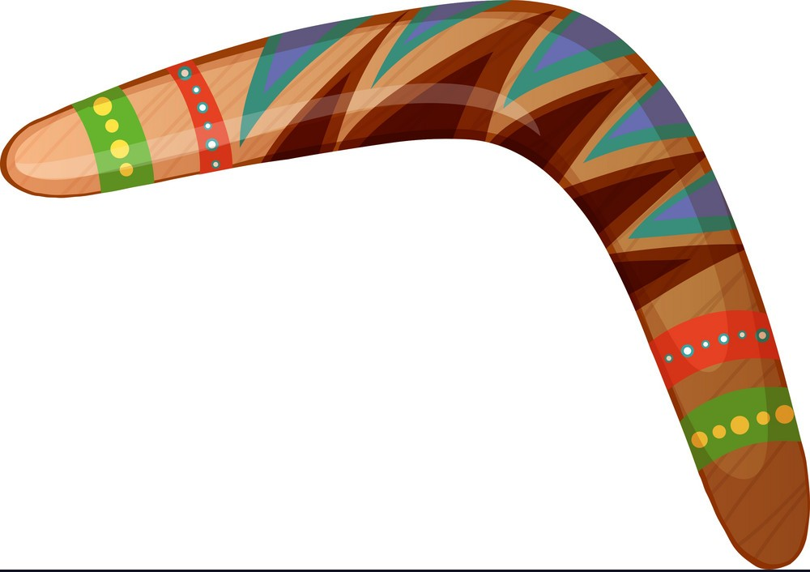
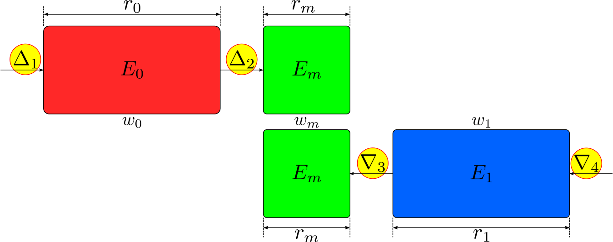
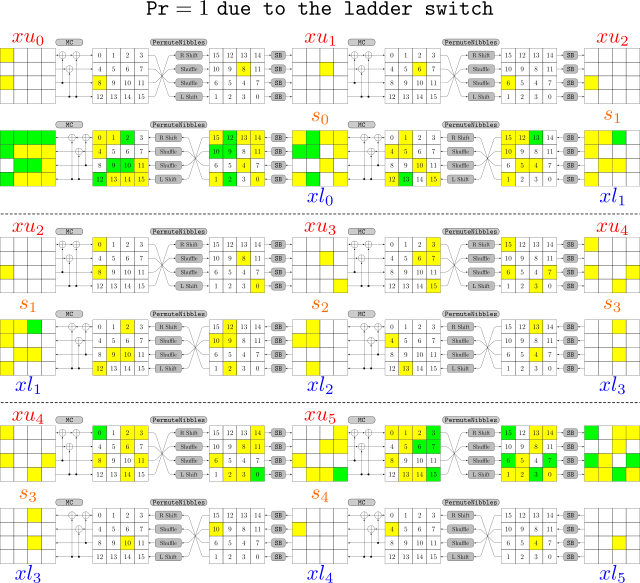
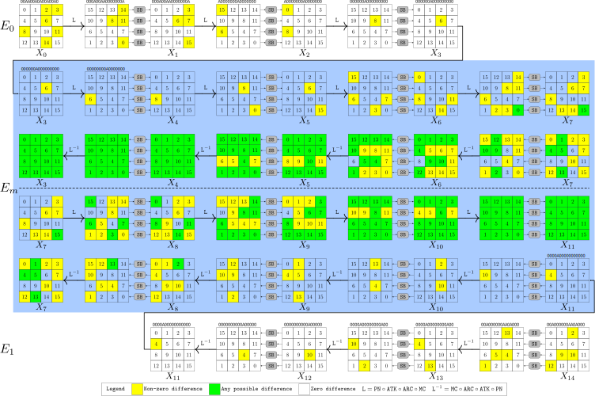
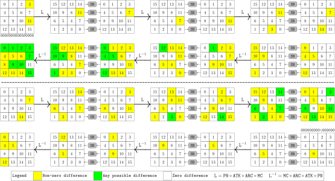
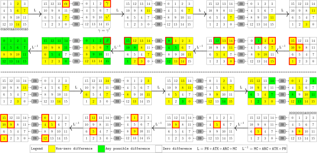
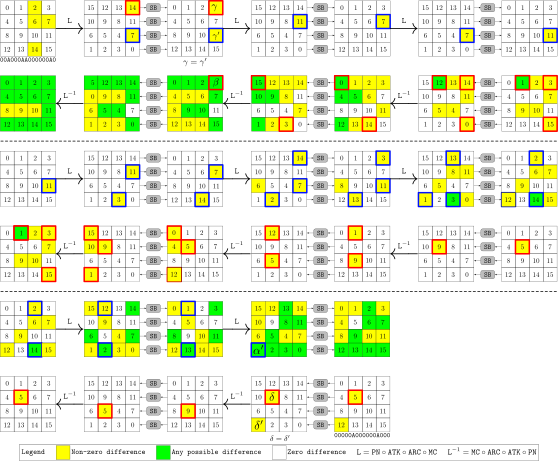
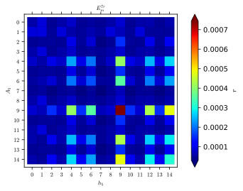
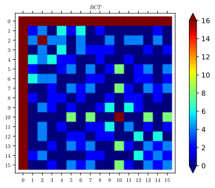

# Improved Rectangle Attacks on SKINNY and CRAFT



This repository complements our research documented in the paper [Improved Rectangle Attacks on SKINNY and CRAFT](https://tosc.iacr.org/index.php/ToSC/article/view/8908) which has been accepted to ToSC 2021, issue 2.

- Mian authors/contributors of the paper: Hosein Hadipour and Nasour Bagheri

The new version of our tool published in FSE 2023 entitled [Throwing Boomerangs into Feistel Structures Application to CLEFIA, WARP, LBlock, LBlock-s, and TWINE](https://tosc.iacr.org/index.php/ToSC/article/view/9858) is available [here](https://github.com/hadipourh/comeback).

## A Discussion On The Claims in [[1]](https://tosc.iacr.org/index.php/ToSC/article/view/9976) About Our Work

**We noticed that a paper published in ToSC-2022-4 [[1]](https://tosc.iacr.org/index.php/ToSC/article/view/9976) has investigated some characteristics in our GitHub repository. In what follows we show that the local/global dependencies discussed in [[1]](https://tosc.iacr.org/index.php/ToSC/article/view/9976) have no impact on our method/results.
The characteristics claimed in [[1]](https://tosc.iacr.org/index.php/ToSC/article/view/9976) are intermediate outputs at the first step of our method.
According to our paper [[2]](https://ia.cr/2020/1317), our tool skips all of these characteristics when going to the next steps (i.e., computing the differential effect and the boomerang switch). More precisely, when our tool derives an 'R+6'-round upper (resp. lower) trail at the first step, it skips the last (resp. first) 6 rounds of this trail and only uses the first (resp. last) 'R' rounds. 
In addition, for the first (resp. last) 'R' rounds, we do not rely on characteristic and we use differential. Therefore, there are two facts that we would like to clarify: first of all, we skip the last (resp. first) 6 rounds of derived upper (resp. lower) trails; second, even in the first (resp. last) 'R' rounds, we only use the differentials (not characteristics). However, all of the claims in [[1]](https://tosc.iacr.org/index.php/ToSC/article/view/9976) include the entire characteristics generated at the first step of our tool (e.g., 12-, 13-, 14-roudn characteristics). For instance, figure 4 in [[1]](https://tosc.iacr.org/index.php/ToSC/article/view/9976) is taken from the first 6 rounds of a lower trail in our GitHub repository where it is entirely skipped in our tool. Thus, we like to clarify that non of the claimed characteristic in [[1]](https://tosc.iacr.org/index.php/ToSC/article/view/9976) is essentially used in our method.**

**Moreover, all characteristics in [[1]](https://tosc.iacr.org/index.php/ToSC/article/view/9976) attributed to our work has been taken from the leftover intermediate outputs in our GitHub repository. These leftover characteristics are actually changed randomly in each single run of our tool, and we never rely on them. From the table of our distinguishers in our paper, it is clear that we only fix the differences in 4 positions.**

**Given that the method in [[1]](https://tosc.iacr.org/index.php/ToSC/article/view/9976) is not applicable to boomerang distinguishers, we provide some intuitions about the validity of our boomerang distinguishers. All of the local/gloabl dependeinces discussed in [[1]](https://tosc.iacr.org/index.php/ToSC/article/view/9976) are only in the last (resp. first) 6-rounds of the upper (resp. lower) trails, where we skip in our method. These parts are essentially included in the boomerang switch and we should treat it as a small boomerang distinguisher. We have experminetally verified the middle part (boomerang switche) in our sandwich distinguishers.**

**In addition, the differentials through `E0` and `E1` in our boomerang distinguishers take `zero` values almost everywhere. Thus, one can confirm that the local/global dependencies discussed in [[1]](https://tosc.iacr.org/index.php/ToSC/article/view/9976) do not appear in differentials through `E0` and `E1`. We also have considered the dependency between upper and lower differentials through the 6-round middle part. Therefore, our boomerang distinguishers should be valid, even with a higher probability that we claimed in the paper. As clear evidence, we have already provided many right quartets (in this repository and our paper) for many of our claimed boomerang distinguishers.**


**In our [FSE 2023 talk](https://iacr.org/submit/files/slides/2023/fse/fse2023/tosc2022_3_36/slides.pdf), we proved that the depednency issues discussed in [[1]](https://tosc.iacr.org/index.php/ToSC/article/view/9976) has essentially no impact on the validity of the boomerang distinguishers. To this aim, we used two differential trails to build an 11-round deterministic boomerang distinguisher for SKINNY-TK2. The bulding block differential trails in our example should be impossible according to [[1]](https://tosc.iacr.org/index.php/ToSC/article/view/9976). However, the resulting boomerang distinguisher works for all keys/plaintexts with probability one.**

## Contents

- [Improved Rectangle Attacks on SKINNY and CRAFT](#improved-rectangle-attacks-on-skinny-and-craft)
	- [Contents](#contents)
	- [General Setting of Our Distinguishers](#general-setting-of-our-distinguishers)
	- [Prerequisites and Installation](#prerequisites-and-installation)
	- [CRAFT-ST-MILP-Switching-Effect](#craft-st-milp-switching-effect)
	- [SMT-SAT-CRAFT-BitWise](#smt-sat-craft-bitwise)
	- [SKINNY-MILP-Switching-Effect](#skinny-milp-switching-effect)
	- [SMT-SAT-SKINNY-64-BitWise](#smt-sat-skinny-64-bitwise)
	- [MILP-SKINNY-128-BitWise](#milp-skinny-128-bitwise)
	- [CRAFT-6-Rounds](#craft-6-rounds)
	- [CRAFT-ST-7-Rounds](#craft-st-7-rounds)
	- [CRAFT-ST-8-Rounds](#craft-st-8-rounds)
	- [CRAFT-ST-9-Rounds](#craft-st-9-rounds)
	- [CRAFT-ST-10-Rounds](#craft-st-10-rounds)
	- [CRAFT-ST-11-Rounds](#craft-st-11-rounds)
	- [CRAFT-ST-12-Rounds](#craft-st-12-rounds)
	- [CRAFT-ST-MiddlePart-7-Rounds](#craft-st-middlepart-7-rounds)
	- [CRAFT-ST-Probability-Computations-9-14-Rounds-Sage](#craft-st-probability-computations-9-14-rounds-sage)
	- [CRAFT-ST-14-Rounds-Dedicated](#craft-st-14-rounds-dedicated)
	- [Boomerang-Distinguisher-I-SKINNY-64-128](#boomerang-distinguisher-i-skinny-64-128)
	- [Boomerang-Distinguisher-I-SKINNY-64-192](#boomerang-distinguisher-i-skinny-64-192)
	- [Boomerang-Distinguisher-I-SKINNY-128-256](#boomerang-distinguisher-i-skinny-128-256)
	- [Boomerang-Distinguisher-I-SKINNY-128-384](#boomerang-distinguisher-i-skinny-128-384)
	- [Boomerang-Distinguisher-II-SKINNY-64-128](#boomerang-distinguisher-ii-skinny-64-128)
	- [Boomerang-Distinguisher-II-SKINNY-128-256](#boomerang-distinguisher-ii-skinny-128-256)
	- [Citation (BibTex)](#citation-bibtex)
	- [License](#license)
  
## General Setting of Our Distinguishers

Assume that we partition `r` rounds of block cipher `E` into `r0 + rm + r1` rounds denoted by `E0, Em`, and `E1`, respectively. Our sandwich distinguishers are effectively built upon the first `r0` and the last `r1` rounds differentials (v.s. differential characteristics), as well as the `rm`-round boomerang switch in the middle. Particularly, the `rm`-round middle part is included in the boomerang switch, where the differences can take any possible value. In addition, we differentiate between the differential and differential characteristics. The building blocks of our distinguishers are basically differentials, not the differential characteristics. Please, take a look at the specification of distinguishers in our paper to see more details. In summary, according to the specifications of distinguishers in our paper, we fix the difference values only at four positions including input/output of `E0`, and input/output of `E1` and anywhere else can take an arbitrary possible difference value in our distinguishers. For example, in our 17-round sandwich distinguisher II for SKINNY we partition the `17` rounds as `6 + 6 + 5` rounds. Next, out tool derives a `6 + 6` upper trial and a `6 + 5` lower trails. These two trails overlap in the 6-round middle part. In addition, these two trails are optimized to have minimum number of common active S-boxes in the 6-round middle part. Then, our tool, skip the last (resp. first) `6` rounds of upper trail (resp. lower trail). We only use the first 6-round differential as well as the last 5-round differential to compute the differential effects `p` and `q` respectively. The 6-round middle part is included in the boomerang switch where the probability is computed based on `BCT` framework. This rule is applied for all of our distinguishers. The following shape briefly describes the overall structure of our boomerang (sandwich distinguishers). As it can be seen, only the differences marked in yellow are fixed in our sandwich distinguishers.



To have a more accurate estimation for success probability of our sandwich distinguishers, in most of the applications in our paper we take the clustering effect into account, where the intermediate differences at input/output of `Em`, i.e., `Delta_2, nabla_3` can also take any possible values.

## Prerequisites and Installation

In this repository, we use both MILP and SMT/SAT-based methods to find boomerang distinguishers for [CRAFT](https://sites.google.com/view/craftcipher) and [SKINNY](https://sites.google.com/site/skinnycipher/home). More precisely, to find a truncated boomerang characteristic we use the word-based MILP model where the [Python3](https://www.python.org/) is used to produce the MILP models, and [Gurobi](https://www.gurobi.com/) is used as the solver. Therefore, you need to install Gurobi and link it to Python3. You can find the installation recipes [here](https://www.gurobi.com/documentation/8.1/remoteservices/installation.html). For SKINNY, given that the key schedule is linear, we use a semi-word-based MILP model to find a truncated differential characteristic where the key schedule is encoded bitwise, whereas the data path is encoded word-wise.

In the second step, where we look for the real differential trails instantiating the discovered truncated trails, we use both the SMT/SAT and the MILP bit-based models. For CRAFT as well as the 64-bit block versions of SKINNY, we use [CryptoSMT](https://github.com/kste/cryptosmt) to instantiate the discovered truncated characteristics and compute the differential effect. Therefore, If you want to use our SAT/SMT-based tools, you need to follow same installation recipes as CryptoSMT. Note that, if you have already installed CryptoSMT, you merely need to replace the `config.py` file with your own `config.py` file in folders [SMT-SAT-CRAFT-BitWise-1](SMT-SAT-CRAFT-BitWise-1), [SMT-SAT-CRAFT-BitWise-2](SMT-SAT-CRAFT-BitWise-2) and [SMT-SAT-SKINNY-64-BitWise](SMT-SAT-SKINNY-64-BitWise). Concerning 128-bit block versions of SKINNY, for instantiation the truncated boomerang characteristics as well as computing the differential effect, we have developed a dedicated tool based on MILP which is located inside the folder [MILP-SKINNY-128-BitWise](MILP-SKINNY-128-BitWise).

In order to experimental verification of our results, we use the [C](https://en.wikipedia.org/wiki/C_(programming_language)) and [C++](https://en.wikipedia.org/wiki/C%2B%2B) languages. For the sake of portability, we did our best to use the standard libraries within our C and C++ codes. Besides, we use [OpenMP](https://www.openmp.org/) to achieve better performance. Hence, to compile our C or C++ codes you can use a C++ compiler such as [g++](https://linux.die.net/man/1/g++) with the compiler flag `-fopenmp`. For example, to compile the `test.cpp` you can use the following command:

```sh
g++ test.cpp -o test -fopenmp -O3
```

where `-O3` is a compiler flag to optimize the execution speed. However, for convenience, we have provided a [MakeFile](https://en.wikipedia.org/wiki/Makefile) for all of our C and C++ codes and you can run the `make` command to compile our C and C++ codes.

It should be noted that we accomplished our heavy experiments on [Jinan](https://english.jnu.edu.cn/) and [NRTC](https://www.nrtc.science/) clusters which both are kind of huge CPU clusters, where we could use at least 300 cores in parallel. Given that boomerang queries in our computations concerning experimental verification of boomerang distinguishers are independent, we can simply parallelize our boomerang queries. To do so, we use the JobArray to submit our heavy jobs to the CPU cluster. For example, to perform an experiment consisting of 2^41 boomerang queries in total, we prepare a C++ code consisting of 2^32 boomerang queries at first. Then, we use a [job script](https://hpc-uit.readthedocs.io/en/latest/jobs/examples.html) to submit 512 jobs in parallel. Besides, the `srand` function in our C++ codes is fed by a parameter dependent on time as well as the job's number created by the job scheduler, to avoid duplicated queries during the parallel computations. Therefore, in total, we perform 2^41 different boomerang queries while each core merely performs 2^32 queries. Thanks to this simple parallelization technique we could accomplish each of our heavy computations in less than a day.


## CRAFT-ST-MILP-Switching-Effect

To find the truncated boomerang distinguishers for CRAFT in the single-tweak model we use the code inside the folder [CRAFT-ST-MILP-SwitchingEffect](./CRAFT-ST-MILP-SwitchingEffect/). The following example shows the usage. For example to find a boomerang distinguisher for 6 rounds of CRAFT in the single-tweak model, we use the following settings inside the [`main.py`](CRAFT-ST-MILP-SwitchingEffect/main.py) file:

```python
r0, w0 = 0, 1
r1, w1 = 1, 2
rm, wm = 5, 1
number_of_patterns = 1
```

After that, we simply run the command `python3 main.py`, which generates the following output:

```sh
Academic license - for non-commercial use only
Read LP format model from file craft.lp
Reading time = 0.00 seconds
: 882 rows, 512 columns, 2112 nonzeros
Solution number 0

Upper activeness pattern:
xu0: 1000000010000000			yu0: 0000000010000000
xu1: 0000001000000000			yu1: 0000001000000000
xu2: 0000000010000000			yu2: 1000000010000000
xu3: 0000001000000001			yu3: 0001001100000001
xu4: 1000000010010010			yu4: 0011001010010010
xu5: 0001001110000110
Lower activeness pattern:
xl0: 1111110100101001			yl0: 0100110000101001
xl1: 1100100001101000			yl1: 0010000001101000
xl2: 0100110000000100			yl2: 0000100000000100
xl3: 0010000000100000			yl3: 0000000000100000
xl4: 0000100000000000			yl4: 0000100000000000
xl5: 0000000000100000

Linking variables:
s0: 00000000000000
s1: 00000000000000
s2: 00000000000000
s3: 00000000000000
s4: 00000000000000
Time used = 0.1166374683380127
```

The following figure illustrates the interpretation of the above output:



As another example the activeness pattern of our dedicated boomerang distinguisher for 14 rounds of CRAFT, can be generated using the following setting inside the file [main.py](CRAFT-ST-MILP-SwitchingEffect/main.py):

```python
r0, w0 = 6, 4
r1, w1 = 6, 4
rm, wm = 2, 2
number_of_patterns = 10
```

Note that our program is able to find multiple truncated boomerang trails for a given setting. `number_of_patterns = 10` specifies the number of patterns we are interested to produce with the given setting. If you run `python3 main.py` with the above setting, you will get the following pattern (in our experiment it was the solution number 9) as well as 9 other patterns:

```txt
# Solution number 9

# Upper activeness pattern:
# x0: 1011001010010010			y0: 1000000010010010
# x1: 0001001100000001			y1: 0000001000000001
# x2: 1000000010000000			y2: 0000000010000000
# x3: 0000001000000000			y3: 0000001000000000
# x4: 0000000010000000			y4: 1000000010000000
# x5: 0000001000000001			y5: 0001001100000001
# x6: 1000000010010010			y6: 0011001010010010
# x7: 0001001110000110			y7: 1111010110000110
# x8: 0011001001011111
# Lower activeness pattern:
# x0: 1111010100101001			y0: 0100110000101001
# x1: 1100100001101000			y1: 0010000001101000
# x2: 0100110000000100			y2: 0000100000000100
# x3: 0010000000100000			y3: 0000000000100000
# x4: 0000100000000000			y4: 0000100000000000
# x5: 0000000000100000			y5: 0010000000100000
# x6: 0000100000000100			y6: 0100110000000100
# x7: 0010000001101000

# Linking variables:
# 01000100000000
# 00000001001000
# Time used = 34.50758695602417
```

The above pattern corresponds to the following boomerang distinguisher in our paper:



Note that only the value of passive nibbles are fixed when we are looking for a real boomerang differential trails.

## SMT-SAT-CRAFT-BitWise

For CRAFT, to find the real differential trails corresponding to a discovered activeness pattern, and then computing the differential effect, we use the SMT-SAT tools located in folders [SMT-SAT-CRAFT-BitWise-1](SMT-SAT-CRAFT-BitWise-1) and [SMT-SAT-CRAFT-BitWise-2](SMT-SAT-CRAFT-BitWise-2).

 [SMT-SAT-CRAFT-BitWise-1](SMT-SAT-CRAFT-BitWise-1), includes the codes we have used for boomerang distinguisher of 9 to 14 rounds of CRAFT and [SMT-SAT-CRAFT-BitWise-2](SMT-SAT-CRAFT-BitWise-2) includes the codes we have used for our dedicated 14-round boomerang distinguisher. As a brief description on the usage of our codes, assume that we want to compute the differential effect corresponding to the first 3 rounds of our dedicated boomerang distinguisher for 14 rounds of CRAFT. It is sufficient to navigate into the folder [SMT-SAT-CRAFT-BitWise-2](SMT-SAT-CRAFT-BitWise-2) and then run the following command:

```sh
python3 craft-e0-3r.py --inputfile inputfiles/boomerang_e0_3r.yaml
```

You can see more examples inside the files [commands1](SMT-SAT-CRAFT-BitWise-1/commands.txt) and [commands2](SMT-SAT-CRAFT-BitWise-2/commands.txt).

## SKINNY-MILP-Switching-Effect

To find the truncated boomerang trails for different variants of SKINNY, we use the MILP tools located in folder [SKINNY-MILP-SwitchingEffect](SKINNY-MILP-SwitchingEffect). Usage of this tool is exactly the same as its alternative for CRAFT which was explained earlier.

## SMT-SAT-SKINNY-64-BitWise

To instantiate the truncated boomerang trails of SKINNY-64 with the real boomerang trails as well as computing the differential effect, we use an SMT-SAT tool located inside the folder [SMT-SAT-SKINNY-64-BitWise](SMT-SAT-SKINNY-64-BitWise). As a brief guide on using this tool, let we want to compute the differential effect corresponding to the first 7 rounds of boomerang distinguisher II for 19 rounds of SKINNY-64-128 with the following input/output differences:

```txt
x0 = 0x0100100000010020   tk0 = 0x00000000000000C0  tk1 = 0x00000000000000F0
x7 = 0x0000004000000000
```

We can simply specify the input/output differences (plus some additional parameters as it is visible) inside a `.yaml` file such as `skinnyrk_example.yaml` as follows:

```yaml
---
cipher: skinnyrk
sweight: 0
rounds: 7
wordsize: 64
mode: 4
tweaksize: 128
keysize: 0
fixedVariables:
- tk00 : "0x00000000000000C0"
- tk10 : "0x00000000000000F0"
- x0 : "0x0100100000010020"
- x7 : "0x0000004000000000"
```

and then run the simple command `python3 skinny64rk.py --inputfile skinnyrk_example.yaml` within the folder [SMT-SAT-SKINNY-64-BitWise](SMT-SAT-SKINNY-64-BitWise), which generates an output like this:

```txt
Finding all trails of weight 12
	Solutions: 5
	Trails found: 5
	Current Probability: -9.678071905112638
	Time: 2.08s
Finding all trails of weight 13
	Solutions: 6
	Trails found: 11
	Current Probability: -9.0
	Time: 2.24s
Finding all trails of weight 14
	Solutions: 0
	Trails found: 11
	Current Probability: -9.0
	Time: 2.41s
```

<a name="MILP-SKINNY-128-BitWise"></a>
## MILP-SKINNY-128-BitWise

To instantiate the truncated boomerang trails of SKINNY-128, as well as computing the differential effect for SKINNY-128, we use a MILP tool located in [MILP-SKINNY-128-BitWise](MILP-SKINNY-128-BitWise). Using this tool is just like the SMT-SAT tool which was explained earlier. For example, assume that we want to compute the differential effect corresponding to the first 7 rounds of boomerang distinguisher II for SKINNY-128-256 with the following input/output differences:

```txt
x0 = 00200000010000000000000100000100   tk0 = 00020000000000000000000000000000   tk1 = 00800000000000000000000000000000
x7 = 00000000000000000006000000000000
```

To do so, we can prepare a `.yaml` file such as `input_example.yaml` consisting of the following contents:

```yaml
---
blocksize: 128
rounds: 7
mode: 2
sweight: 0
endweight: 128
timelimit: -1
fixedVariables:
- tk1_0 : "00020000000000000000000000000000"
- tk2_0 : "00800000000000000000000000000000"
- x_0 : "00200000010000000000000100000100"
- x_7 : "00000000000000000006000000000000"
```

and then simply run the command `python3 main.py --inputfile input_example.yaml` within the folder [MILP-SKINNY-128-BitWise](MILP-SKINNY-128-BitWise) which produces an output like this:

```txt
Current weight: 13.0
Number of trails: 2
	Current Probability: 2^(-12.0)
Time used = 0.6695 seconds

Current weight: 16.415
Number of trails: 2
	Current Probability: 2^(-11.87071376879294)
Time used = 1.4280 seconds

Current weight: 18.0
Number of trails: 4
	Current Probability: 2^(-11.79054359385267)
Time used = 2.1713 seconds

Current weight: 21.0
Number of trails: 4
	Current Probability: 2^(-11.780828459425601)
Time used = 2.9364 seconds

Current weight: 22.0
Number of trails: 2
	Current Probability: 2^(-11.778409863681768)
Time used = 3.6714 seconds

Current weight: 23.0
Number of trails: 2
	Current Probability: 2^(-11.777202084601516)
Time used = 4.3841 seconds
```

The above output means that the differential effect is about `2^-11.78`. Given that we use [Gurobi](https://www.gurobi.com/) to find multiple solutions in our tool, we double check the output of our MILP tool using the experimental approaches to avoid erroneous results. To double check the output of our MILP tool for computing the differential effect of SKINNY-128 we have provided a simple `C` code based on the reference implementation of SKINNY located in [this](DifferentialEffectExperimentalComputation/SKINNY) folder. It should be noted that our MILP tool for computing the differential effect of SKINNY-128 supports two methods to find multiple solutions, one based on multiple solution finder of Gurobi and another one based on the classical method in which new solutions are found by excluding the previous discovered solutions one by one. In other words, we compute the differential effect with three different methods to become confident about the correctness of our results concerning the computed differential effects for SKINNY-128.

## CRAFT-6-Rounds

The following shape illustrates our 6-round boomerang distinguisher with probability one for CRAFT.



The required code for experimental verification of our 6-round boomerang distinguisher for CRAFT is located inside the folder [CRAFT-ST-6-Rounds](CRAFT-ST-6-Rounds/ExperimentalVerification). To build the code, navigate into the folder [CRAFT-ST-6-Rounds](CRAFT-ST-6-Rounds/ExperimentalVerification) and issue the the `make` command. Next, run `./craft-6r` to perform the experiments. As you'll see, all boomerangs will return which means the probability is equal to one.

## CRAFT-ST-7-Rounds



Required code for experimental verification is [here](CRAFT-ST-7-Rounds/ExperimentalVerification). Build it using `make` command and then run `./craft-7r`.

## CRAFT-ST-8-Rounds



Required code for experimental verification is [here](CRAFT-ST-8-Rounds/ExperimentalVerification). Build it using `make` command and then run `./craft-8r`.

## CRAFT-ST-9-Rounds

Required code for experimental verification is located [here](CRAFT-ST-9-Rounds/ExperimentalVerification). Build it using `make` command and then run `./craft-9r`.

## CRAFT-ST-10-Rounds

Required codes for experimental verification are located [here](CRAFT-ST-10-Rounds/ExperimentalVerification). To build the code use `make` command. After that submit the jobs on a cluster of CPUs using the following command:

```sh
qsub job-craft-jobarray-10r.sh
```

## CRAFT-ST-11-Rounds

Required code for experimental verification are located [here](CRAFT-ST-11-Rounds/ExperimentalVerification). Build the code using `make` command and then submit the jobs on a cluster of CPUs via the following command: 

```sh
qsub job-craft-jobarray-11r.sh
```

## CRAFT-ST-12-Rounds

Required codes for experimental verification are located [here](CRAFT-ST-12-Rounds/ExperimentalVerification). We have provided two types of codes inside this folder. One is multi-thread and another one is multi-node. To use them you can simply build the code via the `make` command and then submit the jobs on a cluster of CPUs using the following commands: 

Multi-Thread

```sh
qsub job-craft-jobarray-12r.sh
```

Multi-Nodes
```sh
qsub job-craft12r.sh
```

## CRAFT-ST-MiddlePart-7-Rounds

To theoretically compute the probability of the 7-round middle part of our boomerang distinguisher for 9 to 14 rounds of CRAFT, and regenerate the 4 dimensional matrix `R^7r` in our paper you can use the codes located inside the folder [Theoretical-Middle-7-Rounds](CRAFT-ST-MiddlePart-7-Rounds/Theoretical-Middle-7-Rounds). For example, you can reproduce the matrix `R^7r`, via running the following command inside the folder [Theoretical-Middle-7-Rounds](CRAFT-ST-MiddlePart-7-Rounds/Theoretical-Middle-7-Rounds):

```sh
python3 Gen4DMatirx7rMultiThreads.py
```


Folder [Experimental-Middle-7-Rounds](CRAFT-ST-MiddlePart-7-Rounds/Experimental-Middle-7-Rounds), includes the required codes for those who are interested to experimentally evaluate the probability of the 7-round middle part of our boomerang distinguisher for 9-14 rounds of CRAFT. For example, to produce the experimental alternatvie of matrix `R^7r`, issue the `make` command within the folder [Parallel-Computation](CRAFT-ST-MiddlePart-7-Rounds/Experimental-Middle-7-Rounds/Parallel-Computation), and then submit the jobs using the following command to compute the matrix in parallel:

```sh
qsub JobGenMatrix7re
```

## CRAFT-ST-Probability-Computations-9-14-Rounds-Sage

We have provided a SageMath worksheet inside the folder [CRAFT-ST-Probability-Computations-9-14-Rounds-Sage](CRAFT-ST-Probability-Computations-9-14-Rounds-Sage), consisting of all the codes we have used to compute the probabilities of our boomerang distinguishers for 9 to 14 rounds of CRAFT. To open and run it, issue the following command inside the folder [CRAFT-ST-Probability-Computations-9-14-Rounds-Sage](CRAFT-ST-Probability-Computations-9-14-Rounds-Sage):

```sh
sage -n jupyter ProbabilityComputations.ipynb
```

The following figure visualizes the matrix R^7r corresponding to the probability of the 7-round middle part in our boomerang distinguishers for 9 to 13 rounds of CRAFT.



The following figure visualizes the BCT of CRAFT's S-box. As you can see there is a high similarity between the positions of maximum entries in the following and above pictures which reflects the CRAFT's S-box boomerang behavior on the boomerang behavior of several rounds of this cipher.



To see more about the probability calculation of boomerang distinguishers for 9 to 13 rounds of CRAFT please take a look at [ProbabilityComputations](CRAFT-ST-Probability-Computations-9-14-Rounds-Sage/ProbabilityComputations/ProbabilityComputations.md).

## CRAFT-ST-14-Rounds-Dedicated


All the codes concerning the provided bound for our dedicated 14-round boomerang distinguisher are located inside the folder [CRAFT-ST-14-Rounds-Dedicated](CRAFT-ST-14-Rounds-Dedicated). To make the verification phase easier, we have prepared the SageMath worksheet [ProbabilityComputations.ipynb](CRAFT-ST-14-Rounds-Dedicated/ProbabilityComputations.ipynb) including the codes we have used to provide a lower bound for the probability of our dedicated 14-rounds boomerang distinguisher for CRAFT.

We have also provided an efficient `C++` code to produce the matrix $R^{8r}$ inside the folder [GoldenSet](CRAFT-ST-14-Rounds-Dedicated/GoldenSet), which can be simply built via the `make` command. To run it, it is supposed that you have access to a cluster of CPUs. If so, you can submit the jobs via the following command inside the folder [GoldenSet](CRAFT-ST-14-Rounds-Dedicated/GoldenSet):

```sh
qsub jobfile.sh
```

By running the above command, 625 jobs are performed in parallel (if enough recourses are available) to compute the 625 different entries of the matrix $R^{8r}$.

## Boomerang-Distinguisher-I-SKINNY-64-128


To see the details inside the above picture properly, we encourage you to download the [PDF file](SKINNY-64-128-I/Shapes/rumi_64_128_full_view.pdf).


The upper and lower trails generated in the first step of our tool for boomerang distinguisher I for 18 rounds of SKINNY-64-128 are as follows. **Note that, the red lines illustrate the middle part where the upper and lower trail overlap. We basically skip the part of the characteristics marked in red. We only fix the differences at the input/output of the first and last 6 rounds**:

```diff
Upper trail
Characteristic for skinnyrk - Rounds 12 - Wordsize 64 - Weight 69 - Time 37.31s
Rounds	x                   atk                 y                   z                   tk0                 tk1                 tk2                 w                   
-----------------------------------------------------------------------------------------------------------------------------------------------------------------------
+0	0x8000000000000000  0x4000000000000000  0x4000000000000000  0x0400000000000000  0x0000000C00000000  0x0000000F00000000  none                -2                  
+1	0x0000000000000400  0x0000000000000200  0x0000000000000000  0x0000000000000000  0x0000000000000C00  0x0000000000000E00  none                -2                  
+2	0x0000000000000000  0x0000000000000000  0x0000000000000000  0x0000000000000000  0x00000C0000000000  0x00000E0000000000  none                -0                  
+3	0x0000000000000000  0x0000000000000000  0x0000000000000000  0x0000000000000000  0x00000000000C0000  0x00000000000C0000  none                -0                  
+4	0x0000000000000000  0x0000000000000000  0x0000000000000000  0x0000000000000000  0x000C000000000000  0x000C000000000000  none                -0                  
+5	0x0000000000000000  0x0000000000000000  0x0000000004000000  0x0000000040000000  0x000000000C000000  0x0000000008000000  none                -0                  
-6	0x0000400000000000  0x0000200000000000  0x0000200000000000  0x0000002000000000  0x0C00000000000000  0x0800000000000000  none                -2                  
-7	0x0020002000000020  0x0010001000000010  0x0010001000D00010  0x000110000D000010  0x0000000000C00000  0x0000000000100000  none                -6                  
-8	0x10101D0000101011  0x90B0890000B0B089  0x90B0890000B0B089  0x090B00890B00B089  0x00C0000000000000  0x0010000000000000  none                -16                 
-9	0xB0000B89B089B90B  0x100001D510543401  0x100001D51054D401  0x0100D5010541D401  0x000000000000C000  0x0000000000002000  none                -21                 
-10	0x0100D040D4010000  0x090090B09B090000  0x090090B09B090000  0x0090B090B0990000  0x0000C00000000000  0x0000200000000000  none                -12                 
-11	0xB09000090000B000  0x3040000400003000  0x3040000480003000  0x0304040000083000  0x00000000C0000000  0x0000000040000000  none                -8                  
-12	0x3400040830003704  none                none                none                none                none                none                none                

Weight: 69

Lower trail:
Characteristic for skinnyrk - Rounds 12 - Wordsize 64 - Weight 64 - Time 24.24s
Rounds	x                   atk                 y                   z                   tk0                 tk1                 tk2                 w                   
-----------------------------------------------------------------------------------------------------------------------------------------------------------------------
-6	0x4050001000000015  0x2020009000000082  0x2020009000000082  0x0202900000000082  0x0000400000000000  0x0000C00000000000  none                -10                 
-7	0x9082900000829280  0x5055500000455550  0x50555000C0455550  0x55050050045C5550  0x0000000040000000  0x0000000080000000  none                -18                 
-8	0x5500040C55500005  0x2A0002022A200002  0x2A0002022A200002  0x02A00202A2020002  0x4000000000000000  0x8000000000000000  none                -16                 
-9	0x0200A000000200A0  0x0500500000050050  0x0500500000050000  0x0050005000500000  0x0000000000000040  0x0000000000000010  none                -8                  
-10	0x0050000000000000  0x00A0000000000000  0x00A0000000000000  0x000A000000000000  0x0000004000000000  0x0000001000000000  none                -2                  
-11	0x000000000000000A  0x0000000000000006  0x0000000000000000  0x0000000000000000  0x0000000000000004  0x0000000000000002  none                -2                  
-12	0x0000000000000000  0x0000000000000000  0x0000000000000000  0x0000000000000000  0x0000000400000000  0x0000000200000000  none                -0                  
+13	0x0000000000000000  0x0000000000000000  0x0000000000000000  0x0000000000000000  0x0000000000000400  0x0000000000000400  none                -0                  
+14	0x0000000000000000  0x0000000000000000  0x0000000000000000  0x0000000000000000  0x0000040000000000  0x0000040000000000  none                -0                  
+15	0x0000000000000000  0x0000000000000000  0x00000000000D0000  0x0000000000D00000  0x0000000000040000  0x0000000000090000  none                -0                  
+16	0x000000D000000000  0x0000009000000000  0x0000009000000000  0x0000900000000000  0x0004000000000000  0x0009000000000000  none                -2                  
+17	0x9000900000009000  0x5000400000004000  0x5000400007004000  0x0500004070004000  0x0000000004000000  0x0000000003000000  none                -6                  
+18	0x4040704040004540  none                none                none                none                none                none                none                

Weight: 64
```

 The required code for computing the probability of the 6-round middle part is located in folder [SKINNY-64-128-I/MiddlePart-ProbabilityComputation](SKINNY-64-128-I/MiddlePart-ProbabilityComputation). To use the codes inside this folder you can simply issue the `make` command and then run the compiled files. For instance, to compute the probability of the 6-round middle part use the following command inside the folder [SKINNY-64-128-I/MiddlePart-ProbabilityComputation](SKINNY-64-128-I/MiddlePart-ProbabilityComputation):

```sh
./middle6r
```

The folder [SKINNY-64-128-I/MiddlePart-ProbabilityComputation](SKINNY-64-128-I/MiddlePart-ProbabilityComputation) also includes our `Python` codes to evaluate the theoretical probabilities of the middle part based on the BCT framework.

The required materials to reproduce our results concerning computation of differential effects for the first and last 6 rounds are provided inside the folder [SKINNY-64-128-I/SKINNY-64-128-I-18-Rounds](SKINNY-64-128-I/SKINNY-64-128-I-18-Rounds). For instance, to compute the differential effect of the first 6 rounds of our distinguisher you can use our [SMT-SAT](SMT-SAT-SKINNY-64-BitWise) tool with the input file [SKINNY-64-128-I/SKINNY-64-128-I-18-Rounds/computing_p_clustering_effect_conditions.yaml](SKINNY-64-128-I/SKINNY-64-128-I-18-Rounds/computing_p_clustering_effect_conditions.yaml). To do so, assuming that `computing_p_clustering_effect_conditions.yaml` is located inside the folder [SMT-SAT-SKINNY-64-BitWise](SMT-SAT-SKINNY-64-BitWise), you can use the following command:

```sh
python3 skinny64rk.py --inputfile computing_p_clustering_effect_conditions.yaml
```

The output is something like this:

```txt
Finding all trails of weight 0
	Solutions: 0
Finding all trails of weight 1
	Solutions: 0
Finding all trails of weight 2
	Solutions: 0
Finding all trails of weight 3
	Solutions: 0
Finding all trails of weight 4
	Solutions: 2
	Trails found: 2
	Current Probability: -3.0
	Time: 0.67s
Finding all trails of weight 5
	Solutions: 2
	Trails found: 4
	Current Probability: -2.415037499278844
	Time: 0.81s
Finding all trails of weight 6
	Solutions: 0
	Trails found: 4
	Current Probability: -2.415037499278844
	Time: 0.95s
```

The required codes for experimental verification are located in [SKINNY-64-128-I/SKINNY-64-128-I-18-Rounds/ExperimentalVerification](SKINNY-64-128-I/SKINNY-64-128-I-18-Rounds/ExperimentalVerification). To build the code issue the `make` command. We have configured our code to be executed on a cluster of CPUs. If you have access to a cluster of CPUs, you can easily submit the jobs via the job file we have provided in folder [SKINNY-64-128-I/SKINNY-64-128-I-18-Rounds/ExperimentalVerification](SKINNY-64-128-I/SKINNY-64-128-I-18-Rounds/ExperimentalVerification). In other words, you can submit the jobs using the following command inside the folder [SKINNY-64-128-I/SKINNY-64-128-I-18-Rounds/ExperimentalVerification](SKINNY-64-128-I/SKINNY-64-128-I-18-Rounds/ExperimentalVerification):

```sh
qsub job-rumi-64-128-18r.sh
```

To check the correctness of the provided bound (2^-39.98), we performed 2^41 boomerang queries among which 3.71 boomerangs return on average. The following right quartets are some of the right quartets we discovered throughout our experiments:

```txt
p1: e586c75e78778b0c
p2: e586c75e78778b04
p3: e1f52b90c0f46a4d
p4: e1f52b90c0f46a45
c1: 963802b23541ce56
c2: 0aaaa34777c03baf
c3: 926c02b63146ca52
c4: 0efea34373c73fab
k1: cd75e38623d579d063b2ba5a780227aa
k2: cd75e386e3d579d063b2ba5a880227aa
k3: cd75e38623d539d063b2ba5a780257aa
k4: cd75e386e3d539d063b2ba5a880257aa

p1: 51c655b8b8ac9c92
p2: 51c655b8b8ac9c9a
p3: 49cc892b33afd602
p4: 49cc892b33afd60a
c1: 9311ffc8bebbe711
c2: fadac36948676b87
c3: 9745ffccbabce315
c4: fe8ec36d4c606f83
k1: ad2bbfc633bc4d9d7e571758e8199b3d
k2: ad2bbfc6f3bc4d9d7e57175818199b3d
k3: ad2bbfc633bc0d9d7e571758e819eb3d
k4: ad2bbfc6f3bc0d9d7e5717581819eb3d

p1: dd1b6365de2989cf
p2: dd1b6365de2989c7
p3: 23d6da67a8da379c
p4: 23d6da67a8da3794
c1: 0a794f919485c726
c2: ea4ec1a155139c10
c3: 0e2d4f959082c322
c4: ee1ac1a551149814
k1: cf9a0d881ae505cc87203c4eb4135364
k2: cf9a0d88dae505cc87203c4e44135364
k3: cf9a0d881ae545cc87203c4eb4132364
k4: cf9a0d88dae545cc87203c4e44132364

p1: 23def08bf89954fc
p2: 23def08bf89954f4
p3: 06e483039cbdc892
p4: 06e483039cbdc89a
c1: 0e66f16314b3290d
c2: 515db926c253b008
c3: 0a32f16710b42d09
c4: 5509b922c654b40c
k1: 8c8a8f2f3a611554719871ab8420d96d
k2: 8c8a8f2ffa611554719871ab7420d96d
k3: 8c8a8f2f3a615554719871ab8420a96d
k4: 8c8a8f2ffa615554719871ab7420a96d

```

In the same way, our results plus the required materials to reproduce our results concerning boomerang distinguisher I for 17 and 19 rounds of SKINNY-64-128 are provided inside the folders [SKINNY-64-128-I/SKINNY-64-128-I-17-Rounds](SKINNY-64-128-I/SKINNY-64-128-I-17-Rounds) and [SKINNY-64-128-I/SKINNY-64-128-I-19-Rounds](SKINNY-64-128-I/SKINNY-64-128-I-19-Rounds) respectively. For instance, the required codes for experimental verification of our bound concerning boomerang distinguisher I for 17 rounds of SKINNY-64-128 are provided inside the folder [SKINNY-64-128-I/SKINNY-64-128-I-17-Rounds/ExperimentalVerification](SKINNY-64-128-I/SKINNY-64-128-I-17-Rounds/ExperimentalVerification). You can simply build it via the `make` command and the verify it by running the following command inside the folder [SKINNY-64-128-I/SKINNY-64-128-I-17-Rounds/ExperimentalVerification](SKINNY-64-128-I/SKINNY-64-128-I-17-Rounds/ExperimentalVerification):

```sh
qsub job-rumi-64-128-17r.sh
```

## Boomerang-Distinguisher-I-SKINNY-64-192

The following shape represents the different parts of boomerang distinguisher I for 22 rounds of SKINNY-64-192.


The outputs of our tools concerning the provided bounds for boomerang distinguisher I for 22 and 23 rounds of SKINNY-64-192 are located inside the folders [SKINNY-64-192-I/SKINNY-64-192-I-22-Rounds](SKINNY-64-192-I/SKINNY-64-192-I-22-Rounds) and [SKINNY-64-192-I/SKINNY-64-192-I-23-Rounds](SKINNY-64-192-I/SKINNY-64-192-I-23-Rounds) respectively. Note that there are three sub-folders named [BMD1](SKINNY-64-192-I/SKINNY-64-192-I-22-Rounds/BMD1), [BMD2](SKINNY-64-192-I/SKINNY-64-192-I-22-Rounds/BMD2) and [BMD3](SKINNY-64-192-I/SKINNY-64-192-I-22-Rounds/BMD3) in these directories each of which including a different distinguisher. The activity pattern of these three distinguishers are the same but they are different in terms of input/output difference values. However, we have used [BMD3](SKINNY-64-192-I/SKINNY-64-192-I-22-Rounds/BMD3) in our paper due to having more success probability. Moreover, the required codes for experimental validation of our boomerang distinguisher I for 22 rounds of SKINNY can be find inside [this folder](SKINNY-64-192-I/SKINNY-64-192-I-22-Rounds/BMD3/ExperimentalVerification/LinuxServer). The following cell represents some of the right quartets discovered throughout the experimental verification.

```sh
p1: fcc345999253b1b4
p2: fcc345999253b3b4
p3: e9f1dd00c6387727
p4: e9f1dd00c6387527
c1: 83a25b965cd61acf
c2: 06a279380ba4ab42
c3: d5a75d965c931cca
c4: 50a77f380be1ad47
k1: a7f3c98000f138c713fbd314efd27203aa8271d92399b77a
k2: a7f3c98001f138c713fbd314e4d27203aa8271d92b99b77a
k3: a7f3c98000d138c713fbd314efe27203aa8271d92349b77a
k4: a7f3c98001d138c713fbd314e4e27203aa8271d92b49b77a

p1: f527132f60a5c904
p2: f527132f60a5cb04
p3: 5fc97f45882607f3
p4: 5fc97f45882605f3
c1: 4002d9eb8ba59d46
c2: 2dd1faa65177a4ce
c3: 1607dfeb8be09b43
c4: 7bd4fca65132a2cb
k1: 5939efd8c03f3d9d6b32bf421c1b0032bca911bed9f5deef
k2: 5939efd8c13f3d9d6b32bf42171b0032bca911bed1f5deef
k3: 5939efd8c01f3d9d6b32bf421c2b0032bca911bed925deef
k4: 5939efd8c11f3d9d6b32bf42172b0032bca911bed125deef

p1: 8a8ba6010359cda8
p2: 8a8ba6010359cfa8
p3: c2fb1489b448de82
p4: c2fb1489b448dc82
c1: 79a5f37c0130cb96
c2: f3bde52781bf1b19
c3: 2fa0f57c0175cd93
c4: a5b8e32781fa1d1c
k1: 62ee8d8754eb021fce3d0fdd09033cccd07cece7dda6d598
k2: 62ee8d8755eb021fce3d0fdd02033cccd07cece7d5a6d598
k3: 62ee8d8754cb021fce3d0fdd09333cccd07cece7dd76d598
k4: 62ee8d8755cb021fce3d0fdd02333cccd07cece7d576d598
```

## Boomerang-Distinguisher-I-SKINNY-128-256

The output of our codes plus the required materials to reproduce our results concerning boomerang distinguisher I for 18 to 21 rounds of SKINNY-128-256 are provided inside the folder [SKINNY-128-256-I](SKINNY-128-256-I). For instance to experimentally evaluate the probability of the 6-round middle part of boomerang distinguisher I for SKINNY-128-256, you can use the codes located inside the folder [SKINNY-128-256-I/Middle-6-Rounds](SKINNY-128-256-I/Middle-6-Rounds).

## Boomerang-Distinguisher-I-SKINNY-128-384

The output of our codes plus the required materials to reproduce our bounds for boomerang distinguisher I for 22 to 25 rounds of SKINNY-128-384 can be found inside the folder [SKINNY-128-384-I](SKINNY-128-384-I). In particular, the codes we have used to experimentally validate our bound for boomerang distinguisher I for 22 rounds of SKINNY-128-384 are located inside the folder [SKINNY-128-384-I/SKINNY-128-384-I-22-Rounds/ExperimentalVerification](SKINNY-128-384-I/SKINNY-128-384-I-22-Rounds/ExperimentalVerification). According to our claim the probability of boomerang distinguisher I for 22 rounds of SKINNY-128-384 is 2^-40.57. Accordingly, our code performs 2^41 boomerang queries among which 1.6 boomerangs return on average. To build our code you can use the `make` command, and then submit the jobs on a cluster of CPUs via the following command inside the folder [SKINNY-128-384-I/SKINNY-128-384-I-22-Rounds/ExperimentalVerification](SKINNY-128-384-I/SKINNY-128-384-I-22-Rounds/ExperimentalVerification):

```sh
qsub jobrumi-128-384-22r.sh
```

Some of the right quartets we have discovered throughout our experiments is as follows:

```txt
p1: 8b68483d7e54a1140cb4ad56f5cfacc9
p2: 8b68483d7e54a1140cb4ad56f5c7acc9
p3: 9442ed20a6934b4c50925ffcf0d0526e
p4: 9442ed20a6934b4c50925ffcf0d8526e
c1: 23820cc9011c130afeac8b879c7967aa
c2: 8325b6082c46116050ed125f66cb9f15
c3: 33920cd9010c130afeac8c979c6967ba
c4: 9335b6182c56116050ed154f66db9f05
k1: 2c2c5fc838b8a48195e627dd67da05900ffb5fb4094b88996352a459dacc8706f9e6ce319e72b23359da10c0b41550c3
k2: 2c2c5fc838b8a48195cc27dd67da05900ffb5fb4094b8899632ba459dacc8706f9e6ce319e72b23359e910c0b41550c3
k3: 2c2c5fc838b8a48195e673dd67da05900ffb5fb4094b88996352ab59dacc8706f9e6ce319e72b23359dae8c0b41550c3
k4: 2c2c5fc838b8a48195cc73dd67da05900ffb5fb4094b8899632bab59dacc8706f9e6ce319e72b23359e9e8c0b41550c3

p1: 971c156162362d4605d86098369a7fd5
p2: 971c156162362d4605d8609836927fd5
p3: f365c6aafca52546bd73e2a3e55e4e68
p4: f365c6aafca52546bd73e2a3e5564e68
c1: e04b789b34c0f95efa20a9894b55ca33
c2: db6ce16c03152b46f9172401e1c8e2ec
c3: f05b788b34d0f95efa20ae994b45ca23
c4: cb7ce17c03052b46f9172311e1d8e2fc
k1: 6d3e7a72bd4e15fbacbf02f004d733c417ab4c9e97728d1c5471e2715957c4c6953e38528c4d4d380c4f2910275cd53e
k2: 6d3e7a72bd4e15fbac9502f004d733c417ab4c9e97728d1c5408e2715957c4c6953e38528c4d4d380c7c2910275cd53e
k3: 6d3e7a72bd4e15fbacbf56f004d733c417ab4c9e97728d1c5471ed715957c4c6953e38528c4d4d380c4fd110275cd53e
k4: 6d3e7a72bd4e15fbac9556f004d733c417ab4c9e97728d1c5408ed715957c4c6953e38528c4d4d380c7cd110275cd53e

p1: a099a8ef89c8b63a83cf89087bd2caa9
p2: a099a8ef89c8b63a83cf89087bdacaa9
p3: 573af5667917d7007b905eb2843d04a9
p4: 573af5667917d7007b905eb2843504a9
c1: bdf3418148ac1c5d5ec004a3194b426e
c2: cac2de7861a3e19a0b43e5a3732a992a
c3: ade3419148bc1c5d5ec003b3195b427e
c4: dad2de6861b3e19a0b43e2b3733a993a
k1: 18e6aa0b562ae26d62853c9c3f52550439191425876060c8e100b19bf1f9730adf1d153548f7a2aa7cde46bb319bc06a
k2: 18e6aa0b562ae26d62af3c9c3f52550439191425876060c8e179b19bf1f9730adf1d153548f7a2aa7ced46bb319bc06a
k3: 18e6aa0b562ae26d6285689c3f52550439191425876060c8e100be9bf1f9730adf1d153548f7a2aa7cdebebb319bc06a
k4: 18e6aa0b562ae26d62af689c3f52550439191425876060c8e179be9bf1f9730adf1d153548f7a2aa7cedbebb319bc06a
```

## Boomerang-Distinguisher-II-SKINNY-64-128

The following picture illustrates the different parts of boomerang distinguisher II for 17 to 19 rounds of SKINNY-64-128.


To see the details properly, you can download its [PDF file](SKINNY-64-128-II/Shapes/dufu_64_128_full_view.pdf). The following shape also represents the activeness pattern in the middle part of our distinguisher.


To verify our bound for the probability of the 6-round middle part you can run the codes provided inside the folder [SKINNY-64-128-II/MiddlePart-ProbabilityComputation](SKINNY-64-128-II/MiddlePart-ProbabilityComputation).

The output of our codes as well as the required materials to reproduce our results concerning the bounds for probability of boomerang distinguisher II for 17 to 19 rounds of SKINNY-64-128 can be found inside the folders [SKINNY-64-128-II/SKINNY-64-128-II-17-Rounds](SKINNY-64-128-II/SKINNY-64-128-II-17-Rounds), [SKINNY-64-128-II/SKINNY-64-128-II-18-Rounds](SKINNY-64-128-II/SKINNY-64-128-II-18-Rounds) and [SKINNY-64-128-II/SKINNY-64-128-II-19-Rounds](SKINNY-64-128-II/SKINNY-64-128-II-19-Rounds) ,respectively. In particular, the codes using which we experimentally verified the correctness of our bound for 18 rounds of SKINNY-64-128 can be found inside the folder [SKINNY-64-128-II/SKINNY-64-128-II-18-Rounds/ExperimentalVerification](SKINNY-64-128-II/SKINNY-64-128-II-18-Rounds/ExperimentalVerification). To run this code, it is assumed that you have access to a cluster of CPUs. If so, you can simply build our code via the `make` command and then issue the following command inside the folder [SKINNY-64-128-II/SKINNY-64-128-II-18-Rounds/ExperimentalVerification](SKINNY-64-128-II/SKINNY-64-128-II-18-Rounds/ExperimentalVerification) to submit the parallel jobs.

```sh
qsub jobdufu-64-128-18r.sh
```

This code performs `2^39` boomerang queries among which two boomerang return on average, which validates our bound `2^(-37.90)`. Some of the right quartets discovered throughout the empirical validations are as follows:

```txt
p1: 1c4efd59673b5272
p2: 1c4efd59673b5a72
p3: b94166db3441b483
p4: b94166db3441bc83
c1: d51e2e9f499cf890
c2: 852653a14f727097
c3: e41f2f9f49edf991
c4: b42752a14f037196
k1: 3be9924f15eb7ffe999d65b3e272b38c
k2: 3be9924f19eb7ffe999d65b3ed72b38c
k3: 3be9924f15eb7fbe999d65b3e272b3fc
k4: 3be9924f19eb7fbe999d65b3ed72b3fc

376
p1: d3ef3035b7bf7f66
p2: d3ef3035b7bf7766
p3: 64da4c116b20fae3
p4: 64da4c116b20f2e3
c1: 1043079ac1ae52c1
c2: 240c36f6f20d020c
c3: 2142069ac1df53c0
c4: 150d37f6f27c030d
k1: 386dc4fdccb42cd15eb3f0438981272b
k2: 386dc4fdc0b42cd15eb3f0438681272b
k3: 386dc4fdccb42c915eb3f0438981275b
k4: 386dc4fdc0b42c915eb3f0438681275b
```

## Boomerang-Distinguisher-II-SKINNY-128-256

Besides the provided shape in our paper, the following shape illustrates the different parts of our boomerang distinguishers clearly:


To see the details clearly, we encourage you to download the PDF file from [here](SKINNY-128-256-II/SKINNY-128-256-II-18-Rounds/Shapes/skinny-128-256-rt-18r.pdf).

The upper and lower differential trails generated in the first step of our tool for boomerang distinguisher II for 18 rounds of SKINNY-128-256 are as follows. **Note that, the red lines illustrate the middle part where the upper and lower trail overlap. We basically skip the part of the characteristics marked in red. We only fix the differences at the input/output of the first and last 6 rounds**: 

```diff
Upper trail:
Rounds	x                                 y                                 z                                 tk1                               tk2                               tk               pr     
---------------------------------------------------------------------------------------------------------------------------------------------------------------------------------------------------------
+ 0	00000000000000000000000000200000  00000000000000000000000000800000  00000000000000000000000000800000  00000000000000000002000000000000  00000000000000000080000000000000  0000000000000000 -2.0   
+ 1	80000000000000000000000000000000  03000000000000000000000000000000  00000000000000000000000000000000  02000000000000000000000000000000  01000000000000000000000000000000  0300000000000000 -2.0   
+ 2	00000000000000000000000000000000  00000000000000000000000000000000  00000000000000000000000000000000  00000000000000000200000000000000  00000000000000000100000000000000  0000000000000000 -0.0   
+ 3	00000000000000000000000000000000  00000000000000000000000000000000  00000000000000000000000000000000  00000200000000000000000000000000  00000200000000000000000000000000  0000000000000000 -0.0   
+ 4	00000000000000000000000000000000  00000000000000000000000000000000  00000000000000000000000000000000  00000000000000000000020000000000  00000000000000000000020000000000  0000000000000000 -0.0   
+ 5	00000000000000000000000000000000  00000000000000000000000000000000  00000000060000000000000000000000  00000000020000000000000000000000  00000000040000000000000000000000  0000000006000000 -0.0   
- 6	00000000000000000006000000000000  00000000000000000025000000000000  00000000000000000025000000000000  00000000000000000000000002000000  00000000000000000000000004000000  0000000000000000 -4.0   
- 7	00000025000000000000002500000025  00000021000000000000002100000021  0000002100000a000000002100000021  00000000000002000000000000000000  00000000000008000000000000000000  0000000000000a00 -9.0   
- 8	00212121000000210021000a00210021  002020a0000000200020003400280020  002020a0000000200020003400280020  00000000000000000000000000000200  00000000000000000000000000000800  0000000000000000 -20.0  
- 9	28140080002020a02034002000142080  934100d0009080538041008000518003  934100d0008280538041008000518003  00000000000200000000000000000000  00000000001000000000000000000000  0000000000120000 -36.415
- 10	c2418391934100d0538002c193c18091  0ab4e023b0240004200208b4b02e02ea  0ab4e023b0240004200208b4b02e02ea  00000000000000000000000000020000  00000000000000000000000000100000  0000000000000000 -54.0931
- 11	2c022a910ab4e0230c0404020200c021  8808802210a854201801010808000420  8808800010a854201801010808000420  00000002000000000000000000000000  00000020000000000000000000000000  0000002200000000 -45.0  
- 12	8904b809880880002118b05589009801  none                              none                              none                              none                              none             none   
#Weight: -172.50809999999998
#Time used = 496.16353607177734
Lower trail:
Rounds	x                                 y                                 z                                 tk1                               tk2                               tk               pr     
---------------------------------------------------------------------------------------------------------------------------------------------------------------------------------------------------------
- 0	00202000002020000020002000204020  00809000008080000080008000800490  00809000008080000080008000800490  000000000000000000000000000000f8  0000000000000000000000000000007f  0000000000000000 -18.0  
- 1	80040080008090000080800000009080  02050002000202000002020000000202  02020002000202000002020000000202  00f80000000000000000000000000000  00ff0000000000000000000000000000  0007000000000000 -19.0  
- 2	00000200020200020200020000020000  000008000808000808000800000c0000  000008000808000808000800000c0000  000000000000000000f8000000000000  000000000000000000ff000000000000  0000000000000000 -15.0  
- 3	04000000000008000008000008000000  06000000000010000010000010000000  00000000000010000010000010000000  f8000000000000000000000000000000  fe000000000000000000000000000000  0600000000000000 -9.0   
- 4	00000000000000000000000000000010  00000000000000000000000000000050  00000000000000000000000000000050  0000000000000000f800000000000000  0000000000000000fe00000000000000  0000000000000000 -2.0   
- 5	00005000000000000000000000000000  00000400000000000000000000000000  00000000000000000000000000000000  0000f800000000000000000000000000  0000fc00000000000000000000000000  0000040000000000 -2.0   
- 6	00000000000000000000000000000000  00000000000000000000000000000000  00000000000000000000000000000000  00000000000000000000f80000000000  00000000000000000000fc0000000000  0000000000000000 -0.0   
+ 7	00000000000000000000000000000000  00000000000000000000000000000000  00000000000000000000000000000000  00000000f80000000000000000000000  00000000f80000000000000000000000  0000000000000000 -0.0   
+ 8	00000000000000000000000000000000  00000000000000000000000000000000  00000000000000000000000000000000  000000000000000000000000f8000000  000000000000000000000000f8000000  0000000000000000 -0.0   
+ 9	00000000000000000000000000000000  00000000000000000000000000000000  00000000000008000000000000000000  000000000000f8000000000000000000  000000000000f0000000000000000000  0000000000000800 -0.0   
+ 10	00000000000000000000000800000000  00000000000000000000001000000000  00000000000000000000001000000000  0000000000000000000000000000f800  0000000000000000000000000000f000  0000000000000000 -2.0   
+ 11	00100000000000000010000000100000  00400000000000000040000000400000  00400000001800000040000000400000  0000000000f800000000000000000000  0000000000e000000000000000000000  0000000000180000 -6.0   
+ 12	40400040004000000000184000400040  none                              none                              none                              none                              none             none   
# Weight: -73.0
# Time used = 106.74798440933228                          none                              none                              none                              none             none   
```

One can simply evaluate the probability of the 6-round middle part via the code we have prepared [here](SKINNY-128-256-II/Middle-6-Rounds/middle6r.c) inside the folder [SKINNY-128-256-II/Middle-6-Rounds](SKINNY-128-256-II/Middle-6-Rounds). To this end, issue the `make` command to build the code, and the run it by the following command:

```sh
./middle6r
```

It can be seen that the probability of the middle part is about `2^(-20.19)` as we have estimated in our paper. To compute the differential effect corresponding to the first 6 rounds we can use the provided tool inside the folder [MILP-SKINNY-128-BitWise/Skinny128-256-BitWise](MILP-SKINNY-128-BitWise/Skinny128-256-BitWise). To do so, we have prepared the input file for our MILP tool [here](SKINNY-128-256-II/SKINNY-128-256-II-18-Rounds/computing_p_clustering_effect_conditions.yaml). [This file](SKINNY-128-256-II/SKINNY-128-256-II-18-Rounds/computing_p_clustering_effect_conditions.yaml) represents the output of our tool concerning the computation of differential effect corresponding to the first 6 round. Similarly, we can compute the differential effect corresponding to the last 6 rounds. [This file](SKINNY-128-256-II/SKINNY-128-256-II-18-Rounds/computing_q_clustering_effect.txt), represents the output of our MILP tool concerning computation of differential effect corresponding to the last 6 rounds. They both can be simply verified using the experimental approach as well. To do so you can use our codes [here](DifferentialEffectExperimentalComputation/SKINNY). After computing the differential effect of the first and last 6 rounds we have: `p_6r = 2^-3`, `q_6r = 2^-7.29`. Hence, the total probability of the whole 18-round boomerang distinguisher is `p_bm18r = p_6r^2*q_6r^2*r_6r = 2^(-40.77)`.

We have also provided the required codes for experimental validation of this distinguisher inside the folder [SKINNY-128-256-II/SKINNY-128-256-II-18-Rounds/ExperimentalVerification](SKINNY-128-256-II/SKINNY-128-256-II-18-Rounds/ExperimentalVerification). You can simply issue the `make` command inside this folder to build the code. It is supposed that you have access to a cluster of CPUs to run this code. If so, you can easily submit the jobs via the following command with the same configuration as we did:

```sh
qsub job-dufu-128-256-18r.sh
```

To experimentally validate our bound, we performed `2^41` boomerang queries several times, and observed that one boomerang returns on average. Some of the right quartets we discovered during our experiments are as follows:

```txt
p1: d68ce58bb0f6ad4f5b421e017cfb688f
p2: d68ce58bb0f6ad4f5b421e017cdb688f
p3: dee5273cbc2cb50858816c8805cae6f6
p4: dee5273cbc2cb50858816c8805eae6f6
c1: a4b5da6c3e30d0bf3adc8399cb8dbadb
c2: bbe9a07e5eabbfbb083191b245488c13
c3: e4f5da2c3e70d0bf3adc9bd9cbcdba9b
c4: fba9a03e5eebbfbb083189f245088c53
k1: 59e26cf7dec40bbb37f041ba27f8266f0e050eebaa515f1a33c60afeabb5cc05
k2: 59e26cf7dec40bbb37f241ba27f8266f0e050eebaa515f1a33460afeabb5cc05
k3: 59e26cf7dec40bbb37f041ba27f8de6f0e050eebaa515f1a33c60afeabb50305
k4: 59e26cf7dec40bbb37f241ba27f8de6f0e050eebaa515f1a33460afeabb50305


p1: 8d9a13adfc4d3d8046145385edc26a21
p2: 8d9a13adfc4d3d8046145385ede26a21
p3: 91b30cc8898c0324631b80319a5745de
p4: 91b30cc8898c0324631b80319a7745de
c1: eb871cd1bbd5c3de4503f64d3b6fdb11
c2: eb9d9bdfaaeded28d773172b082e82de
c3: abc71c91bb95c3de4503ee0d3b2fdb51
c4: abdd9b9faaaded28d7730f6b086e829e
k1: a733ade942312ce0503c3e528aa0c417cb47c7dad8bcefbc3f8131b6375d98de
k2: a733ade942312ce0503e3e528aa0c417cb47c7dad8bcefbc3f0131b6375d98de
k3: a733ade942312ce0503c3e528aa03c17cb47c7dad8bcefbc3f8131b6375d57de
k4: a733ade942312ce0503e3e528aa03c17cb47c7dad8bcefbc3f0131b6375d57de
```

To check the correctness of the right quartets provided in this page, you can use the codes located in folder [TestRightQuartets](TestRightQuartets). Besides, we have provided a dedicated page to compare different approaches to experimentally verify differential distinguishers entitled [A Note On Experimental Verification of Differential Distinguishers](NoteOnExperimentalVerification/README.md).

## Citation (BibTex)

If our codes have been used in a project that leads to an academic publication, please, acknowledge that fact by citing our paper:

```bib
@article{Hadipour_Bagheri_Song_2021,
title={Improved Rectangle Attacks on SKINNY and CRAFT}, 
volume={2021}, 
url={https://tosc.iacr.org/index.php/ToSC/article/view/8908}, 
DOI={10.46586/tosc.v2021.i2.140-198}, 
number={2}, 
journal={IACR Transactions on Symmetric Cryptology}, 
author={Hadipour, Hosein and Bagheri, Nasour and Song, Ling}, 
year={2021}, 
month={Jun.}, 
pages={140-198}}
```

## License

The codes published in this page are licensed under [MIT](LICENSE.txt).
